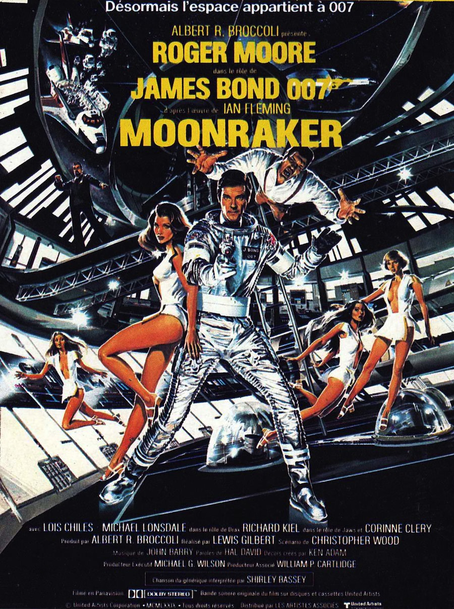
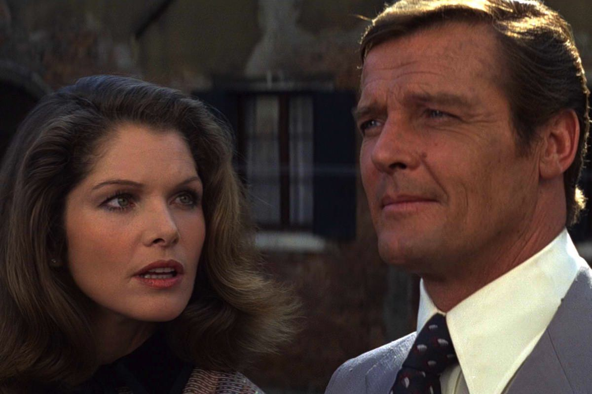

+++
type = "post"
titre = "<em>Moonraker</em>, Lewis Gilbert"
title = "Moonraker, Lewis Gilbert"
url = "/moonraker-gilbert"
date = "2013-03-04T00:01:10"
Lastmod = "2013-05-11T10:02:54"
cover = "moonraker-lewis-gilbert-richard-kiel.jpg"
categorie = [ "À voir" ]
tag = [ "Blockbuster", "Espionnage", "James Bond", "Science-Fiction", "Vite oublié" ]
createur = [ "Lewis Gilbert" ]
acteur = [ "Lois Chiles", "Michael Lonsdale", "Richard Kiel", "Roger Moore" ]
annee = [ "1979" ]
weight = 1979
saga = [ "James Bond" ]

+++

Le phénoménal succès de <a href="http://voiretmanger.fr/2013/02/24/espion-aimait-gilbert/" title="L’espion qui m’aimait, Lewis Gilbert"><em>L’espion qui m’aimait</em></a> appelait à une suite et les producteurs n’ont pas perdu de temps. Deux ans après, Lewis Gilbert revient à la barre pour un nouvel épisode avec le désormais populaire Roger Moore dans le rôle de l’agent 007. <em>Moonraker</em>, c’est la tentative d’en faire encore plus, d’aller toujours plus loin. Après la mer et le monde sous-marin de son prédécesseur, place à l’espace : le succès de <a href="http://voiretmanger.fr/2012/06/03/star-wars-episode-4-nouvel-espoir-lucas/" title="Star Wars, Épisode IV : Un nouvel espoir, George Lucas - À voir et à manger"><em>Star Wars, Épisode IV : Un nouvel espoir</em></a> et de <a href="http://voiretmanger.fr/2013/02/15/rencontres-du-troisieme-type-spielberg/" title="Rencontres du troisième type, Steven Spielberg"><em>Rencontres du troisième type</em></a> aidant<a href="#footnote_0_8593" id="identifier_0_8593" class="footnote-link footnote-identifier-link" title="Ce film va jusqu&rsquo;&agrave; citer tr&egrave;s explicitement le long-m&eacute;trage de Spielberg en reprenant la fameuse musique qui permet aux hommes de communiquer avec les extra-terrestres&hellip;">1</a>, la science-fiction s’impose comme un genre très populaire à la fin des années 1970 et la saga <em>James Bond</em> se doit d’apporter sa version. <em>Moonraker</em> emmène effectivement l’agent secret dans l’espace, au cours d’un épisode qui devient caricatural à force de n’importe quoi et de kitsch. Une nouvelle fois, la saga se retrouve dans une impasse en essayant de reproduire à l’identique une formule qui a fonctionné précédemment. Une nouvelle fois, cette fausse bonne idée ne conduit pas à un grand film, bien au contraire. Même s’il peut faire sourire par moment, cet épisode part dans tous les sens et se perd vite dans un spectacle souvent grotesque…

Sur certaines <a href="http://www.dvdclassik.com/critique/moonraker-gilbert/galerie">affiches anglo-saxonnes</a>, le message marketing indique que <em>Moonraker</em> débute là où les autres <em>James Bond</em> se terminent. De fait, le pré-générique de cet épisode en met plein la vue : après le vol d’une navette spatiale suivie d’une explosion assez impressionnante et qui marque au passage une nouvelle étape sur le plan technique, on retrouve l’agent 007 en chute libre. Une très belle séquence qui s’avère prometteuse et qui introduit admirablement cet épisode ; par la suite, les habitudes reprennent en revanche vite leur droit. Lewis Gilbert, un habitué de la saga désormais, filme son personnage principal au QG du MI6, recevoir son ordre de mission et un gadget des mains de Q, encore une montre en plus. <em>Moonraker</em> suit un scénario déjà vu et revu dans la saga : l’histoire d’un homme qui décide d’exterminer toute la race humaine pour créer un nouvel univers épuré. Si vous avez vu les épisodes précédents, cette trame ne vous sera pas étrangère : c’est exactement la même que pour <em>L’espion qui m’aimait</em>, même si la touche spatiale est censée apporter la nouveauté. On l’a dit, le succès des films de science-fiction incite les producteurs à se tourner vers ce genre, finalement plutôt rare dans <em>James Bond</em>. Le grand méchant, qui aurait pu être le SPECTRE, a mis en place un programme spatial pour tuer les milliards d’êtres humains depuis sa station spatiale secrète qu’il aura pris soin de remplir de couples censés régénérer la race humaine. En attendant le grand final dans l’espace, <em>Moonraker</em> joue la carte de l’exotisme avec une multiplication des décors : la Californie revisitée en château de la Loire, Venise ou encore Rio. L’agent secret multiplie les affrontements et les courses-poursuites, en bateau essentiellement. L’ensemble reste efficace — Lewis Gilbert connaît bien son métier — et même parfois spectaculaire, mais le long-métrage est handicapé par sa tendance à en faire toujours trop.

<em>Moonraker</em> reproduit une erreur de <a href="http://voiretmanger.fr/2013/02/17/homme-pistolet-or-hamilton/" title="L’homme au pistolet d’or, Guy Hamilton"><em>L’homme au pistolet d’or</em></a> : reprendre un personnage secondaire du film précédent. Après le shérif, c’est Jaws, le méchant à la dentition d’acier que l’on avait aperçu dans le film précédent qui fait son grand retour ici. Ce grand personnage assez caricatural a même droit à un rôle encore plus développé, plus que de raison d’ailleurs. Même s’il a plus de place à l’écran, ce personnage ne dit qu’une seule chose pendant tout le film et la tentative de le rendre plus humain avec une vague histoire d’amour est plus ridicule qu’autre chose. Au total, ce méchant récurrent et indestructible est plus pénible qu’autre chose : on aurait préféré que le vrai méchant du film, interprété par un Michael Lonsdale efficace, ait droit à plus de place. Lewis Gilbert multiplie aussi les gadgets avec un peu trop de facilité : outre la montre donnée à James Bond par Q en début de film, les gadgets sont présents au bon moment et au bon endroit, comme par magie. À Venise par exemple, l’agent secret bénéficie d’une gondole totalement équipée pour résister et contre-attaquer lors d’une course-poursuite et s’en sortir avec un aéroglisseur qui sort de nulle part. Les décors rappellent aussi un peu trop ceux des épisodes précédents, avec un arrière-goût de déjà-vu un peu trop présent dans <em>Moonraker</em>. Le plus visible, c’est certainement le repère du méchant en Amérique du Sud, une copie parfaite de décors déjà vu dans la saga. Certes, la station spatiale n’a jamais été vue, mais l’originalité de ce décor n’est pas vraiment exploitée : rendre l’absence de gravité n’est pas facile, mais Lewis Gilbert se débarrasse un peu trop facilement de ce problème, tandis que ses séquences spatiales ressemblent trop à <a href="http://voiretmanger.fr/2011/08/07/2001-odyssee-espace-kubrick/" title="2001 : l'odyssée de l'espace, Stanley Kubrick - À voir et à manger"><em>2001 : l&rsquo;odyssée de l&rsquo;espace</em></a>, la bataille finale n’est pas plus qu’une caricature de <em>Star Wars</em>, les sabres laser en moins. Dans cet ensemble, c’est peut-être Roger Moore qui incarne toujours avec une grande classe toute britannique le rôle de l’agent 007. Il a toujours cet air détaché qui fait son originalité et sa composition est globalement réussie. 

Le succès n’incite pas la saga <em>James Bond</em> à innover et cela se voit : <em>Moonraker</em> est un épisode qui n’a comme seule ambition de reproduire le succès de son prédécesseur, en reprenant strictement la même formule. Las, ce qui fonctionnait avec <em>L’espion qui m’aimait</em> ne fait plus recette : Lewis Gilbert en fait à nouveau des tonnes et retombe dans les travers d&rsquo;<a href="http://voiretmanger.fr/2013/01/20/on-ne-vit-que-deux-fois-gilbert/" title="On ne vit que deux fois, Lewis Gilbert - À voir et à manger"><em>On ne vit que deux fois</em></a>. Malgré ces défauts, le public suit et <em>Moonraker</em> est à nouveau un succès qui appelle encore une fois à une suite rapide…

<strong>James Bond reviendra dans… <a href="http://voiretmanger.fr/2013/03/10/rien-que-pour-vos-yeux-glen/" title="Rien que pour vos yeux, John Glen"><em>Rien que pour vos yeux</em></a></strong>

<h3>Vous voulez m’aider ?<a href="#footnote_1_8593" id="identifier_1_8593" class="footnote-link footnote-identifier-link" title="&Agrave; propos de la publicit&eacute;&hellip;">2</a></h3>
<ul>
<li><a href="http://www.amazon.fr/gp/product/B001TEKHX6/ref=as_li_ss_tl?ie=UTF8&#038;tag=leblogdenic07-21&#038;linkCode=as2&#038;camp=1642&#038;creative=19458&#038;creativeASIN=B001TEKHX6">Acheter le film en Blu-Ray sur Amazon</a></li>
<li><a href="http://www.amazon.fr/gp/product/B000NJM5TW/ref=as_li_ss_tl?ie=UTF8&#038;tag=leblogdenic07-21&#038;linkCode=as2&#038;camp=1642&#038;creative=19458&#038;creativeASIN=B000NJM5TW">Acheter le film en DVD sur Amazon</a></li>
<li><a href="https://itunes.apple.com/fr/movie/moonraker/id561944121">Acheter ou louer le film sur L’iTunes Store</a></li>
</ul>
<ul>
<li><a href="http://www.amazon.fr/gp/product/B008U6R9B4/ref=as_li_ss_tl?ie=UTF8&amp;tag=leblogdenic07-21&amp;linkCode=as2&amp;camp=1642&amp;creative=19458&amp;creativeASIN=B008U6R9B4">Acheter la trilogie complète en Blu-Ray sur Amazon</a></li>
<li><a href="http://www.amazon.fr/gp/product/B008U6R93C/ref=as_li_ss_tl?ie=UTF8&amp;tag=leblogdenic07-21&amp;linkCode=as2&amp;camp=1642&amp;creative=19458&amp;creativeASIN=B008U6R93C">Acheter la trilogie complète en DVD sur Amazon</a></li>
</ul>

<ol class="footnotes"><li id="footnote_0_8593" class="footnote">Ce film va jusqu&rsquo;à citer très explicitement le long-métrage de Spielberg en reprenant la fameuse musique qui permet aux hommes de communiquer avec les extra-terrestres… [<a href="#identifier_0_8593" class="footnote-link footnote-back-link">&#8617;</a>]</li><li id="footnote_1_8593" class="footnote"><a href="http://voiretmanger.fr/soutien/">À propos de la publicité…</a> [<a href="#identifier_1_8593" class="footnote-link footnote-back-link">&#8617;</a>]</li></ol>
