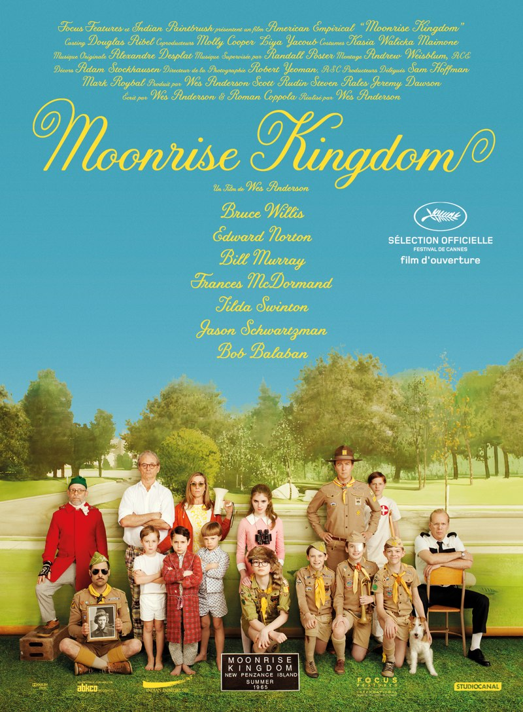
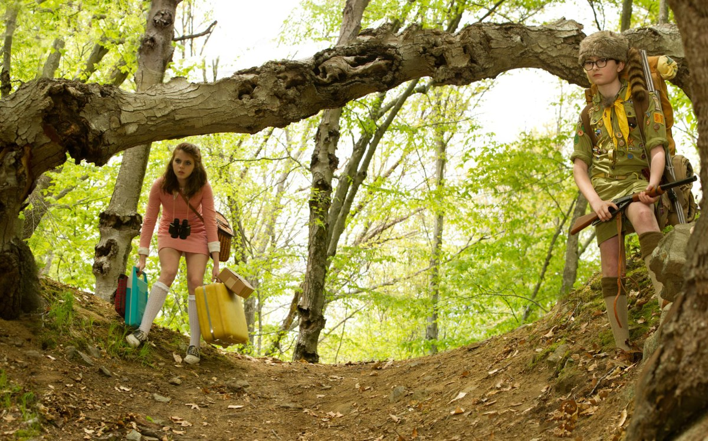
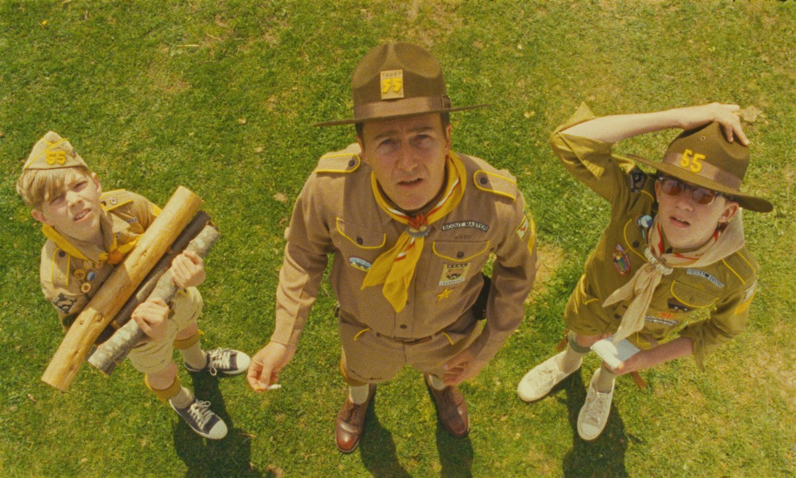

+++
type = "post"
titre = "<em>Moonrise Kingdom</em>, Wes Anderson"
title = "Moonrise Kingdom, Wes Anderson"
url = "/moonrise-kingdom-anderson"
date = "2012-05-19T19:51:45"
Lastmod = "2015-03-28T19:34:10"
cover = "moonrise-kingdom-wes-anderson.jpg"
categorie = [ "À voir" ]
tag = [ "Adolescence", "Amour", "Enfance", "Famille", "Société" ]
createur = [ "Wes Anderson" ]
acteur = [ "Bill Murray", "Bruce Willis", "Edward Norton", "Jason Schwartzman", "Tilda Swinton" ]
annee = [ "2012" ]
weight = 2012
pays = [ "États-Unis" ]

+++

Deux ans après une incursion dans l&rsquo;animation avec <em><a href="/2010/02/18/fantastic-fox-anderson/">Fantastic Mr. Fox</a></em>, Wes Anderson revient avec un nouveau film tourné en images réelles. <em>Moonrise Kingdom</em> brasse tous les thèmes chers au cinéaste américain, même si la famille n&rsquo;occupe pas le centre de l&rsquo;histoire. Il est ici question d&rsquo;enfance et d&rsquo;amour, mais comme toujours chez Wes Anderson, <em>Moonrise Kingdom</em> propose d&rsquo;abord une ambiance particulière et une galerie de personnages particulièrement typés. Si vous aimez ses films, il n&rsquo;y a pas de raison que celui-ci ne vous plaise pas…

Milieu des années 1960, les scouts occupent pour l&rsquo;été quelques petites îles au large de la Nouvelle-Angleterre. Parmi eux, Sam a du mal à s&rsquo;intégrer à la communauté : tous les autres scouts n&rsquo;aiment pas ce jeune garçon renfermé et que l&rsquo;on dit psychologiquement déstabilisé. Sam s&rsquo;en fiche, il prépare un plan pour s&rsquo;évader avec la fille qu&rsquo;il aime. Un an auparavant, il a rencontré Suzy lors d&rsquo;une représentation costumée. Entre les deux enfants qui n&rsquo;ont pas encore atteint l&rsquo;adolescence, le coup de foudre a été immédiat. Suzy vit justement avec ses deux parents avocats sur la même île où le camp de scouts de Sam s&rsquo;est installé. Par un échange épistolaire fourni, ils préparent une évasion et partent ensemble se perdre dans les forêts de l&rsquo;île. Pendant quelques jours, ils vont vivre leur amour seuls, loin des adultes et autres enfants à leur recherche. Cet amour est fort, mais peut-il durer au-delà de la période estivale ?

<em>Moonrise Kingdom</em> est l&rsquo;histoire d&rsquo;un coup de foudre. Sam et Suzy sont jeunes, très jeunes, trop jeunes pour vraiment passer à l&rsquo;acte, mais ils n&rsquo;en ont pas besoin. Leur amour est sincère et total : ils ne pourraient vivre l&rsquo;un sans l&rsquo;autre et quand les parents de Suzy tentent de les séparer, ce n&rsquo;est que pour les motiver à se retrouver au plus vite. Wes Anderson utilise un flashback pour montrer le premier regard entre les deux jeunes : Sam entre dans la loge de Suzy où se trouvent aussi d&rsquo;autres filles. Immédiatement, il la choisit elle, et elle seule, et le cinéaste rend cet accord entre eux immédiatement sensible. Après ce premier regard vient le temps de la découverte de l&rsquo;autre : les goûts de l&rsquo;un et de l&rsquo;autre, mais aussi les corps de l&rsquo;un et de l&rsquo;autre. Suzy aime lire et elle lit ses livres d&rsquo;aventures à Sam quand ce dernier apprend à la première à pêcher et à survivre dans les bois. Plus tard, c&rsquo;est le premier baiser avec la langue et les premières caresses. <em>Moonrise Kingdom</em> n&rsquo;ira pas plus loin, mais cet amour surprend par sa maturité. Difficile souvent de croire que les deux personnages principaux de Wes Anderson n&rsquo;ont qu&rsquo;une dizaine d&rsquo;années, ils semblent même beaucoup plus murs que les adultes qui les entourent.

Tourné vers l&rsquo;amour des deux enfants, <em>Moonrise Kingdom</em> oppose logiquement deux univers. À celui des plus jeunes répond celui des adultes qui représente naturellement l&rsquo;autorité. Tous les personnages de Wes Anderson restent dans le fond de grands enfants qui refusent de vieillir, ni même de murir : c&rsquo;était flagrant dans <em><a href="/2012/02/18/la-vie-aquatique-anderson/">La Vie Aquatique</a></em> avec ce personnage loufoque de Steve Zissou. Ici, les adultes sont tous ridicules et totalement incapables d&rsquo;assumer leur rôle d&rsquo;autorité. Le chef du camp scout perd un de ses enfants, avant de perdre le camp tout entier. Les parents de Suzy sont tous les deux avocats, ils ne s&rsquo;aiment plus et semblent ne plus vraiment s&rsquo;occuper de leurs quatre enfants depuis plusieurs années. À un moment de <em>Moonrise Kingdom</em>, le père passe derrière ses trois fils avec une hache, ce qui résume bien sa vision de l&rsquo;éducation. L&rsquo;unique policier de l&rsquo;île est toujours triste et désabusé, mais c&rsquo;est peut-être le seul adulte à être sauvé par Wes Anderson : c&rsquo;est en tout cas lui qui sauve les enfants du deuxième coup de foudre — un réel cette fois — et c&rsquo;est lui qui rend l&rsquo;amour possible après l&rsquo;été. Le film s&rsquo;arrête judicieusement et on ne sait pas ce qui se passe après cette parenthèse estivale, mais une issue heureuse est envisageable. La ténacité et la maturité des deux enfants expliquent en premier lieu ce succès, mais il faut aussi noter le rôle du policier qui hérite ainsi d&rsquo;une place à part dans le scénario.

Dès les premiers plans de <em>Moonrise Kingdom</em>, la marque de fabrique de Wes Anderson est bien sensible. Le cinéaste multiplie les plans fixes pour présenter la famille de Suzy en quelques images : il lui faut peu de moyens, quelques exemples suffisent amplement à comprendre cette famille désolidarisée, où les parents sont absents et où la fille de la famille est à part, dans son univers, à scruter l&rsquo;horizon avec ses jumelles. D&rsquo;emblée, l&rsquo;ambiance si particulière des films de Wes Anderson, une ambiance un peu triste qui prête à sourire en même temps, s&rsquo;installe et elle ne quittera pas le film, oscillant en permanence entre légèreté et gravité. <em>Moonrise Kingdom</em> tend parfois vers le loufoque, parfois vers le drame amoureux : l&rsquo;ensemble offre un équilibre fragile, mais parfaitement maîtrisé. Wes Anderson est maintenant un metteur en scène de talent, tous ses cadres sont travaillés et réfléchis, sans pour autant que la mise en scène paraisse forcée. <em>Moonrise Kingdom</em> doit beaucoup au talent de ses deux jeunes acteurs principaux — Jared Gilman et Kara Hayward — qui composent un couple crédible, un point essentiel pour la réussite du film. Autour d&rsquo;eux, les adultes ne sont pas en reste : Bruce Willis surprend positivement avec ce rôle de flic tranquille, Bill Murray est égal à lui-même et Edward Norton compose un chef scout convainquant. Le tout est relevé par la très belle musique d&rsquo;Alexandre Desplat.

Wes Anderson soulève rarement un enthousiasme unanime et <em>Moonrise Kingdom</em> ne devrait pas faire exception. Le film plaira d&rsquo;abord aux fans du cinéaste et de ses films décalés, ceux qui n&rsquo;appréciaient pas les précédents risquent bien d&rsquo;être lassés par cette histoire d&rsquo;amour juvénile. C&rsquo;est à la fois la plus grande réussite et la limite de <em>Moonrise Kingdom</em> : il s&rsquo;agit d&rsquo;un film de Wes Anderson, et cela se voit.

<h3>Vous voulez m&rsquo;aider ?</h3>
<ul>
<li><a href="http://www.amazon.fr/gp/product/B00835VZDU/ref=as_li_ss_tl?ie=UTF8&tag=leblogdenic07-21&linkCode=as2&camp=1642&creative=19458&creativeASIN=B00835VZDU">Acheter le film en Blu-Ray sur Amazon</a></li>
<li><a href="http://www.amazon.fr/gp/product/B00835VZ94/ref=as_li_ss_tl?ie=UTF8&tag=leblogdenic07-21&linkCode=as2&camp=1642&creative=19458&creativeASIN=B00835VZ94">Acheter le film en DVD sur Amazon</a></li>
<li><a href="https://itunes.apple.com/fr/movie/moonrise-kingdom/id559624828">Acheter ou louer le film sur l&rsquo;iTunes Store</a></li>
</ul>

<em>Article 500 du blog !</em>

