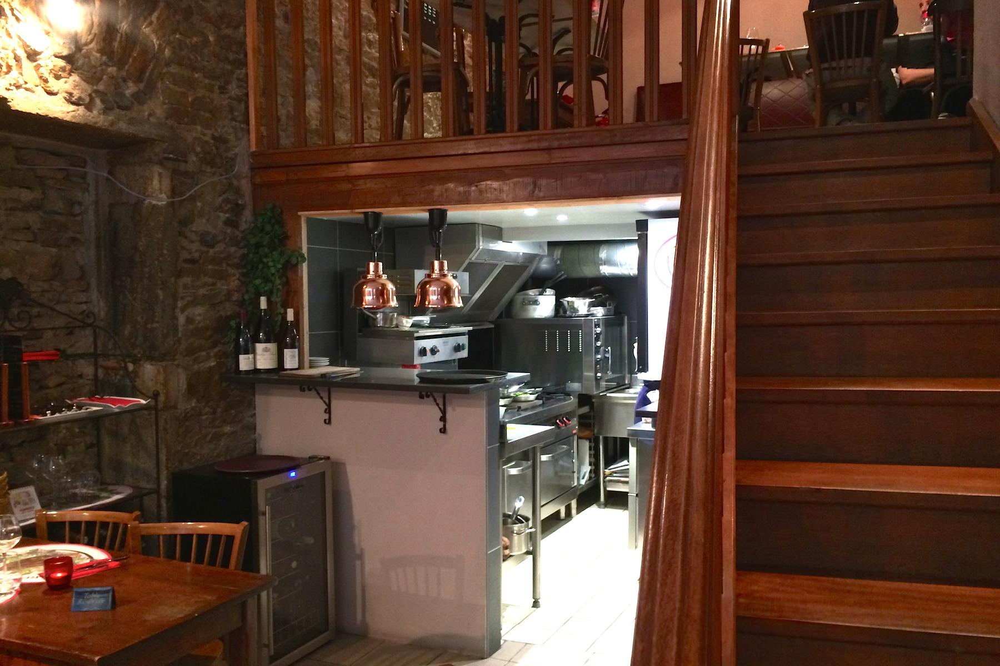
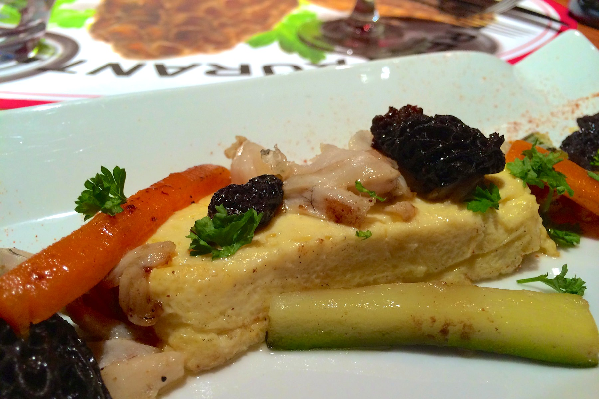
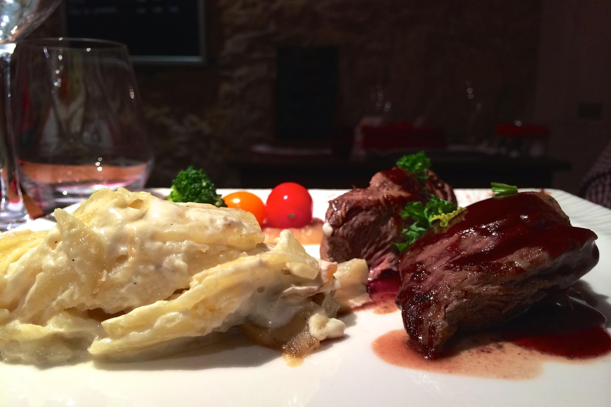
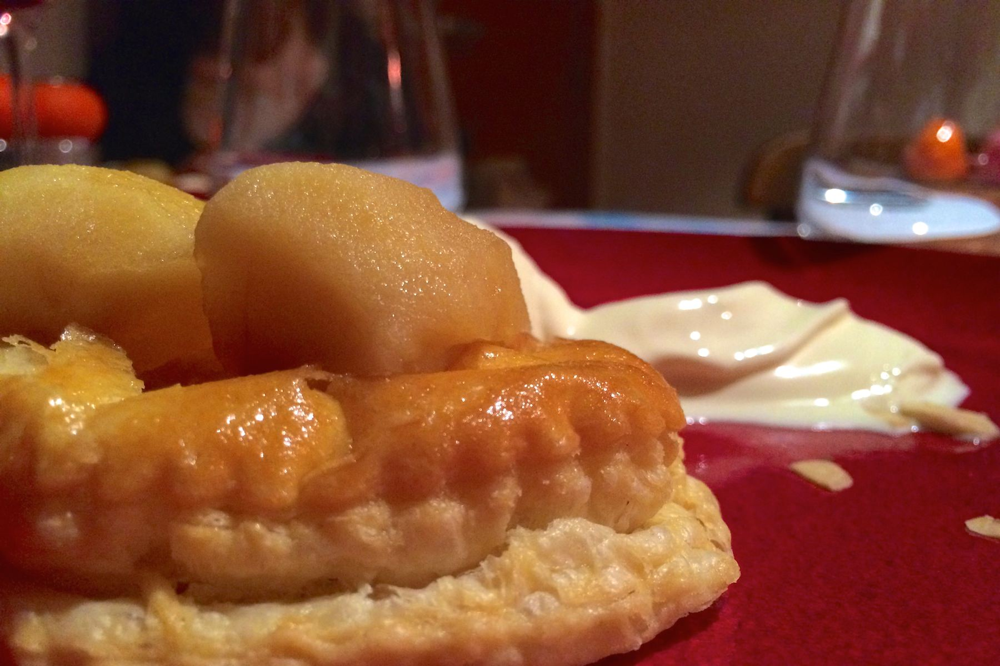

+++
type = "post"
titre = "La morille à Lyon"
title = "La morille à Lyon"
url = "/morille-lyon"
date = "2014-05-25T00:25:34"
Lastmod = "2014-05-25T22:46:29"
cover = "la-morille-lyon.jpg"
categorie = [ "À manger" ]
tag = [ "Cuisine française" ]

+++

Au cœur du Vieux-Lyon, à deux pas de la station de métro et de la cathédrale Saint-Jean, ce ne sont pas les restaurants qui manquent, mais il est parfois difficile de sortir du traditionnel bouchon lyonnais dans ce quartier très touristique. <a href="http://www.restaurant-la-morille.fr"><strong>La morille</strong></a> est un restaurant français assez classique, mais qui ose sortir des sentiers battus à Lyon avec une cuisine plus recherchée. Sans prétendre au gastronomique, cette adresse propose des assiettes savoureuses à un prix raisonnable.

La façade tout en verre laisse largement voir la petite salle du restaurant. Une trentaine de personnes peuvent manger à chaque service à <strong>La Morille</strong>, ce qui en fait une adresse de taille moyenne dans ce quartier très dense de ce point de vue. Au fond, on distingue de la rue la cuisine et le chef qui s’affaire. Une invitation à entrer dans ce restaurant qui l’affiche clairement dès l’entrée : ici, tout est fait maison. Une promesse rassurante à l’ère des plats souvent cuisinés à l’avance et à peine travaillés par le restaurateur avant le service. Ce samedi soir là, toutes les tables étaient occupées : souvent des couples, mais aussi quelques groupes dont le nôtre, à huit sur la mezzanine. Si l’on profite de la cuisine et de l’air frais en bas, il fait un peu chaud en haut, mais au moins on y est tranquilles. On est dans le Vieux Lyon, on ne s’attend pas à une salle aérée : ici comme ailleurs dans le quartier, la convivialité est le maître mot.

Nulle carte permanente ici, chaque jour le chef peut varier les plaisirs avec sa <a href="/wp-content/2014/05/la-morille-carte.jpg">carte resserrée</a> autour d’une douzaine de propositions, pas une de plus. Le soir, on peut manger pour 29 € avec le menu complet, de l’entrée au dessert, mais ceux qui le préfèrent peuvent aussi commander à la carte. Comme c’est souvent le cas, les tarifs sont alors moins avantageux et on aura toujours mieux fait de partir sur les trois assiettes. Avec un tel nom, <strong>La morille</strong> se devait de servir le fameux champignon noir et on le retrouve en effet, ce soir-là dans une entrée et un plat. Les amateurs seront peut-être déçus de ne pas le retrouver plus, les plus curieux auraient même apprécié de trouver une proposition de dessert autour de la morille, mais les choix du chef sont cohérents et cette carte fait envie. Sans se lancer dans des expérimentations un peu folles, on apprécie certaines originalités, à l’image de ce cappuccino froid d’asperges en entrée, ou bien encore la crème brulée à l’absinthe dans les desserts. Et pour les amateurs, le ris de veau aux morilles est, semble-t-il, le plat signature du restaurant.

Dans les assiettes, on retrouve une cuisine simple, mais souvent savoureuse et juste. En entrée, le cappuccino a eu du succès, tout comme les Saint-Jacques accompagnées de jus de crabe, même si cette assiette aurait mérité un accompagnement plus présent, ou plus de matière première. Les cuisses de grenouilles accompagnées de morilles et d&rsquo;une royale à l’ail des ours composaient une bonne assiette, même si les cuisses étaient désossées et donc un peu sèches et surtout si l’ail des ours promis dans l’intitulé était, ce soir-là, aux abonnés absents. Les morilles, généreuses et excellentes, venaient toutefois sauver le tout et apportaient toute la profondeur nécessaire à l’entrée. Le repas se poursuit avec un onglet de veau d’une tendreté remarquable et accompagné d’une sauce au vin puissante comme il se devait. Une excellente viande, avec des accompagnements un peu quelconques en revanche : le gratin dauphinois était bon, mais manquait un peu de sel et de chaleur et la branche de brocolis cuite à l’eau n’apportait rien. Les ris de veau ont eu du succès, et le lapin au vin jaune était bien cuisiné, même si le vin annoncé était lui aussi trop discret. Pour finir le repas, <strong>La morille</strong> ne manque pas d’idées pour une note de gourmandise, mais aussi de fraicheur. Ainsi, la tarte tarin était judicieusement accompagné d’une glace qui n’était pas à la vanille cette fois, mais au calvados. Une touche d’originalité qui sauve une tarte qui était un peu nature et manquait de caramel. La structure chocolat était plus intéressante : faite maison, cette structure était constituée de deux feuilles de chocolat noir, avec de la praline et du biscuit breton au milieu. C’est bon, mais riche et la glace à la verveine fait très bien glisser le tout.

<strong>La morille</strong> ne met pas le champignon dans toutes ses assiettes, ce qui aurait été un joli défi, mais cette adresse devrait convenir à tous ceux qui cherchent une cuisine française simple, mais de qualité. Avec ses assiettes vraiment composées sur place — la cuisine ouverte ne ment jamais — et ses prix raisonnables, ce restaurant mérite le détour si vous voulez manger dans le Vieux Lyon, mais que vous n’en pouvez plus des bouchons…

<small><em>Article 900 du blog !</em></small>

