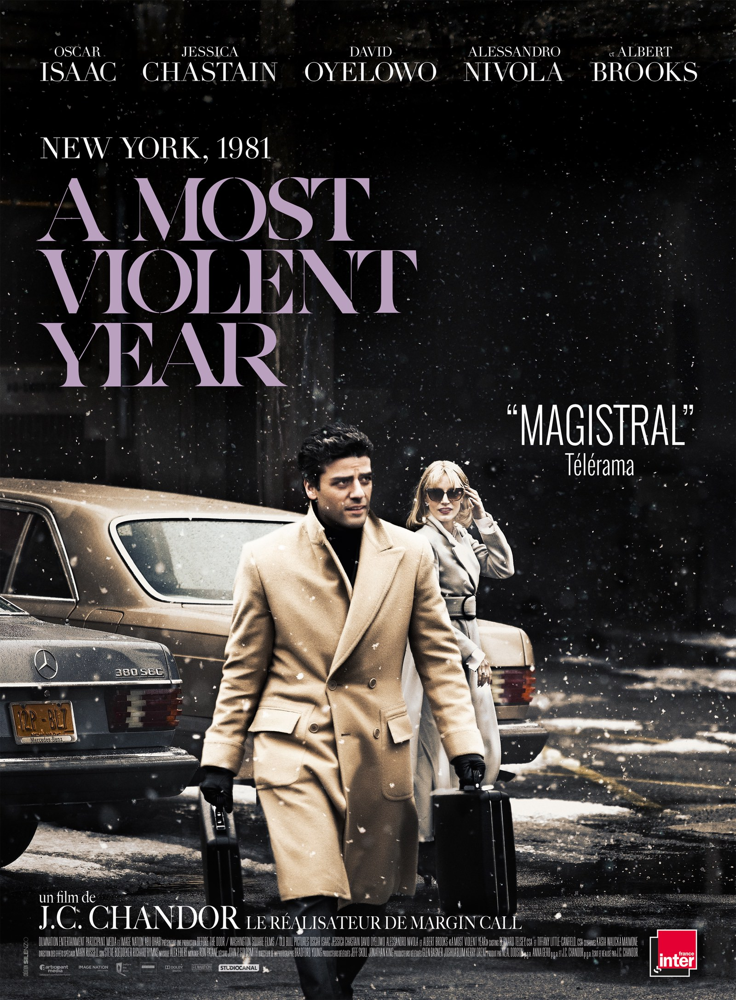
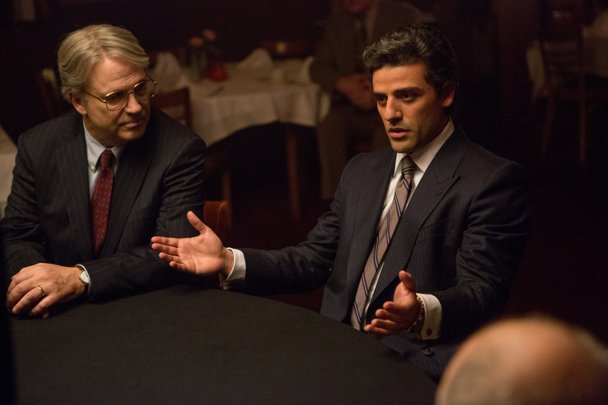

+++
titre = "<em>A Most Violent Year</em>, J.C. Chandor"
title = "A Most Violent Year, J.C. Chandor"
url = "/most-violent-year-chandor"
date = "2015-01-01T00:13:19"
Lastmod = "2015-01-01T00:16:55"
cover = "a-most-violent-year-chandor.jpg"
categorie = [ "À voir" ]
tag = [ "Argent", "Corruption", "Drame", "Enquête", "Famille", "Justice", "Mafia", "Société", "Sorties du mois", "Violence" ]
createur = [ "J.C. Chandor" ]
acteur = [ "Albert Brooks", "David Oyelowo", "Elyes Gabel", "Jessica Chastain", "Oscar Isaac" ]
annee = [ "2014" ]
weight = 2014
pays = [ "États-Unis" ]

+++

Pour son troisième long-métrage en trois ans, J.C. Chandor change de contexte et plonge dans le passé récent des États-Unis, tout en cherchant aussi du côté du cinéma classique. Deux ans après l&rsquo;excellent <a href="http://voiretmanger.fr/margin-call-chandor/" title="Margin Call, J.C. Chandor"><em>Margin Call</em></a> qui assistait à la crise des subprimes sans le dire, le cinéaste américain plonge cette fois le spectateur au cœur de la mafia new-yorkaise au début des années 1980. <em>A Most Violent Year</em> n&rsquo;a rien à voir avec un film de mafia façon <a href="http://voiretmanger.fr/affranchis-scorsese/" title="Les Affranchis, Martin Scorsese"><em>Les Affranchis</em></a> ou <a href="http://voiretmanger.fr/saga/le-parrain/"><em>Le Parrain</em></a> toutefois : le film se place astucieusement à côté en suivant les pas d&rsquo;un personnage qui refuse de devenir un mafieux dans un environnement complètement gangréné par la mafia. Une excellente idée, qui permet à J.C. Chandor de raconter une histoire tendue et passionnante, à découvrir !

Ce n&rsquo;est pas un hasard si l&rsquo;affiche du film précise « New York, 1981 » : cette précision géographique et historique explique en fait le choix du titre. Cette année-là, la ville américaine a connu la plus grande violence jamais enregistrée dans son histoire, un pic qui touche directement les personnages de <em>A Most Violent Year</em>. Le récit se concentre en effet sur Abel Morales, patron d&rsquo;une entreprise de livraison de fioul. Ce jeune immigrant d&rsquo;origine hispanique a racheté l&rsquo;entreprise de son beau-père et il la gère avec sa femme depuis quelques années quand l&rsquo;histoire commence. En se positionnant sur le haut de gamme et en entretenant une relation de confiance avec ses clients, Abel a gagné beaucoup de parts de marché et son entreprise est très prospère. À tel point qu&rsquo;il s&rsquo;apprête à acheter une immense zone pour stocker plus de fioul et le faire venir directement par bateau. Tout semble aller pour le mieux… sauf que ses camions sont de plus en plus souvent volés. Chaque camion citerne contient environ 6000 $ de carburant et ses chauffeurs sont régulièrement braqués. La situation s&rsquo;envenime encore, quand les commerciaux sont eux aussi pris à parti pendant leurs visites de clients potentiels, et quand sa famille est directement menacée. J.C. Chandor ne laisse pas planer le doute et fait comprendre d&rsquo;emblée que ces menaces diverses proviennent directement de la compétition. Comme la gestion des déchets dans <a href="http://voiretmanger.fr/soprano-chase-hbo/" title="Les Soprano, David Chase (HBO)"><em>Les Soprano</em></a>, la distribution de fioul est étroitement contrôlée par quelques familles qui ne voient pas du tout d&rsquo;un bon œil ce nouveau concurrent un peu trop ambitieux à leurs yeux. Les vols et les menaces plus ou moins directes, c&rsquo;est eux qui les organisent, ou du moins qui les incitent, car ils ont tout intérêt à éliminer ce concurrent gênant. Et pour couronner le tout, le personnage principal d&rsquo;<em>A Most Violent Year</em> est confronté à la justice américaine qui le considère comme un mafieux, à l&rsquo;image de ses pairs.

La principale question posée par <em>A Most Violent Year</em> est, au fond, celle du milieu : Abel peut-il vraiment échapper à la mafia et gérer son entreprise sainement ? Tous ses concurrents utilisent des pratiques peu recommandables, mais lui veut faire les choses bien : il respecte ses employés et surtout ses clients, à qui il propose de l&rsquo;attention et une offre adaptée plutôt que de les arnaquer comme le feraient tous les autres. Et cela fonctionne ! Il est manifestement riche et les affaires vont bien si l&rsquo;on en juge aux voitures luxueuses et à l&rsquo;immense maison qu&rsquo;il possède. À ses yeux, cette réussite est uniquement liée à son sens des affaires et à son choix de faire une offre de meilleure qualité que celle de ses concurrents, mais peut-il tenir sur cette ligne ? Les mafieux qui sont en compétition avec son entreprise aimeraient bien qu&rsquo;il suive la même voie et ils font tous pour le pousser à rester sur un territoire défini ou à casser ses prix. J.C. Chandor montre bien comment son personnage espère résister, refusant notamment d&rsquo;équiper ses chauffeurs d&rsquo;armes à feu pour qu&rsquo;ils puissent se défendre et riposter en cas de vol. Mais en même temps, <em>A Most Violent Year</em> est assez déprimant par l&rsquo;effet, clairement démontré, du milieu. Abel est marié à une femme issue de la mafia par sa famille et son avocat a lui aussi l&rsquo;habitude de tremper dans les affaires louches. Cet entourage jette une ombre sur la carrière soi-disant propre du personnage : a-t-il réussi par lui-même, sur le fameux modèle de l&rsquo;<em>American Dream</em>, ou a-t-il bénéficié des arnaques habituelles de la mafia, fût-ce à son insu ? Il faut dire que les enquêtes menées par la justice, qui sont comme un fil rouge pendant tout le film, jettent un trouble sur le personnage. J.C. Chandor parvient ainsi à maintenir un bon niveau de suspense et sa mise en scène tendue est très efficace à cet égard.

<em>A Most Violent Year</em> est rempli d&rsquo;autant de doutes et de suspicions que son personnage principal apparaît sûr de lui. C&rsquo;est probablement la plus grande réussite du dernier film de J.C. Chandor : on ne sait jamais vraiment où se positionne Abel et le risque de tomber dans la mafia est toujours sensible, à défaut de toujours être visible. Un équilibre subtil qui fonctionne à plein et qui ménage un suspense de tous les instants. Le long-métrage est assez classique sur la forme, mais très bien maîtrisé et porté par des acteurs convaincants (Oscar Isaac est très bien, dans un registre qu&rsquo;on ne connaissait pas et Jessica Chastain est excellente, comme d&rsquo;habitude) : en bref, c&rsquo;est une réussite, et une vision décalée plutôt bien vue sur la mafia. <em>A Most Violent Year</em> mérite bien le détour…

