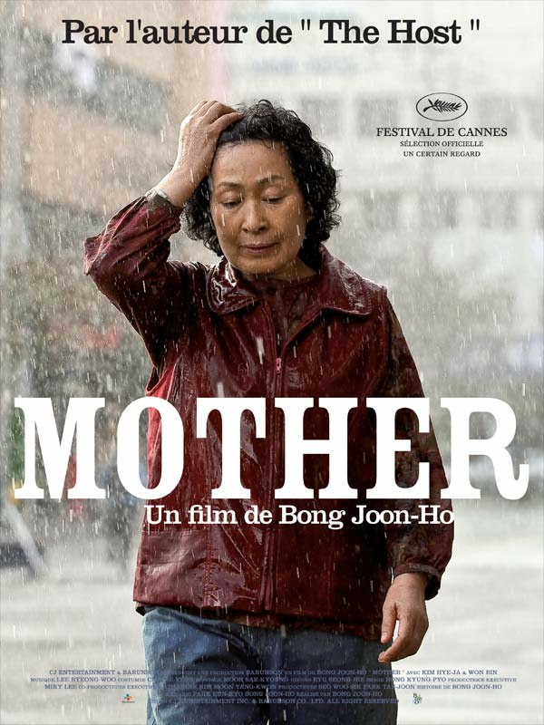
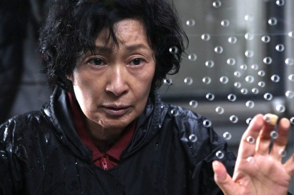

+++
type = "post"
titre = "<em>Mother</em>, Bong Joon-ho"
title = "Mother, Bong Joon-ho"
url = "/mother-bong"
date = "2010-01-30T23:45:48"
Lastmod = "2015-02-06T19:33:02"
cover = "mother-bong.jpg"
categorie = [ "À voir" ]
tag = [ "Drame", "Famille", "Thriller" ]
createur = [ "Bong Joon-ho" ]
acteur = [ "Kim Hye-Ja", "Won Bin" ]
annee = [ "2010" ]
weight = 2010
pays = [ "Corée du Sud" ]

+++

L&rsquo;affiche ne laisse place à aucun doute, Bong Joon-ho est aussi le réalisateur de <em>The Host</em> (et de <em>Memories of Murder</em>, accessoirement). Cette façon de vendre un film à travers un autre qui a bien marché est assez détestable, mais on ne peut pas en vouloir au réseau de distribution, quand on constate qu&rsquo;une salle peut être complète un samedi soir pour voir <em>Mother</em>, dernier film de Bong Joon-ho. Et pourtant, ce film est bien éloigné de <em>The Host</em> : suivant les traces d&rsquo;une mère prête à tout pour sauver son fils, <em>Mother</em> est un très beau film sur la famille, mais aussi, comme toujours, sur la société sud-coréenne.

<strong>Attention, il y a une enquête dans <em>Mother</em>. Si vous n&rsquo;aimez pas connaître le coupable avant de voir le film, passez directement aux derniers paragraphes…</strong>

L&rsquo;histoire de <em>Mother</em> est assez simple. Une mère et son fils vivent ensemble dans une ville non identifiée de la Corée du Sud. Le fils est un peu simplet, il a manifestement de graves problèmes de mémoires et réagit, disons différemment des gens supposés normaux. Il vit dans son propre monde et selon une logique qui lui est aussi propre. On se moque souvent de lui, ce qui le laisse totalement indifférent jusqu&rsquo;à ce que le mot &laquo;&nbsp;idiot&nbsp;&raquo; apparaisse. Alors, le gentil dadais se transforme en bête enragée. Sa mère veut à tout prix le protéger, on sent que sa vie se résume entièrement à un fils qu&rsquo;elle chérit comme la plus belle chose au monde. Elle le surprotège, voulant même lui donner à manger alors qu&rsquo;il a manifestement passé l&rsquo;âge. D&rsquo;ailleurs, il en a assez et préfère vivre sa vie, aller faire des bêtises avec un ami, ou boire des verres. Un matin, on retrouve une jeune fille morte sur un toit et c&rsquo;est immédiatement ce garçon que l&rsquo;on suspecte. Les preuves sont accablantes, il ne fait rien pour les contrer signant même la déclaration reconnaissant son crime, et il est emprisonné.

Commence alors une vaste contre-enquête menée par sa mère pour prouver son innocence. Sa détermination ne défaille jamais, alors que l&rsquo;innocence de son fils devient secondaire : peu importe finalement qu&rsquo;il soit le meurtrier ou non, elle fera tout pour convaincre la police qu&rsquo;il n&rsquo;est pour rien dans l&rsquo;histoire. Là où on essaierait de faire valoir une santé mentale déficiente comme circonstances atténuantes, cette mère s&rsquo;obstine à trouver un autre coupable, si possible le vrai, mais cette question même paraît secondaire. Elle va alors jusqu&rsquo;à accuser un ami de son fils, évidemment innocent. Et quand sa quête de vérité aboutit finalement, elle n&rsquo;accepte pas la vérité, elle ne peut pas l&rsquo;accepter.

Le film montre à merveille comment l&rsquo;amour qu&rsquo;une mère peut éprouver pour son fils peut virer à la folie. Sa quête est sublime parce que motivée uniquement par un amour inconditionnel, mais elle la mène aussi tout droit dans les pires travers, mentant aux forces de la police et préférant finalement livrer un coupable idéal pour que son fils soit libéré. La vérité perd toute sa place dans <em>Mother</em> qui commençait pourtant comme une double enquête des plus classiques. Mais le réalisateur vient nous rappeler qu&rsquo;il ne fait pas de cinéma classique et l&rsquo;on retrouve ici un des principes de <em>The Host</em> où le monstrueux naissait de la routine.

La folie est telle qu&rsquo;on ne sait plus bien, au fond, qui du fils ou de la mère est le plus fou. Le fils a des troubles de mémoire et de comportements, mais c&rsquo;est certainement le plus sincère et le plus candide. Le personnage de la mère est bien plus passionnant par sa dualité. Côté pile, une mère aimante qui se sacrifie pour son fils. Côté face, une femme manipulatrice qui est, et c&rsquo;est vraiment le point fort du scénario et du film, finalement responsable de tout. C&rsquo;est elle qui a dit à son fils de se battre quand on le traite mal. Pis, c&rsquo;est elle qui a essayé de l&rsquo;empoisonner à l&rsquo;âge de 5 ans dans un suicide collectif raté. Le film ne dit rien à ce sujet, mais on peut très bien imaginer que ses problèmes mentaux sont apparus avec ce suicide maternel dans sa jeunesse. La quête de la mère, vue sous cet angle, prend alors un tout autre sens. Le film est, pour cela, assez déchirant, très émouvant, d&rsquo;autant plus que ce personnage de la mère, jamais nommée, tend à l&rsquo;universel.

<em>Mother</em> est un film à la fois magnifique et terrifiant. Porté par une excellente actrice (Kim Hye-Ja), le personnage de la mère est passionnant, parce que trouble et complexe. Bong Joon-ho fait, de son côté, des merveilles derrière la caméra, certains plans étant vraiment magnifiques. <em>Mother</em> est un film au rythme assez lent globalement, même si à intervalles réguliers, le rythme s&rsquo;accélère tandis que l&rsquo;enquête avance. C&rsquo;est un très beau film, terrifiant aussi jusqu&rsquo;à la toute fin et sa conclusion peu optimiste (avec l&rsquo;acupuncture comme solution originale à tous les problèmes).

Il y aurait encore beaucoup à dire sur <em>Mother</em>, évoquer l&rsquo;humour présent en permanence à travers le film, mais aussi la critique d&rsquo;une société coréenne corrompue où la violence est omniprésente, où les figures de l&rsquo;autorité sont des moins que rien incapables de mener une enquête à bon terme (la police) ou capable d&rsquo;un délit de fuite puis des pires gamineries quand il s&rsquo;agit de justifier un acte. Je préfère en rester là et recommander, une nouvelle fois, le dernier film de Bong Joon-ho, un cinéaste définitivement passionnant.

Concert de louanges parmi la blogosphère : Rob, qui a eu la chance <a href="http://www.toujoursraison.com/2010/01/entretien-avec-bong-joon-ho-tellement_25.html">d&rsquo;interviewer</a> Bong Joon-ho<a href="#fn-2561-1" rel="footnote">1</a> a <a href="http://www.toujoursraison.com/2010/01/mother.html">beaucoup aimé</a> <em>Mother</em>. Louanges aussi chez <a href="http://showtimefolks.fr/2009/12/29/preview-mother-de-bong-joon-ho/">Showtime, Folks !</a>, chez <a href="http://www.surlarouteducinema.com/archive/2010/01/29/mother-de-joon-ho-bong.html">Pascale</a> ou encore chez <em><a href="http://www.critikat.com/Mother.html">Critikat</a></em> qui livre, comme d&rsquo;habitude, une brillante analyse du film.

<h3>Vous voulez m&rsquo;aider ?</h3>
<ul>
<li><a href="http://www.amazon.fr/gp/product/B003PHJLV4/ref=as_li_ss_tl?ie=UTF8&tag=leblogdenic07-21&linkCode=as2&camp=1642&creative=19458&creativeASIN=B003PHJLV4">Acheter le film en Blu-Ray sur Amazon</a></li>
<li><a href="http://www.amazon.fr/gp/product/B003G5MTPK/ref=as_li_ss_tl?ie=UTF8&tag=leblogdenic07-21&linkCode=as2&camp=1642&creative=19458&creativeASIN=B003G5MTPK">Acheter le film en DVD sur Amazon</a></li>
<li><a href="https://itunes.apple.com/fr/movie/mother-vost/id421979204">Acheter ou louer le film sur l&rsquo;iTunes Store</a></li>
</ul>

<ol>
<li id="fn-2561-1">
Une interview fort intéressante, où l&rsquo;on apprend notamment que l&rsquo;actrice principale est une véritable star en Corée du Sud et une sorte de mère toujours parfaite. Ce film serait même né de la volonté de lui faire jouer un rôle à contre-emploi…&#160;<a href="#fnref-2561-1" rev="footnote">&#8617;</a>
</li>
</ol>

