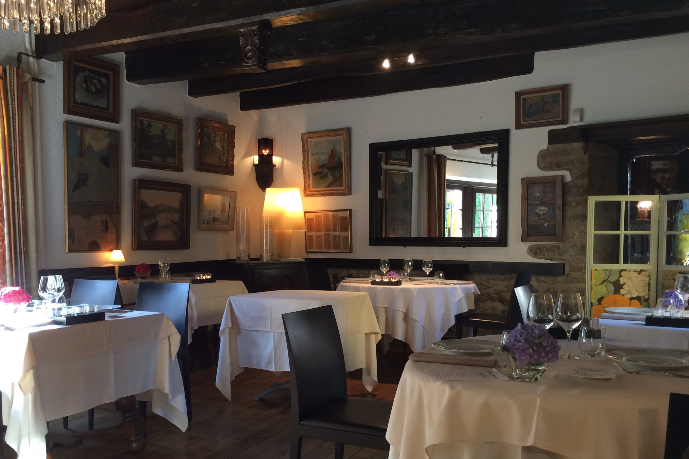
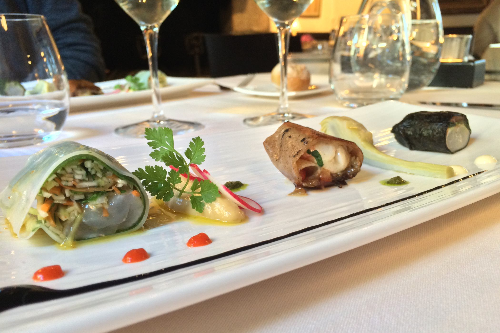
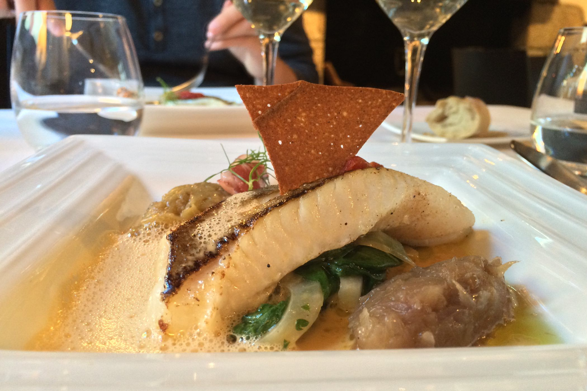
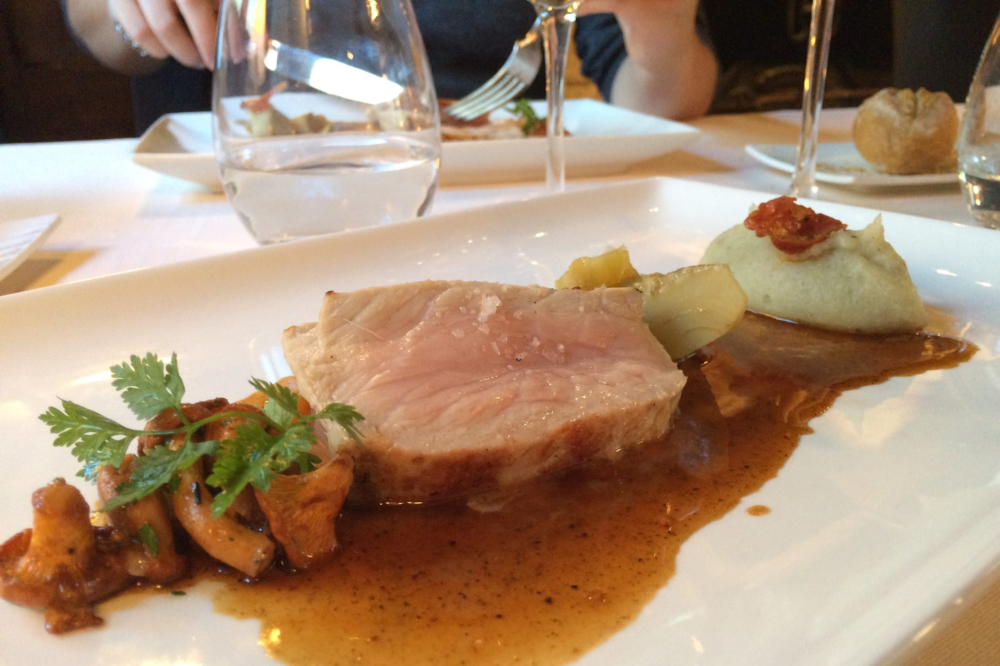
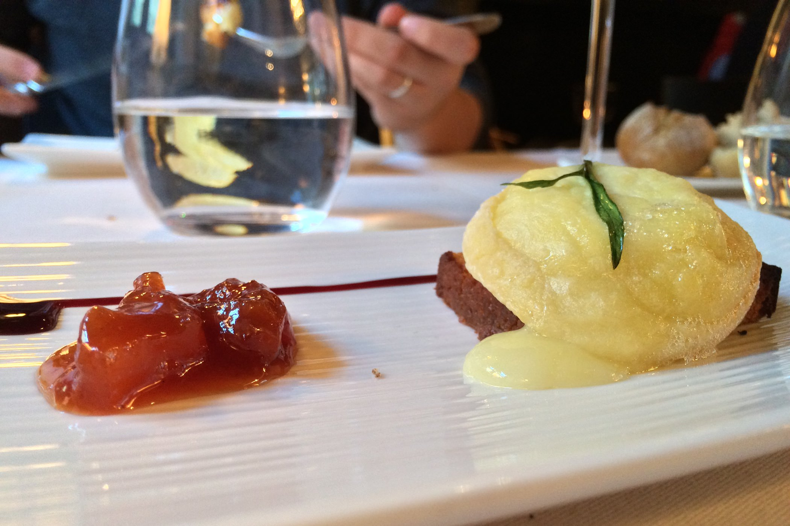
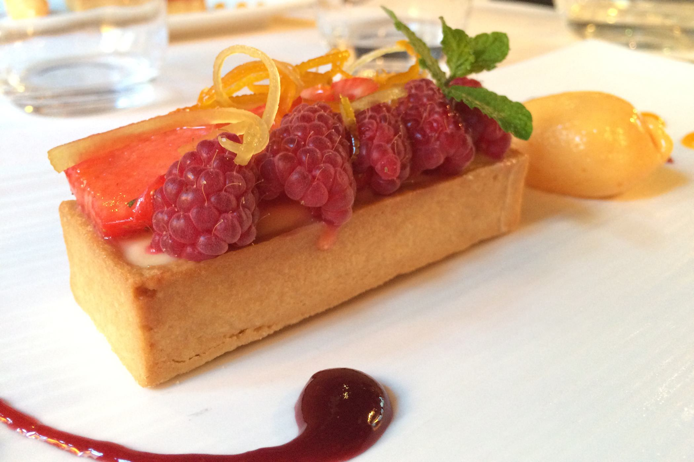

+++
type = "post"
titre = "Le Moulin de Rosmadec à Pont-Aven"
title = "Le Moulin de Rosmadec à Pont-Aven"
url = "/moulin-rosmadec-pont-aven"
date = "2014-07-12T00:06:06"
Lastmod = "2014-07-13T21:18:20"
cover = "moulin-rosmadec-pont-aven.jpg"
categorie = [ "À manger" ]
tag = [ "À manger", "Bretagne", "Cadre original", "Cuisine française", "Cuisine moderne", "Poisson", "Une étoile Guide Michelin" ]

+++

<a href="http://www.moulinderosmadec.com/restaurant.html"><strong>Le Moulin de Rosmadec</strong></a> pourrait difficilement être situé plus au centre de Pont-Aven. Situé le long de la rivière qui traverse le charmant bourg rendu célèbre par les peintres, on accède au restaurant par une toute petite ruelle qui donne sur la rue principale de la ville. C’est à l’intérieur d’un moulin construit au XVe siècle très bien conservé que cette adresse propose une cuisine traditionnelle qui ose les touches de modernité. Étoilée, cette maison propose des assiettes parfaitement maîtrisées, pour un prix finalement très raisonnable. Si vous cherchez une cuisine gastronomique dans la région, c’est un incontournable.

Le moulin du XVe siècle a été préservé quasiment dans son état original. Les cuisines modernes ont été installées légèrement en retrait, si bien que l’on entre dans la partie qui date vraiment de plusieurs siècles. Le premier contact est, de fait, très impressionnant : les boiseries sombres, les meubles bretons et les traces de l’activité de minoterie sont omniprésents, formant un cadre très chaleureux. En arrière de cette première salle, deux autres en enfilade, les deux le long de l’Aven. On reste dans un premier temps dans un cadre ancien, parquet en bois massif et poutres apparentes, mais on note déjà quelques touches plus modernes, des chaises aux lampes dessinées par Starck. L’autre salle complète avec un décor plus moderne, une sorte de véranda qui a le mérite de laisser encore plus admirer la rivière, mais qui perd forcément en charme pour les amateurs d’ancien. Les beaux jours, on pourra même manger dehors… Quoi qu’il en soit, l’ensemble est très séduisant et <strong>Le Moulin de Rosmadec</strong> a bien su conserver ses atouts d’antan.

En ce vendredi soir de période estivale, le restaurant est quasiment complet, mais la disposition générale des lieux est parfaitement optimisée pour éviter la sensation d’usine touristique. Les tables ne sont pas les unes sur les autres et l’accueil, naturellement, est digne d’un restaurant étoilé. La patronne en personne vous souhaite la bienvenue, vous installe à table et vous sert dans la foulée un amuse-bouche. Quel que soit le menu que vous choisissez, ou même si vous ne voulez qu’un plat à la carte, on vous sert de quoi ouvrir l’appétit, un geste très agréable. L’amuse-bouche ouvre un repas et permet au chef de signer d’emblée sa présence : c’est une forme de signature et la terrine de volaille craquante, accompagnée d’une sorte de gaspacho revisité, formaient un aperçu très engageant.

Pendant que l’on déguste ces amuse-bouches, on a tout le loisir de lire <a href="/wp-content/2014/07/moulin-rosmadec-menu.jpg">la carte</a> du lieu. Le midi, on peut se contenter de la formule du jour et s’en tirer, avec deux assiettes, pour moins de trente euros. Le soir, cette même formule est proposée, mais uniquement avec une entrée, un plat et un dessert pour environ 50 €. On se laisse vite tenter par les deux autres formules toutefois, avec un choix qui représente bien l’esprit du <strong>Moulin de Rosmadec</strong>. Si vous cherchez des valeurs sûres, le menu tradition facturé 79 € par convive vous propose exactement ça : la tradition. Le homard grillé Rosmadec et ses deux beurres est un plat signature qui fait la réputation des lieux et qui n’a, apparemment, pas volé son succès. En entrée, vous aurez au choix des huitres (bretonnes, cela va de soi) ou du foie gras maison ; pour finir le repas, un soufflé au Grand Marnier on ne peut plus classique ou des crêpes soufflées qui valent, apparemment, le détour.

La tradition a du bon, mais nous préférons nous laisser porter par le menu surnommé « Méli Mélo Gourmand » qui est bien plus ambitieux. Jugez plutôt : une entrée, un poisson, une viande, du fromage et un dessert pour 64 €, voilà un programme alléchant. Le chef propose alors des plats plus originaux, quoique souvent centrés sur les produits de la mer, c’est bien normal. On commence notre repas avec de la langoustine, proposée sous trois formes. Au milieu de l’assiette rectangulaire, une version crêpière : le crustacé est cuit, enroulé dans une galette de sarrasin et assaisonné avec une fondue d’oignons. Moins classique, mais tout aussi efficace : deux langoustines crues, l’une dans une algue façon sushi et l’autre un peu dans l’esprit d’un rouleau de printemps, avec de nombreux légumes. L’ensemble est très bon, on passe d’un goût à l’autre en changeant de bouchée, mais les amateurs de langoustine regretteront peut-être que le crustacé soit un peu couvert par ce qui l’entoure. Un reproche qui ne s’applique pas au Saint-Pierre qui a suivi : le poisson à la chair ferme était parfaitement cuit et accompagné avec précision d’un excellent jus de crustacé, et de légumes divers, épinards, fenouils et autres artichauts. Au contraire de l’entrée, cette assiette est très précisément équilibrée, un régal.

Quittant la mer, on attaque une assiette de viande avec un filet de veau du Limousin cuit à la perfection, c’est-à-dire encore rosé. Quelques giroles et un peu d’artichaut pour accompagner cette pièce de viande, mais le clou du spectacle est plutôt le jus épicé proposé en abondance dans l’assiette. De quoi dynamiser la viande d’une tendreté remarquable, en lui apportant un peu de sucre, pour une assiette encore une fois très bien équilibrée. Même exercice, à nouveau une réussite pour le fromage, un crottin de Chavignol simplement fondu sur un carré de pain d’épices grillé. Le chèvre était très bon et surtout pas écrasé par le pain d’épices qui savait rester discret en sucre. La marmelade préparée par le chef peut être dégustée à part et on aurait tort de s’en passer : la recette est secrète nous a-t-on dit, elle est en tout cas très bonne, avec un goût marqué de fruits et une touche de fraise très convaincante. Quand arrive le dessert, on n’a pas envie d’une assiette trop lourde, mais rien de tel avec cette tartelette avec une base Yuzu, surmontée de fraises et framboises et accompagnée d’un sorbet à l’abricot. Servi dans des assiettes refroidies (une excellente et trop rare idée), ce dessert rafraichit les papilles et termine le repas sur une note gourmande, mais pas lourde.

Loin des attrape-touristes qui pullulent aux alentours, <strong>Le Moulin de Rosmadec</strong> reste une valeur sûre de Pont-Aven. Le restaurant n’a pas volé son étoile au Guide Michelin et on y mange très bien, que ce soit des plats traditionnels inchangés depuis des générations, ou des recettes plus originales et toujours savoureuses. Certes, le budget est loin d’un petit restaurant estival — 150 € à deux, avec le vin —, mais pour un étoilé et pour la qualité servie, le rapport qualité/prix est excellent. Une très bonne adresse, à ne pas rater !

