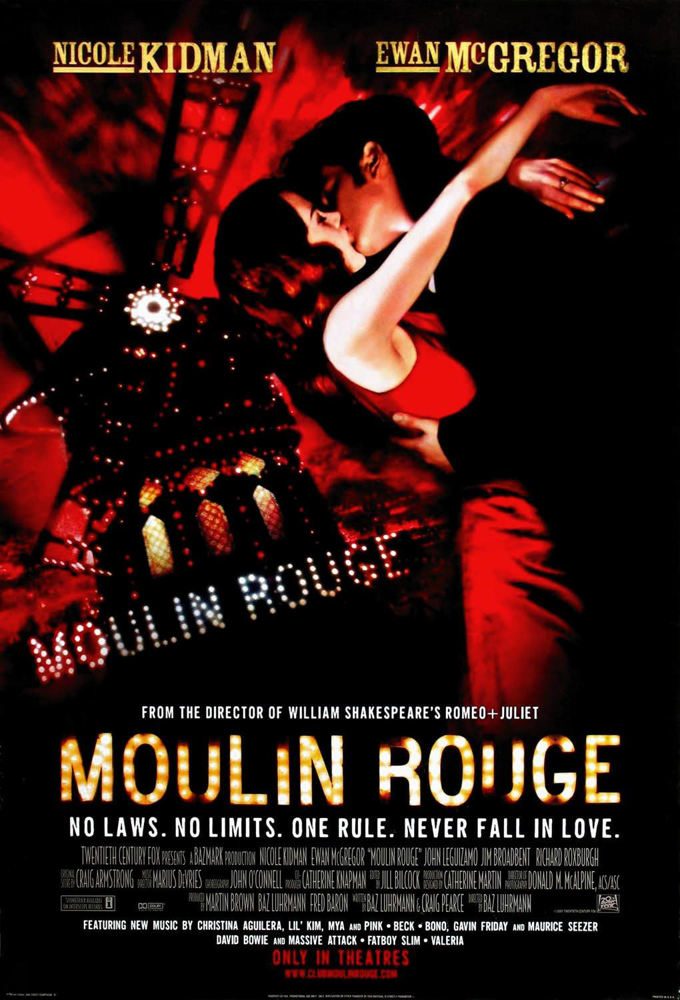
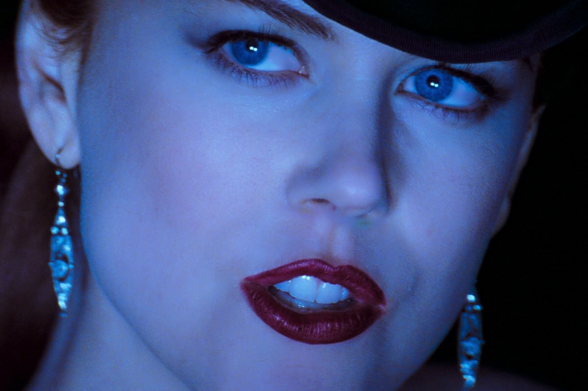

+++
type = "post"
titre = "<em>Moulin Rouge !</em>, Baz Luhrmann"
title = "Moulin Rouge !, Baz Luhrmann"
url = "/moulin-rouge-luhrmann"
date = "2013-06-22T10:24:24"
Lastmod = "2014-02-25T22:20:29"
cover = "moulin-rouge-luhrmann-ewan-mcgregor-nicole-kidman.jpg"
categorie = [ "À voir" ]
tag = [ "Amour", "Bollywood", "Comédie musicale", "Drame", "Kitsch", "Théâtre" ]
createur = [ "Baz Luhrmann" ]
acteur = [ "Ewan McGregor", "Jim Broadbent", "John Leguizamo", "Nicole Kidman" ]
annee = [ "2001" ]
weight = 2001
pays = [ "États-Unis" ]
original = "Moulin Rouge!"

+++

Baz Luhrmann s’est fait connaître par une relecture tonitruante du mythe <em>Roméo et Juliette</em> mâtiné de clips MTV avec <a href="/romeo-juliette-luhrmann/" title="Romeo + Juliette, Baz Lurhmann - À voir et à manger"><em>Romeo + Juliette</em></a>. Quatre ans plus tard, il fait un retour encore plus bruyant sur les écrans avec <em>Moulin Rouge !</em>, une comédie musicale qui se déroule dans le Paris de la Belle Époque et un drame autour d’un amour impossible. Rien de très original sur le papier, si ce n’est que le traitement à l’écran est complètement déjanté. Comédie musicale oblige, il y a beaucoup de chansons dans le film, mais Baz Lurhmann a eu l’idée étonnante de composer une bande originale comme un grand medley de tubes de toutes les époques. À l’écran, un grand bordel très coloré, souvent kitsch, mais assez plaisant.

« <em>Aucune loi. Aucune limite. Une seule règle. Ne jamais tomber amoureux.</em> » : <em>Moulin Rouge !</em> commence immédiatement par poser le contexte général, en même temps qu’il donne la fin de l’histoire. On découvre ainsi Christian — Ewan McGregor correct —, jeune poète sans le sou, qui est en train d’écrire une histoire, son histoire d’amour fou et impossible avec Satine — Nicole Kidman comme on l’avait jamais vue —, l’une des filles du Moulin Rouge. Dans le Paris de la fin du XIXe siècle reconstitué pour les besoins du film, cette adresse est un haut lieu du cabaret, mais aussi de la prostitution et Satine est une fille qui vend son corps, une courtisane comme on le disait alors. Comme toutes les autres filles, elle n’a qu’une seule règle : ne jamais tomber amoureuse. Bien évidemment, elle va tomber amoureuse de Christian et on sait ainsi que leur histoire est vouée à l’échec. Baz Lurhmann va même plus loin en précisant dès les premières minutes que Satine est morte : on ne regarde pas <em>Moulin Rouge !</em> pour son suspense. Comme avec la relecture de <em>Roméo et Juliette</em> d’ailleurs, le cinéaste australien construit son film autour d’un amour aussi fort qu’il est impossible. On le sait très bien, tout autant que les personnages, mais le coup de foudre est plus fort : dès la première rencontre, Christian tombe sous le charme et il ne peut que l’aimer. Satine résiste un petit peu plus longtemps, mais elle doit elle aussi céder face à ce sentiment trop fort. De manière assez tragique, le cinéaste laisse pourtant entrevoir la possibilité d’un amour, puisque tout le film est construit sur cette relation d’abord secrète qui devient trop forte pour être cachée. Hélas, quand ce n’est pas la société qui leur interdit de s’aimer, c’est la nature : atteinte de la tuberculose, l’héroïne de <em>Moulin Rouge !</em> ne peut survivre à cet amour qui semble avoir déclenché la maladie — la première manifestation a lieu juste après le premier regard. Cette histoire n’est absolument pas originale, mais Baz Lurhmann a une autre piste pour compenser ce manque d’originalité.

Optant pour la comédie musicale, <em>Moulin Rouge !</em> est composé de plusieurs séquences chantées par ses personnages. Le genre n’est pas nouveau, mais Baz Luhrmann n’adapte pas une comédie musicale existante comme c’est souvent le cas, il compose ses propres morceaux, ce qui est plus rare. Plus étonnant encore, il choisit de piocher dans l’immense répertoire de la pop et du rock de la deuxième moitié du XXe siècle pour ses chansons : on entend ainsi David Bowie, Madonna ou encore The Police, sur un fond de Belle Époque. L’anachronisme est flagrant et il est le principal élément de décalage dans ce film qui fonctionne un petit peu sur la systématisation des décalages. À l’écran, l’idée fonctionne en tout cas très bien et le plaisir de <em>Moulin Rouge !</em> provient aussi de la possibilité de reconnaître tous les artistes brassés sur la <a href="http://www.amazon.fr/gp/product/B000063T0T/ref=as_li_ss_tl?ie=UTF8&tag=leblogdenic07-21&linkCode=as2&camp=1642&creative=19458&creativeASIN=B000063T0T">bande originale</a>. Les morceaux originaux ont été réécrits pour les adapter au film et le résultat est souvent plutôt bon, même s’il ne reste parfois qu’une ligne ou deux de certains morceaux. Comme toute comédie musicale, il faut bien sûr composer avec le décalage créé par ces chansons qui font avancer l’action, mais l’ensemble fonctionne assez bien, du moins dans un premier temps. <em>Moulin Rouge !</em> commence en effet par une plongée à toute allure dans l’univers créé pour le film. Pendant les premières minutes, tout va vite, très vite même, et on est un peu abasourdi par l’énorme bordel coloré que filme Baz Lurhmann. Sa vision du Moulin Rouge est une sorte d’immense fête où les costumes bariolés s’entremêlent, où l’on boit, où l’on chante, où l’on danse… et où on se perd un petit peu. Le film est toutefois sauvé par un sens du second degré qui évite l’ensemble, très kitsch, d’être trop ridicule. Cet humour initial rend la première scène de rencontre entre Christian et Satine très drôle : construite entièrement sur les quiproquos, elle fonctionne vraiment bien notamment grâce au talent de Jim Broadbent qui compose un patron de cabaret hilarant. Malheureusement, <em>Moulin Rouge !</em> devient plus sérieux dans un deuxième temps et ses défauts sont alors plus difficiles à pardonner. Outre qu’il est un peu long, mais c’est surtout l’amour mièvre du poète qui devient pesant à la longue. Le cinéaste a toutefois la bonne idée de ne pas céder toute la place à son histoire d’amour et à maintenir, jusqu’au bout, de nombreuses scènes de danse et de chants qui sont, il faut le reconnaître, réussies dans le genre. 

Filmé comme un long clip de plus de deux heures, sans un plan de plus de quelques secondes, <em>Moulin Rouge !</em> est un peu fatiguant, comme tous les films de Baz Lurhmann. Difficile toutefois de condamner ce long-métrage pour cette raison : c’est son style après tout et il faut bien dire que c’est un style qu’il maîtrise et qui est très bien mis en œuvre. Ici, une banale histoire d’amour impossible devient un énorme n’importe quoi bariolé, quelque chose qui est assez proche de l’idée qu’on se fait du Moulin Rouge à la fin du XIXe siècle. C’est sans doute aussi faux que le Paris en carton-pâte de <em>Moulin Rouge !</em>, mais qu’importe : le film ne prétend nullement à la précision historique, c’est plutôt une relecture occidentale de Bollywood et à condition de ne pas être allergique au genre, c’est assez réussi. 

<h3>Vous voulez m&rsquo;aider ?<a href="#footnote_0_9773" id="identifier_0_9773" class="footnote-link footnote-identifier-link" title="&Agrave; propos de la publicit&eacute;&hellip;">1</a></h3>
<ul>
<li><a href="http://www.amazon.fr/gp/product/B0041HU454/ref=as_li_ss_tl?ie=UTF8&tag=leblogdenic07-21&linkCode=as2&camp=1642&creative=19458&creativeASIN=B0041HU454">Acheter le film en Blu-Ray sur Amazon</a></li>
<li><a href="http://www.amazon.fr/gp/product/B00006CFIM/ref=as_li_ss_tl?ie=UTF8&tag=leblogdenic07-21&linkCode=as2&camp=1642&creative=19458&creativeASIN=B00006CFIM">Acheter le film en DVD sur Amazon</a></li>
<li><a href="https://itunes.apple.com/fr/movie/moulin-rouge!/id369516103">Acheter ou louer le film sur l&rsquo;iTunes Store</a></li>
</ul>

<ol class="footnotes"><li id="footnote_0_9773" class="footnote"><a href="/soutien/">À propos de la publicité…</a> [<a href="#identifier_0_9773" class="footnote-link footnote-back-link">&#8617;</a>]</li></ol>
