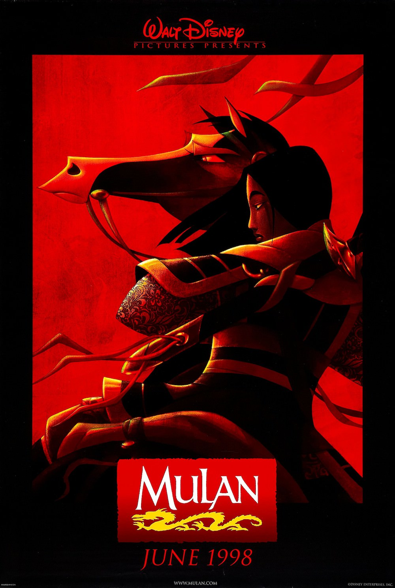
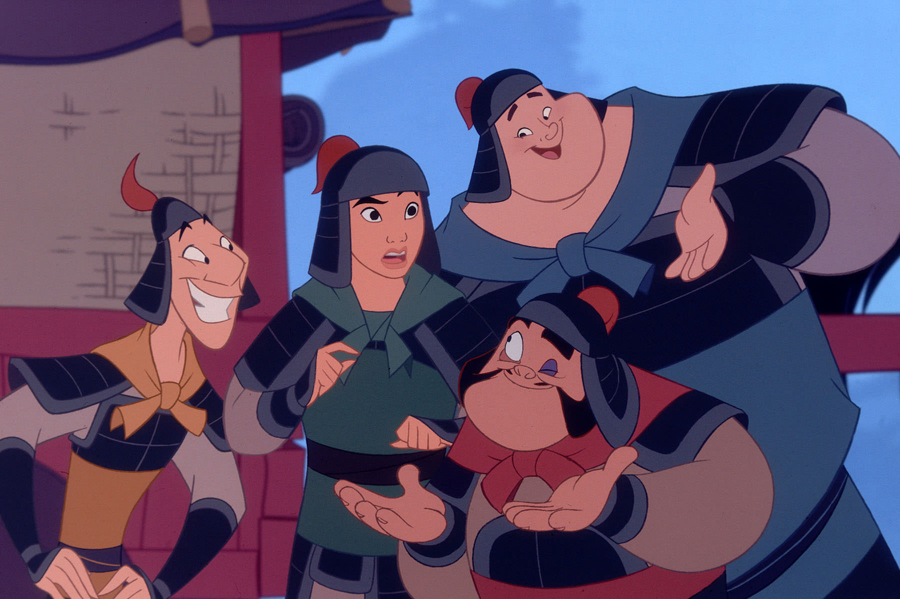
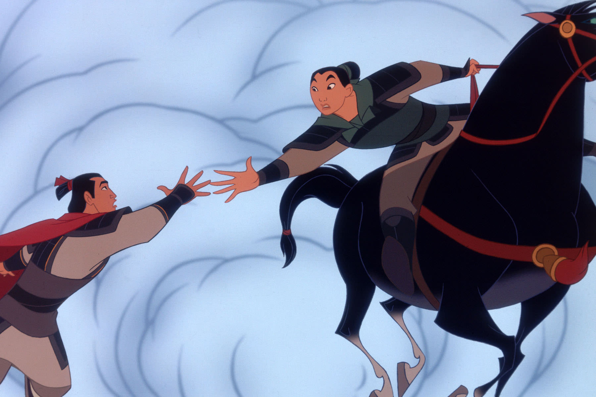

+++
titre = "<em>Mulan</em>, Tony Bancroft et Barry Cook"
title = "Mulan, Tony Bancroft et Barry Cook"
url = "/mulan-bancroft-cook"
date = "2014-01-15T15:41:01"
Lastmod = "2014-02-25T13:47:03"
cover = "disney-mulan-tony-bancroft-barry-cook.jpg"
categorie = [ "À voir" ]
tag = [ "Amour", "Aventure", "Famille", "Féminisme", "Guerre", "Histoire" ]
createur = [ "Barry Cook", "Tony Bancroft", "Walt Disney" ]
annee = [ "1998" ]
weight = 1998
saga = [ "Classiques d'animation Disney" ]
pays = [ "États-Unis" ]

+++

Juste après <a href="http://voiretmanger.fr/hercule-musker-clements/" title="Hercule, John Musker et Ron Clements"><em>Hercule</em></a>, le trente-sixième classique de Disney renouvelle encore le genre à sa manière. Après la mythologie gréco-romaine, le studio d’animation cherche cette fois du côté de l’Asie en s’inspirant de l’histoire de <a href="http://fr.wikipedia.org/wiki/Hua_Mulan">Hua Mulan</a>, héroïne d’une vraie légende chinoise, pour <em>Mulan</em>. S’inspirer de l’histoire est une tendance relativement récente pour Walt Disney, mais assez présente dans les années précèdent la sortie de ce nouvel opus, de <em>Pocahontas, une légende indienne</em> au <em>Bossu de Notre-Dame </em>. Pour ce long-métrage inspiré par la Chine — une première —, Tony Bancroft et Barry Cook signent un film d’animation réussi, sans doute parce qu’il a su capitaliser sur les bases du studio tout en offrant quelques idées nouvelles…

En premier lieu, c’est peut-être la modernité du propos qui frappe quand on découvre <em>Mulan</em> pour la première fois. Si le personnage principal est une femme comme dans bon nombre des films du studio, l’héroïne de Tony Bancroft et Barry Cook n’a rien de la gentille princesse dont on se contente trop souvent. Mulan est une fille de bonne famille, mais pas de famille noble, dans la Chine du Ve siècle. Son rôle est très clair : elle doit trouver un bon parti et se marier pour honorer sa famille et assurer ainsi une descendance nombreuse. L’une des premières chansons du film résume cet objectif de vie assez dur et déjà plutôt éloigné de ce que l’on aurait l’habitude d’entendre dans un Walt Disney. Mais le plus important tient dans la posture de Mulan face à cette obligation sociale : alors qu’elle essaye de s’y conformer pour faire plaisir à ses parents, la jeune femme ne peut voiler sa vraie nature. Elle se plante lamentablement lors du passage devant la marieuse, l’équivalent de l’époque des télé-réalités actuelles où on va décider si elle est digne de se marier et à quel niveau dans la société elle peut espérer trouver un époux. Dans le même temps, <em>Mulan</em> intègre un fait historique avec l’envahissement du pays par les terribles Huns et l’Empereur rassemble toutes ses troupes. Pour éviter à son vieux père une mort certaine, Mulan se déguise en soldat et se porte volontaire à sa place, ce qui était à l’époque passible de la peine de mort. Les princesses ont toujours agi chez Disney, mais c’est la première fois peut-être qu’une héroïne aussi contrainte par le contexte social parvient à s’en extirper et à imposer son indépendance.

Non seulement Mulan s’impose dans un univers extrêmement masculin par défaut, mais elle le fait en outre dans un cadre encore plus exclusivement masculin en s’engageant dans l’armée. Tony Bancroft et Barry Cook enchaînent les passages obligés avec un entraînement difficile et le passage d’hommes médiocres à d’excellents soldats après avoir montré leur courage, mais la question du sexe reste présente en permanence. Le personnage principal de <em>Mulan</em> doit cacher son identité, faire attention à dormir et se laver loin de ses collègues et alors que la jeune femme a largement prouvé sa valeur en mettant en échec à elle seule toute l’armée des Huns, la découverte de sa sexualité provoque un rejet net. Même si les enfants sont servis avec des personnages secondaires d’ailleurs plutôt convaincants — le dragon Mushu porté par la voix de José Garcia en français est amusant —, ce retour à la réalité est assez rude. Dans l’ensemble, Tony Bancroft et Barry Cook signent d’ailleurs quelques scènes que l’on n’aurait pas imaginé voir dans un film d’animation de Walt Disney. <em>Mulan</em> est l’une des très rares fois où la guerre est représentée, et pas une gentille guerre avec uniquement des blessés : on voit à un moment donné une armée entière terrassée et une terre détruite, recouverte de cadavres et de ruines encore fumantes. On ne voit rien de choquant, naturellement, mais le simple fait de suggérer les effets de la guerre est une nouveauté. Au total, ce film introduit suffisamment d’éléments jamais ou rarement vus pour renouveler les films d’animation de Disney.

En cherchant du côté de l’Asie, Walt Disney se renouvelle avec une histoire qui surprend par sa modernité. <em>Mulan</em> raconte le récit d’une femme qui refuse les règles imposées par sa société et prend son indépendance en dansant la guerre. Une idée forte qui fait beaucoup pour la réussite de ce long-métrage qui peut aussi compter sur des chansons bien écrites et faciles à mémoriser et sur un humour très classique, mais efficace. Le trait aurait gagné à être petit peu plus fin, mais Tony Bancroft et Barry Cook ont fait un beau travail et ce <em>Mulan</em> se regarde avec plaisir.

<h3>Vous voulez m’aider ?<a href="#footnote_0_10941" id="identifier_0_10941" class="footnote-link footnote-identifier-link" title="&Agrave; propos de la publicit&eacute;&hellip;">1</a></h3>
<ul>
<li><a href="http://www.amazon.fr/gp/product/B00AHDVHOS/ref=as_li_ss_tl?ie=UTF8&#038;tag=leblogdenic07-21&#038;linkCode=as2&#038;camp=1642&#038;creative=19458&#038;creativeASIN=B00AHDVHOS">Acheter le film en Blu-Ray sur Amazon</a></li>
<li><a href="http://www.amazon.fr/gp/product/B000BU9XYS/ref=as_li_ss_tl?ie=UTF8&#038;tag=leblogdenic07-21&#038;linkCode=as2&#038;camp=1642&#038;creative=19458&#038;creativeASIN=B000BU9XYS">Acheter le film en DVD sur Amazon</a></li>
<li><a href="https://itunes.apple.com/fr/movie/mulan/id369298201">Acheter ou louer le film sur l’iTunes Store</a></li>
</ul>

<ol class="footnotes"><li id="footnote_0_10941" class="footnote"><a href="http://voiretmanger.fr/soutien/">À propos de la publicité…</a> [<a href="#identifier_0_10941" class="footnote-link footnote-back-link">&#8617;</a>]</li></ol>
