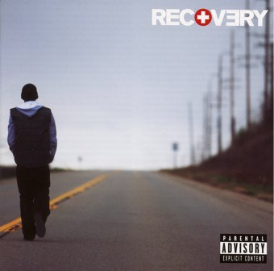
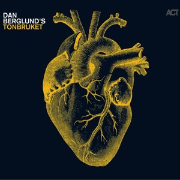
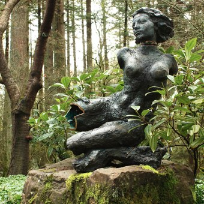
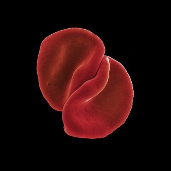
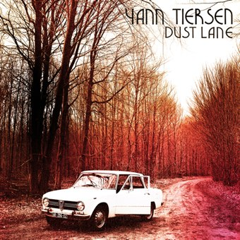
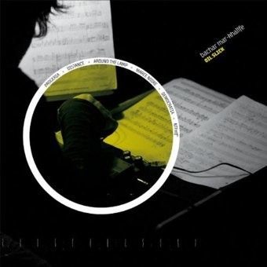
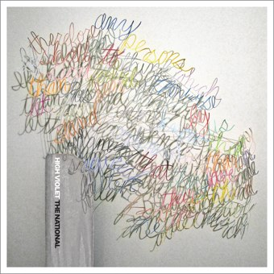
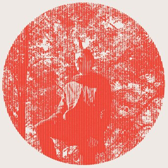
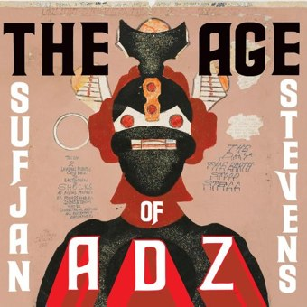
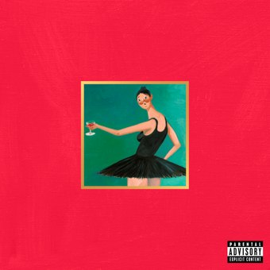

+++
titre = "Musique : 2010 en dix albums"
title = "Musique : 2010 en dix albums"
url = "/musique-2010-dix-albums"
date = "2010-12-28T00:03:21"
Lastmod = "2010-12-28T00:05:17"
cover = "10-albums-pour-2010.jpg"
categorie = [ "Musique" ]
tag = [ "Moâ", "Top" ]

+++

J&rsquo;ai un problème avec la musique. Non pas pour l&rsquo;écouter, cela se fait sans mal dès que l&rsquo;occasion se présente, mais pour écrire dessus. Alors que la critique d&rsquo;un film vient sans problème, pendant la séance même parfois, la critique d&rsquo;un album vient avec difficulté et souvent ne vient pas, faute de temps.

Ces dix albums ne constituent pas un top 10. Il s&rsquo;agit plutôt des dix premiers albums sortis en 2010 qui me sont venus à l&rsquo;esprit. Les dix albums qui ont compté pour moi cette année, en d&rsquo;autres termes. Certains albums auraient pu s&rsquo;y trouver, je pense en particulier à <em>My Father Will Guide Me Up A Rope To The Sky</em> de Swans, à <em>There is Love in You</em> de Four Tet, à <em>Sisterworld</em> des Liars ou encore à <em>This is Happening</em> de LCD Soundsystem. Il est encore trop tôt pour me prononcer, mais <em>A Sufi and a Killer</em> de Gonjasufi s&rsquo;annonce comme un album assez passionnant.

Pour un vrai top musical, je ne saurais recommander assez le <a href="http://topdesblogueurs.fr">top des blogueurs 2010</a> qui récompense vingt albums pour l&rsquo;année. Comme tous les ans, je n&rsquo;en connais pas la moitié et c&rsquo;est tant mieux : c&rsquo;est l&rsquo;occasion rêvée de découvrir de nouveaux artistes, de nouveaux genres, de nouveaux horizons musicaux… Faites-en autant, écoutez au moins ces albums parfois fort étranges, même si c&rsquo;est souvent déroutant à la première écoute.

Arrêtons là le texte, place à la musique ! Chaque pochette contient un lien vers une critique, ici ou ailleurs. Autant que possible, vous trouverez aussi de quoi écouter les albums en streaming…

[narrowcolumn side=&nbsp;&raquo;left&nbsp;&raquo;] [/narrowcolumn]

[narrowcolumn side=&nbsp;&raquo;right&nbsp;&raquo;][/narrowcolumn]

[narrowcolumn side=&nbsp;&raquo;right&nbsp;&raquo;]Dan Berglund était le contrebassiste de l&rsquo;excellentissime trio de jazz EST malheureusement arrêté avec la mort de son leader pianiste. Sur cet album en solo, le musicien poursuit le travail de sape du trio de jazz traditionnel commencé par EST. Un album inclassable qui s&rsquo;éloigne indéniablement du jazz tout en maintenant ses influences, un album noir, un album brillant. <a href="http://open.spotify.com/album/7gmwPl78M6JHaHFmx2m4Or"><em>Spotify</em></a> [/narrowcolumn]

[narrowcolumn side=&nbsp;&raquo;left&nbsp;&raquo;]<em>Recovery</em> n&rsquo;est certainement pas le meilleur album d&rsquo;Eminem qui n&rsquo;a jamais réussi à égaler les réussites artistiques de l&rsquo;époque Slim Shaddy. Reste que cet album complète une mythologie inégalée dans le monde de la musique et maintient ainsi son intérêt. <em>Recovery</em> est aussi l&rsquo;album de la rupture consommée avec le double maléfique, mais il faut bien avouer que l&rsquo;on préfère l&rsquo;Eminem sombre. <em><a href="http://open.spotify.com/album/3PogVmhNucYNfyywZvTd7F">Spotify</a></em>[/narrowcolumn]

[narrowcolumn side=&nbsp;&raquo;left&nbsp;&raquo;][/narrowcolumn]

[narrowcolumn side=&nbsp;&raquo;right&nbsp;&raquo;][/narrowcolumn]

[narrowcolumn side=&nbsp;&raquo;right&nbsp;&raquo;]Un album de Peter Gabriel est forcément un événement. Mais pour <em>Scratch My Back</em>, l&rsquo;ex-leader de Genesis ne chante pas ses propres chansons puisqu&rsquo;il s&rsquo;agit d&rsquo;un album de reprises. Mais pas de reprises standard : Peter Gabriel a abandonné les guitares pour cet album composé entièrement avec un orchestre symphonique. Le résultat est surprenant et réjouissant : à ne pas rater ! <em><a href="http://www.deezer.com/music/peter-gabriel/scratch-my-back-487382">Deezer</a></em>[/narrowcolumn]

[narrowcolumn side=&nbsp;&raquo;left&nbsp;&raquo;]Menomena est un nom bien connu dans le milieu du rock expérimental. Ce quatuor américain compose un univers sonore riche, pas toujours accessible à la première écoute, mais l&rsquo;effort en vaut la peine tant la musique de Menomena s&rsquo;avère passionnante et <em>Mines</em> ne fait pas exception à la règle avec ce très bel album qui permet au groupe d&rsquo;atteindre dans la composition un nouveau palier. <em><a href="http://open.spotify.com/album/1dgaozl5H6j7jWgp7ShqCP">Spotify</a></em>[/narrowcolumn]

[narrowcolumn side=&nbsp;&raquo;right&nbsp;&raquo;][/narrowcolumn]

[narrowcolumn side=&nbsp;&raquo;left&nbsp;&raquo;][/narrowcolumn]

[narrowcolumn side=&nbsp;&raquo;right&nbsp;&raquo;]Yann Tiersen surprend avec <em>Dust Lane</em>, son dernier album. L&rsquo;époque d&rsquo;<em>Amélie Poulain</em> est désormais loin derrière, de même que ces chansons mélancoliques qui ont fait la réputation et le succès du breton. Cet album est indéniablement gonflé tant il s&rsquo;éloigne des productions précédentes et c&rsquo;est un pari réussi. Plus sombre, plus complexe aussi que ses prédécesseurs, <em>Dust Lane</em> est également un album bien plus intéressant et réussi. <em><a href="http://open.spotify.com/album/0VerI93Ffw0qpuiOvMgaHs">Spotify</a></em>[/narrowcolumn]

[narrowcolumn side=&nbsp;&raquo;left&nbsp;&raquo;]En voilà un album étonnant. Chacun des six morceaux qui composent <em>Oil Slick</em> semblent avoir été écrits par des artistes différents. Ce sont six morceaux très différents donc, tantôt lents, tantôt rapides, tantôt doux, tantôt violents, tantôt électroniques, tantôt acoustiques. L&rsquo;ensemble frappe par sa vigueur, sa noirceur aussi, son évidence enfin. Bachar Mar-Khalifé frappe fort avec ce premier essai… <a href="http://open.spotify.com/album/61Jv3MnWQeaiB0E92mvRt5"><em>Spotify</em></a>[/narrowcolumn]

[narrowcolumn side=&nbsp;&raquo;right&nbsp;&raquo;][/narrowcolumn]

[narrowcolumn side=&nbsp;&raquo;left&nbsp;&raquo;][/narrowcolumn]

[narrowcolumn side=&nbsp;&raquo;right&nbsp;&raquo;]&nbsp;&raquo;Post-punk&nbsp;&raquo; ou pas, le débat fait rage, mais peu importe. À mes oreilles, <em>High Violet</em> est d&rsquo;abord un très bel album plein de pépites qui me donnent envie de chantonner. Les mélodies sont simples et sublimes, mais The National n&rsquo;est pas un groupe à se laisser enfermer dans les schémas traditionnels et multiplie au contraire les références. Un très bel album en tout cas, porté par l&rsquo;excellente voix du chanteur. Un très bel album. <em><a href="http://open.spotify.com/album/6k54ZuG2Z49HQRbJdO65b5">Spotify</a></em>[/narrowcolumn]

[narrowcolumn side=&nbsp;&raquo;left&nbsp;&raquo;]Owen Pallett n&rsquo;est pas artiste à craindre les excès et il met les deux pieds dans le classique et casse-gueule genre de la pop teintée de musique classique. Mais là où tant d&rsquo;albums font dans le kitsch imbuvable, <em>Heartland</em> s&rsquo;en sort extrêmement bien avec une collection de titres pop souvent grandiloquents, mais toujours plus excellents. Une fois le disque terminé, loin de l&rsquo;écœurement attendu, on en redemande ! <a href="http://open.spotify.com/album/68s2yQ7tcehQRrMGfikqER"><em>Spotify</em></a>[/narrowcolumn]

[narrowcolumn side=&nbsp;&raquo;right&nbsp;&raquo;][/narrowcolumn]

[narrowcolumn side=&nbsp;&raquo;left&nbsp;&raquo;][/narrowcolumn]

[narrowcolumn side=&nbsp;&raquo;right&nbsp;&raquo;]Sufjan Stevens promettait de produire un album par État américain, mais ce pari un peu fou n&rsquo;est plus à l&rsquo;ordre du jour. Tant mieux a-t-on envie de dire : <em>Illinois</em> était vraiment excellent, mais on pouvait craindre que le jeune artiste multi-instrumentiste se répète, d&rsquo;autant que son style est très marqué. <em>The Age of Adz</em> change de style, même si la patte Stevens reste audible (les chœurs et instruments classiques), et le résultat est vraiment réjouissant autant que techniquement époustouflant. <em><a href="http://itunes.apple.com/fr/album/the-age-of-adz/id392327958">iTunes</a></em>[/narrowcolumn]

[narrowcolumn side=&nbsp;&raquo;left&nbsp;&raquo;]Kanye West est un artiste étonnant, toujours en quête de nouveaux horizons musicaux, de nouveaux mélanges… La meilleure preuve ? L&rsquo;utilisation de samples de King Crimson sur &laquo;&nbsp;POWER&nbsp;&raquo;… Ou bien la présence de Bon Iver dans les invités ? <em>My Beautiful Dark Twisted Fantasy</em> retrouve ainsi les mélanges traditionnels chez Kanye West et disons-le, c&rsquo;est d&rsquo;une très grande efficacité. Un album riche, assez brillant et très plaisant. <a href="http://open.spotify.com/album/6LBiuhK7PZKjVXyMfPxPoh"><em>Spotify</em></a>[/narrowcolumn]

