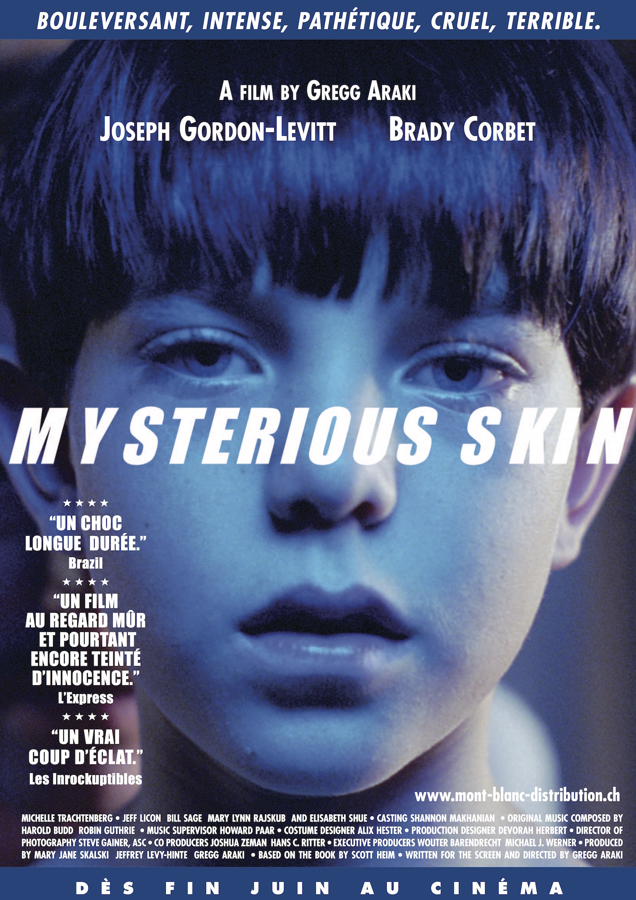
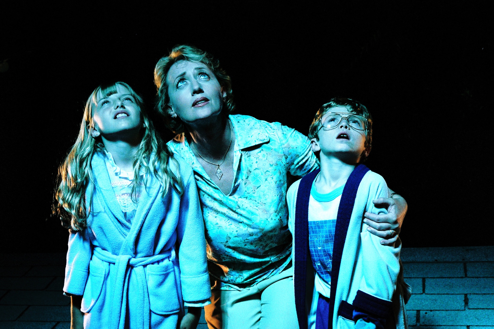

+++
type = "post"
titre = "<em>Mysterious Skin</em>, Gregg Araki"
title = "Mysterious Skin, Gregg Araki"
url = "/mysterious-skin-arak"
date = "2014-10-05T00:20:32"
Lastmod = "2014-10-05T00:25:55"
cover = "mysterious-skin-joseph-gordon-lewitt.jpg"
categorie = [ "À voir" ]
tag = [ "Adaptation littéraire", "Adolescence", "Drame", "Enfance", "Famille", "Homosexualité", "Sexe", "Viol" ]
createur = [ "Gregg Araki" ]
acteur = [ "Brady Corbet", "Elisabeth Shue", "Joseph Gordon-Levitt", "Michelle Trachtenberg" ]
annee = [ "2005" ]
weight = 2005
pays = [ "États-Unis", "Pays-Bas" ]

+++

Adapté d&rsquo;un roman éponyme, <em>Mysterious Skin</em> s&rsquo;attaque à un sujet extrêmement difficile : le viol de deux enfants de moins de dix ans. Le huitième long-métrage de Gregg Araki ne se concentre pas vraiment sur cet acte odieux, mais plutôt sur ses conséquences une dizaine d&rsquo;années après les faits. À sa sortie, le film a malgré tout été interdit aux moins de 16 ans et même si on ne voit jamais vraiment ce qui se passe, il faut reconnaître qu&rsquo;il est, encore aujourd&rsquo;hui, d&rsquo;une violence psychologique rare. Le scénario se concentre essentiellement sur les deux enfants et surtout leurs problèmes à l&rsquo;aube de leur âge adulte et <em>Mysterious Skin</em> est aussi cruel et bouleversant, qu&rsquo;il est réussi. Un excellent film, à (re)voir !

<em>Mysterious Skin</em> ouvre sur… un mystère : Brian, huit ans, est retrouvé dans la cave de sa maison, le nez en sang, sans avoir la moindre idée de ce qui lui est arrivé. Ce petit garçon jusque-là tout à fait normal bascule alors : il fait des cauchemars, son nez saigne régulièrement et il s&rsquo;évanouit souvent, sans crier gare. Que s&rsquo;est-il passé ? Il semble incapable de s&rsquo;en souvenir et son père ne l&rsquo;aide pas, dépité par ce fils qu&rsquo;il considère comme un moins que rien. Pour se donner une explication censée, Brian imagine qu&rsquo;il a été enlevé par des extra-terrestres et cette explication lui permet d&rsquo;avancer dans la vie. On le retrouve ainsi, une dizaine d&rsquo;années plus tard, plongé plus que jamais dans l&rsquo;extraordinaire. Il est persuadé d&rsquo;avoir été enlevé, mais cherche à retrouver son passé. Sur les conseils d&rsquo;une femme persuadée, elle aussi, d&rsquo;avoir été enlevée, il essaie de se souvenir et essaie de retrouver un autre garçon qui revient sans cesse dans ses rêves. Neil, le deuxième personnage principal de Gregg Araki, est ce garçon. Contrairement à Brian, Neil n&rsquo;a pas perdu la mémoire et il se souvient très bien de ce qui s&rsquo;est passé, cet été-là. Le coach de baseball des deux garçons avait un goût beaucoup trop prononcé pour les enfants et il abusait régulièrement de Neil. Un jour, il a ramené chez lui non pas un, mais deux garçons : Brian accompagnait Neil, et il s&rsquo;est fait lui aussi abuser sexuellement. <em>Mysterious Skin</em> raconte comment cette première expérience sexuelle abusive a détruit la vie de deux adolescents et futurs adultes. Avec deux parcours totalement différents : là où l&rsquo;un se consacre entièrement aux phénomènes paranormaux, à tel point d&rsquo;enfouir toute question de sexualité, l&rsquo;autre se consacre exclusivement au sexe, vendant son corps pour une poignée de pain à des hommes d&rsquo;âge mur.

Gregg Araki construit son film en tissant en permanence les deux histoires en parallèle. Les voix des deux garçons devenus adultes font office de narrateurs, si bien que cet été où ils se sont fait abusés sexuellement est comme un long flashback. Ce qui intéresse le cinéaste, ce n&rsquo;est pas forcément le viol lui-même, même si <em>Mysterious Skin</em> ne l&rsquo;élude aucunement. Plusieurs scènes évoquent très clairement ce moment, sans le montrer de manière explicite : pour des raisons évidentes, les enfants acteurs ne pouvaient pas tourner un viol, si bien que les scènes ont été tournées en deux temps, avec d&rsquo;un côté les enfants, de l&rsquo;autre les adultes. Il n&rsquo;en faut pas plus pour comprendre ce qui se passe, et on comprend sans peine l&rsquo;interdiction aux moins de 16 ans. Voir un homme déshabiller ces garçons, puis les embrasser et enfin aller beaucoup plus loin, c&rsquo;est vraiment troublant et le film a quelque chose de presque choquant. Mais ce qui trouble le plus, au fond, ce n&rsquo;est pas l&rsquo;acte lui-même, mais plutôt le point de vue. En effet, <em>Mysterious Skin</em> est surtout vécu à travers le personnage de Neil qui, en grandissant, a toujours eu une sexualité anormale et largement débridée. Il se prostitue rapidement et vend son corps à tous les hommes qui passent par là, le plus souvent des pères de famille qui n&rsquo;assument par leur homosexualité. Et il aime ça, comme il aimait sa relation avec son coach de baseball. C&rsquo;est bien là toute la complexité de ce film : Gregg Araki ne fait pas du viol l&rsquo;horreur absolue, mais un moment de complicité partagée. D&rsquo;autant que Neil est un garçon précoce, qui se masturbe déjà en regardant les amants de sa mère et qui dit avoir eu un coup de foudre instantané pour l&rsquo;entraîneur. Sans la justifier, naturellement, le long-métrage ne condamne pas en bloc cette relation, même s&rsquo;il illustre parfaitement les dégâts qu&rsquo;elle a causée. <em>Mysterious Skin</em> n&rsquo;impose aucun point de vue externe à cette histoire, racontée strictement à la première personne et c&rsquo;est peut-être ce qui gêne le plus et justifie l&rsquo;interdiction, beaucoup plus en tout cas que les quelques paires de fesse que l&rsquo;on peut apercevoir.

Troublant, c&rsquo;est peut-être le meilleur terme pour caractériser <em>Mysterious Skin</em>. Le sujet est difficile, mais son traitement l&rsquo;est encore plus. En choisissant exclusivement le point de vue des deux hommes qui en été victime de viol quand ils étaient jeunes, Gregg Araki ne porte pas de jugement de valeur et laisse même entendre que les garçons en question ont pu apprécier ce qui s&rsquo;est passé. Le long-métrage montre bien les conséquences désastreuses de ces abus sexuels, mais le trouble reste présent malgré tout. Joseph Gordon-Levitt, excellent dans son rôle de jeune homme qui ne peut se défaire du sexe, est en grande partie responsable de ce trouble et, à l&rsquo;heure des bilans, le succès de <em>Mysterious Skin</em> lui doit beaucoup. Gregg Araki signe une œuvre qui fait froid dans le dos, mais c&rsquo;est bien le signe que c&rsquo;est une réussite.

<h3>Vous voulez <a href="/soutien/">m&rsquo;aider</a> ?</h3>
<ul>
<li><a href="http://www.amazon.fr/gp/product/B001A5RF66/ref=as_li_ss_tl?ie=UTF8&amp;tag=leblogdenic07-21&amp;linkCode=as2&amp;camp=1642&amp;creative=19458&amp;creativeASIN=B001A5RF66">Acheter le film en DVD sur Amazon</a></li>
</ul>

