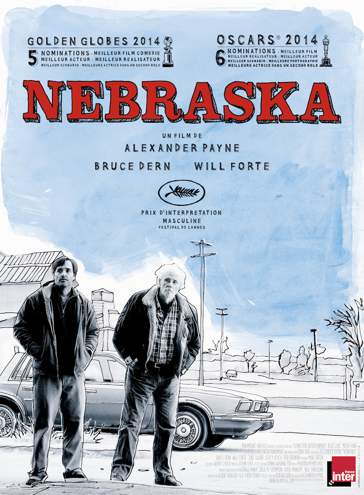
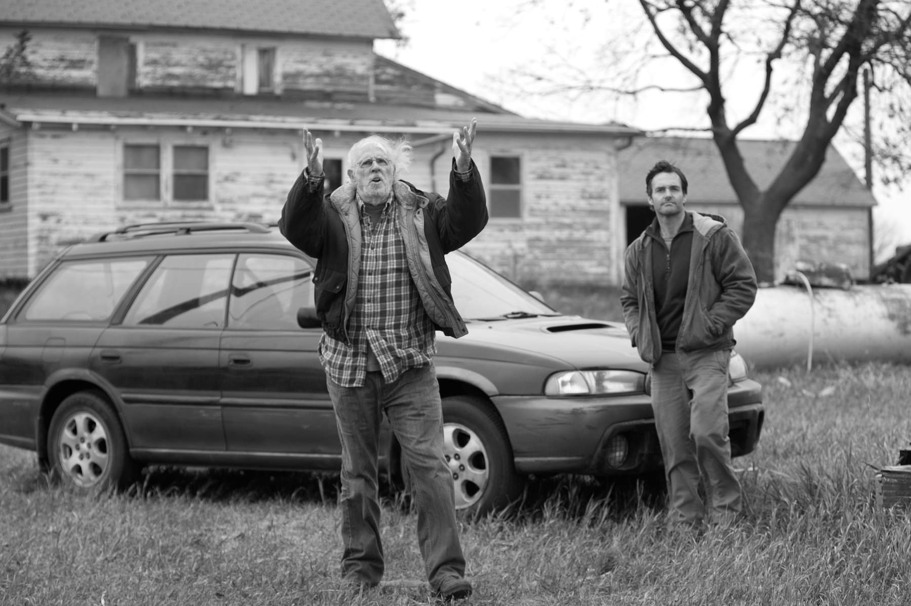
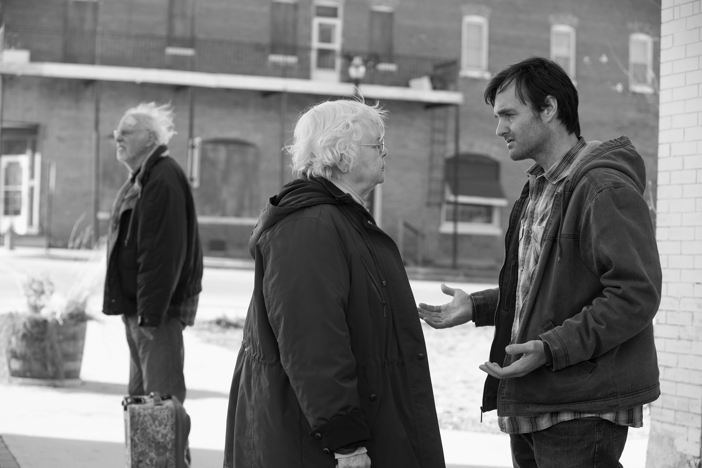

+++
titre = "<em>Nebraska</em>, Alexander Payne"
title = "Nebraska, Alexander Payne"
url = "/nebraska-payne"
date = "2014-04-02T08:14:00"
Lastmod = "2014-04-02T08:29:55"
cover = "nebraska-bruce-dern-payne.jpg"
categorie = [ "À voir" ]
tag = [ "Argent", "Drame", "Famille", "Humour", "Maladie", "Road-movie", "Société", "Sorties du mois" ]
createur = [ "Alexander Payne" ]
acteur = [ "Bob Odenkirk", "Bruce Dern", "June Squibb", "Will Forte" ]
annee = [ "2014" ]
weight = 2014
pays = [ "États-Unis" ]

+++

Avec <a href="http://voiretmanger.fr/descendants-payne/" title="The Descendants, Alexander Payne"><em>The Descendants</em></a>, Alexander Payne a eu l’occasion de prouver qu’il sait raconter des histoires de familles avec une justesse infinie. Dans ce nouveau long-métrage, le cinéaste change d’horizon et abandonne le paradis hawaïen pour les immenses plaines au cœur des États-Unis. De retour dans son Nebraska natal, il y filme un road-movie à la fois très drôle, dramatique et aussi touchant. Loin des blockbusters agités, <em>Nebraska</em> est un petit film apaisé et apaisant, qui frappe encore une fois par son ton et ses personnages toujours parfaitement justes. Porté par un Bruce Dern justement récompensé du Prix d’interprétation masculine à Cannes, ce film est une vraie réussite, à ne surtout pas rater.

<em>Nebraska</em> se construit autour d’une idée simple. Un jour, Woody Grant reçoit une lettre qui lui promet un million de dollars à condition qu’il se rende à Lincoln, dans le Nebraska, pour réclamer son gain. Bien sûr, il ne s’agit que de l’une de ces arnaques qui promettent énormément jusqu’aux notes de bas de page qui ajoutent tant de conditions que l’on est assuré de perdre. Mais le vieil homme n’a plus tout à fait toute sa tête et il est persuadé d’avoir gagné ce million. Cela tombe bien, il en aurait bien besoin pour s’acheter une nouvelle camionnette neuve et un compresseur à air, non pas qu’il en ait vraiment besoin — on lui a retiré son permis depuis longtemps déjà —, mais c’est ce qu’il voudrait. Le personnage principal imaginé par Alexander Payne se met ainsi en tête de se rendre à Lincoln, même s’il doit parcourir à pied les centaines de miles qui le séparent de sa destination. Le film ouvre alors qu’il sort à peine de la ville où il habite : un policier, intrigué, lui demande où il va et le ramène au poste, où David, son plus jeune fils, vient le chercher. Ses deux fils et sa femme, Kate, essaient tant bien que mal de le convaincre qu’il s’agit d’une arnaque, il n’y a rien à faire. La seule obsession du vieil homme semble être ce million et il finit toujours par repartir. Plutôt que de l’enfermer dans une maison de retraite, David prend sur lui et accompagne son père en voiture. À partir de ce moment, <em>Nebraska</em> se transforme en road-movie sur les routes droites et vides des plaines américaines. On traverse le pays avec le père et le fils, et c’est surtout l’occasion, pour Woody, de revenir dans la petite ville de son enfance. Alexander Payne organise alors une réunion familiale, entre retrouvailles et l’hypocrisie de tous ceux qui se sentent beaucoup plus proches, maintenant que l’argent doit couler à flot.

À défaut de rebondissements spectaculaires, la grande force d’Alexander Payne est plutôt à chercher du côté de la grande justesse des personnages et des situations. <em>Nebraska</em> ne fait pas de vagues, il n’est jamais impressionnant, c’est vrai, mais il est constamment sur la bonne note, avec le bon angle. Aussi surprenant que cela puisse paraître, il s’agit aussi d’une comédie et on rit beaucoup à la fois de la bêtise de tous ces gens qui perdent la tête quand on leur parle d’un million de dollars, au point de réécrire l’histoire ou de refuser la vérité quand on évoque l’arnaque. On rit aussi, un peu à son insu, mais jamais sans méchanceté, de Woody : le vieillard n’a pas totalement perdu la tête, mais il a des absences et c’est surtout sa mauvaise foi qui fait rire. Autre personnage très amusant, la mère : la trop rare June Squibb compose une vieille femme qui pourrait être une mamie gâteau, mais qui est en fait une boule pleine d’énergie et qui n’a jamais sa langue dans la poche. Il faut la voir, présenter ses hommages dans un cimetière, et finalement insultant la mémoire de tous les morts avec une anecdote salace ou une remarque perfide. Il faut la voir, insulter sa belle famille qui n’a jamais rien fait pour son mari, mais qui s’intéresse brutalement à lui, maintenant qu’il est riche. Encore une fois, Alexander Payne ne filme rien d’extraordinaire, mais ce qu’il propose est si précis qu’on est comme soufflé par ce que l’on voit. Et derrière l’humour se cache autant un portrait assez terrible de l’Amérique profonde qu’une émotion qui jaillit finalement un peu par surprise. <em>Nebraska</em> se termine ainsi sur une note de douceur, presque un <em>happy end</em> alors que le fils et le père se réconcilient autour de petites choses, mais qui veulent dire beaucoup. Pour que cette émotion soit crédible, il fallait de sacrés acteurs et on peut dire que Bruce Dern était l’acteur de la situation. Il est parfait dans son rôle de vieillard qui perd un peu la tête et à ses côtés, Will Forte est aussi un très bon fils.

Une fois de plus, Alexander Payne signe un long-métrage qui n’a l’air de rien, mais qui reste en esprit longtemps après avoir quitté la salle. <em>Nebraska</em> est un petit film, certes, mais il est si juste et précis qu’il parvient à toucher exactement ce qu’il faut et c’est ce qui, au fond, fait sa réussite. Avec ce road-movie dans le fin fond des États-Unis, le cinéaste a changé de décor par rapport à <em>The Descendants</em>, mais il n’a pas changé de méthode et le résultat est tout aussi plaisant. Un très beau film, à voir.

