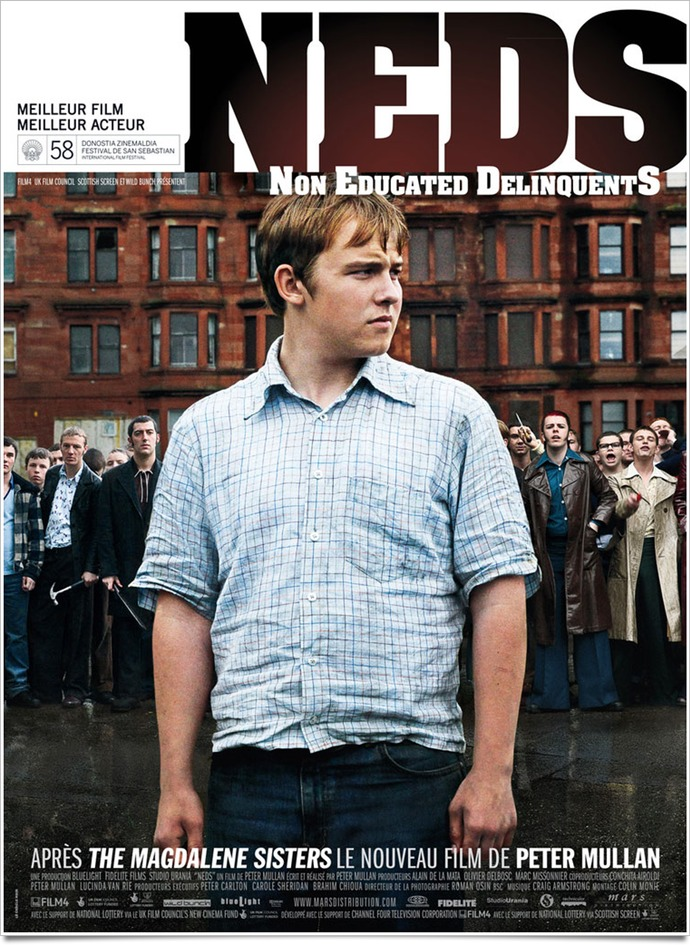
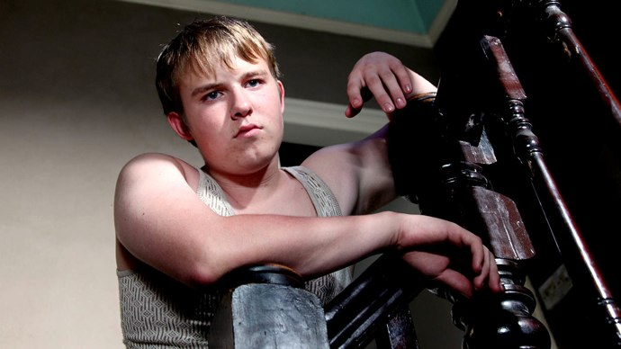
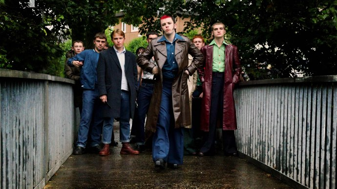

+++
type = "post"
titre = "Neds, Peter Mullan"
title = "Neds, Peter Mullan"
url = "/neds-mullan"
date = "2010-12-16T00:35:04"
Lastmod = "2011-08-31T17:53:57"
cover = "neds-mullan.jpg"
categorie = [ "À voir" ]
tag = [ "Arcs 2010", "Famille", "Festival", "Société", "Violence" ]
createur = [ "Peter Mullan" ]
annee = [ "2011" ]
weight = 2011

+++

Les <a href="http://en.wikipedia.org/wiki/Ned_(Scottish)">neds</a>, un régionalisme écossais qui désigne les jeunes délinquants qui trainent en bande dans les rues et posent des tas de problèmes, quand ils ne s&rsquo;entretuent pas joyeusement à coups de couteaux ou marteaux. Le titre du dernier film de Peter Mullan donne ainsi le ton, <em>Neds</em> n&rsquo;est pas un film très joyeux. Tout à la fois film social et récit d&rsquo;apprentissage d&rsquo;un jeune né au mauvais endroit à la mauvaise époque, <em>Neds</em> est un film prenant et efficace.

John McGill est un excellent élève dans son école primaire de Glascow dans les années 1970, il est parmi les tout premiers de l&rsquo;école et ses enseignants ne manquent pas de le féliciter. Mais quand il arrive au collège, c&rsquo;est la douche froide : comme le lui rappelle sèchement le proviseur, il est le petit frère de Benjamin McGill, la terreur du quartier qui a été viré <em>manu militari</em> quelques années auparavant. La violence semblant héréditaire pour cet homme, on place le pauvre John dans une classe moins bonne avec comme double consigne de se tenir à carreau et de prouver par l&rsquo;excellence de ses résultats qu&rsquo;il est plus digne de réussir que son frère. Ce frère, c&rsquo;est à la fois son fardeau et une bénédiction : quand les voyous apprennent que John est le petit frère de &laquo;&nbsp;Benny&nbsp;&raquo;, ils le laissent immédiatement tranquille, car ils savent que la vengeance du grand frère serait terrible. Sauf que John finit par donner raison à ceux qui doutaient de sa capacité à changer : il finit par entrer dans une bande, et l&rsquo;engrenage de la violence s&rsquo;active alors. Sans dévoiler la fin, le film ne peut se terminer avec un happy-end et on assiste effectivement à la lente descente aux enfers d&rsquo;un jeune homme qui était pourtant promis à un brillant avenir.

<em>Neds</em> est d&rsquo;abord un film sur la violence et l&rsquo;impossibilité d&rsquo;y échapper. Le milieu dans lequel est né John est un milieu violent où des bandes armées s&rsquo;affrontent en plein jour et le font très sérieusement, puisque l&rsquo;on compte régulièrement des morts ou blessés dans les rangs. Difficile de vivre dans ce climat sans souffrir de la violence, ou alors sans y participer. Les femmes sont globalement celles qui souffrent, tant les mères, que les femmes ou les sœurs, quand les hommes sont tous impliqués dans cette violence, à des degrés divers. Quand ce n&rsquo;est pas la violence d&rsquo;un gang, c&rsquo;est celle d&rsquo;un mari alcoolique qui insulte tous les soirs sa femme pour la faire descendre et l&rsquo;aider. Peter Mullan s&rsquo;attache à montrer comment cette violence s&rsquo;entretient d&rsquo;elle-même et semble indépassable. Impossible pour ses habitants de sortir des cités qui concentrent les problèmes sociaux et constituent un terreau parfait pour la violence. Les jeunes y sont désœuvrés, ils se rassemblent dans des squares ou des cages d&rsquo;escalier, ils boivent et fument et attaquent dès que l&rsquo;occasion se présente les jeunes d&rsquo;une autre cité. Pour en sortir, il faut autant de l&rsquo;argent, que le courage d&rsquo;affronter les peurs de l&rsquo;extérieur. John fréquente ainsi un camarade de classe issue d&rsquo;une famille aisée et a droit à un interrogatoire en règle de la part de la mère de ce camarade qui, bien vite, décrète que John n&rsquo;est pas assez bien pour son fils et le jette comme un malpropre. Ce rejet incompréhensible casse quelque chose chez le jeune homme et le film en fait l&rsquo;élément qui déclenche son passage à la délinquance. C&rsquo;est peut-être un peu simpliste, mais c&rsquo;est en même temps assez réaliste : comment s&rsquo;en sortir quand tout votre entourage ne cesse de vous répéter que vous êtes un délinquant en devenir ?

Le système scolaire est d&rsquo;ailleurs très nettement pointé du doigt parmi les responsables de l&rsquo;échec de John. <em>Neds</em> montre parfaitement bien que le corps enseignant est largement critiquable parce qu&rsquo;il entretient la violence qu&rsquo;il dit pourtant vouloir combattre. L&rsquo;enseignement n&rsquo;était pas une partie de plaisir à l&rsquo;époque et Peter Mullan décrit bien ce système surréaliste où tous les élèves de l&rsquo;école sont en permanence mis en compétition avec les autres et où les classes sont composées uniquement selon les résultats. Les meilleures classes sont celles qui ont les meilleures élèves, tandis que les moins bons élèves sont relégués dans des pseudo-classes où le professeur occupe vaguement des élèves qui n&rsquo;intéressent plus du tout le système éducatif. Pire, les élèves changent de classe en fonction de leur niveau, et ce même en cours d&rsquo;année quand les pires élèves d&rsquo;un niveau descendent d&rsquo;un cran et les meilleurs montent au contraire. C&rsquo;est un système violent en soi, mais à cette violence psychologique s&rsquo;ajoute la violence physique. À chaque problème, la punition est la même, des coups de lanières de cuir sur les paumes des mains. Les raisons de frapper les élèves ne manquent pas, sans distinction en fonction de l&rsquo;âge ou du sexe. À une époque où la moindre intention de réprimander un élève peut conduire au renvoi du professeur, cette méthode à l&rsquo;ancienne est vraiment surprenante. Elle est aussi totalement inefficace et même contre-productive en ce qu&rsquo;elle banalise la violence : les élèves finissent par jouer de cette punition, la réclame même et s&rsquo;en moque. Il faut dire qu&rsquo;ils ont l&rsquo;habitude de se battre dans la rue à coups de pierres, couteaux ou marteaux : ce n&rsquo;est pas quelques bandes de cuir qui vont les effrayer outre mesure. C&rsquo;est ainsi l&rsquo;échec d&rsquo;un système que démontre <em>Neds</em>, même si le système scolaire ne suffit pas à expliquer la violence de ces jeunes, il faut aussi rappeler l&rsquo;inefficacité des forces de l&rsquo;ordre ou encore l&rsquo;inaction des familles.

Par son histoire et son environnement, <em>Neds</em> évoque inévitablement le cinéma de Ken Loach, devenu au fil des films le spécialiste du film social à l&rsquo;anglaise. Mais techniquement, Peter Mullan s&rsquo;éloigne du réalisme Loachien pour proposer un film visuellement plus contrasté. La photographie du film tend ainsi vers la saturation des couleurs avec un soin particulier apporté à la lumière ou à l&rsquo;ombre (c&rsquo;est flagrant pour les scènes de nuit, quand le père appelle sa femme en l&rsquo;insultant). Formellement, le film se rapproche ainsi plus de la <a href="http://voiretmanger.fr/2010/05/15/red-riding-trilogy-1974-jarrold/">trilogie Red Riding</a> (à laquelle Peter Mullan participait d&rsquo;ailleurs, en tant qu&rsquo;acteur) que de l&rsquo;univers de Ken Loach. Le film contient même une séquence fantastique avec un Christ qui descend de la croix… on est alors bien loin du réalisme de documentaire.

<em>Neds</em> est un film assez classique, presque un film de genre qui serait le film de voyous des banlieues britanniques. Mais Peter Mullan s&rsquo;en tire très bien avec ce sujet déjà souvent exploité : le côté apprentissage de la vie et surtout l&rsquo;implacable violence qui empêche John de s&rsquo;en sortir est plutôt bien vu et bien traité, même si on regrettera une ficelle de scénario un peu grosse avec le rejet de l&rsquo;ami riche. Le film est efficace, bien rythmé et plaisant, mais aussi assez violent.

