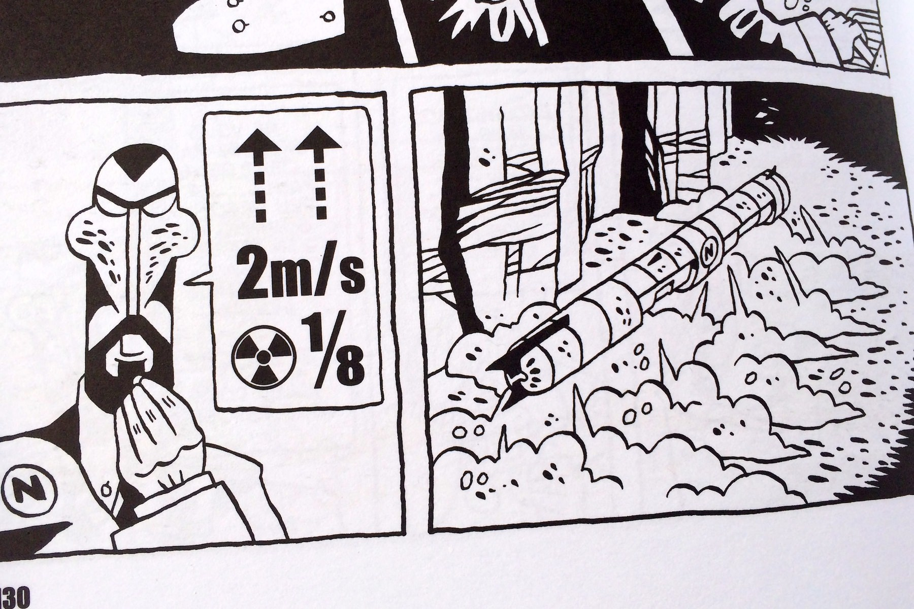
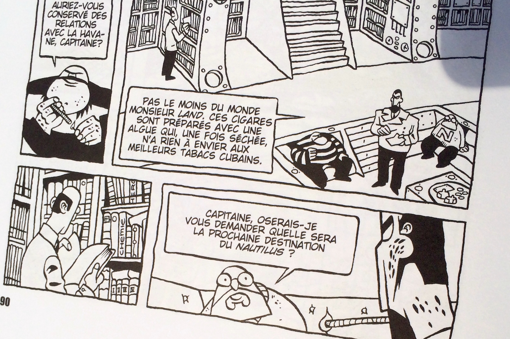
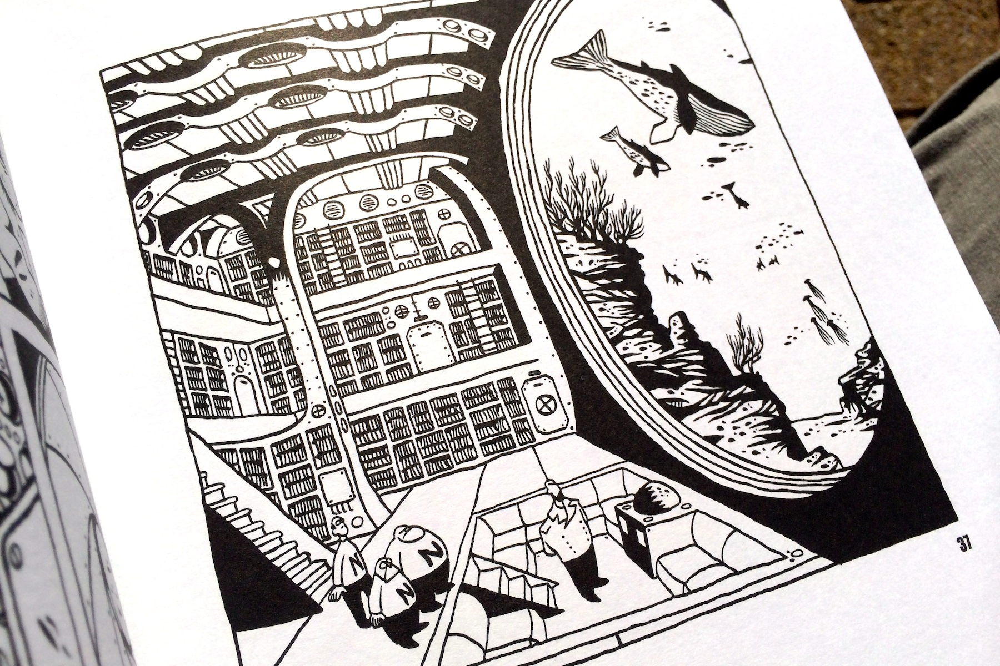

+++
type = "post"
titre = "<em>Nemo</em>, Brüno"
title = "Nemo, Brüno"
url = "/nemo-bruno"
date = "2013-12-23T15:09:12"
Lastmod = "2013-12-23T15:22:00"
cover = "nemo-bruno.jpg"
categorie = [ "À lire" ]
tag = [ "Bande dessinée", "Fantastique", "Guerre", "Société" ]
createur = [ "Brüno" ]
annee = [ "2005" ]
weight = 2005
pays = [ "France" ]

+++

Avec <em>Nemo</em>, Brüno s’est inspiré du célèbre <em>Vingt mille lieues sous les mers</em> de Jules Vernes. Une relecture assez fidèle dans la trame narrative, mais visuellement très libre : cette bande dessinée en noir et blanc — elle existe aussi en version colorée, mais on évoquera ici uniquement l’édition « treize étrange » de 2005 — surprend par son style très simple et par son format carré inhabituel. L’occasion de (re)découvrir un récit qui a très bien vieilli : près de 150 ans après la publication du roman original, ce <em>Nemo</em> surprend par ses thèmes toujours actuels. 

L’histoire de base est connue : un monstre marin terrifie tous les navires du monde et une grande chasse est organisée par plusieurs nations. <em>Nemo</em> commence justement sur un navire chargé d’abattre ce que l’on croit être une bête, peut-être un Nerval géant. À son bord, des militaires, un baleinier, mais aussi un scientifique venu enquêter sur cette bête qui s’annonce comme la plus grande jamais vue. Quand l’équipe tombe enfin sur le monstre, l’attaque ne se passe pas comme prévu et le navire est envoyé par le fond par le monstre. Trois survivants — dont le baleinier et le scientifique — se retrouvent sur son dos et s’aperçoivent alors qu’il s’agit en fait d’un sous-marin. Le capitaine Nemo, son propriétaire, a décidé de fuir la terre en construisant son appareil qui lui permet de vivre au fond de l’océan. Brüno suit assez fidèlement Jules Vernes, jusqu’au final tragique que l’on connaît, mais impose dans le même temps un style graphique extrêmement différent des illustrations originales de <em>Vingt mille lieues sous les mers</em>. Le noir est blanc se fait ici très contrasté, loin des centaines de nuances de gris que l’on avait au XIXe siècle. Le trait est simple, surtout pour les personnages qui se résument souvent à quelques formes géométriques. Ce qui n’empêche pas l’auteur et dessinateur de prendre plus de soin dans certaines cases, notamment pour montrer le fond marin. Côté originalité, on apprécie aussi ces instructions techniques données par Nemo et transcrites par des images, façon rébus. 

Si le récit de <em>Nemo</em> suit l’original dans les grandes lignes, le style tranché de Brüno modifie sensiblement l’ambiance générale. La valorisation de la science — Jules Vernes vantait l’électricité notamment — a quasiment complètement disparu, même si la bibliothèque est toujours au rendez-vous. Tout ce que le capitaine Nemo pouvait avoir de positif est pratiquement annulé par ce personnage d’une cruauté sans limite. Certes, il s’intéresse aux fonds marins, certes, il est cultivé avec son immense bibliothèque, mais l’auteur le présente d’abord comme un type sanguinaire prêt à tout pour détruire d’autres navires. Il veut s’isoler du monde, c’est vrai, mais il est aussi motivé par l’envie de vengeance contre les pays qui envoient leurs navires contre lui. Et puis il ne manque jamais une occasion de mettre sa supériorité technique et morale en avant : le personnage qui a donné à <em>Nemo</em> son titre est imbu de lui-même et fait souvent preuve d’un excès de confiance assez imprudent. Brüno s’intéresse aux trois autres personnages, les prisonniers de la première attaque, mais en leur accordant peut-être moins d’importance que Jules Vernes. L’auteur montre très bien en revanche le temps qui passe, l’ennui qui s’empare de ces prisonniers et leurs réactions. Là encore, l’auteur suit assez précisément le récit original et cette bande dessinée peut constituer une bonne introduction à <em>Vingt mille lieues sous les mers</em>, même si on ne peut que recommander de (re)lire ce classique de la littérature !

<em>Nemo</em> offre une relecture originale et plutôt rafraichissante du classique de Jules Vernes. On perd naturellement la finesse et la complexité du foisonnant roman d’aventures d’origine, mais le style particulier de Brüno est une vision alternative intéressante du capitaine Nemo. Le retrait d’un monde qui ne tourne pas rond est un thème qui n’a pas pris une ride et le récit reste d’actualité. <em>Nemo</em> se lit assez rapidement avec ses grosses cases souvent muettes et si vous appréciez le style particulier de cette bande dessinée, elle est d’une lecture très plaisante…

<h3>Vous voulez m&rsquo;aider ?<a href="#footnote_0_10771" id="identifier_0_10771" class="footnote-link footnote-identifier-link" title="&Agrave; propos de la publicit&eacute;&hellip;">1</a></h3>
<ul>
<li><a href="http://www.amazon.fr/gp/product/2723492427/ref=as_li_ss_tl?ie=UTF8&#038;tag=leblogdenic07-21&#038;linkCode=as2&#038;camp=1642&#038;creative=19458&#038;creativeASIN=2723492427">Acheter la bande dessinée sur Amazon</a></li>
</ul>

<ol class="footnotes"><li id="footnote_0_10771" class="footnote"><a href="http://voiretmanger.fr/soutien/">À propos de la publicité…</a> [<a href="#identifier_0_10771" class="footnote-link footnote-back-link">&#8617;</a>]</li></ol>
