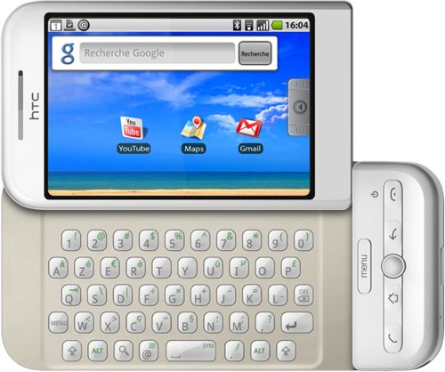

+++
type = "post"
titre = "N&rsquo;est pas Apple qui veut&#8230;"
title = "N'est pas Apple qui veut&#8230;"
url = "/nest-pas-apple-qui-veut"
date = "2009-03-19T21:45:45"
Lastmod = "2013-09-07T23:47:05"
cover = ""
categorie = [ "En bref" ]
tag = [ "Apple", "iPhone", "Technologies" ]

+++

Android fait partie des systèmes pour téléphones qui risquent de peser lourd dans la guerre des mobiles qui s&rsquo;annonce. Mais pour l&rsquo;heure, on ne peut pas dire que ça soit un franc succès, la faute sans doute au seul téléphone actuellement compatible, le HTC G1. Orange l&rsquo;a, fort discrètement, introduit à son catalogue la semaine dernière, le rebaptisant au passage &laquo;&nbsp;HTC Dream&nbsp;&raquo;, un nom plus sympathique qui sert sans doute à déguiser un peu la réalité.

Car la réalité n&rsquo;est pas, comme le révèle <a href="http://www.electronlibre.info/Demarrage-decevant-d-Android-chez,286"><strong>ElectronLibre</strong></a>, aussi rose que dans un rêve. Le lancement du Dream semble avoir été fait en catastrophe, comme en témoignent les nombreuses incohérences et fonctions que ce téléphone devrait avoir&#8230; mais n&rsquo;a pas.

Pourtant, ce téléphone semble ne pas manquer d&rsquo;arguments, à en croire les dirigeants d&rsquo;Orange, à l&rsquo;image de Jean-Marie Culpin, Directeur marketing mobile France chez Orange qui explique qu&rsquo;« <em>un OS comme Android nous permettra de proposer régulièrement des mises à jour afin d’intégrer de nouvelles fonctions</em> ». Le moins que l&rsquo;on puisse dire est qu&rsquo;une mise à jour ne serait, en effet, pas de trop. Jugez plutôt : ce smartphone proposé par Google est censé s&rsquo;intégrer parfaitement aux services en lignes de l&rsquo;entreprise californienne. Mais le Dream d&rsquo;Orange est incapable de synchroniser son carnet d&rsquo;adresses ou son calendrier avec Gmail, pas plus qu&rsquo;avec Outlook d&rsquo;ailleurs. Eh oui, un téléphone de 2009 peut être vendu sans synchronisation possible ! Ce même Jean-Marie Culpin reconnaît le problème et évoque une mise à jour en avril. Il n&rsquo;empêche que cela fait un peu léger.

Mais il y a pis que les nombreux défauts logiciels (impossibilité de lire des vidéos autrement que celles de YouTube, pas de support des messageries instantanées, absence de prise en charge de l&rsquo;accéléromètre&#8230;) puisque même le clavier semble avoir été fait sur un coin de table, au bistrot. HTC a fait des choix plutôt étranges en intégrant deux fois le signe @, mais ni les guillemets, ni les apostrophes, deux éléments il est vrai totalement inutiles en français. Les utilisateurs francophones seront, par contre, heureux d&rsquo;apprendre que la £ est présente ! Que propose HTC face à ces légers soucis ? Une mise à jour logicielle bien sûr !

Non, vraiment, n&rsquo;est pas Apple qui veut&#8230;

<strong>Note</strong> : cet article est le pendant polémiste d&rsquo;un <a href="http://www.macg.co/news/voir/134264/orange-trop-pressee-de-lancer-le-g1">article beaucoup plus sérieux</a> écrit pour <strong><a href="http://www.macg.co/">MacGeneration</a></strong>. J&rsquo;ai trouvé intéressant/rigolo de conserver les deux, juste histoire de voir la différence en terme de rédaction, et si ce message attirera tous les trolls attendus. Il sera aussi intéressant de savoir si lesdits trolls liront le sujet jusqu&rsquo;ici ou s&rsquo;arrêteront au titre. Ami troll, si tu m&rsquo;entends !

