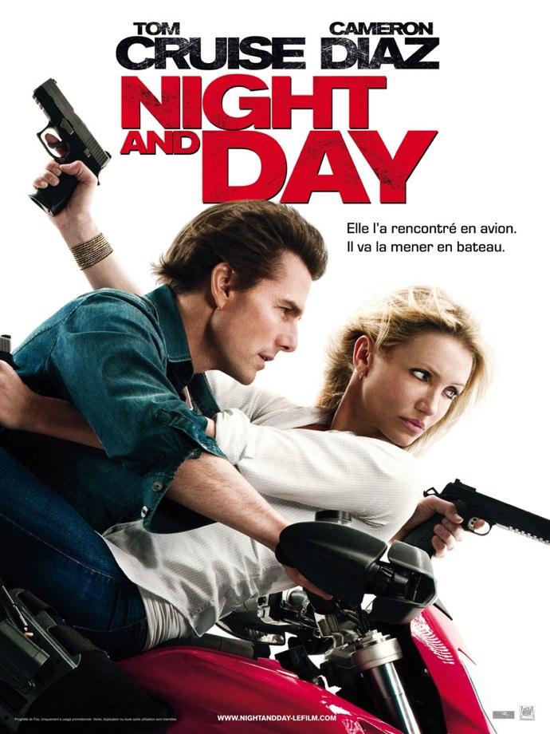
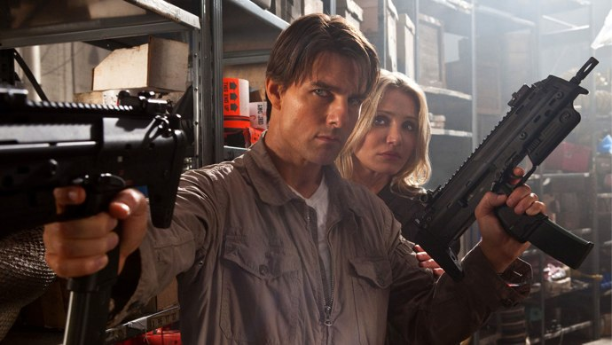

+++
type = "post"
titre = "<em>Night and Day</em>, James Mangold"
title = "Night and Day, James Mangold"
url = "/night-and-day-mangold"
date = "2010-08-08T22:22:12"
Lastmod = "2015-01-18T18:04:29"
cover = "knight-and-day-cruise-diaz.jpg"
categorie = [ "À voir" ]
tag = [ "Action", "Amour", "Blockbuster", "Espionnage", "Humour", "Vite oublié" ]
createur = [ "James Mangold" ]
acteur = [ "Cameron Diaz", "Peter Sarsgaard", "Tom Cruise" ]
annee = [ "2010" ]
weight = 2010
pays = [ "États-Unis" ]
original = "Knight and Day"

+++

<em>Night and Day</em> réunit à l&rsquo;écran deux immenses stars de ces dernières années, Tom Cruise et Cameron Diaz, pour un film d&rsquo;action romantique parfaitement calibré pour la saison estivale. Blockbuster oublié dès la sortie de la salle, le film se révèle néanmoins un divertissement plaisant, notamment grâce à ces deux stars sur le retour qui cabotinent en permanence.

Roy Miller croise par hasard la route d&rsquo;une belle femme dans un aéroport américain. June est immédiatement fascinée par ce grand brun qui croise à nouveau sa route, quelques minutes après le premier choc. Les deux se retrouvent finalement dans le même avion quasiment vide. Tout semble aller pour le mieux, malgré quelques perturbations et trous d&rsquo;air, jusqu&rsquo;à ce que Roy tue brusquement tous les passagers et les deux pilotes avant de faire atterrir le gros avion dans un champ. La surprise est grande pour June qui était loin d&rsquo;imaginer que cet homme qui la fait craquer avait autant de talents cachés. Bien malgré elle, du moins au départ, la voilà embarquée dans une aventure romanesque qui rassemble pèle-mêle le FBI, des méchants espagnols, la corrida, un jeune inventeur génial, une petite batterie capable d&rsquo;alimenter une ville entière, l&rsquo;Autriche, beaucoup de course-poursuites, autant de fusillades et une île paradisiaque. June découvre peu à peu que ce Roy est en fait une sorte d&rsquo;agent secret très doué pour tuer des dizaines d&rsquo;ennemis surarmés en s&rsquo;en sortant sans encombre, à une blessure superficielle près. Elle se découvre en même temps des talents de tueuses et un goût bien affirmé pour les dangers, se jetant sans hésitation dans la gueule du loup, sûre que Roy sera là pour la sauver, tel un Zorro des temps modernes (un Zorro qui aurait troqué un cheval contre une moto rouge… ce qui n&rsquo;est franchement pas malin dans une ville où l&rsquo;on jette dans la rue des taureaux déchaînés).

L&rsquo;intrigue n&rsquo;a dans le fond aucune importance. Cette histoire de Zéphyr est aussi peu crédible que son jeune inventeur, geek et asocial comme il se doit. Au fond, tout le monde veut absolument cette invention, mais on a l&rsquo;impression que personne ne sait vraiment pourquoi. Il y a bien un marchand d&rsquo;armes dans l&rsquo;histoire, et bien sûr les services secrets américains, mais on ne prend jamais la peine de nous expliquer ce qu&rsquo;ils viennent faire dans cette galère. Peu importe, <em>Night and Day</em>, c&rsquo;est d&rsquo;abord l&rsquo;histoire d&rsquo;un couple improbable. Le scénario est connu, même si d&rsquo;habitude il s&rsquo;agit plutôt de deux hommes (un tueur expérimenté, l&rsquo;autre totalement incapable, mais qui survit par miracle sous les feux ennemis). On retrouve bien l&rsquo;idée du duo comique et la fille qui ne connaît absolument rien au monde des armes et qui devrait mourir quinze fois par seconde, mais parvient miraculeusement à passer entre les balles n&rsquo;a rien de bien original. Cela fonctionne plutôt bien dans le film de James Mangold. La blonde, et pas seulement par la couleur des cheveux, n&rsquo;est vraiment pas douée tandis que lui excelle et doit régulièrement faire face aux bourdes de sa partenaire de fortune. On rigole à plusieurs reprises, surtout au début puisque le film évolue peu à peu vers un film d&rsquo;action plus traditionnel quand June se découvre une passion pour les armes. Sans parler de franche rigolade, le film extirpe quand même de nombreux sourires et c&rsquo;est bien ce qui était promis par le film<a href="#fn-3791-1" rel="footnote">1</a>.

&lt;

div style=&nbsp;&raquo;text-align: center;&nbsp;&raquo;>

<em>Night and Day</em> est à bien des égards un film d&rsquo;acteurs qui vit pour et par son duo. Tom Cruise et Cameron Diaz ont déjà joué ensemble (au moins dans <em><a title="Vanilla Sky, Cameron Crowe" href="/2012/01/28/vanilla-sky-crowe/">Vanilla Sky</a></em>), et ce sont deux acteurs plutôt sur la mauvaise pente aujourd&rsquo;hui. Ce ne sont plus les jeunes premiers qui ont fait rêver des fourgons de jeunes spectateurs, les deux ont vieilli et cela se voit. L&rsquo;un comme l&rsquo;autre ne peuvent plus prétendre être toujours aussi jeunes et ils en jouent. Cameron Diaz tout particulièrement, en jouant ici une fille un peu bête qui fait vraiment gamine, comme pour ses premiers rôles dans des comédies, semble assumer totalement son âge en endossant un contre-emploi complet. Cruise de son côté me semble bien vieillir, depuis son étonnant rôle dans <em><a href="/2008/10/23/tonnerre-sous-les-tropiques/">Tonnerre sous les Tropiques</a></em>. Il incarne ici un agent secret totalement désinvolte, qui tue tout naturellement, sans trop y faire attention et qui peut draguer une femme tout en massacrant gentiment 15 méchants. Il faut dire que le personnage interprété par Cameron Diaz ne le gêne pas trop de ce côté, ne se posant jamais vraiment de question et étant décidément très blonde. La paire fonctionne bien, dans un esprit proche des prestations de Brad Pitt et Angelina Jolie dans <em>Mr. &amp; Mrs. Smith</em>, en moins sérieux toutefois.

Cela ne concerne pas directement le film, mais je souhaitais quand même évoquer le titre &laquo;&nbsp;français&nbsp;&raquo; du film. Il faut d&rsquo;abord savoir que le titre original est <em>Knight and Day</em>, jeu de mots pas vraiment subtil entre la nuit (&laquo;&nbsp;<em>night</em>») et le chevalier (&laquo;&nbsp;<em>knight</em> »), deux mots qui ont exactement la même prononciation en anglais. Ce jeu de mots était démultiplié par le fait que le fameux Zéphyr est caché dans une figurine de chevalier par le héros… qui s&rsquo;appelait en fait Knight avant de devenir agent secret. Que ce jeu de mots soit complexe pour des Français peu doués avec les langues, soit. Mais il faudra m&rsquo;expliquer l&rsquo;intérêt de traduire un titre anglais par un autre titre anglais. C&rsquo;est déjà stupide, mais ça l&rsquo;est encore plus quand on pense que le titre choisi n&rsquo;a rien, mais alors absolument rien, à voir avec le film. Il n&rsquo;est pas question de jour et de nuit dans <em>Night and Day</em> et ce titre est quand même très mauvais, commun (d&rsquo;après Allociné, au moins <a href="http://www.allocine.fr/film/fichefilm_gen_cfilm=133753.html">un autre film</a>, coréen, est sorti avec ce titre)… bref, inutile. Ce film obtiendra sans doute la palme du titre français le plus ridicule de l&rsquo;année, ce qui est quand même une victoire comme une autre…

<em>Night and Day</em> n&rsquo;est pas la bouse estivale que l&rsquo;on pouvait craindre à en juger au duo d&rsquo;acteurs ou au synopsis. C&rsquo;est une comédie estivale sympathique, avec ce qu&rsquo;il faut d&rsquo;explosions pour justifier son titre de blockbuster d&rsquo;action. On se fiche bien du scénario alambiqué et on préférera se concentrer sur le duo de personnages qui fonctionne assez bien dans le registre des antagonismes. C&rsquo;est classique, certes, c&rsquo;est oublié sitôt vu, mais c&rsquo;est efficace et le film rempli bien son rôle de divertissement.

Avis contrastés dans la blogosphère. <a href="http://www.plan-c.fr/article-critique-night-and-day-de-james-mangold-54604620.html">Alexandre</a> a ainsi détesté, faisant un parallèle entre les nombreuses scènes où le héros endort l’héroïne (astuce scénaristique un peu facile, il est vrai) et le fait qu&rsquo;il ait lui-même dormi devant un film jugé &laquo;&nbsp;mollasson.&nbsp;&raquo; D&rsquo;autres avis plus positifs quand même, comme celui de <a href="http://myscreens.fr/2010/cinema/night-day-critique/">Fred</a> qui regrette aussi le manque de budget et les coupes dans les scènes d&rsquo;action, <a href="http://nivrae.fr/2010/07/28/critique-cinema-night-and-day/">Nivrae</a> qui a aussi oublié très vite le film ou encore <a href="http://www.filmosphere.com/2010/06/critique-night-and-day-knight-and-day-2010/">Nicolas</a> qui a apprécié un &laquo;&nbsp;<em>succès estival assuré</em>&nbsp;&raquo; jugé plaisant… Côté critique traditionnelle, la surprise vient comme parfois des <em>Inrocks</em> qui défendent ce &laquo;&nbsp;<em>pop-corn movie</em>&nbsp;&raquo; à grand renfort de formules-chocs (&laquo;&nbsp;<em>du Hitchcock pour l&rsquo;ère YouTube </em>») et en faisant une analyse pointue de Tom Cruise.

<h3>Vous voulez m&rsquo;aider ?</h3>
<ul>
<li><a href="http://www.amazon.fr/gp/product/B003YUBZ9I/ref=as_li_ss_tl?ie=UTF8&tag=leblogdenic07-21&linkCode=as2&camp=1642&creative=19458&creativeASIN=B003YUBZ9I">Acheter le film en Blu-Ray sur Amazon</a></li>
<li><a href="http://www.amazon.fr/gp/product/B003YUBZ98/ref=as_li_ss_tl?ie=UTF8&tag=leblogdenic07-21&linkCode=as2&camp=1642&creative=19458&creativeASIN=B003YUBZ98">Acheter le film en DVD sur Amazon</a></li>
<li><a href="https://itunes.apple.com/fr/movie/night-and-day/id391313519?l=en">Acheter ou louer le film sur l&rsquo;iTunes Store</a></li>
</ul>

<ol>
<li id="fn-3791-1">
L&rsquo;affiche française faisant preuve d&rsquo;un humour tout particulier, avec les calembours sur le bateau et l&rsquo;avion. Très fin…&#160;<a href="#fnref-3791-1" rev="footnote">&#8617;</a>
</li>
</ol>

