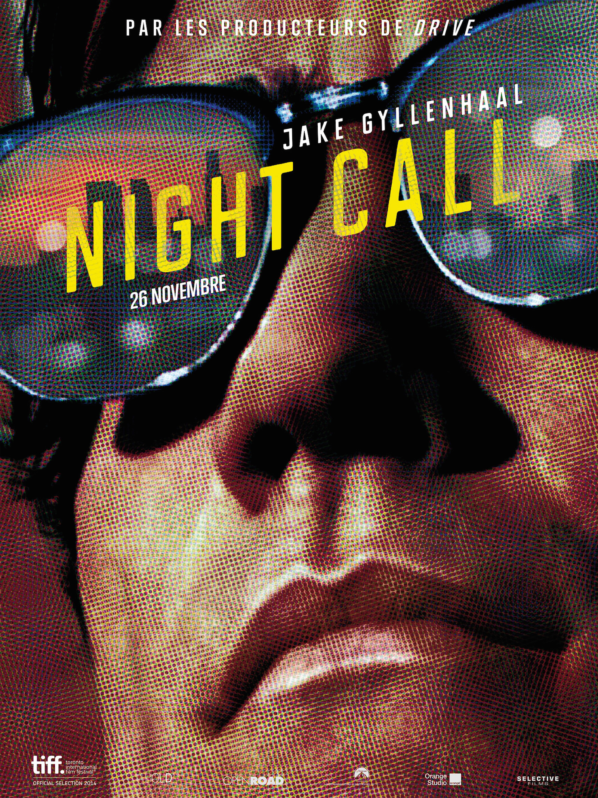

+++
type = "post"
titre = "<em>Night Call</em>, Dan Gilroy"
title = "Night Call, Dan Gilroy"
url = "/night-call-gilroy"
date = "2014-11-30T16:13:04"
Lastmod = "2014-11-30T16:17:07"
cover = "night-call-jake-gyllenhaal.jpg"
categorie = [ "À voir" ]
tag = [ "Ambiance", "Drame", "Metafilm", "Mort", "Police", "Société", "Sorties du mois", "Télévision" ]
createur = [ "Dan Gilroy" ]
acteur = [ "Bill Paxton", "Jake Gyllenhaal", "Kevin Rahm", "Rene Russo", "Riz Ahmed" ]
annee = [ "2014" ]
weight = 2014
pays = [ "États-Unis" ]
original = "Nightcrawler"

+++

« <em>Par les producteurs de <a href="http://voiretmanger.fr/drive-winding-refn/" title="Drive, Nicolas Winding Refn">Drive</a></em> » : dès son affiche, <em>Night Call</em> tente de créer un lien avec le long-métrage de Nicolas Winding Refn. C&rsquo;est probablement motivés par cette même envie de surfer sur le succès d&rsquo;un autre film que les distributeurs français ont choisi ce titre différent de l&rsquo;original (<em>Nightcrawler</em>) et qui crée, là encore, un lien direct entre les deux longs-métrages — « <em>Night Call</em> », c&rsquo;est le titre du morceau le plus connu de la <a href="http://www.amazon.fr/gp/product/B0067ZIZR2/ref=as_li_ss_tl?ie=UTF8&amp;tag=leblogdenic07-21&amp;linkCode=as2&amp;camp=1642&amp;creative=19458&amp;creativeASIN=B0067ZIZR2">bande-originale de <em>Drive</em></a>. Avec autant de liens, on en viendrait presque à considérer que ce nouveau film n&rsquo;est qu&rsquo;une pale copie de <em>Drive</em>, mais ce serait une erreur. Pour sa première réalisation, Dan Gilroy suit les pas d&rsquo;un homme aussi ambitieux que méprisable, un personnage fascinant qui filme les crimes les plus sanglants de Los Angeles pour les revendre à la télévision locale. Un sujet original, pour un résultat vraiment impressionnant : oubliez <em>Drive</em>, <em>Night Call</em> mérite amplement d&rsquo;être vu pour lui-même !

En toile de fond, Dan Gilroy a choisi un sujet original et assez rare pour son premier film. Aux États-Unis, les chaînes d&rsquo;information locales ne vivent qu&rsquo;avec les crimes et accidents qui ont lieu dans la ville. Mais pour obtenir les informations sur ces drames, les chaînes n&rsquo;envoient pas leur propres journalistes et préfèrent acheter des vidéos à des indépendants qui parcourent les rues à la quête de l&rsquo;image qui se vendra bien. À bien des égards, le sujet de <em>Night Call</em> rappelle les paparazzis, sauf que ces hommes qui « rampent » dans les rues la nuit ne sont pas à la quête de célébrité, mais de malheur humain. Tout est bon à être filmé, un accident mortel, un meurtre ou un vol qui tourne mal. Ils écoutent les fréquences de la police en quête de l&rsquo;incident qui peut rapporter, ils se pressent sur les lieux du crime et filment d&rsquo;aussi près que possible pour vendre ensuite leur vidéo au plus offrant. Un boulot ingrat, mais qui fonctionne bien à Los Angeles, où l&rsquo;action se déroule. Le héros de <em>Night Call</em>, Lou Bloom, fait partie de ces caméramans à la recherche du scoop et il est vite remarqué par l&rsquo;une des chaînes locales. Il faut dire qu&rsquo;il semble fait pour ce métier, il sait où se mettre précisément pour avoir la meilleure image et il n&rsquo;a pas peur de passer outre les interdits. Au départ, il se contente de passer une barrière de police pour aller filmer une scène de crime de plus près. Mais ces images plaisent à la télévision, elles rapportent énormément et on lui en demande d&rsquo;autres. Jusqu&rsquo;où aller pour fournir ces images choc que la télévision veut faire tourner en boucle ? Dan Gilroy montre bien comment l&rsquo;appât du gain, et peut-être aussi le plaisir un peu malsain de l&rsquo;exclusivité, attirent Lou et lui font aller toujours plus loin pour obtenir ce qu&rsquo;il veut. Au début, il se contente de déplacer un cadavre pour obtenir un meilleur cadrage. Mais quand on commence sur cette voie dangereuse, où s&rsquo;arrêter ? Être le premier sur une scène de crime, avant même la police, est-ce se rendre complice du meurtre que de filmer sans aider les forces de l&rsquo;ordre ? <em>Night Call</em> soulève quelques questions morales passionnantes à une époque où les chaînes d&rsquo;actualité en continu ont pris énormément de place. La frontière entre réalité et mensonge est toujours très floue et le personnage principal n&rsquo;hésite pas à la franchir quand ça l&rsquo;arrange. De fait, il devient lui-même un metteur en scène, ce qui donne au film une dimension méta assez bien vue : au fond, qu&rsquo;est-ce qui différencie Lou de Dan Gilroy ?

Le premier film de Dan Gilroy raconte d&rsquo;abord l&rsquo;histoire d&rsquo;un homme et c&rsquo;est une histoire vraiment impressionnante. Quand <em>Night Call</em> commence, Lou Bloom n&rsquo;est qu&rsquo;un voleur à la petite semaine, un type qui vole un peu de métal pour vivre avec sa voiture miteuse et son appartement qui ne vaut pas mieux. Il ne trouve aucun travail stable et sa vie ne paraît mener nulle part, jusqu&rsquo;au jour où il tombe par hasard sur un accident de la route. Un caméraman est là pour filmer la scène et la revendre au plus offrant et, sans que l&rsquo;on sache très bien pourquoi, Lou est très intéressé. Le scénario se déroule ensuite logiquement : il achète l&rsquo;équipement et parvient à filmer quelques scoops qui lui valent l&rsquo;attention d&rsquo;une chaîne locale. Mais ce qui est surtout fascinant au sujet de ce personnage, c&rsquo;est son caractère : le personnage principal de Dan Gilroy est un antipathique de première, un sale type qui ne recule devant rien pour satisfaire ses propres envies. On a déjà évoqué la manipulation de la réalité, mais Lou est capable d&rsquo;aller beaucoup, beaucoup plus loin. Sans trop en révéler sur l&rsquo;intrigue, disons simplement que ce personnage ne recule devient rien et qu&rsquo;il est très souvent odieux. Dans sa relation avec le type qu&rsquo;il emploie pour une misère et qu&rsquo;il exploite sans honte, et surtout dans la relation qu&rsquo;il veut entretenir avec la directrice des programmes de la chaîne : c&rsquo;est un manipulateur et menteur, un homme qu&rsquo;on n&rsquo;aurait en aucun cas envie de rencontrer, encore moins d&rsquo;aimer. Et pourtant, c&rsquo;est la force de <em>Night Call</em> : ce personnage totalement antipathique nous est finalement sympathique et on a envie qu&rsquo;il s&rsquo;en sorte, même si ses méthodes sont plus que douteuses. C&rsquo;est une belle performance, que le film doit surtout à son acteur principal : Jake Gyllenhaal est impressionnant dans ce rôle difficile, pas seulement parce qu&rsquo;il a perdu quelques kilos pour interpréter Lou, mais surtout parce qu&rsquo;il est est parfait en baratineur et manipulateur de premier ordre. Il sait rester calme, tout en gardant un ton menaçant dans la voix et surtout dans les propos et quelques scènes de confrontation avec la directrice des programmes ou avec son employé sont vraiment impressionnantes à cet égard.

La comparaison avec <em>Drive</em> peut s&rsquo;expliquer par certains aspects — les deux films se déroulent de nuit, à Los Angeles, avec quelques séquences en voiture —, mais elle est injuste. <em>Night Call</em> n&rsquo;a besoin d&rsquo;aucune comparaison pour exister : le premier film de Dan Gilroy est une réussite ! Porté par un Jake Gyllenhaal en pleine forme et par un personnage odieux et fascinant, le long-métrage est aussi passionnant par son sujet méconnu et parce qu&rsquo;il dit de notre société abreuvée d&rsquo;images en direct. Le scénario ne juge pas trop sévèrement ce personnage qui fait ce qu&rsquo;il a à faire pour vivre, mais peut-être plus les chaînes de télévision qui veulent faire passer un message et s&rsquo;arrangent avec la réalité pour qu&rsquo;elle aille dans le sens désiré. <em>Night Call</em> est une réussite, à ne pas rater !

