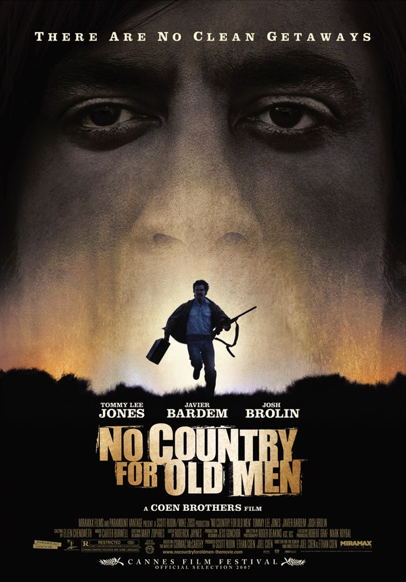
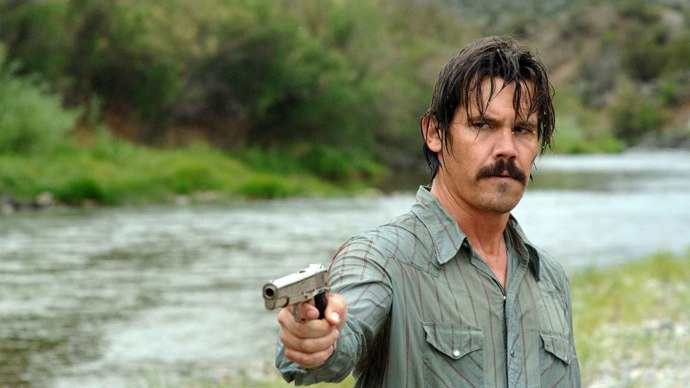
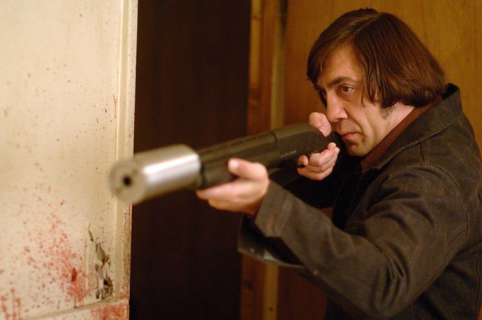

+++
titre = "<em>No Country for Old Men</em>, Joel et Ethan Coen"
title = "No Country for Old Men, Joel et Ethan Coen"
url = "/no-country-for-old-men-coen"
date = "2012-02-26T18:46:41"
Lastmod = "2013-11-17T16:30:21"
cover = "no-country-for-old-men-tommy-lee-jones.jpg"
categorie = [ "À voir" ]
tag = [ "Drame", "Folie", "Serial-killer", "Thriller", "Violence", "Western" ]
createur = [ "Joel et Ethan Coen" ]
acteur = [ "Javier Bardem", "Josh Brolin", "Tommy Lee Jones", "Woody Harrelson" ]
annee = [ "2008" ]
weight = 2008
pays = [ "États-Unis" ]

+++

Pour leur douzième film, les deux frères Coen choisissent pour la première fois d&rsquo;adapter un livre. <em>No Country for Old Men</em> est ainsi basé sur <em>Non, ce pays n&rsquo;est pas pour le vieil homme</em>, un roman de Cormac McCarthy. Joel et Ethan Coen n&rsquo;en font pas moins un film très personnel où l&rsquo;on retrouve des thèmes chers au duo. Le résultat est glaçant et bluffant : une vraie réussite, à (re)voir.

Alors qu&rsquo;il chasse dans le désert du Texas, Llewelyn tombe par hasard sur une scène de massacre. Quelques camionnettes en plein désert et plusieurs cadavres : il comprend vite qu&rsquo;un échange de drogue a mal tourné. La drogue est toujours sur place, mais il manque l&rsquo;argent : Llewelyn part à sa recherche et ne tarde pas à le trouver à proximité du massacre. Deux millions de dollars en billets de 100 : un véritable magot qui va aussi lancer à ses trousses les Mexicains qui fournissaient la drogue et un terrifiant psychopathe qui vient chercher l&rsquo;argent. Récupérer l&rsquo;argent lui vaut d&rsquo;être la cible d&rsquo;une vaste course-poursuite qui échappe totalement au shérif du coin. Bell se sent dépassé par une époque trop violente qu&rsquo;il ne comprend plus et il assiste, totalement impuissant, à un déchaînement de violence sanguinaire.

<em>No Country for Old Men</em> commence dans les paysages des westerns et ce genre restera toujours présent, même si le film s&rsquo;en éloigne incontestablement. L&rsquo;histoire ici peut se résumer à une course-poursuite assez complexe : tout le monde en veut à Llewelyn, autant les Mexicains qu&rsquo;Anton Chigurh, psychopathe qui impressionne par sa seule présence. L&rsquo;employeur d&rsquo;Anton lance aussi dans le courant du film un autre tueur à gages à ses trousses, Anton ayant décidé de faire cavalier seul. En parallèle, le shérif Bell mène l&rsquo;enquête et essaie de comprendre quelque chose à cette vaste affaire qui le dépasse. <em>No Country for Old Men</em> repose à l&rsquo;origine sur un hasard : la découverte du massacre et de l&rsquo;argent par un chasseur, avant les deux parties concernées. Une sorte de machine infernale se met ainsi en route et les frères Coen la déploient ensuite méthodiquement. Anton semble n&rsquo;exister que pour tuer : armé d&rsquo;un fusil conçu pour tuer le bétail et d&rsquo;une simple bonbonne de gaz que beaucoup trop sous-estiment, il tue sans scrupule et avec une redoutable efficacité, mais pas toujours pour de bonnes raisons. Tous ceux qui se mettent en travers de son chemin sont menacés, et il épargne rarement, très rarement même, ses victimes. Face à lui, Llewelyn s&rsquo;avère étonnamment résistant et il parvient à lui survivre à plusieurs reprises.

Cette course-poursuite tend <em>No Country for Old Men</em> vers le genre du thriller. En apparence au moins, Joel et Ethan Coen proposent un thriller dans une ambiance de western, mais le scénario conduit le spectateur vers une aire piste. Le thriller ne tient pas vraiment la route dans ce film : Llewelyn n&rsquo;a vraiment aucune chance, ses opposants devinent toujours ses moindres faits et gestes, sans que l&rsquo;on sache très bien pourquoi au juste. La fin, que l&rsquo;on ne dévoilera pas, est en outre bien éloignée des enjeux du thriller. Le titre est en fait un indice essentiel pour bien comprendre <em>No Country for Old Men</em> : ce pays qui n&rsquo;est pas pour les vieux hommes, c&rsquo;est bien le Texas des années 1980 qui est présenté, et les vieux hommes sont ici représentés par le personnage du shérif Bell. Contrairement au roman de Cormac McCarthy, le personnage semble ici n&rsquo;être que secondaire par sa place à l&rsquo;écran, mais il s&rsquo;agit en fait du héros du film. Les frères Coen ont astucieusement choisi de ne le faire apparaître qu&rsquo;assez tard, après les autres personnages, mais le shérif prend de plus en plus d&rsquo;importance au cours du film. Et pour cause, ce shérif désabusé qui se sent totalement exclu d&rsquo;un monde qu&rsquo;il ne parvient plus à comprendre est le personnage clé du film. L&rsquo;intrigue du thriller n&rsquo;est dès lors plus que secondaire : elle permet essentiellement de souligner l&rsquo;incompréhension du vieil homme et sa lassitude face au monde. <em>No Country for Old Men</em> l&rsquo;associe à un jeune shérif que l&rsquo;on imagine encore motivé ; face à lui, Bell prend son temps, il a souvent le regard dans le vide, il refuse de participer à l&rsquo;enquête et se contente de commenter tristement son époque.

Sans surprise, <em>No Country for Old Men</em> est un film techniquement très travaillé et réussi. Joel et Ethan Coen mettent tout leur talent au service du film et proposent des plans souvent magnifiques dans les grandes plaines du Far West américain. En écho à son personnage principal, le film prend son temps et évite le rythme survolté d&rsquo;un thriller traditionnel. Le récit est également marqué par les ellipses, ce qui n&rsquo;est sans doute pas étranger au style du romancier à son origine : on pense à <em><a href="http://voiretmanger.fr/2009/03/08/la-route-cormac-mccarthy/">La Route</a></em> qui avait aussi cette habitude de se concentrer sur l&rsquo;essentiel, mais de ne pas tout donner au lecteur. <em>No Country for Old Men</em> est une vraie réussite, le film le doit aussi à ses acteurs : Javier Bardem est vraiment impressionnant dans ce rôle de psychopathe serial-killer, à tel point que l&rsquo;on a du mal par la suite à le dissocier de ce rôle. Les autres acteurs sont tous bons, mais Tommy Lee Jones est à nouveau exceptionnel dans le rôle du vieux shérif désabusé : il parvient à transmettre toute sa fatigue et son incompréhension par un simple timbre de voix.

Les frères Coen ont réussi à adapter un livre, sans sacrifier leur univers si particulier. Et pour cause, leur adaptation de <em>Non, ce pays n&rsquo;est pas pour le vieil homme</em> de Cormac McCarthy n&rsquo;est pas extrêmement fidèle comme avait pu l&rsquo;être celle de John Hillcoat pour <em><a href="http://voiretmanger.fr/2009/12/05/la-route-hillcoat/">La Route</a></em>. S&rsquo;éloigner légèrement du livre était sans doute nécessaire : <em>No Country for Old Men</em> est une réussite totale, un film terrifiant et prenant qui reste longtemps en mémoire.

<h3>Vous voulez m&rsquo;aider ?<a href="#footnote_0_5850" id="identifier_0_5850" class="footnote-link footnote-identifier-link" title="&Agrave; propos de la publicit&eacute;&hellip;">1</a></h3>
<ul>
<li><a href="http://www.amazon.fr/gp/product/B001B16PHY/ref=as_li_ss_tl?ie=UTF8&amp;tag=leblogdenic07-21&amp;linkCode=as2&amp;camp=1642&amp;creative=19458&amp;creativeASIN=B001B16PHY">Acheter le film en Blu-Ray sur Amazon</a></li>
<li><a href="http://www.amazon.fr/gp/product/B001B0LYW6/ref=as_li_ss_tl?ie=UTF8&amp;tag=leblogdenic07-21&amp;linkCode=as2&amp;camp=1642&amp;creative=19458&amp;creativeASIN=B001B0LYW6">Acheter le film en DVD sur Amazon</a></li>
<li><a href="https://itunes.apple.com/fr/movie/no-country-for-old-men-vost/id388083125">Acheter ou louer le film sur l&rsquo;iTunes Store</a></li>
</ul>

<ol class="footnotes"><li id="footnote_0_5850" class="footnote"><a href="http://voiretmanger.fr/a-propos/publicite/">À propos de la publicité…</a> [<a href="#identifier_0_5850" class="footnote-link footnote-back-link">&#8617;</a>]</li></ol>
