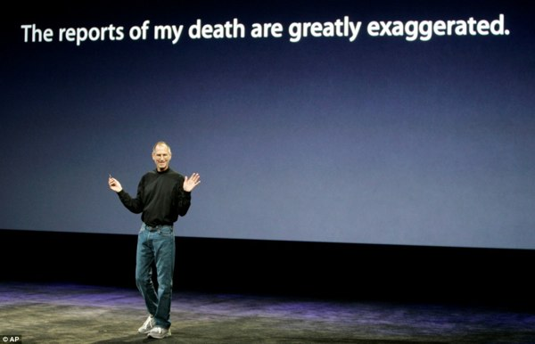

+++
titre = "Non, je ne suis pas mort"
title = "Non, je ne suis pas mort"
url = "/non-je-ne-suis-pas-mort"
date = "2009-06-14T19:10:26"
Lastmod = "2013-09-08T00:05:50"
cover = ""
categorie = [ "En bref" ]
tag = [ "Moâ", "Université" ]

+++

Le silence sur ce blog a trop duré. Pas un seul billet publié depuis le 22 mai, seulement quatre billets pour ce mois-ci, l&rsquo;activité de ces deux derniers mois a été pour le moins légère&#8230; La faute en revient essentiellement à l&rsquo;université qui a monopolisé mon temps pour avancer un passionnant (je pèse mes mots) <a href="http://memoire.nicolasfurno.com/">mémoire</a> sur la production cartographique des régions françaises mise en avant sur leur site Internet.

J&rsquo;espérais terminer ce mémoire pendant le week-end, l&rsquo;imprimer demain ou après-demain, et passer à la suite. Mais voilà, j&rsquo;ai pris mes désirs pour des réalités et un rendez-vous avec mon directeur de mémoire hier m&rsquo;a ramené à la dure réalité. Il me reste encore au moins deux semaines de travail&#8230; L&rsquo;avantage est que je ne vais plus passer 10 heures par jour à penser au mémoire, mais seulement deux ou trois. De quoi me laisser du temps pour réviser un concours pour l&rsquo;année prochaine, pour <a href="http://www.macg.co/">travailler</a>, mais aussi pour le blog.

Mon retard est si abyssal qu&rsquo;il ne servirait à rien de le rattraper. J&rsquo;ai quand même gribouillé dans un coin de fichier quelques lignes sur tous les films vus depuis un mois et demi, cela fera une base. Et après, le rythme reprendra à peu près normalement, en tout cas je l&rsquo;espère.

Parce que finalement, écrire pour ce blog est d&rsquo;abord un plaisir personnel assez égoïste, même si évidemment j&rsquo;aime encore mieux être lu par quelqu&rsquo;un. L&rsquo;écriture est vraiment une nécessité pour moi, et je ne me pose même pas la question, comme <a href="http://wordssounds.free.fr/index.php/2009/06/11/ca-rime-a-quoi-de-bloguer/">d&rsquo;autres</a> l&rsquo;ont fait (et c&rsquo;est d&rsquo;ailleurs très intéressant), de savoir pourquoi je blogue.

Je pourrais écrire uniquement pour mon ordinateur, mais puisque l&rsquo;Internet me permet de le faire potentiellement à la terre entière&#8230; Sincèrement pour ceux qui s&rsquo;égarent malencontreusement dans ce recoin de la toile&#8230; 😉

