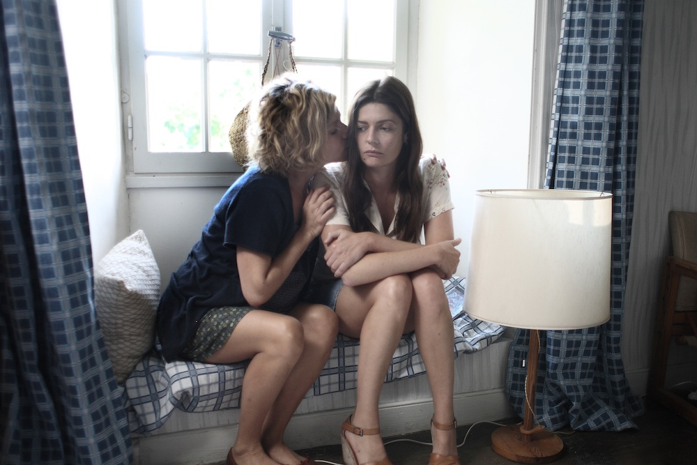
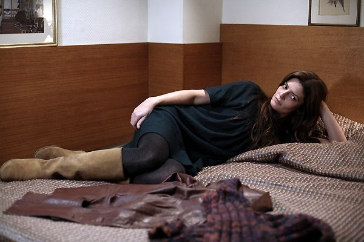
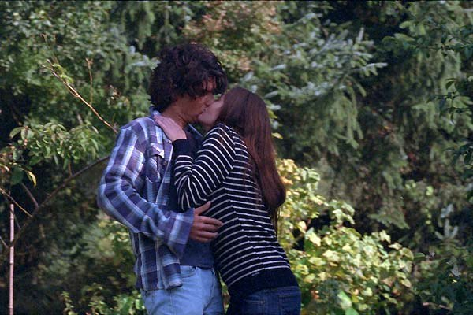
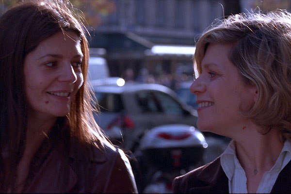

+++
type = "post"
titre = "<em>Non ma fille, tu n&rsquo;iras pas danser</em>, Christophe Honoré"
title = "Non ma fille, tu n'iras pas danser, Christophe Honoré"
url = "/non-ma-fille-tu-niras-pas-danser-honore"
date = "2009-09-07T01:01:44"
Lastmod = "2014-09-27T23:34:16"
cover = "non-ma-fille-tu-niras-pas-danser.jpg"
categorie = [ "À voir" ]
tag = [ "Drame", "Famille" ]
createur = [ "Christophe Honoré" ]
acteur = [ "Chiara Mastroianni", "Jean-Marc Barr", "Marie-Christine Barrault", "Marina Foïs" ]
annee = [ "2009" ]
weight = 2009
pays = [ "France" ]

+++

<em>Non ma fille, tu n&rsquo;iras pas danser</em> est le nouveau film de Christophe Honoré. Ayant apprécié les précédents, je suis naturellement allé voir celui-ci et je dois dire que je n&rsquo;ai pas été déçu par la redite, bien au contraire. Honoré quitte Paris pour la Bretagne, et cela change à peu près tout…

Sur le papier, <em>Non ma fille tu n&rsquo;iras pas danser</em> ressemble fort à un film d&rsquo;Honoré. On retrouve des têtes connues, Chiara Mastroianni et évidemment Louis Garrel, et des thèmes communs : la famille, l&rsquo;amour, la perte&#8230; Cette proximité est d&rsquo;autant plus proche que des acteurs déjà vus dans les <em>Chansons d&rsquo;amour</em> jouent en gros le même rôle que dans ce précédent film. Ce sentiment étrange et présent au départ, même si Louis Garrel est alors remplacé par le frère du réalisateur, disparaît néanmoins au cours du film.

Le film commence en gare de Montparnasse, pour assister au départ d&rsquo;une mère (Léna/Chiara Mastroianni) et ses deux enfants, en route pour la Bretagne. À l&rsquo;arrivée, la mère apprend invite que sa propre mère a invité son ex, dans une sorte de traquenard assez déplaisant, on s&rsquo;en doute. Cette réunion de famille a furieusement des airs d&rsquo;<em>Un conte de Noël</em> d&rsquo;Arnaud Desplechin, avec cet amour empreint de rancœurs et de méchancetés. Néanmoins, le film n&rsquo;est jamais aussi grave et conserve la légèreté qui traverse tous les films d&rsquo;Honoré depuis ses débuts. Ainsi, si tout le monde semble effectivement se liguer contre Léna, ça n&rsquo;est pas méchamment bien au contraire, c&rsquo;est en pensant à elle, pour son bien dit-on.

C&rsquo;est que Léna n&rsquo;est pas une mère idéale. Disons-le franchement, elle est même carrément dérangée. Elle demande à la fin du film pourquoi elle n&rsquo;arrive pas à faire ce que les autres font très bien, et c&rsquo;est bien ça la question : elle semble incapable de se satisfaire d&rsquo;une situation et comme on le lui suggère à un autre moment, c&rsquo;est un peu l&rsquo;éternelle rebelle de la famille. Cliniquement, Léna est sans doute dépressive. Elle pleure souvent, reste amorphe dans son lit, mais s&rsquo;énerve aussi, se veut hyperactive par moment, prend des décisions contradictoires en permanence. Bref, elle ne sait pas ce qu&rsquo;elle veut, si ce n&rsquo;est qu&rsquo;elle ne veut pas que l&rsquo;on décide à sa place. Or c&rsquo;est justement ce que semble vouloir faire sa famille entière.

La tension entre Léna et le reste de la famille va croissant pendant tout le film, jusqu&rsquo;à l&rsquo;incident final qui est comme l&rsquo;explosion après le calme apparent. Néanmoins, <em>Non ma fille, tu n&rsquo;iras pas danser</em> est tout sauf linéaire. Bien au contraire, c&rsquo;est un film complexe, polymorphe, partant un peu dans tous les sens, mais aussi, c&rsquo;est vrai, riche. En témoigne cette scène centrale où l&rsquo;on nous raconte, en costumes d&rsquo;époque et avec biniou, un vieux conte breton : une fille ne veut se marier qu&rsquo;avec l&rsquo;homme qui la fera danser des heures durant. Mais elle tue en fait tous ses prétendants à l&rsquo;effort, et finit par se retrouver seule. Cette séquence fait brus<em> </em>quement irruption dans le film qu&rsquo;elle sépare en deux parties distinctes, la première se passant essentiellement en Bretagne, la seconde à Paris.

Cette séquence donne évidemment une explication au titre du film, mais elle est bien plus que cela puisqu&rsquo;elle sert de clé de lecture à tout le film. Bon, je vais être franc. Sur le coup, elle m&rsquo;a surtout ennuyé parce que, le biniou, même au cinéma, au bout de dix secondes tu n&rsquo;en peux plus. Apparemment, Christophe Honoré n&rsquo;est pas de cet avis et on a du biniou pendant ce qui ma semblé être une éternité, et très fort en plus, à moins qu&rsquo;il n&rsquo;ait voulu que la séquence soit pénible. Bref, quoi qu&rsquo;il en soit, sur le coup j&rsquo;ai eu du mal à apprécier pleinement ce conte.

Pourtant, ce petit conte fournit une explication à la fois sur le comportement de Léna, et sur celui de sa famille. C&rsquo;est d&rsquo;ailleurs Léna qui le dit à un moment, pour elle la vie doit être la plus vaste et libre possible, elle refuse l&rsquo;engagement de peur de la réduire, d&rsquo;avoir une vie étriquée à l&rsquo;image de celle de ses parents. C&rsquo;est finalement un désir d&rsquo;absolu assez classique, sauf que Léna refuse de l&rsquo;abandonner. C&rsquo;est pourquoi elle ne cède sur aucun point face à sa famille, c&rsquo;est pourquoi elle proteste énergiquement dès qu&rsquo;on critique sa gestion des enfants, sa séparation d&rsquo;avec son ex, ou toute autre décision. Ce désir d&rsquo;absolu entraîne des cassures, symbolisées dans le conte par les multiples morts des prétendants. Mais aussi une grande tristesse et une honte profonde, soulignée explicitement par Léna en fin de film. Alors que souvent, chez Honoré, il y a le deuil d&rsquo;un proche, ici il n&rsquo;y a pas de mort, mais quand même un deuil de cet absolu, un deuil forcément plus indistinct, opaque&#8230;

Le conte introduit en tout cas la partie qui m&rsquo;a semblé la plus forte et la plus intéressante, à savoir la partie parisienne. Elle correspond en quelque sorte à l&rsquo;explosion du personnage principal qui avait jusque-là réussi à se contenir et à conserver les apparences. De retour à Paris, avec le train-train quotidien, les enfants à l&rsquo;école et les petits boulots, on sent les masques tomber encore plus qu&rsquo;auparavant, jusqu&rsquo;au craquage complet avec une chute dans l&rsquo;escalier et l&rsquo;arrivée des parents. Le film devient alors très beau et juste, mais aussi terrible, quand il montre les relations compliquées entre la fille et ses parents, les seconds étant assez envahissants quand la première est à fleur de peau et franchement désagréable. La tension est à son comble et le film peut paraître désagréable, ce qui, en l&rsquo;occurrence, est plutôt un compliment.

Christophe Honoré soulage de temps en temps ses spectateurs avec des sortes de pauses légères : l&rsquo;escapade romaine des parents avec école buissonnière, la chanson traduite en direct avec les enfants, les baguettes de pain en guise d&rsquo;oreilles de lapin, etc. Ces pauses sont bienvenues, car j&rsquo;ai quand même trouvé le film assez étouffant. C&rsquo;est sans doute la contrepartie nécessaire à sa richesse, les thèmes abordés étant trop nombreux pour être tous évoqués : il y a le regard des enfants sur les adultes, l&rsquo;inversion du rôle des enfants et des parents ou encore plus largement le problème de la vie et de l&rsquo;âge qui passe.

Je ne m&rsquo;arrêterai pas avant d&rsquo;avoir évoqué le merveilleux duo d&rsquo;actrice que contient le film, celui composé de Chiara Mastroianni et Marina Foïs. Toutes deux sont vraiment excellentes, avec une mention spéciale pour la seconde qui ne cesse de m&rsquo;épater dans des rôles plus sérieux et bien éloignés de ses débuts dans les Robins des Bois. Mais dans <em>Non ma fille, tu n&rsquo;iras pas danser</em>, il n&rsquo;y a pas de fausses notes d&rsquo;acteurs, tous les rôles et seconds rôles sont parfaitement interprétés. Bon, et la musique d&rsquo;Alex Beaupain reste aussi excellente, dans un registre fort différent des <em>Chansons d&rsquo;amour</em>. Une Bo qui se termine avec un morceau d&rsquo;Antony et ses Johnson (splendissime &laquo;&nbsp;<a href="http://www.deezer.com/listen-2151048">Another World</a>&nbsp;&raquo; sur le dernier album) ne peut, de toute façon, pas être mauvaise&#8230;

En parcourant rapidement les 2/3 lignes rédigées ci-dessus, je sens que je patine un peu. Il faut dire que ça n&rsquo;est pas un film évident à décrire et analyser et à dire vrai, je ne sais toujours pas quoi en penser. D&rsquo;un côté, il y a indéniablement un fond fort intéressant pour un film d&rsquo;auteur par excellence. De l&rsquo;autre, sur le moment, je n&rsquo;ai pas été plus emballé que cela. Peut-être que je pensais retrouver l&rsquo;immédiateté des précédents films de Christophe Honoré, et que je n&rsquo;étais pas prêt à accueillir la nouveauté. Sans doute serait-ce un film à revoir, mais ce sera à la télévision, il y a trop de sorties ciné en ce moment.

Pour une analyse fine du film, je recommande le trio habituel <em><a href="http://www.telerama.fr/cinema/films/non-ma-fille-tu-n-iras-pas-danser,388978,critique.php">Télérama</a></em>, <em><a href="http://www.lesinrocks.com/cine/cinema-article/t/1251817260/article/non-ma-fille-tu-niras-pas-danser/">Inrockuptibles</a></em>, <em><a href="http://www.critikat.com/Non-ma-fille-tu-n-iras-pas-danser.html">Critikat</a></em>. Mais sur le ressenti en sortie de salle, je dois dire que <a href="http://www.toujoursraison.com/2009/09/non-ma-fille-tu-niras-pas-danser.html">la critique de Rob</a> me paraît plus proche. Je serais curieux de savoir ce qu&rsquo;il en sera dans quelques jours/semaines&#8230;

<h3>Vous voulez <a href="/soutien/">m&rsquo;aider</a> ?</h3>
<ul>
<li><a href="http://www.amazon.fr/gp/product/B002VTOAYA/ref=as_li_ss_tl?ie=UTF8&amp;tag=leblogdenic07-21&amp;linkCode=as2&amp;camp=1642&amp;creative=19458&amp;creativeASIN=B002VTOAYA">Acheter le film en Blu-ray sur Amazon</a></li>
<li><a href="http://www.amazon.fr/gp/product/B0032UXZSE/ref=as_li_ss_tl?ie=UTF8&amp;tag=leblogdenic07-21&amp;linkCode=as2&amp;camp=1642&amp;creative=19458&amp;creativeASIN=B0032UXZSE">Acheter le film en DVD sur Amazon</a></li>
<li><a href="https://itunes.apple.com/fr/movie/non-ma-fille-tu-niras-pas/id385524707">Acheter ou louer le film sur l&rsquo;iTunes Store</a></li>
</ul>

