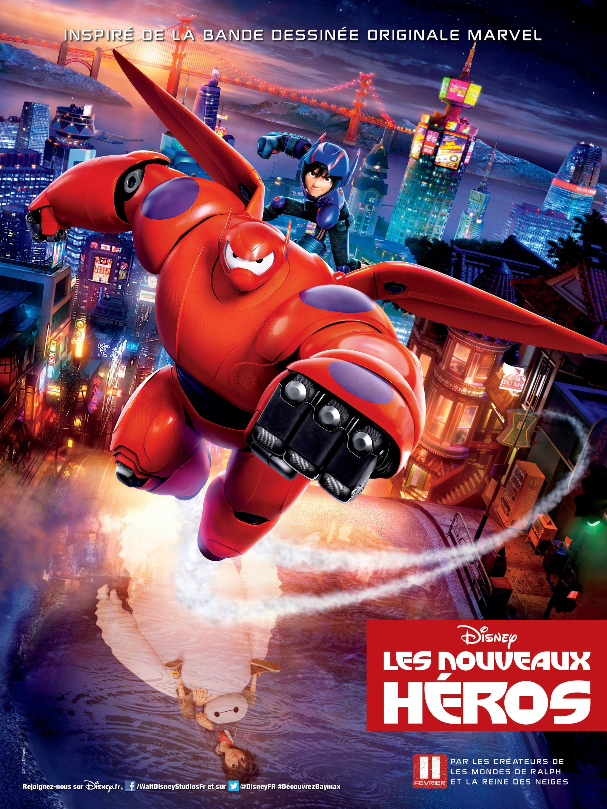
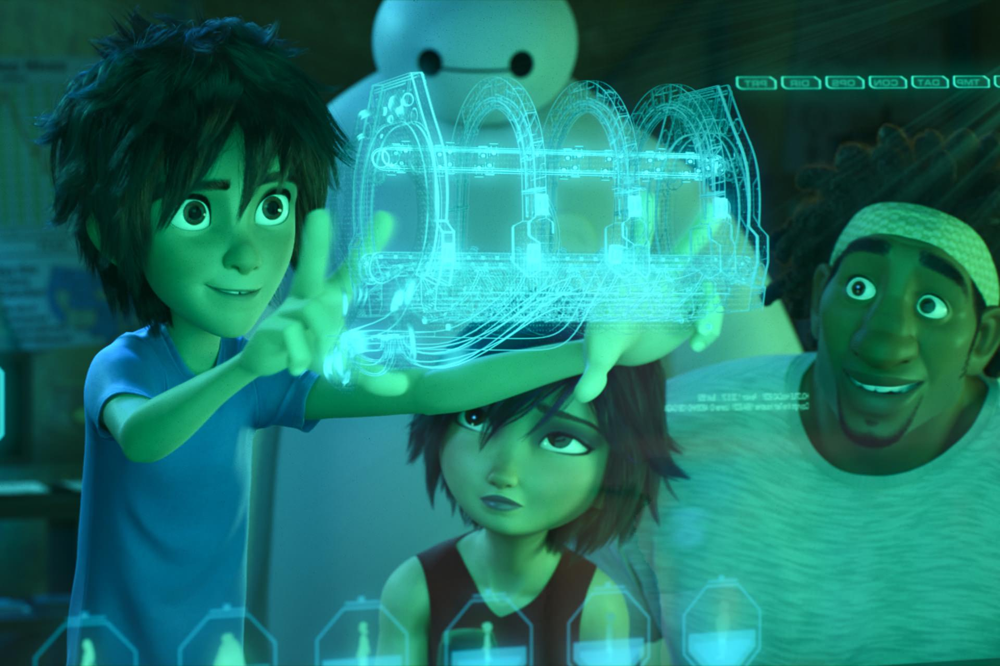
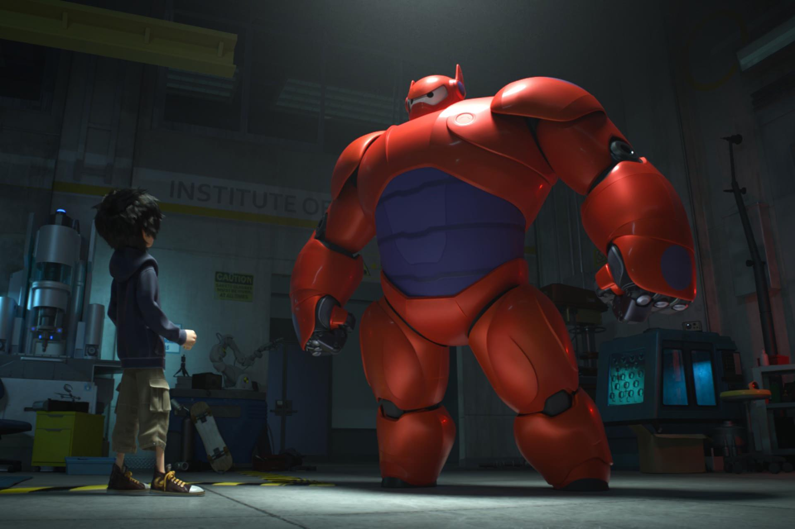

+++
titre = "<em>Les Nouveaux Héros</em>, Don Hall et Chris Williams (II)"
title = "Les Nouveaux Héros, Don Hall et Chris Williams (II)"
url = "/nouveaux-heros-hall-williams"
date = "2015-02-13T01:23:08"
Lastmod = "2015-02-13T01:26:05"
cover = "les-nouveaux-heros-disney.jpg"
categorie = [ "À voir" ]
tag = [ "Adaptation bande-dessinée", "Animation", "Comics", "Intelligence artificielle", "Robot", "Science-Fiction", "Sorties du mois", "Superhéros" ]
createur = [ "Chris Williams (II)", "Don Hall" ]
annee = [ "2015" ]
weight = 2015
saga = [ "Classiques d'animation Disney" ]
pays = [ "États-Unis" ]
original = "Big Hero 6"

+++

Les superhéros sont devenus omniprésents au cinéma, à tel point que leur relative absence dans le cinéma d&rsquo;animation est surprenante. Il y a bien eu <a href="http://voiretmanger.fr/indestructibles-bird/" title="Les Indestructibles, Brad Bird"><em>Les Indestructibles</em></a> chez Pixar, mais en général, les films d&rsquo;animation se contentent de références détournées à l&rsquo;univers des comics. Ce n&rsquo;est assurément pas le cas du cinquante-quatrième <a href="http://voiretmanger.fr/saga/classiques-danimation-disney/">classique d&rsquo;animation Disney</a>, puisque <em>Les Nouveaux Héros</em> est adapté directement d&rsquo;un comics. C&rsquo;est la première fois, depuis son acquisition de Marvel en 2009, que Disney intègre les superhéros à ses productions familiales annuelles et on ne manquait pas de raisons de craindre le pire. À l&rsquo;arrivée, le long-métrage réalisé par Don Hall et Chris Williams (II) est une plutôt bonne surprise. Prenant son sujet très au sérieux, ce Disney ose un ton plus adulte avec des sujet abordés de manière étonnamment frontale et réaliste, comme la mort d&rsquo;un proche et le deuil. <em>Les Nouveaux Héros</em> reste un film pour toute la famille et on est un peu inquiet face à ce qui pourrait donner une saga ratée, mais cette première tentative de rapprochement entre l&rsquo;animation de Disney et les superhéros de Marvel est une bonne surprise !

<em>Les Nouveaux Héros</em> se déroule dans un univers totalement fictif, probablement dans le futur, en tout cas dans une autre dimension où San Francisco et Tokyo auraient pu fusionner pour donner San Fransokyo. Dans cet univers, les robots sont partout et ils sont intelligents. Le héros de cette histoire est justement un petit génie en robotique : Hiro Hamada n&rsquo;a que 13 ans, mais il conçoit déjà des robots extrêmement astucieux. Sa dernière invention ? De tous petits robots qui travaillent ensemble pour créer n&rsquo;importe quelle forme à partir d&rsquo;une simple pensée. L&rsquo;intrigue se met en place autour de cette invention, et surtout d&rsquo;un tragique accident qui vient tout bouleverser. Niro a un grand frère, Tadashi, mais il meurt assez rapidement dans une explosion qui n&rsquo;est accidentelle qu&rsquo;en apparence. Il laisse derrière lui un frère endeuillé et Baymax, un robot tout rondouillard chargé de soigner les humains. Le scénario est alors assez classique : Hiro et Baymax apprennent à se connaître et ils vont chercher ce qui est arrivé à Tadashi, alors qu&rsquo;une menace plane sur la ville. Un grand méchant a repris l&rsquo;idée des petits robots de Hiro pour en faire une arme et le jeune garçon doit tout faire pour sauver la ville, y compris transformer le robot tout rondouillard en une sorte d&rsquo;Iron Man. Au passage, il est aidé par les quatre meilleurs amis de son frère, d&rsquo;où le titre original : une nouvelle confrérie de superhéros se forme face à l&rsquo;adversité ! Comme on peut le constater, <em>Les Nouveaux Héros</em> ne dépaysera pas les fans de comics, mais c&rsquo;est aussi sa force. Contrairement à bon nombre de films d&rsquo;animation qui détournent le genre, celui-ci est une vraie adaptation des bandes-dessinées originales, au premier degré.

C&rsquo;est aussi un classique Disney, héritier d&rsquo;une longue tradition qui remonte aux années 1930 tout de même. Et ce nouveau long-métrage est intéressant à cet égard : c&rsquo;est la première fois que l&rsquo;univers de Marvel vient s&rsquo;y inscrire, et <em>Les Nouveaux Héros</em> est aussi l&rsquo;occasion de plusieurs autres « première fois ». Ainsi, la mort n&rsquo;est jamais vraiment absente chez Disney, mais c&rsquo;est souvent simplement un motif pour agir, ou une peine finalement assez courte pour le héros. Ici, Don Hall et Chris Williams (II) la traite de manière si réaliste, que l&rsquo;on est surpris de voir le difficile travail du deuil. Niro est vraiment abattu par la mort de son frère et il ne s&rsquo;en remet pas immédiatement. Il faut plusieurs minutes et quelques péripéties avec Baymax pour qu&rsquo;il sorte de sa léthargie et retrouve son statut de héros classique. Même si l&rsquo;on reste dans le domaine de ce qu&rsquo;un enfant de trois ans peut comprendre, on peut apprécier malgré tout cette posture, que l&rsquo;on avait plutôt tendance à retrouver chez Pixar. On sent bien l&rsquo;influence du studio d&rsquo;ailleurs, et pas seulement parce que <em>Les Nouveaux Héros</em> est techniquement impeccable<a href="#fn-13138-1" rel="footnote">1</a>. C&rsquo;est aussi le scénario qui est plus mature, dans le sens où il parle aux enfants de façon plus sérieuse. À cet égard, le long-métrage séduira aussi plus facilement les adultes, d&rsquo;autant qu&rsquo;il évite totalement les chansons : que ceux qui ont souffert face à <a href="http://voiretmanger.fr/la-reine-des-neiges-buck-lee/" title="La Reine des neiges, Chris Buck et Jennifer Lee"><em>La Reine des neiges</em></a> se rassurent, le ton est ici beaucoup plus premier degré, avec une bande-son que les adaptations Marvel en images réelles ne renieraient pas. Ce qui n&rsquo;empêche pas quelques traits d&rsquo;humour avec, là encore, un traitement plutôt atypique chez Disney. Il n&rsquo;y a pas le sempiternel personnage secondaire comique, l&rsquo;humour est au contraire bien intégré au scénario, surtout dans la première partie. Et si Baymax en est la principale source, ce n&rsquo;est pas un personnage comique pour autant.

Plus conventionnel que les meilleurs Pixar, <em>Les Nouveaux Héros</em> reste dans la grande tradition des classiques Disney, mais on apprécie que le studio ose un petit peu plus. Son traitement moins enfantin, plus premier degré, et ses sujets plus graves sont bienvenus. Le long-métrage signé Don Hall et Chris Williams (II) est à la fois drôle, bien rythmé avec quelques scènes d&rsquo;action impressionnantes comme il se doit et même touchant par moment, sans aller aussi loin sur ce point que chez Pixar ou Ghibli, pour changer de registre. Saluons l&rsquo;effort malgré tout, et <em>Les Nouveaux Héros</em> mérite amplement d&rsquo;être vu, en famille ou non.

<ol>
<li id="fn-13138-1">
Avec une 3D qui reste assez gadget, mais qui, comme c&rsquo;est souvent le cas en animation, n&rsquo;est pas inutile et peut même être assez efficace.&#160;<a href="#fnref-13138-1" rev="footnote">&#8617;</a>
</li>
</ol>

