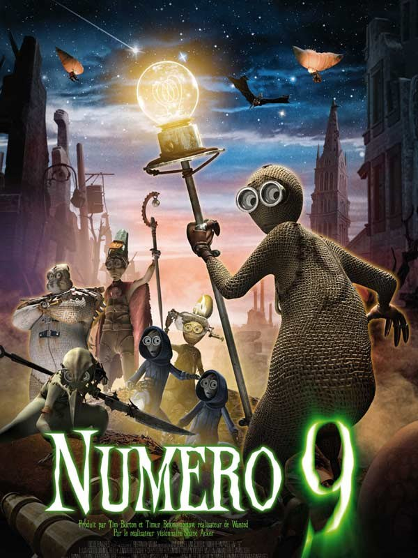
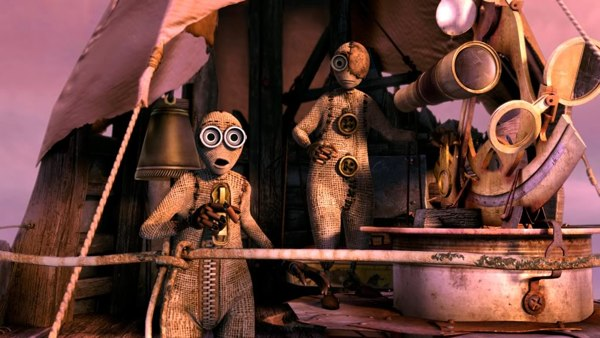

+++
type = "post"
titre = "Numéro 9, Shane Acker"
title = "Numéro 9, Shane Acker"
url = "/numero-9-acker"
date = "2009-09-04T00:03:48"
Lastmod = "2009-09-04T00:04:36"
cover = ""
categorie = [ "À voir" ]
tag = [ "Animation", "Science-Fiction" ]
createur = [ "Shane Acker" ]
annee = [ "2009" ]
weight = 2009

+++

Rattrapant encore mon retard cinématographique, je suis allé voir aujourd&rsquo;hui <em>Numéro 9</em>, un intrigant film d&rsquo;animation réalisé par Shane Acker, mais surtout produit par Tim Burton. Les critiques étaient mitigées, mais j&rsquo;ai fait confiance à mon instinct et je ne le regrette pas.

<em>Numéro 9</em> est un film d&rsquo;animation, mais pas vraiment un film pour enfants. L&rsquo;histoire, en effet, est très sombre et l&rsquo;univers montré assez violent. Dystopie assez classique, le film se déroule dans un monde postapocalyptique. Les hommes ont construit des machines surpuissantes et très intelligentes, et comme toujours en Science-Fiction, elles se sont tournées contre leur créateur. Et elles ont gagné, laminant entièrement l&rsquo;humanité à coup de gaz toxique. Ce qui reste de la Terre est donc un monde vide de toute trace vivante, gris, sombre et sale, un peu comme l&rsquo;univers de <em><a href="http://voiretmanger.fr/2008/09/07/wall-e-dernier-bijou-des-studios-pixar/">Wall-E</a></em> à dire vrai.

En fait, ce monde n&rsquo;est pas tout à fait vide. D&rsquo;étranges créatures, des sortes de petits robots enveloppés dans du tissu (à la manière de <em>Coraline</em> cette fois) et dotés d&rsquo;une intelligence artificielle très développée. En fait, ce sont quasiment des hommes, sauf qu&rsquo;ils sont beaucoup plus petits et que ce sont les seuls survivants. Le film s&rsquo;ouvre avec numéro 9, qui est donc le neuvième et dernier d&rsquo;une série de petits bonshommes.

Quand il ouvre les yeux, 9 ne sait pas bien ce qu&rsquo;il est, où il est et pourquoi un vieil homme est mort par terre. Il sort et rencontre alors d&rsquo;autres comme lui. Un groupe résiste sous l&rsquo;égide de numéro 1 dans une ancienne cathédrale abandonnée. Le 9 ne veut pas rester protégé et inactif, et décide de sauver le numéro 2 emporté par une bête métallique terrible. Commence alors un combat très dur, avec de nombreux morts qui rappellent à nouveau que l&rsquo;on n&rsquo;a pas ici affaire à un film pour les plus jeunes.

Le gros point fort de <em>Numéro 9</em>, c&rsquo;est sa forme. C&rsquo;est bien simple, ce film d&rsquo;animation est splendide et ne souffre pas la comparaison avec ceux de Pixar. L&rsquo;univers est fidèlement transcrit par une quantité de détails à donner le tournis, les personnages sont parfaitement animés, bref, c&rsquo;est visuellement très beau. C&rsquo;est aussi un film qui fourmille d&rsquo;idées graphiques et qui est assez poétique. Les méchantes machines sont aussi très belles à voir, avec des tas de prolongements métalliques et des yeux rouges effrayants. On retrouve bien là des éléments familiers au cinéma de Tim Burton et je dois dire que c&rsquo;est une réussite totale.

Là où <em>Numéro 9</em> pèche un peu c&rsquo;est, vous l&rsquo;aurez compris, sur le scénario. L&rsquo;histoire de base n&rsquo;est pas très originale, mais après tout peu importe (on ne peut pas être constamment révolutionnaire en science-fiction). Plus gênante est la fin, très confuse. On dirait que les scénaristes n&rsquo;ont pas vraiment su comment finir le scénario et ont opté pour une fin très belle à voir, mais qui n&rsquo;est pas vraiment justifiée. Le film aurait peut-être gagné à être légèrement plus long (même si sa concision est une force à mon avis) et développer un peu la fin, le rôle du numéro 9&#8230;

Ceci étant dit, je recommande chaudement de voir <em>Numéro 9</em> si vous êtes fan de science-fiction et/ou de Tim Burton et/ou de belles images de synthèse. Et encore une fois, c&rsquo;est vraiment un des plus beaux films d&rsquo;animation que j&rsquo;ai vu&#8230;

