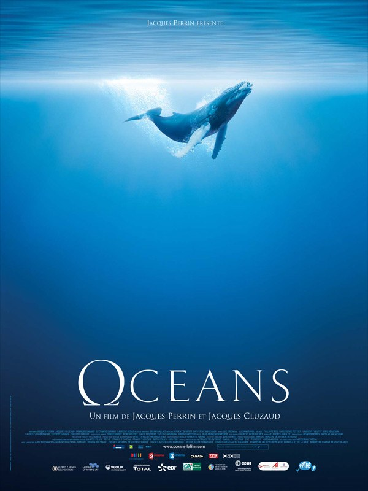
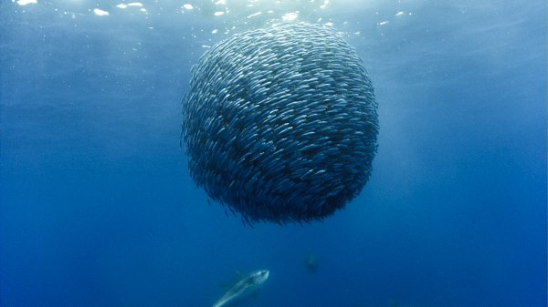
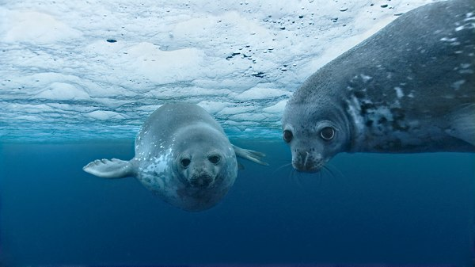
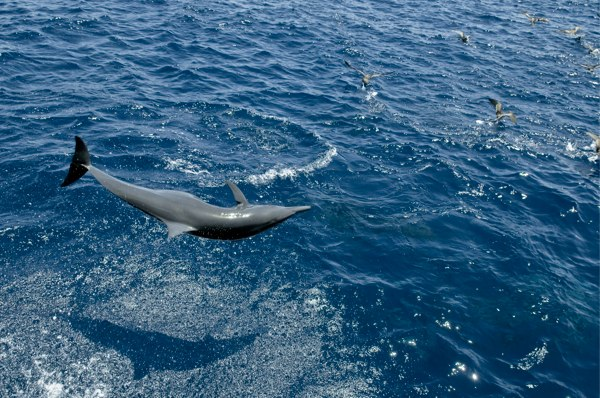

+++
titre = "Océans, Jacques Perrin et Jacques Cluzaud"
title = "Océans, Jacques Perrin et Jacques Cluzaud"
url = "/oceans-perrin-cluzaud"
date = "2010-02-19T00:10:23"
Lastmod = "2012-07-05T21:33:20"
cover = "oceans-jacques-perrin-jacques-cluzaud.jpg"
categorie = [ "À voir" ]
tag = [ "Animaux", "Documentaire", "Écologie", "Nature" ]
createur = [ "Jacques Cluzaud", "Jacques Perrin" ]
annee = [ "2010" ]
weight = 2010
pays = [ "France" ]

+++

Devant les abysses de vide et n&rsquo;importe quoi proposés par le cinéma en ce moment, j&rsquo;ai décidé d&rsquo;aller voir <em>Océans</em>, le dernier film de Jacques Perrin et Jacques Cluzaud. J&rsquo;avais associé le premier, un peu rapidement apparemment, au formidable <em>Microcosmos</em> qui reste le seul documentaire &laquo;&nbsp;animalier&nbsp;&raquo; intéressant au cinéma à mes yeux. La participation de Jacques Perrin s&rsquo;était limitée à la production, et cela se ressent avec <em>Océans</em> : au lieu de se limiter à de belles images, le film veut éveiller les consciences. Et ça n&rsquo;est pas vraiment sa meilleure idée…

<em>Océans</em> entend montrer ce que cache la majeure partie de notre planète, les océans donc. Les deux réalisateurs ont envoyé des équipes aux quatre coins du monde pour capter la magie des profondeurs océaniques, mais aussi des espèces en surface, sur les plages voire dans les airs. Mais il ne s&rsquo;agit pas que de montrer : les deux Jacques entendent bien faire passer un message par leur film, et ce message est clair. L&rsquo;océan est menacé, de très nombreuses espèces maritimes sont menacées par l&rsquo;homme, il faut agir et les sauver le plus vite possible.

Pour que ce message n&rsquo;échappe à personne, <em>Océans</em> est scénarisé. Concrètement, un narrateur — Jacques Perrin <em>himself</em> — lit un texte qui évoque la richesse d&rsquo;un monde encore largement méconnu et déjà en grande partie détruit. Le scénario met en scène un petit garçon qui demande à un vieil homme — bis — que l&rsquo;on suppose être son grand-père<a href="#footnote_0_2862" id="identifier_0_2862" class="footnote-link footnote-identifier-link" title="Je crois que c&rsquo;est vraiment le cas d&rsquo;ailleurs, en tout cas ce gar&ccedil;on &agrave; aussi comme nom de famille Perrin.">1</a>, ce qu&rsquo;est l&rsquo;océan. Et c&rsquo;est donc un portrait de l&rsquo;océan que l&rsquo;homme livre à l&rsquo;enfant, et à nous. Plusieurs thèmes ou idées sont évoqués successivement par le film : la chaîne alimentaire, le rôle indispensable de toutes les espèces, la formidable inventivité de la nature pour s&rsquo;adapter à toutes les situations ou encore le danger que représente l&rsquo;homme pour ce milieu naturel. À la fin du film, le message se fait plus insistant quand le petit garçon et son grand-père vont dans la galerie des espèces disparues ou quand un pauvre dauphin se fait prendre au piège dans un chalut.

Visuellement, <em>Océans</em> est évidemment magnifique. Il n&rsquo;y a vraiment rien à redire, l&rsquo;image allongée sur la vaste toile blanche d&rsquo;un cinéma est vraiment agréable à regarder. Les équipes techniques du film se sont données du mal, non seulement pour filmer les espèces au plus près, mais aussi pour leur rendre toutes leurs couleurs. Sans doute d&rsquo;ailleurs un peu trop : certaines couleurs étaient quand même trop vives pour paraître naturelles. Il n&rsquo;empêche que l&rsquo;on peut voir comme jamais des poissons, des crustacés, des tortues et autres phoques, de très près. Il en va de même pour les monstres des océans que sont les orques, le terrifiant requin ou bien évidemment les gigantesques baleines à bosse, d&rsquo;autant plus impressionnantes qu&rsquo;elles ont été filmées au plus près, à quelques centimètres à peine de leur peau, grâce à un petit drone silencieux. Les animaux sont le plus souvent indifférents, mais on sent certaines espèces très curieuses de la présence humaine, tout particulièrement les phoques.

Jaques Perrin et Cluzaud ont réussi, à force de persévérance (quatre ans de tournage, quand même), à filmer des scènes vraiment exceptionnelles. Certains plans sont vraiment splendides (les méduses, les bancs de poisson notamment), certains sont impressionnants (là je pense aux baleines évidemment, quelles bêtes !), d&rsquo;autres nouveaux à tel point que les scientifiques ont pu, grâce à <em>Océans</em>, voir une espèce qu&rsquo;ils ne connaissaient que morte, en vie. Le combat de centaines (voire milliers, difficile à dire) de crabes qui se rassemblent apparemment tous les ans dans une baie est aussi très impressionnant.

Si je n&rsquo;ai rien à redire sur l&rsquo;image, <em>Océans</em> est malheureusement aussi un film sonore. L&rsquo;ambiance sonore des océans et des animaux filmés est bien reconstituée (cela m&rsquo;étonnerait fort que l&rsquo;on entende aussi bien les pattes d&rsquo;un crabe crisser sur le sable à plusieurs dizaines de mètres de profondeur) et elle est efficace pour plonger, si j&rsquo;ose dire, les spectateurs dans l&rsquo;univers. Les cris des phoques ou des oiseaux, les sirènes des baleines ou les claquements des pinces des crabes sont bien là et sont bienvenus. Le film ajoute à tous ces éléments une musique composée par Bruno Coulais, compositeur d&rsquo;une liste longue comme le bras de films (français essentiellement) et notamment des fameux <em>Choristes</em> (arg). Si la musique accompagne certains plans avec efficacité (je pense ici aux attaques des oiseaux sur un banc de poissons, ou au combat des crabes par exemple), elle est aussi parfois lourde et caricaturale. Mais surtout, elle m&rsquo;a semblé bien souvent bien inutile : le son des vagues ou des animaux ne pouvaient-ils pas suffire ?

Venons-en enfin au sujet qui me fâche avec <em>Océans</em>. Sans doute devrais-je d&rsquo;emblée préciser ma pensée sur l&rsquo;écologie et les films appelant à sauver la planète. Bien évidemment, je suis pour qu&rsquo;on arrête de détruire la planète comme on le fait aujourd&rsquo;hui. Évidemment que vider les océans de ses espèces, que casser la chaîne alimentaire, que détruire des écosystèmes entiers (à commencer par les deux régions polaires) sont d&rsquo;énormes stupidités qui se retourneront un jour contre nous puissance 10. Évidemment.

Mais les films qui prennent les spectateurs par la main pour lui dire que &laquo;&nbsp;oulala, c&rsquo;est mal !!&nbsp;&raquo;, et que &laquo;&nbsp;tu dois changer pour sauver ta planète mon petit bonhomme&nbsp;&raquo; m&rsquo;insupportent au plus haut point. Déjà, on nous prend en général pour des c*ns dans ce genre de films et pédagogie rime très souvent avec démagogie. Le fait que des entreprises co-responsables du dérèglement climatique financent ce genre de films me semble toujours désagréable, on sent toujours le calcul cynique de l&rsquo;entreprise qui se crée une bonne image à moindres frais. C&rsquo;est aussi le cas ici, avec des petites entreprises insignifiantes comme Total, Veolia ou EDF. Du coup, je n&rsquo;ai vu ni le film de Hulot, ni celui de Yann Arthus Bertrand. Je leur préfère des films tout aussi engagés, mais bien plus malins, comme <em>Le cauchemar de Darwin</em>, pour en rester dans le domaine écologique. Et puis, sur un plan plus philoso-politique, je suis très loin d&rsquo;adhérer à l&rsquo;écologisme radical, celui de la décroissance, voire tout le délire autour de Gaïa et de la disparition de l&rsquo;homme de la surface terrestre. Je suis d&rsquo;accord pour partager la planète avec la nature, mais restons sérieux, l&rsquo;humanité doit prévaloir et mettre ses intérêts avant celui des animaux ou des plantes. Si elle peut le faire en préservant les animaux et plantes, alors oui, évidemment, elle doit le faire.

Heureusement, <em>Océans</em> évite quand même en large partie les écueils que j&rsquo;évoquais précédemment. Les commentaires se font, en moyenne, discrets, ils durent peu et laissent une large place à l&rsquo;image. Le petit garçon est censé prendre un air intéressé puis affolé, mais il n&rsquo;est heureusement pas suffisamment présent pour énerver. À la fin du film, on l&rsquo;a dit, les humains sont intégrés au cadre, parfois de manière intelligente (la fusée du début, ou des raffineries derrière des lions de mer), mais aussi de manière très lourde et pénible (le chalut qui emprisonne un dauphin ou une tortue, et la terrible scène du requin aux ailerons coupés et rejeté à la mer encore vivant). C&rsquo;est lourd et ça n&rsquo;apporte rien au film, si ce n&rsquo;est pour tirer une larme aux spectateurs. Ce qui est déplaisant et à toujours le don de me faire rire, quand je suis de bonne humeur.

<em>Océans</em> est sauvé de peu du marasme écologico-niais par la durée des séquences sans message, et par des images tantôt magnifiques, tantôt très intéressantes. On regrettera quand même l&rsquo;aspect un peu &laquo;&nbsp;déjà vu&nbsp;&raquo; de certaines scènes, parfois à l&rsquo;intérieur même du film (certes, un banc de poissons, c&rsquo;est magnifique, mais au bout d&rsquo;un moment…). Le film aurait beaucoup gagné, à mon avis, en étant totalement débarrassé de tout texte et scénario : le caddie qui intrigue tant un lion de mer en dit bien assez sur l&rsquo;impact de l&rsquo;homme sur les océans.

<h3>Vous voulez m&rsquo;aider ?<a href="#footnote_1_2862" id="identifier_1_2862" class="footnote-link footnote-identifier-link" title="&Agrave; propos de la publicit&eacute;&hellip;">2</a></h3>
<ul>
<li><a href="http://www.amazon.fr/gp/product/B003HESMGK/ref=as_li_ss_tl?ie=UTF8&#038;tag=leblogdenic07-21&#038;linkCode=as2&#038;camp=1642&#038;creative=19458&#038;creativeASIN=B003HESMGK">Acheter le film en Blu-Ray sur Amazon</a></li>
<li><a href="http://www.amazon.fr/gp/product/B0037250LC/ref=as_li_ss_tl?ie=UTF8&#038;tag=leblogdenic07-21&#038;linkCode=as2&#038;camp=1642&#038;creative=19458&#038;creativeASIN=B0037250LC">Acheter le film en DVD sur Amazon</a></li>
<li><a href="http://itunes.apple.com/fr/movie/oceans-2009/id377453761">Acheter ou louer le film sur l&rsquo;iTunes Store</a></li>
</ul>

<ol class="footnotes"><li id="footnote_0_2862" class="footnote">Je crois que c&rsquo;est vraiment le cas d&rsquo;ailleurs, en tout cas ce garçon à aussi comme nom de famille Perrin. [<a href="#identifier_0_2862" class="footnote-link footnote-back-link">&#8617;</a>]</li><li id="footnote_1_2862" class="footnote"><a href="http://voiretmanger.fr/soutien/">À propos de la publicité…</a> [<a href="#identifier_1_2862" class="footnote-link footnote-back-link">&#8617;</a>]</li></ol>
