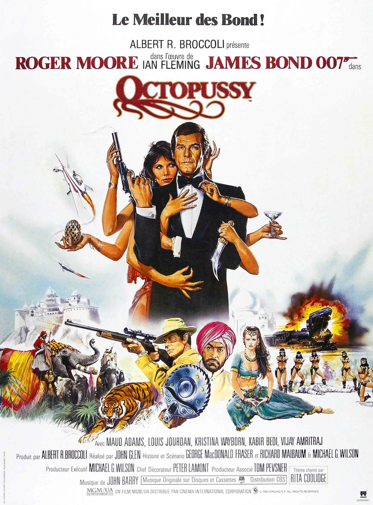
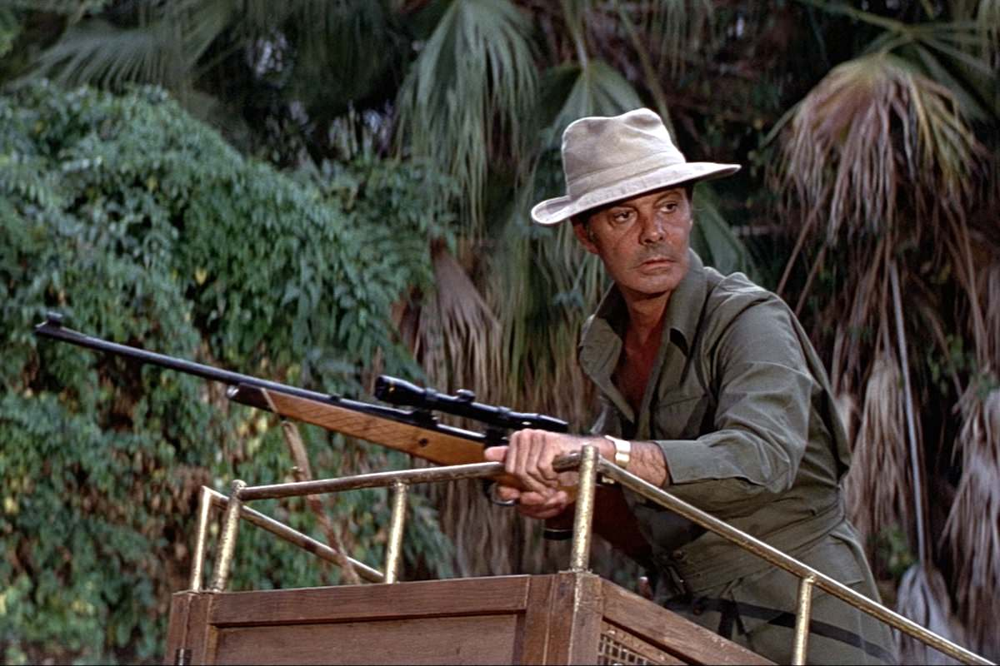

+++
type = "post"
titre = "Octopussy, John Glen"
title = "Octopussy, John Glen"
url = "/octopussy-glen"
date = "2013-03-17T09:58:23"
Lastmod = "2013-05-11T10:04:49"
cover = "octopussy-john-glen-roger-moore.jpg"
categorie = [ "À voir" ]
tag = [ "Blockbuster", "Espionnage", "James Bond", "Vite oublié" ]
createur = [ "John Glen" ]
acteur = [ "Louis Jourdan", "Maud Adams", "Roger Moore" ]
annee = [ "1983" ]
weight = 1983
saga = [ "James Bond" ]

+++

Vingt et un an et treize films plus tard, la saga <em>James Bond</em> a tenu bon, malgré les blockbusters concurrents qui ont pris de plus en plus de place. La série peine pourtant à se renouveler et les derniers épisodes ont parfois été trop loin, à l’image de <a href="http://voiretmanger.fr/2013/03/03/moonraker-gilbert/" title="Moonraker, Lewis Gilbert - À voir et à manger"><em>Moonraker</em></a> qui tentait de reproduire les succès précédents de la série sans innover. Le succès des épisodes avec Roger Moore n’incite pas les producteurs à changer leur acteur fétiche : à 56 ans, il est appelé à nouveau pour interpréter l’agent secret 007. <em>Octopussy</em> ne change pas trop la formule gagnante : John Glen réalise son deuxième épisode qui emporte les spectateurs en Inde pour une étonnante aventure à base de bijoux volés et de bombe nucléaire. De bonnes idées et quelques bons éléments, mais l’ensemble est assez vite oublié…

<em>Octopussy</em> entend en mettre plein la vue dès les premières minutes : la séquence pré-générique se déroule à Cuba et on assiste à l’évasion très spectaculaire de l’agent secret fait prisonnier. Prenant ses ennemis et les spectateurs par surprise, il parvient à s’enfuir à bord d’un tout petit avion caché dans une remorque dédiée à un cheval. Un effet de surprise qui aboutit à une impressionnante course-poursuite dans les airs : de quoi marquer le ton avec cette ouverture très rythmée et assez humoristique. L’ambiance retombe vite toutefois et John Glen embraye sur les scènes habituelles de la saga : retour à Londres donc pour donner à l’agent son ordre de mission. L’intrigue d’<em>Octopussy</em> est originale et elle débute sur un élément totalement anodin en apparence. Un <a href="http://fr.wikipedia.org/wiki/Œufs_de_Fabergé">œuf de Fabergé</a>, une pièce d’orfèvrerie aussi rare que chère, a été retrouvé avec le cadavre de l’agent secret 009 pendant une mission en Allemagne. Le mystère s’épaissit encore quand le MI6 découvre que cet œuf est en fait un faux très bien réalisé. James Bond doit découvrir comment cette pièce précieuse s’est retrouvée dans les mains de son ancien collègue et il tombe vite sur un trafic de bijoux apparemment anodin, même s’il cache en arrière-plan l’URSS. Dans la continuité de <a href="http://voiretmanger.fr/2013/03/10/rien-que-pour-vos-yeux-glen/" title="Rien que pour vos yeux, John Glen - À voir et à manger"><em>Rien que pour vos yeux</em></a>, <em>Octopussy</em> exploite à nouveau une intrigue dans l’esprit de la Guerre froide, même si l’enjeu ici est justement le réchauffement des relations entre les deux blocs. De fait, John Glen n’exploite pas les différences entre RDA et RFA et l’intrigue finit par tourner autour d’un retour à une vraie guerre. D’apparence simple, voire même simpliste, le scénario de ce treizième volet est en fait plus complexe, mais sa complexité n’est pas très bien gérée et on a du mal à comprendre le lien entre bijoux et bombe nucléaire, entre Inde, URSS et Allemagne… Globalement, l’intrigue d’<em>Octopussy</em> peine à passionner, mais elle est finalement assez secondaire.

Un <em>James Bond</em> sur les rails, au propre comme au figuré : cet épisode n’innove pas vraiment dans la saga et se contente de reproduire des schémas et des thèmes déjà vus. Passé l’impressionnant pré-générique, John Glen semble en roue libre et il déroule son histoire sans y mettre tellement de conviction. <em>Octopussy</em> intègre tout ce qu’il faut pour faire un bon épisode, sans plus : le briefing avec M (interprété par Robert Brown qui remplace son défunt prédécesseur) avant la découverte d’un gadget avec Q (Desmond Llewelyn, fidèle au poste) et puis la mission, la rencontre avec le méchant en deux étapes, dont une dans un casino, les filles bien sûr, mais aussi les aides et guides locaux, les courses-poursuites, la bombe désamorcée à la dernière minute… Il y a bien quelques spécificités et éléments originaux dans <em>Octopussy</em>, à commencer par la longue séquence en train qui ne ressemble en rien à celle de <a href="http://voiretmanger.fr/2012/12/30/bons-baisers-russie-young/" title="Bons baisers de Russie, Terence Young - À voir et à manger"><em>Bons baisers de Russie</em></a> et qui rappelle bien plus la <a href="http://voiretmanger.fr/2011/10/24/saga-indiana-jones-spielberg/" title="La saga Indiana Jones, Steven Spielberg - À voir et à manger">saga <em>Indiana Jones</em></a>. Le premier film est sorti deux ans auparavant et son succès pèse sur ce <em>James Bond</em> qui semble en prendre acte et qui répond à sa manière, un peu comme <em>Moonraker</em> avait pu le faire avec <em>Star Wars</em>. Ainsi, l’agent secret se hisse sur le toit du train et il devient lui-même un aventurier, une idée que l’on retrouve quand il s’échappe d’une chasse à l’homme en pleine jungle. Les idées sont là, mais John Glen ne parvient pas à réaliser un long-métrage à la hauteur de ceux de Steven Spielberg. <em>Octopussy</em> est un peu trop lent dans sa première partie, même s’il se rattrape par la suite, mais pas assez sans doute pour effacer ce sentiment de déjà-vu qui est présent pendant plus de deux heures. La musique de John Barry, même si elle est très efficace dans sa déclinaison des thèmes de la saga, participe à cette impression en n’étant vraiment pas du côté de l’originalité…

Si <em>Octopussy</em> n’est pas le pire épisode de la saga, il est loin d’être le meilleur pour autant. John Glen sait filmer un <em>James Bond</em>, mais il le fait de manière beaucoup trop mécanique, avec au total un film qui manque d’originalité. Le divertissement est au rendez-vous, mais <em>Octopussy</em> ne fera pas date…

<strong>James Bond reviendra dans… <a href="http://voiretmanger.fr/2013/03/24/dangereusement-votre-glen/" title="Dangereusement vôtre, John Glen"><em>Dangereusement vôtre</em></a></strong>

<h3>Vous voulez m’aider ?<a href="#footnote_0_8647" id="identifier_0_8647" class="footnote-link footnote-identifier-link" title="&Agrave; propos de la publicit&eacute;&hellip;">1</a></h3>
<ul>
<li><a href="http://www.amazon.fr/gp/product/B00AOALWTE/ref=as_li_ss_tl?ie=UTF8&tag=leblogdenic07-21&linkCode=as2&camp=1642&creative=19458&creativeASIN=B00AOALWTE">Acheter le film en Blu-Ray sur Amazon</a></li>
<li><a href="http://www.amazon.fr/gp/product/B000NJM5UG/ref=as_li_ss_tl?ie=UTF8&tag=leblogdenic07-21&linkCode=as2&camp=1642&creative=19458&creativeASIN=B000NJM5UG">Acheter le film en DVD sur Amazon</a></li>
<li><a href="https://itunes.apple.com/fr/movie/octopussy/id561945670">Acheter ou louer le film sur l’iTunes Store</a></li>
</ul>
<ul>
<li><a href="http://www.amazon.fr/gp/product/B008U6R9B4/ref=as_li_ss_tl?ie=UTF8&amp;tag=leblogdenic07-21&amp;linkCode=as2&amp;camp=1642&amp;creative=19458&amp;creativeASIN=B008U6R9B4">Acheter la trilogie complète en Blu-Ray sur Amazon</a></li>
<li><a href="http://www.amazon.fr/gp/product/B008U6R93C/ref=as_li_ss_tl?ie=UTF8&amp;tag=leblogdenic07-21&amp;linkCode=as2&amp;camp=1642&amp;creative=19458&amp;creativeASIN=B008U6R93C">Acheter la trilogie complète en DVD sur Amazon</a></li>
</ul>

<ol class="footnotes"><li id="footnote_0_8647" class="footnote"><a href="http://voiretmanger.fr/soutien/">À propos de la publicité…</a> [<a href="#identifier_0_8647" class="footnote-link footnote-back-link">&#8617;</a>]</li></ol>
