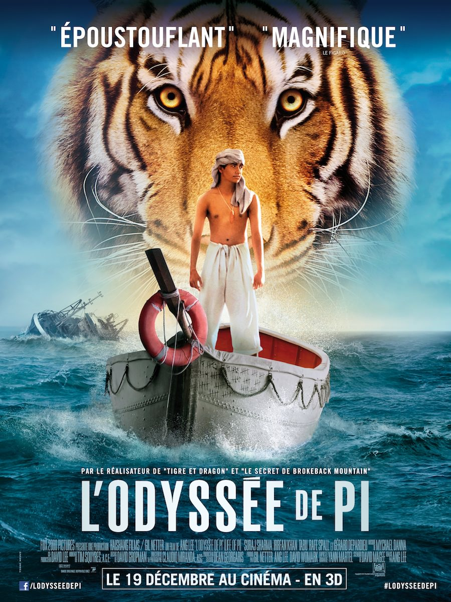
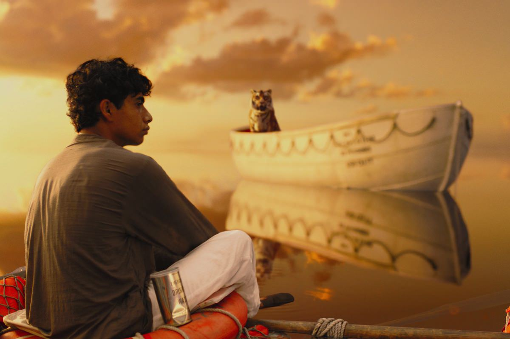
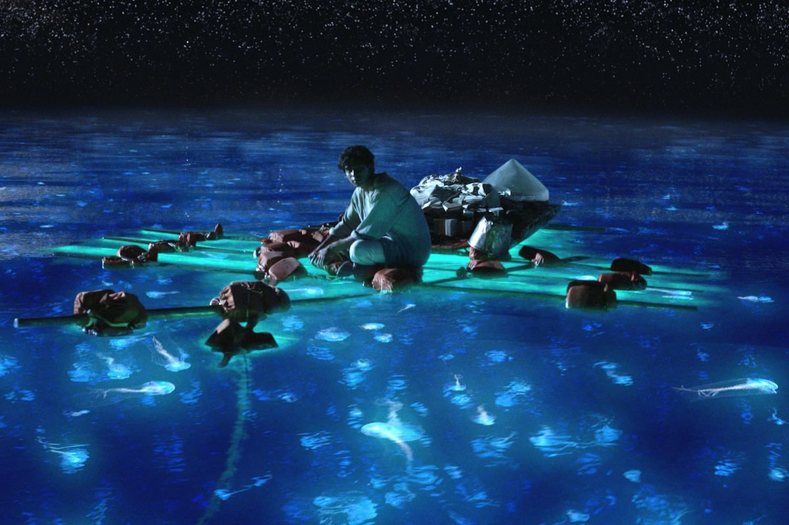

+++
type = "post"
titre = "L&rsquo;Odyssée de Pi, Ang Lee"
title = "L'Odyssée de Pi, Ang Lee"
url = "/odyssee-pi-lee"
date = "2013-01-05T20:04:25"
Lastmod = "2013-04-22T18:23:25"
cover = "odyssee-pi-lee.jpg"
categorie = [ "À voir" ]
tag = [ "Animaux", "Bateau", "Drame", "Famille", "Fantastique", "Religion" ]
createur = [ "Ang Lee" ]
acteur = [ "Adil Hussain", "Irrfan Khan", "Suraj Sharma", "Tabu" ]
annee = [ "2012" ]
weight = 2012
pays = [ "États-Unis" ]
original = "Life of Pi"

+++

La dernière réalisation de l’étonnant cinéaste chinois Ang Lee opte pour le fantastique et le mystique avec l’étrange histoire d’un jeune homme qui survit à un naufrage avec un tigre comme seul compagnon. <em>L’Odyssée de Pi</em> est un film souvent magnifique, parfois un peu kitsch, et un très beau récit, même s’il est un peu perturbé par des messages religieux trop présents. Une belle réussite malgré tout, pour un film à voir en famille.

<em>L’Odyssée de Pi</em> concentre les attentions des spectateurs sur son récit de survie en haute mer, mais le film commence loin de là. Pi, né Piscine Molitor Patel, est un jeune garçon de Pondichéry, en Inde. Il vit avec ses deux parents et son frère ainé dans le zoo de la ville et il découvre la vie et ses mystères en suivant la voie de la religion. Né et élevé dans la tradition bouddhiste, il découvre le catholicisme puis l’islam et essaie de les suivre en même temps. Plus tard, Pi a quitté l’adolescence et découvre l’amour pour la première fois quand ses parents décident de quitter le pays pour tenter une nouvelle vie au Canada. Ils embarquent sur un navire japonais avec tous les animaux qui devront être vendus en Amérique du Nord, mais une terrible tempête fait couler le bateau en plein milieu du Pacifique. Pi est le seul survivant, du moins le seul humain : dans la barque, il retrouve aussi un zèbre, un orang-outan, une hyène et surtout le tigre du zoo. La nature fait rapidement son travail et le jeune homme doit survivre aux côtés du félin, aussi majestueux que dangereux…

Un écrivain en panne d’inspiration demande à Pi devenu adulte de lui raconter son histoire qui a la réputation d’être extraordinaire pour trouver le sujet de son prochain livre. Ce petit système narratif assez conventionnel permet à Ang Lee d’introduire son personnage et son récit. <em>L’Odyssée de Pi</em> remonte jusqu’à l’enfance du personnage principal, mais l’essentiel se déroule malgré tout après le naufrage. Ce dernier, très bref, reste inexpliqué et ce n’est de toute façon pas le sujet du film. De même, la disparition de la famille de Pi, mais aussi de tout l’équipage, ne fait l’objet que d’une part limitée du scénario : très vite, le cinéaste nous laisse seuls avec Pi et son tigre. Commence alors une lutte pour survivre qui est tantôt effrayante, tantôt assez amusante. Le tigre est un superbe animal et surtout un très grand prédateur. <em>L’Odyssée de Pi</em> a d’ailleurs le bon sens de ne pas diminuer le danger lié à l’animal : nul angélisme ici, le tigre est et restera un prédateur féroce, même si Pi parvient à l’amadouer quelque peu. Le garçon reste méfiant d’un bout à l’autre et on se demande en permanence si l’animal ne va pas lui sauter dessus. On sait bien que le héros survit, puisqu’il raconte son récit, mais Ang Lee a su malgré tout insuffler un peu de suspense. <em>L’Odyssée de Pi</em> ne prétend jamais au thriller pour autant, n’exagérons rien, mais le long-métrage s’avère prenant et on a envie d’en voir plus et de découvrir comment le jeune homme a réussi à survivre.

Dans sa première partie, <em>L’Odyssée de Pi</em> est un film très documenté sur la vie d’un petit garçon en Inde et si l’on n&rsquo;ira pas parler de documentaire, Ang Lee filme son récit avec un certain réalisme. La difficile scolarité du petit Piscine — il va dans une école anglophone et son prénom est beaucoup trop proche du mot « <em>pissing</em> » pour ne pas avoir droit à toutes les moqueries imaginables de la part de ses camarades — puis ses hésitations religieuses qui exaspèrent son père agnostique font l’objet de quelques scènes assez amusantes. L’embarquement et le naufrage sont en revanche plus dramatiques, mais toute cette première partie est réaliste et ne prépare pas au déplacement vers le fantastique qui s’empare lentement à partir du naufrage. Ang Lee mène bien son affaire et introduit le fantastique par touches successives, transformant peu à peu la survie de Pi en une sorte de conte. Dans un premier temps, les lueurs surnaturelles qui se font de plus en plus nombreuses dans <em>L’Odyssée de Pi</em> ne sont que le reflet de la lune sur des méduses. Bien vite toutefois, elles semblent un peu étranges pour n’être que des reflets de lune et l’île qui apparaît plus tard dans le récit ne peut pas être réelle. Cette irruption contraste avec le réalisme des débuts et le film se termine sur une idée de scénario que l’on ne dévoilera pas, mais qui remet astucieusement en perspective tout ce qui précède. L’ensemble est en tout cas à la fois très séduisant sur le plan visuel et Ang Lee a parfaitement réussi à doser le fantastique. Quel dommage dès lors de venir le gâcher un peu avec un mysticisme beaucoup trop présent et un message religieux qui devient pesant sur la fin.

On a déjà eu l’occasion d’évoquer à plusieurs reprises la beauté de certains de ses plans. De fait, <em>L’Odyssée de Pi</em> est un film esthétique, dans la même veine que <em>Tigre et Dragons</em>. Ang Lee sait manier les couleurs assez vives pour composer des tableaux parfois un peu kitsch, c’est vrai, mais souvent aussi très beaux. On retrouve par moment la magie d’<a href="http://voiretmanger.fr/2009/12/18/avatar-james-cameron/" title="Avatar, James Cameron - À voir et à manger"><em>Avatar</em></a> — surtout sur l’île —, mais c’est surtout les jeux avec l’eau qui sont magnifiques dans le film. Ang Lee joue avec une eau parfaitement pure et stable que vient brutalement perturber un nageur, un poisson ou la carcasse du navire qui vient de couler. C’est toujours très beau à défaut d’être réaliste et le cinéaste a parfaitement su exploiter la 3D qui s’avère nette et bien utilisée, une fois n’est pas coutume. <em>L’Odyssée de Pi</em> impressionne aussi par son utilisation de l’imagineriez numérique pour générer son tigre : la bête n’est quasiment jamais réelle, mais l’illusion est quasiment parfaite, à l’exception de quelques poils qui ne s’agitent pas encore comme il faut. À côté de cette bête numérique, Ang Lee a réuni un casting efficace avec notamment deux acteurs convaincants pour interpréter Pi jeune (Suraj Sharma) et adulte (Irrfan Khan). La vraie star reste malgré tout le tigre et certainement pas Gérard Depardieu venu pour un tout petit second rôle…

Ang Lee est un cinéaste complexe qui change de forme et de registre au gré des films. Avec <em>L’Odyssée de Pi</em>, il se tourne vers le conte fantastique, pour un résultat souvent splendide et un peu kitsch. Cette étonnante histoire de survie avec un tigre est très réussie, mais on regrette un peu la présence trop marquée de la religion, à la limite du prosélytisme. Qu’importe, <em>L’Odyssée de Pi</em> reste une œuvre très plaisante, à voir avec les enfants (pas avant 10 ans malgré tout)…

<h3>Vous voulez m&rsquo;aider ?<a href="#footnote_0_8253" id="identifier_0_8253" class="footnote-link footnote-identifier-link" title="&Agrave; propos de la publicit&eacute;&hellip;">1</a></h3>
<ul>
<li><a href="http://www.amazon.fr/gp/product/B00AQF8GEQ/ref=as_li_ss_tl?ie=UTF8&tag=leblogdenic07-21&linkCode=as2&camp=1642&creative=19458&creativeASIN=B00AQF8GEQ">Acheter le film en Blu-Ray sur Amazon</a></li>
<li><a href="http://www.amazon.fr/gp/product/B00AQF8G6O/ref=as_li_ss_tl?ie=UTF8&tag=leblogdenic07-21&linkCode=as2&camp=1642&creative=19458&creativeASIN=B00AQF8G6O">Acheter le film en DVD sur Amazon</a></li>
<li><a href="https://itunes.apple.com/fr/movie/lodyssee-de-pi/id601704047">Acheter ou louer le film sur l&rsquo;iTunes Store</a></li>
</ul>

<ol class="footnotes"><li id="footnote_0_8253" class="footnote"><a href="http://voiretmanger.fr/soutien/">À propos de la publicité…</a> [<a href="#identifier_0_8253" class="footnote-link footnote-back-link">&#8617;</a>]</li></ol>
