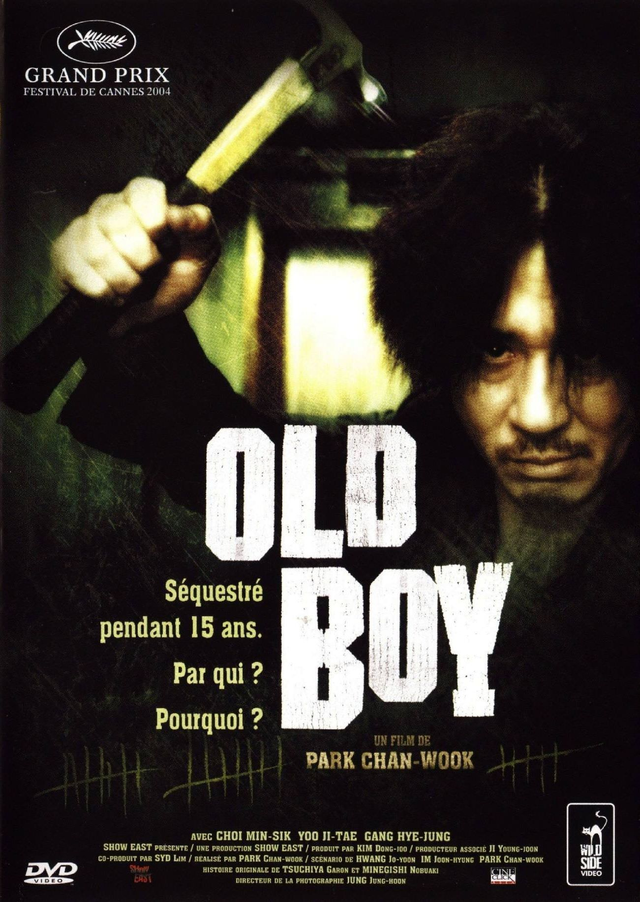
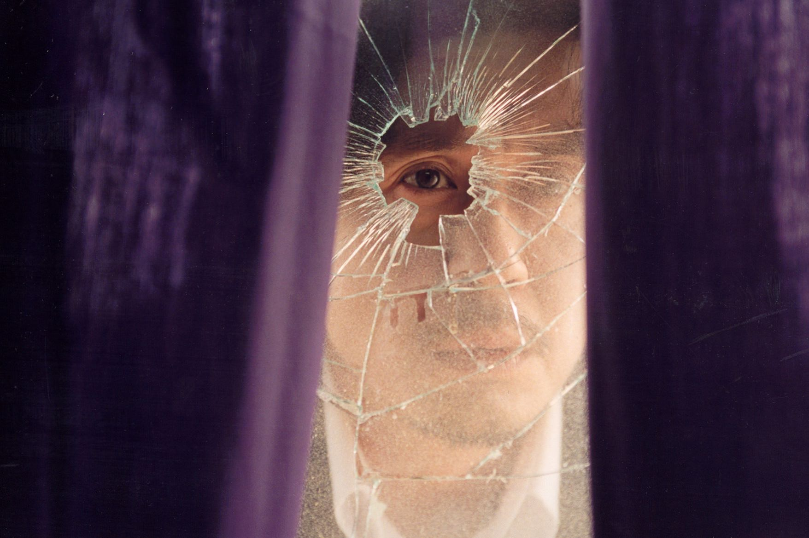
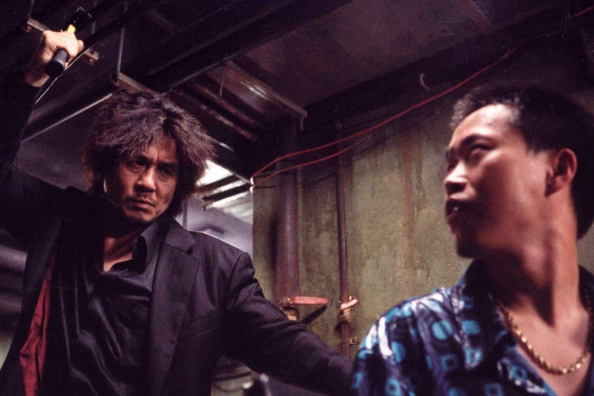

+++
titre = "<em>Old Boy</em>, Park Chan-wook"
title = "Old Boy, Park Chan-wook"
url = "/old-boy-park"
date = "2015-04-12T18:26:09"
Lastmod = "2015-04-12T18:29:00"
cover = "old-boy-choi-min-sik.jpg"
categorie = [ "À voir" ]
tag = [ "Adaptation bande-dessinée", "Amour", "Enquête", "Folie", "Manga", "Prison", "Psychologie", "Thriller", "Vengeance", "Violence" ]
createur = [ "Park Chan-wook" ]
acteur = [ "Choi Min-sik", "Kang Hye-Jeong", "Yu Ji-tae" ]
annee = [ "2004" ]
weight = 2004
pays = [ "Corée du Sud" ]
original = "Oldeuboi"

+++

« <em>Séquestré pendant 15 ans. Par qui ? Pourquoi ?</em> » : l&rsquo;affiche résume bien le sujet principal d&rsquo;<em>Old Boy</em>, adaptation d&rsquo;un manga par le réalisateur sud-coréen Park Chan-wook. Un jour, un homme est enlevé et enfermé sans savoir pourquoi dans une pièce pendant quinze ans. Une idée de départ aussi simple que terrifiante, mais qui n&rsquo;est vraiment que le point de départ d&rsquo;un récit d&rsquo;une violence rare et surtout d&rsquo;une violence qui est autant physique que psychologique. Park Chan-wook signe un thriller qui est à la fois proche du film d&rsquo;horreur, voire gore par moment, et un thriller psychologique comme on en avait rarement vu. <em>Old Boy</em> est un excellent film, mais à ne voir qu&rsquo;avec le cœur bien accroché…

Park Chan-wook ouvre son film sur une forme d&rsquo;emprisonnement, puisque la première séquence se déroule dans un commissariat de police où Oh Dae-soo, le personnage principal, vient d&rsquo;être arrêté. L&rsquo;homme est manifestement dans un état d&rsquo;ébriété avancé et on pourrait croire que son enfermement, au cœur du film, commence alors. Il n&rsquo;en est rien : un ami vient le sortir de là et c&rsquo;est au moment où il appelle sa fille pour son anniversaire que le personnage disparaît. <em>Old Boy</em> n&rsquo;est pas de ces films qui explicitent en permanence tout ce qui se passe. Bien au contraire, le scénario donne le minimum d&rsquo;informations et il faut ainsi rester la majeure partie du film sans savoir pourquoi cet homme apparemment sans histoire a été enfermé. La mise en scène, toujours très travaillée, rend bien ce sentiment d&rsquo;incompréhension qui est aussi celui du personnage, naturellement. On le voit au téléphone avec sa fille, puis la caméra le quitte quelques secondes et c&rsquo;est fait, il a été kidnappé. Le plan suivant se déroule dans la cellule qu&rsquo;il ne quitte pas pendant 15 ans : à ce stade, Oh Dae-soo est enfermé depuis deux mois et il commence à perdre la tête. Il supplie ses tortionnaires de donner une raison, mais il ne reçoit rien que du silence. D&rsquo;emblée, Park Chan-wook marque bien le film de cette particularité : la violence est parfois physique, on y reviendra, mais elle est toujours psychologique. On est avec ce personnage dans une minuscule cellule et on ne sait rien. On ne sait pas qui est derrière cet enfermement, on ne sait pas pourquoi cet enfermement et surtout on ne sait pas combien de temps il durera. Le point de vue reste au cœur de la cellule et c&rsquo;est ça qui est violent : on est autant aveuglé que le personnage, d&rsquo;où un étrange sentiment de claustrophobie. On avance dans le noir et on ne sait jamais où on va aller : cette première partie d&rsquo;<em>Old Boy</em> fait froid dans le dos.

On pourrait penser que l&rsquo;emprisonnement était au cœur du film, mais ce n&rsquo;est pas du tout le cas<a href="#fn-13534-1" rel="footnote">1</a>. Au bout de 15 ans, le personnage est libéré sans plus d&rsquo;explications, mais avec un téléphone portable. Commence alors une quête de vengeance, avec pour commencer une question : qui était derrière tout cela ? <em>Old Boy</em> se transforme assez vite en une enquête qui mène loin dans le passé, mais pour commencer le personnage doit retrouver le monde des vivants, après l&rsquo;avoir perdu de vue pendant si longtemps — pendant quinze ans, son seul lien avec le monde extérieur était une télévision. Park Chan-wook a parfaitement rendu ce difficile retour à la réalité de son personnage, avec une séquence émouvante, mais elle aussi terrible dans le même temps. C&rsquo;est tout le film qui oscille ainsi entre l&rsquo;émotion et les sentiments les plus sombres que l&rsquo;on peut trouver en un humain. Le film a des accès de violence physique et visuelle qui dépassent souvent ce que l&rsquo;on retrouve ailleurs, sauf à chercher dans l&rsquo;horreur tendance gore. Il y a une séance d&rsquo;arrachage de dents avec un marteau, une langue coupée aux ciseaux et, dans un autre registre, ce poulpe avalé encore vivant. Des séquences choc qui restent en mémoire, mais surtout grâce au contexte. Car, si <em>Old Boy</em> sait faire preuve d&rsquo;une violence visuelle aiguisée, ce n&rsquo;est pas forcément cette violence là qui dérange le plus et qui justifie assurément l&rsquo;interdiction aux moins de 16 ans imposée à raison lors de sa sortie en salles. Le plus impressionnant, c&rsquo;est la violence psychologique du long-métrage. Le fait d&rsquo;enfermer quelqu&rsquo;un pendant 15 ans sans jamais lui donner de raison est déjà très impressionnant et Choi Min-sik, l&rsquo;acteur qui incarne ce personnage, excellence pour montrer les dégâts causés par cette incarcération. Il ressort hébété, fou et partiellement amnésique : même quand il rencontre celui qui est à l&rsquo;origine de tout, l&rsquo;histoire ne lui revient pas immédiatement. Et <em>in fine</em>, c&rsquo;est pourtant cette histoire qui est la plus terrifiante. Entre inceste et vengeance, la découverte de ce qui s&rsquo;est réellement passée et des motivations des uns et des autres agit comme un vrai choc. Et quand on réalise totalement ce qui s&rsquo;est déroulé pendant deux heures, on sort du film secoués. Une belle performance de la part de Park Chan-wook.

Rares sont les films qui vont aussi loin dans la violence, mais ceux qui combinent à ce point là visuel et psychologie. On en prend plein la vue, avec quelques images difficiles à supporter, mais ce n&rsquo;est pas encore le pire. <em>Old Boy</em> impressionne surtout par cette histoire de vengeance si disproportionnée, si inhumaine même, qu&rsquo;elle laisse forcément des traces. Avec sa mise en scène osée — la fameuse scène de combat tournée comme un unique et long plan séquence est un grand moment de cinéma —, Park Chan-wook réalise un grand film, mais il faut bien avoir conscience que ce n&rsquo;est pas une œuvre toujours agréable à regarder. Mais c&rsquo;est aussi une réussite totale dans le genre, à (re)découvrir !

<h3>Vous voulez <a href="http://voiretmanger.fr/soutien/">m&rsquo;aider</a> ?</h3>
<ul>
<li><a href="http://www.amazon.fr/gp/product/B006LNABFO/ref=as_li_ss_tl?ie=UTF8&amp;tag=leblogdenic07-21&amp;linkCode=as2&amp;camp=1642&amp;creative=19458&amp;creativeASIN=B006LNABFO">Acheter le film en Blu-ray sur Amazon</a></li>
<li><a href="http://www.amazon.fr/gp/product/B006LNAAGE/ref=as_li_ss_tl?ie=UTF8&amp;tag=leblogdenic07-21&amp;linkCode=as2&amp;camp=1642&amp;creative=19458&amp;creativeASIN=B006LNAAGE">Acheter le film en DVD sur Amazon</a></li>
<li><a href="https://itunes.apple.com/fr/movie/old-boy/id414968358">Acheter ou louer le film sur l&rsquo;iTunes Store</a></li>
<li><a href="http://www.netflix.com/WiMovie/70024111">Regarder le film sur Netflix</a></li>
</ul>

<ol>
<li id="fn-13534-1">
Il va sans dire qu&rsquo;il faut absolument avoir vu le film avant de continuer…&#160;<a href="#fnref-13534-1" rev="footnote">&#8617;</a>
</li>
</ol>

