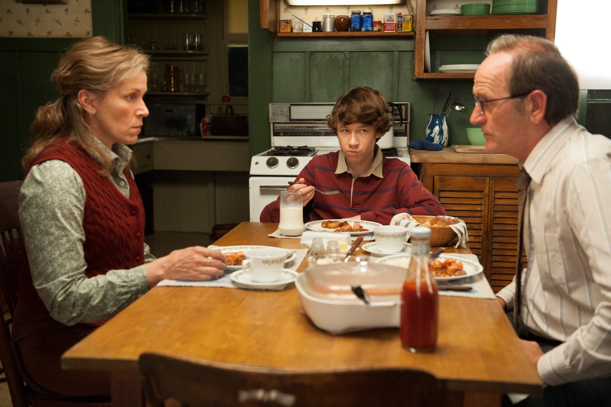
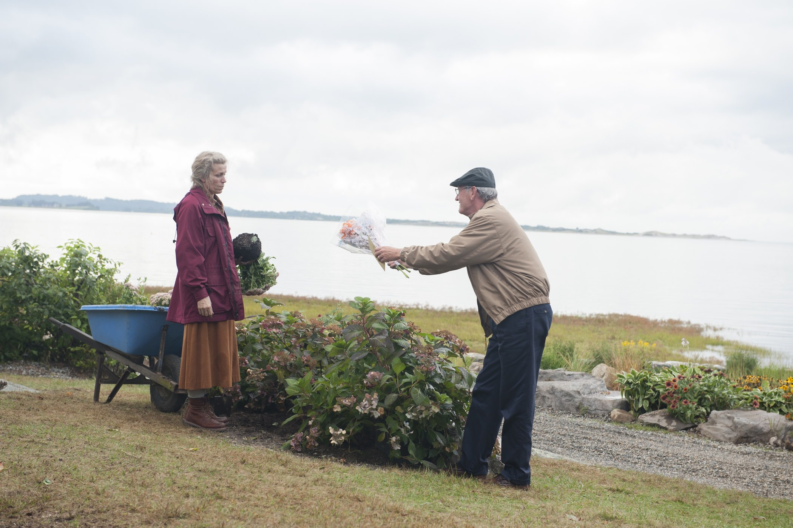

+++
titre = "<em>Olive Kitteridge</em>, Lisa Cholodenko (HBO)"
title = "Olive Kitteridge, Lisa Cholodenko (HBO)"
url = "/olive-kitteridge-cholodenko-hbo"
date = "2015-01-13T23:35:42"
Lastmod = "2015-01-14T18:10:23"
cover = "olive-kitteridge-frances-mcdormand-cholodenko.jpg"
categorie = [ "À voir" ]
tag = [ "Adaptation littéraire", "Dépression", "Enfance", "Famille", "Mort", "Série", "Vie" ]
createur = [ "HBO", "Lisa Cholodenko" ]
acteur = [ "Bill Murray", "Frances McDormand", "John Gallagher", "Jr.", "Peter Mullan", "Richard Jenkins", "Zoe Kazan" ]
annee = [ "2014" ]
weight = 2014
pays = [ "États-Unis" ]

+++

Puisque c&rsquo;est HBO qui finance, puisqu&rsquo;il est passé à la télévision sous la forme de quatre épisodes d&rsquo;une heure, on parle de série, ou plutôt de mini-série. Pourtant, <em>Olive Kitteridge</em> pourrait très bien être un film de quatre heures, sans la moindre difficulté. Portée à l&rsquo;écran par Lisa Cholodenko, cette adaptation du roman éponyme d&rsquo;Elizabeth Strout prouve qu&rsquo;elle n&rsquo;a rien à envier aux long-métrages habituels. Bien au contraire même, la réalisation est impeccable et l&rsquo;écriture d&rsquo;une puissance rare, pour cette fresque familiale qui nous fait traverser 25 ans de la vie de son héroïne. Par certains aspects, on pense à <a href="http://voiretmanger.fr/boyhood-linklater/" title="Boyhood, Richard Linklater"><em>Boyhood</em></a>, mais à la différence du film de Richard Linklater, <em>Olive Kitteridge</em> suit la mère de famille plutôt que celle du fils, qui est toutefois un personnage central dans la série. Avec cette petite série, HBO prouve quoi qu&rsquo;il en soit qu&rsquo;il reste le maître de la narration à la télévision : en quatre épisodes seulement, Lisa Cholodenko a signé une grande série, à ne pas rater !

La toute première scène d&rsquo;<em>Olive Kitteridge</em> marque le ton en présentant… le suicide d&rsquo;Olive, personnage principal de la série. La mère de famille, à un âge manifestement avancé, prépare méticuleusement sa mort en choisissant un coin isolé dans la forêt, en prévoyant un tapis pour ne pas salir le sol et en laissant son testament à proximité. Flashback, on reprend vingt-cinq ans en arrière, mais avec cette idée derrière la tête que cela finira mal. De fait, la série réalisée par Lisa Cholodenko n&rsquo;est pas très joyeuse, et si la dépression et le malheur vous effraient, mieux vaut éviter de la regarder. Mais ce n&rsquo;est pas parce qu&rsquo;elle est triste, que cette série n&rsquo;est pas belle : avec quatre épisodes d&rsquo;une heure, autant dire beaucoup moins de matière que la majorité des feuilletons télévisés, <em>Olive Kitteridge</em> parvient à créer des personnages étonnamment épais. Naturellement, la série ne peut pas en créer beaucoup, mais les trois personnages principaux — Olive, son mari Henry et leur fils Christopher — ont beaucoup plus d&rsquo;épaisseur au bout de quatre heures, que bon nombre de personnages que l&rsquo;on revoit sur plusieurs saisons. Pour parvenir à ce résultat, le scénario adapté par l&rsquo;auteur du roman original et par Jane Anderson est extrêmement bien écrit, avec une finesse impressionnante dans la caractérisation de ces personnages. Loin de la caricature, ils sont composés petit à petit, une patience qui paye, car on finit par les connaître presque aussi bien que s&rsquo;ils étaient de notre famille. Naturellement, le meilleur scénario ne serait rien sans les acteurs pour le porter et là encore, <em>Olive Kitteridge</em> fait fort avec un casting d&rsquo;exception. Richard Jenkins est parfait en pharmacien qui adore tellement sa femme qu&rsquo;il accepte toutes ses réprimandes et la vie infernale qu&rsquo;elle lui fait mener. John Gallagher, Jr., dans le rôle du fils, est une belle découverte et on aimerait bien voir le voir passer un petit peu plus de Broadway au grand écran. La vraie star du film, toutefois, c&rsquo;est bien Olive, interprétée magistralement par une Frances McDormand en grande forme. L&rsquo;actrice n&rsquo;avait rien à prouver, elle non plus, mais elle est spectaculaire pour cette interprétation qui s&rsquo;étale sur 25 ans : certes, le maquillage (discret) aide, mais elle fait beaucoup pour la crédibilité de l&rsquo;ensemble. Et son personnage, odieux à souhait, est en même temps très touchant, ce qui est bien le signe que sa composition est une réussite. S&rsquo;il ne fallait qu&rsquo;une raison pour regarder <em>Olive Kitteridge</em>, c&rsquo;est bien elle : elle explose à l&rsquo;écran.

Portée par Frances McDormand, cette série est aussi extrêmement bien réalisée et il convient aussi de saluer le travail de Lisa Cholodenko. <em>Olive Kitteridge</em> est souvent très subtile sur le fond comme sur la forme, avec des plans aussi superbes qu&rsquo;ils sont tristes du Maine, où l&rsquo;action se déroule. On apprécie aussi la subtilité des sauts temporels et leur crédibilité : tout cela combiné fait que l&rsquo;on ne voit pas cette œuvre comme une mini-série, mais plutôt comme un gros film, et un grand film. Certes, <em>Olive Kitteridge</em> n&rsquo;est jamais très drôle, mais le scénario vous réserve quelques surprises et on se passionne vite pour cette famille Kitteridge. Une vraie réussite !

<h3>Vous voulez <a href="http://voiretmanger.fr/soutien/">m&rsquo;aider</a> ?</h3>
<ul>
<li><a href="http://www.amazon.fr/gp/product/B00R7UJCGE/ref=as_li_ss_tl?ie=UTF8&amp;tag=leblogdenic07-21&amp;linkCode=as2&amp;camp=1642&amp;creative=19458&amp;creativeASIN=B00R7UJCGE">Acheter la série en DVD sur Amazon</a></li>
</ul>

