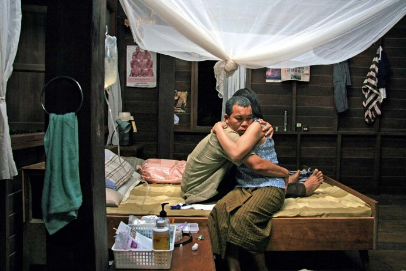

+++
type = "post"
titre = "<em>Oncle Boonmee, celui qui se souvient de ses vies antérieures</em>, Apichatpong Weerasethakul (Palme d&rsquo;or 2010)"
title = "Oncle Boonmee, celui qui se souvient de ses vies antérieures, Apichatpong Weerasethakul (Palme d'or 2010)"
url = "/oncle-boonmee-weerasethakul"
date = "2010-09-08T23:59:12"
Lastmod = "2013-10-12T10:36:27"
cover = "weerasethakul-oncle-boonmee.jpg"
categorie = [ "À voir" ]
tag = [ "Expérience", "Fantastique", "Mort", "Nature", "Palme d'or" ]
createur = [ "Apichatpong Weerasethakul" ]
annee = [ "2010" ]
weight = 2010
saga = [ "Palmes d'or" ]
pays = [ "France", "Thaïlande" ]
original = "Lung Boonmee Raluek Chat"

+++

Rares, très rares, sont les palmes d&rsquo;or cannoises à faire l&rsquo;unanimité. Tous les ans, on a plutôt droit à d&rsquo;interminables polémiques entre partisans et opposants. 2010 ne fit pas exception, au contraire même. Rarement le choix du jury du plus célèbre Festival de cinéma dans le monde avait autant fait parler de lui. Les uns clamèrent à l&rsquo;arnaque intellectualisante, parisianiste et sans intérêt quand d&rsquo;autre parlèrent de chef d&rsquo;œuvre. Passées les polémiques estivales, force est de constater que <em>Oncle Boonmee, celui qui se souvient de ses vies antérieures</em> n&rsquo;est pas un film commun et en tout cas pas un film populaire. Apichatpong Weerasethakul, réalisateur thaïlandais qui présente ici son sixième long-métrage, fait partie de ces réalisateurs disposant d&rsquo;un univers radical et pas forcément accessible. Pourtant, son dernier film n&rsquo;est pas l&rsquo;œuvre incompréhensible et vaine que certains ont voulu voir. Pour peu que l&rsquo;on accepte d&rsquo;entrer dans le film, l&rsquo;expérience qu&rsquo;il procure est fascinante.

Résumer <em>Oncle Boonmee, celui qui se souvient de ses vies antérieures</em> n&rsquo;est pas chose aisée, tant ce film s&rsquo;éloigne de structures narratives traditionnelles. Le point de départ n&rsquo;est pourtant pas si complexe qu&rsquo;il pourrait en avoir l&rsquo;air. Oncle Boonmee est un propriétaire terrien que l&rsquo;on juge riche au regard des critères thaïlandais. Sur ses terres, il produit divers produits, du miel notamment et c&rsquo;est un homme qui semble aimer la nature, c&rsquo;est-à-dire la jungle dans cet espace du monde. Mais Boonmee est aussi un homme malade, d&rsquo;une maladie du genre incurable. Il doit faire plusieurs fois par jour des dialyses sous peine de mettre sa vie en danger, et ce traitement très lourd le fatigue. On le sent las de la vie et prêt à la quitter. Son passé le hante, ce sont les vies antérieures du titre qui reviennent à son esprit. Il y a notamment son ancienne femme, morte depuis des années déjà, qui revient sous la forme d&rsquo;un fantôme. Il y a aussi son fils, disparu depuis plus de dix ans et qui revient sous la forme d&rsquo;un singe. Un jour, il décide d&rsquo;en finir et se rend dans une mystérieuse caverne qu&rsquo;il désigne lui-même comme étant le lieu de sa première naissance. Lieu originel et lieu de la fin : il laisse s&rsquo;écouler du tuyau qui lui permet de suivre son traitement un liquide qui conduit à sa mort. Un suicide, si l&rsquo;on veut, mais le film ne laisse aucun doute sur la question : son heure était venue.

Le fil narratif est bel et bien présent, mais il ne faudrait pas croire qu&rsquo;Apichatpong Weerasethakul veut nous raconter une histoire aussi ferme. Son film n&rsquo;est pas dans cet état d&rsquo;esprit, il s&rsquo;agit plutôt de poser la caméra, d&rsquo;attendre, filmer les derniers jours de la vie d&rsquo;un homme, capter le souvenir de vies antérieures. Si <em>Oncle Boonmee, celui qui se souvient de ses vies antérieures</em> ménage effectivement quelques flashbacks, ce n&rsquo;est pas son mode de fonctionnement principal. L&rsquo;évocation n&rsquo;est jamais explicite, on ne saura d&rsquo;ailleurs pas plus sur cet homme à la fin du film et cet oncle conserve de bout en bout une large part de mystère. Que faisait-il de son vivant ? Pourquoi sa femme est morte ? Toutes ces questions restent en suspens, ne sont même pas évoquées par le film. Un dialogue donne quelques détails sur le fils, on comprend qu&rsquo;il allume toujours des lumières devant la maison toutes les nuits dans l&rsquo;espoir qu&rsquo;il revienne. On ne saura rien de plus, et de toute manière cela importe peu. Le cinéaste ne veut pas tant raconter une histoire, que filmer une ambiance, un univers et tenter de capter le souvenir d&rsquo;une vie, sans l&rsquo;expliciter pour autant. C&rsquo;est pourquoi <em>Oncle Boonmee, celui qui se souvient de ses vies antérieures</em> est une expérience cinématographique et c&rsquo;est aussi ce qui explique le rejet d&rsquo;une partie de la critique et certainement d&rsquo;une large majorité du public. Disons-le, il ne se passe jamais grand-chose chez Weerasethakul, on contemple grâce à de longs plans fixes, on écoute parfois plus que l&rsquo;on regarde. C&rsquo;est un cinéma exigeant, qui nécessite d&rsquo;accepter de sortir des sentiers battus par Hollywood et de se laisser porter par une proposition radicalement différente, composée d&rsquo;attentes et d&rsquo;incompréhensions. Nombre de spectateurs se feront berner par la Palme d&rsquo;or et c&rsquo;est dommage : sachez-le avant d&rsquo;entrer en salle, il faut être dans un état d&rsquo;esprit particulier et accepté de se laisser porter par un film, se laisser hypnotiser même, quitte à être dans un état second proche du sommeil.

L&rsquo;opacité de <em>Oncle Boonmee, celui qui se souvient de ses vies antérieures</em> est renforcée par son recours au fantastique. Quand on dit que les fantômes du passé viennent hanter l&rsquo;oncle, c&rsquo;est au sens propre. C&rsquo;est ainsi son ancienne femme qui apparaît un soir, à table. Ce n&rsquo;est plus un fantôme, mais son incarnation concrète et visible de tous, même de ceux qui ne l&rsquo;ont pas connue. Son fils reconverti en singe ajoute aussi une touche de mystère avec ses deux yeux rouges qui brillent dans le noir et ses poils qui ne cherchent pas le réalisme et rappellent plutôt, dans un tout autre univers, Chewbacca. Encore un élément qu&rsquo;il faut accepter sans se formaliser : Apichatpong Weerasethakul propose un univers marqué par le bouddhisme et l&rsquo;animisme qui est pris au premier degré. On se réincarne après la mort et les animaux sont donc forcément d&rsquo;anciens humains à respecter : on veille à ne pas tuer d&rsquo;insectes avec une mauvaise intention, et on traite avec tout le respect qui lui est dû un buffle qui s&rsquo;échappe. La grotte où vient mourir Boonmee est aussi très étrange, inaccessible et en même temps ouverte, brillant de mille feux et en même temps obscure. C&rsquo;est aussi une référence explicite à la caverne platonicienne, avec un plan assez extraordinaire où la lumière du soleil vient toucher de ses rayons ses occupants allongés au sol. Mais <em>Oncle Boonmee, celui qui se souvient de ses vies antérieures</em> est aussi marqué par un certain réalisme, surtout après la mort de son personnage principal, quand le film s&rsquo;attache à décrire la vie qui continue. On découvre alors une société encore très marquée par la religion, mais où la religion et la vie moderne semblent s&rsquo;opposer comme le symbolise bien ce jeune moine qui aimerait mieux pouvoir chatter ou faire des karaokés. D&rsquo;autres incursions du réel émaillent le film, comme cette évocation de laotiens entrés illégalement sur le territoire, ou de guerres anciennes contre le communisme qui a laissé des traces. Beaucoup moins développée, cette partie presque sociale (n&rsquo;exagérons rien) est aussi très intéressante et apporte une touche plus classique à un film par ailleurs marqué par l&rsquo;originalité, à condition toutefois d&rsquo;accepter cette ultime partie qui semble sortir de nulle part et qui introduit des personnages jusqu&rsquo;alors inconnus.

<em>Oncle Boonmee, celui qui se souvient de ses vies antérieures</em> est aussi très intéressant sur le plan technique. Tourné quasiment uniquement dans la jungle thaïlandaise, le film utilise très bien cet élément du paysage pour créer une atmosphère mystérieuse, mais pas vraiment inquiétante. Une bonne partie de la pellicule est plongée dans une obscurité parfois totale qui ne facilite pas la concentration, mais renforce le sentiment d&rsquo;expérience visuelle. Par certains aspects, le travail d&rsquo;Apichatpong Weerasethakul rappelle celui de Gaspard Noé sur <em><a href="http://voiretmanger.fr/2010/05/04/enter-the-void-noe/">Enter the Void</a></em>, mais tourné au ralenti et avec un usage de drogues apaisantes plutôt qu&rsquo;énervantes. On retrouve cette proximité avec la mort bien sûr, mais aussi une volonté de filmer l&rsquo;intériorité. Les deux films sont radicalement différents, tout aussi intéressants sur le plan technique, même si je préfère le calme apaisant de Weerasethakul. Ce dernier a beaucoup travaillé sur la bande-son, proposant un environnement sonore extrêmement riche qui contribue à créer une atmosphère. L&rsquo;usage d&rsquo;une musique simple, en vibrations sourdes, enrichit encore cet environnement sonore. L&rsquo;ensemble a vraiment une force apaisante, on ressort calme et calmé de ce film.

Quel est le rôle de la Palme d&rsquo;Or ? Récompenser un film populaire, auquel cas la palme 2010 est vraiment honteuse, ou récompenser un film peut-être impopulaire à sa sortie en salle, mais qui est jugé par des gens du métier comme étant le meilleur film à un instant t ? Veut-on vraiment récompenser des films comme <em>Bienvenue chez les Chtis</em>, parmi les plus gros succès de ces dernières années ? Tim Burton, président du jury cette année, a répondu un &laquo;&nbsp;non&nbsp;&raquo; cinglant en imposant le choix de <em>Oncle Boonmee, celui qui se souvient de ses vies antérieures</em>. Il y a indéniablement une part de provocation derrière ce choix, une volonté de défier tous les paris et favoris, et une volonté aussi de choquer le petit monde de la critique. Mais on aurait tort de résumer le film d&rsquo;Apichatpong Weerasethakul à une simple provocation futile. <em>Oncle Boonmee, celui qui se souvient de ses vies antérieures</em> n&rsquo;est certes pas un film grand public, c&rsquo;est même un film exigeant et élitiste, c&rsquo;est un fait. Mais ce n&rsquo;est pas un film totalement opaque et vain : il faut en effet faire l&rsquo;effort de se laisser porter, accepter de ne pas tout comprendre et de sortir des schémas traditionnels. Et alors, on pourra apprécier de magnifiques images, se laisser envouter par une ambiance teintée de merveilleux, se laisser bercer par une bande sonore riche… bref profiter d&rsquo;une expérience cinématographique fascinante. Nul n&rsquo;est obligé d&rsquo;accepter ce défi, cela dit.

Les critiques sont partagées, à l&rsquo;image de <a href="http://www.telerama.fr/cinema/films/oncle-boonmee-celui-qui-se-souvient-de-ses-vies-anterieures,410503,critique.php"><em>Télérama</em></a> qui publie comme à l&rsquo;accoutumée dans ces cas-là, un double avis. <em><a href="http://www.critikat.com/Oncle-Boonmee-celui-qui-se.html">Critikat</a></em> fait partie des convaincus, de même que les <em><a href="http://www.lesinrocks.com/cine/cinema-article/t/49802/date/2010-08-27/article/oncle-boonmee-celui-qui-se-souvient-de-ses-vies-anterieures/">Inrockuptibles</a></em> qui partent en chasse contre les critiques négatives des &laquo;&nbsp;<em>gros médias populaires</em>&laquo;&nbsp;. Côté blogs, <a href="http://www.toujoursraison.com/2010/09/oncle-boonmee-celui-qui-se-souvient-de.html">Rob Gordon</a> a aimé, mais juge que ce Weerasethakul n&rsquo;est pas le meilleur. Ce que je veux bien croire et qui m&rsquo;a donné envie de voir les autres…

<h3>Vous voulez m&rsquo;aider ?<a href="#footnote_0_4002" id="identifier_0_4002" class="footnote-link footnote-identifier-link" title="&Agrave; propos de la publicit&eacute;&hellip;">1</a></h3>
<ul>
<li><a href="http://www.amazon.fr/gp/product/B00632TWXA/ref=as_li_ss_tl?ie=UTF8&tag=leblogdenic07-21&linkCode=as2&camp=1642&creative=19458&creativeASIN=B00632TWXA">Acheter le film en Blu-Ray sur Amazon</a></li>
<li><a href="http://www.amazon.fr/gp/product/B006M44K90/ref=as_li_ss_tl?ie=UTF8&tag=leblogdenic07-21&linkCode=as2&camp=1642&creative=19458&creativeASIN=B006M44K90">Acheter le film en DVD sur Amazon</a></li>
<li><a href="https://itunes.apple.com/fr/movie/oncle-boonmee-vost/id414994968">Acheter ou louer le film sur l&rsquo;iTunes Store</a></li>
</ul>

<ol class="footnotes"><li id="footnote_0_4002" class="footnote"><a href="http://voiretmanger.fr/soutien/">À propos de la publicité…</a> [<a href="#identifier_0_4002" class="footnote-link footnote-back-link">&#8617;</a>]</li></ol>
