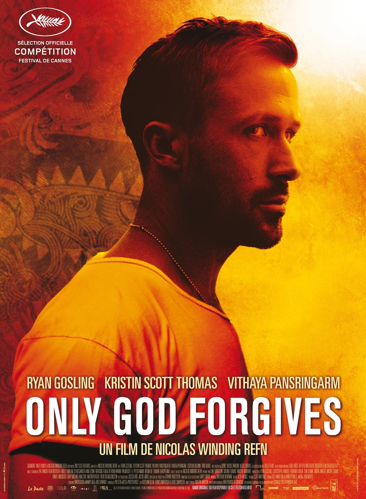

+++
titre = "<em>Only God Forgives</em>, Nicolas Winding Refn"
title = "Only God Forgives, Nicolas Winding Refn"
url = "/only-god-forgives-winding-refn"
date = "2013-05-23T00:09:12"
Lastmod = "2013-10-05T15:48:22"
cover = "only-god-forgives-nicolas-winding-refn-ryan-gosling.jpg"
categorie = [ "À voir" ]
tag = [ "Drame", "Famille", "Mafia", "Thriller", "Violence" ]
createur = [ "Nicolas Winding Refn" ]
acteur = [ "Kristin Scott Thomas", "Ryan Gosling", "Vithaya Pansringarm" ]
annee = [ "2013" ]
weight = 2013
pays = [ "Danemark", "France" ]

+++

Deux ans seulement après <a href="http://voiretmanger.fr/drive-winding-refn/" title="Drive, Nicolas Winding Refn"><em>Drive</em></a> qui lui as permis de sortir de l’anonymat auprès du grand public, Nicolas Winding Refn revient dans les salles avec un nouveau long-métrage. <em>Only God Forgives</em> quitte l’Amérique pour la Thaïlande, mais le cinéaste retrouve Ryan Gosling, l’acteur devenu star planétaire depuis le succès de <em>Drive</em>. On aurait aimé que le changement de cadre géographique suffise à éviter la redite, mais le cinéaste se répète un peu avec cette nouvelle réalisation, ou plutôt donne ce sentiment. Imparfait, <em>Only God Forgives</em> s’avère <em>in fine</em> très séduisant, notamment grâce à sa mise en scène extrêmement travaillée et souvent magnifique. 

Au premier abord, <em>Only God Forgives</em> ressemble à un « <em>Drive 2</em> », un constat qui commence bien sûr avec son acteur principal. Dans ce nouveau film, il incarne Julian, un américain venu à Bangkok pour échapper à la justice et qui est à la tête d’un petit réseau de drogue. Il travaille avec son frère, Billy, qui meurt dans les premières minutes par le père de la fille de 16 ans qu’il venait de violer et assassiner. Seul, il essaie de venger son frère, mais bien vite sa mère arrive à son tour des États-Unis pour obtenir sa vengeance. On le voit, l’histoire imaginée par Nicolas Winding Refn n’a pas grand-chose à voir avec celle de <em>Drive</em>, et pourtant les points communs sont nombreux. Il y a Ryan Gosling qui interprète Julian et qui conserve très exactement le même jeu détaché : il ne réagit jamais, même pas quand sa mère déclare devant la pute qu’il a embauchée pour jouer sa petite amie qu’il est un incapable doublé d’un impuissant sexuel. Il est toujours stoïque et même s’il est très bon dans ce rôle, on ne peut s’empêcher de trouver qu’il se répète un peu : nonobstant ses deux participations pour ce cinéaste, c’est à nouveau le même rôle que dans <a href="http://voiretmanger.fr/the-place-beyond-the-pines-cianfrance/" title="The Place Beyond the Pines, Derek Cianfrance"><em>The Place Beyond the Pines</em></a> sorti il y a deux mois environ. On se lasse un petit peu de ce rôle, même s’il faut noter qu’il est à nouveau parfaitement exécuté et qu’il participe en grande part à l’ambiance si particulière d’<em>Only God Forgives</em>. Comme son prédécesseur en effet, ce nouvel opus est encore une fois un film d’ambiance et on est cette fois plongé dans un Bangkok sale et poisseux, à l’exception du luxueux hôtel où la mère vient s’installer. Nicolas Winding Refn n’a pas son pareil pour filmer ces décors et leur donner une force incroyable par sa mise en scène qui est ici encore très travaillée. La photographie est quasiment en permanence monochrome, avec une dominance du rouge qui indique, dès les premiers plans, que le sang va couler. Le cinéaste utilise en outre les ralentis de manière intensive pour un résultat très précieux et hypnotisant à la fois, qui n’est pas sans rappeler le travail de <a href="http://voiretmanger.fr/createur/wong-kar-wai/">Wong Kar-wai</a>. On aime ou on n’aime pas, mais <em>Only God Forgives</em> est très travaillé et parfaitement tenu d’un bout à l’autre : le résultat est fascinant et rappelle, mais en plus léger, ce que l’on avait pu voir chez Gaspard Noé, dans <a href="http://voiretmanger.fr/enter-the-void-noe/" title="Enter The Void, Gaspard Noé"><em>Enter The Void</em></a>. On retrouve aussi le même goût pour la violence brute et qui explose dans le film : ici, une séquence de torture est vraiment éprouvante, alors même que l’on ne voit rien de gore.

Si <em>Only God Forgives</em> ressemble en apparence à un nouveau <em>Drive</em>, ce n’est que pour mieux s’en distinguer. De fait, le film qui a fait connaître le réalisateur danois n’était pas si caractéristique de son cinéma marqué par une violence souvent extrême et par une esthétisation absolue. À bien des égards, ce nouveau long-métrage est bien plus proche de son cinéma et de ses films précédents, même s’il partage bien des points communs avec son prédécesseur direct. Des points communs, certes, mais la comparaison s’essouffle vite : dans ce nouveau récit, Nicolas Winding Refn ne met en scène que des personnages ratés, à commencer par son héros qui n’a rien d’héroïque. Loin du conducteur paisible et efficace, Julian reste stoïque parce qu’il semble incapable d’agir, tout simplement. Après avoir été mis plus bas que terre par sa mère, la pute qui l’accompagne lui demande pourquoi il se laisse faire et la seule réponse qu’il trouve est significative : parce que c’est sa mère. Au fond, il est incapable de se défendre, pas plus qu’il ne peut assassiner froidement celui qui a tué son frère : le héros attitré d’<em>Only God Forgives</em> ne sait pas se battre et le film le montre bien quand il se fait détruire à l’occasion d’un combat à mains nues. À ses côtés, sa mère brillamment interprétée par une Kristin Scott Thomas époustouflante de cruauté et de sadisme est un personnage autrement plus violent, mais qui échoue également. Ce film n’est que l’histoire d’un long échec et c’est ce qui le distingue de <em>Drive</em>, sans compter qu’il évoque des thèmes très intéressants et loin d’être idiots autour de la famille, de la mère castratrice et autres problèmes psychanalytiques. En même temps, Nicolas Winding Refn semble prendre un malin plaisir à ne pas filmer un récit intéressant et même à exploiter une idée extrêmement légère uniquement en guise d’excuse à sa mise en scène. À cet égard, <em>Only God Forgives</em> s’éloigne du thriller pour s’approche du pur exercice de style, de l’objet artistique qui est d’ailleurs souvent magnifique. Un objet artistique peut-être, mais un objet violent, on l’a dit. Dans cet univers extrêmement carré — de multiples plans fixes sont parfaitement équilibrés, un peu comme chez <a href="http://voiretmanger.fr/createur/stanley-kubrick/">Stanley Kubrick</a> —, le personnage de Chang interprété par Vithaya Pansringarm fascine. Ce policier est tout aussi stoïque que Julian, mais lui est efficace et violent : devant ses collègues, il exécute sans concession ses victimes d’un coup de sabre net et précis. C’est lui qui peut tuer et se prendre pour un dieu, celui du titre, celui qui pardonne.

<em>Only God Forgives</em> agace par sa manière de reprendre, parfois jusqu’à la caricature, des éléments que l’on avait déjà vu dans <em>Drive</em>. Que ce soit son acteur principal ou la musique que l’on n’a pas évoquée ici, mais qui est à nouveau composée par Cliff Martinez et dans le même esprit, Nicolas Winding Refn donne parfois le sentiment de se répéter. On pourrait aussi critiquer sa propension à la violence qui paraît un peu gratuite, ou encore une esthétique outrancière qui remplace même un scénario digne de ce nom. Malgré ces défauts, <em>Only God Forgives</em> séduit et convainc : le film reste en mémoire et plus on y pense, plus il marque l’écart avec <em>Drive</em>. Loin de n’offrir qu’une pâle copie de son succès, Nicolas Winding Refn compose un long-métrage puissant et prenant. À voir…

<small><em>Article 700 du blog !</em></small>

<h3>Vous voulez m&rsquo;aider ?<a href="#footnote_0_9560" id="identifier_0_9560" class="footnote-link footnote-identifier-link" title="&Agrave; propos de la publicit&eacute;&hellip;">1</a></h3>
<ul>
<li><a href="http://www.amazon.fr/gp/product/B00DSKW9GC/ref=as_li_ss_tl?ie=UTF8&#038;tag=leblogdenic07-21&#038;linkCode=as2&#038;camp=1642&#038;creative=19458&#038;creativeASIN=B00DSKW9GC">Acheter le film en Blu-Ray sur Amazon</a></li>
<li><a href="http://www.amazon.fr/gp/product/B00DSKW96M/ref=as_li_ss_tl?ie=UTF8&#038;tag=leblogdenic07-21&#038;linkCode=as2&#038;camp=1642&#038;creative=19458&#038;creativeASIN=B00DSKW96M">Acheter le film en DVD sur Amazon</a></li>
<li><a href="https://itunes.apple.com/fr/movie/only-god-forgives-vost/id691170383">Acheter ou louer le film sur l&rsquo;iTunes Store</a></li>
</ul>

<ol class="footnotes"><li id="footnote_0_9560" class="footnote"><a href="http://voiretmanger.fr/soutien/">À propos de la publicité…</a> [<a href="#identifier_0_9560" class="footnote-link footnote-back-link">&#8617;</a>]</li></ol>
