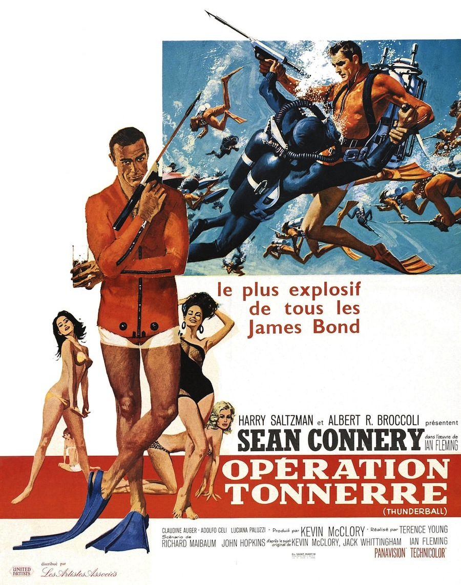
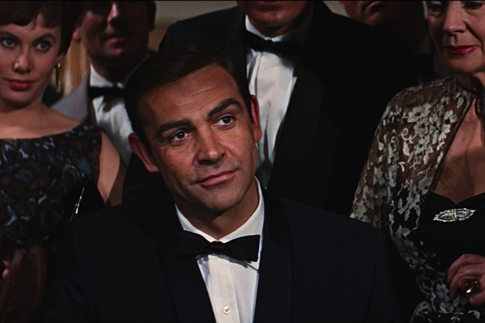

+++
type = "post"
titre = "<em>Opération Tonnerre</em>, Terence Young"
title = "Opération Tonnerre, Terence Young"
url = "/operation-tonerre-young"
date = "2013-01-13T08:48:36"
Lastmod = "2013-05-11T09:59:37"
cover = "operation-tonnerre-young.jpg"
categorie = [ "À voir" ]
tag = [ "Action", "Blockbuster", "Espionnage", "Guerre froide", "James Bond" ]
createur = [ "Terence Young" ]
acteur = [ "Bernard Lee", "Claudine Auger", "Desmond Llewelyn", "Sean Connery" ]
annee = [ "1965" ]
weight = 1965
saga = [ "James Bond" ]
original = "Thunderball"

+++

Quand <em>Opération Tonnerre</em> sort sur les écrans à la fin de l&rsquo;année 1965, le personnage de James Bond est entré dans l&rsquo;imaginaire collectif et le succès de <a href="http://voiretmanger.fr/2013/01/06/goldfinger-hamilton/" title="Goldfinger, Guy Hamilton - À voir et à manger"><em>Goldfinger</em></a> a permis à la jeune saga d&rsquo;entrer dans le club des licences à succès. La suite n&rsquo;attend pas et il ne s&rsquo;écoule qu&rsquo;un an avant ce nouveau film qui est réalisé par Terence Young. Le réalisateur avait signé les deux premiers long-métrages en tâtonnant un peu et avec deux ambiances assez différentes ; cette fois, il réalise un <em>James Bond</em> extrêmement classique, où tous les éléments traditionnels sont réunis. <em>Opération Tonnerre</em> n&rsquo;impressionne pas autant que son prédécesseur, mais il reste un divertissement très plaisant.

« <em>Le plus explosif de tous les James Bond</em> » comme le clame son affiche, commence par une séquence pré-générique qui n&rsquo;a qu&rsquo;un lien limité avec la suite de l&rsquo;intrigue, comme c&rsquo;est maintenant l&rsquo;habitude de la saga. En pleine Guerre froide, mais suffisamment loin de la crise des missiles cubains, <em>Opération Tonnerre</em> repose sur une histoire de bombe atomique détournée. Il n&rsquo;est pas question des deux blocs toutefois, mais ce quatrième épisode signe le grand retour du SPECTRE, ce fameux groupe de méchants ultimes qui se battent pour la domination du monde, rien que cela. Comme dans <a href="http://voiretmanger.fr/2012/12/30/bons-baisers-russie-young/" title="Bons baisers de Russie, Terence Young - À voir et à manger"><em>Bons baisers de Russie</em></a>, le spectateur découvre dès le départ le plan machiavélique du groupe et il a ainsi une bonne avance sur le MI6 et sur l&rsquo;agent secret. Ce plan se déroule d&rsquo;ailleurs sans accroc pendant la majeure partie du film et il faudra attendre les dernières minutes pour qu&rsquo;il soit déjoué par James Bond. L&rsquo;utilisation du SPECTRE est assez classique, mais la réunion qui se tient au début l&rsquo;est peut-être un peu moins : elle se déroule en parallèle d&rsquo;une réunion qui rassemble — et c&rsquo;est une exception dans toute la saga — tous les agents 00. Le parallèle entre les deux organisations est flagrant et troublant : <em>Opération Tonnerre</em> fait un peu du SPECTRE le pendant sombre du MI6, finalement. Nonobstant cette petite originalité, l&rsquo;œuvre de Terence Young enchaîne les séquences attendues, avec plusieurs James Bond girls, dont une méchante comme dans <em>Goldfinger</em>, des séquences d&rsquo;opposition avec le méchant, des gadgets, etc. 

<em>Opération Tonnerre</em> ne reste pas dans les annales comme étant un grand <em>James Bond</em>, mais ce quatrième film de Terence Young offre malgré tout un spectacle très réussi et l&rsquo;action s&rsquo;avère globalement efficace. On le retient surtout pour ses nombreuses séquences subaquatiques et notamment pour son combat final où des dizaines d&rsquo;hommes s&rsquo;affrontent sous l&rsquo;eau. La séquence manque sans doute de rythme — la bande-originale plutôt molle n&rsquo;aide pas, il faut dire —, mais elle reste malgré tout assez impressionnante et la performance peut être saluée à une époque où tout se faisait en vrai, faute d&rsquo;effets spéciaux numériques. Les effets mis en place par Terence Young ont quant à eux tous très mal vieillis, surtout vers la fin quand la course du bateau est artificiellement accélérée en modifiant la vitesse de l&rsquo;image. <em>Goldfinger</em> avait déjà utilisé ce procédé, mais il est ici plus grossier et passe mal. Pour le reste, <em>Opération Tonnerre</em> est un divertissement réussi, sans plus, la faute à la fois à un scénario imparfait et à un manque de rythme combiné à une trop longue durée. Côté scénario, on a du mal à comprendre pourquoi Largo ne profite pas de la demi-douzaine d&rsquo;occasions qui se présentent à lui pour éliminer James Bond, tandis que ce dernier semble venir à bout de tous ses ennemis avec une déconcertante facilité. <em>Opération Tonnerre</em> manque également de rythme, sans doute parce qu&rsquo;il est trop long : c&rsquo;est le premier épisode de la saga à dépasser les deux heures, mais c&rsquo;est surtout en raison de séquences sous l&rsquo;eau un peu trop longues. C&rsquo;est particulièrement le cas lorsque les méchants récupèrent les bombes dans l&rsquo;avion immergé : à quoi bon prendre le temps de montrer comment ils camouflent l&rsquo;appareil ? Sean Connery est en revanche toujours parfait dans le rôle de l&rsquo;agent 007 et le film doit indéniablement beaucoup à son acteur principal.

Gros succès commercial à sa sortie, <em>Opération Tonnerre</em> est peut-être, plus que <em>Goldfinger</em>, est le premier vrai blockbuster de la saga. Terence Young signe aussi un épisode extrêmement conventionnel, qui innove peu, mais reste aujourd&rsquo;hui encore très plaisant. Le film aurait gagné en intensité s&rsquo;il avait été plus court, en l&rsquo;état il constitue un divertissement malgré tout réussi. 

<strong>James Bond reviendra dans… <a href="http://voiretmanger.fr/2013/01/20/on-ne-vit-que-deux-fois-gilbert/" title="On ne vit que deux fois, Lewis Gilbert"><em>On ne vit que deux fois</em></a></strong>

<h3>Vous voulez m’aider ?<a href="#footnote_0_8312" id="identifier_0_8312" class="footnote-link footnote-identifier-link" title="&Agrave; propos de la publicit&eacute;&hellip;">1</a></h3>
<ul>
<li><a href="http://www.amazon.fr/gp/product/B001D45CJ6/ref=as_li_ss_tl?ie=UTF8&amp;tag=leblogdenic07-21&amp;linkCode=as2&amp;camp=1642&amp;creative=19458&amp;creativeASIN=B001D45CJ6">Acheter le film en Blu-Ray sur Amazon</a></li>
<li><a href="http://www.amazon.fr/gp/product/B000NJM5RY/ref=as_li_ss_tl?ie=UTF8&amp;tag=leblogdenic07-21&amp;linkCode=as2&amp;camp=1642&amp;creative=19458&amp;creativeASIN=B000NJM5RY">Acheter le film en DVD sur Amazon</a></li>
<li><a href="https://itunes.apple.com/fr/movie/operation-tonnerre-thunderball/id564648284">Acheter ou louer le film sur l’iTunes Store</a></li>
</ul>
<ul>
<li><a href="http://www.amazon.fr/gp/product/B008U6R9B4/ref=as_li_ss_tl?ie=UTF8&amp;tag=leblogdenic07-21&amp;linkCode=as2&amp;camp=1642&amp;creative=19458&amp;creativeASIN=B008U6R9B4">Acheter la trilogie complète en Blu-Ray sur Amazon</a></li>
<li><a href="http://www.amazon.fr/gp/product/B008U6R93C/ref=as_li_ss_tl?ie=UTF8&amp;tag=leblogdenic07-21&amp;linkCode=as2&amp;camp=1642&amp;creative=19458&amp;creativeASIN=B008U6R93C">Acheter la trilogie complète en DVD sur Amazon</a></li>
</ul>

<ol class="footnotes"><li id="footnote_0_8312" class="footnote"><a href="http://voiretmanger.fr/soutien/">À propos de la publicité…</a> [<a href="#identifier_0_8312" class="footnote-link footnote-back-link">&#8617;</a>]</li></ol>
