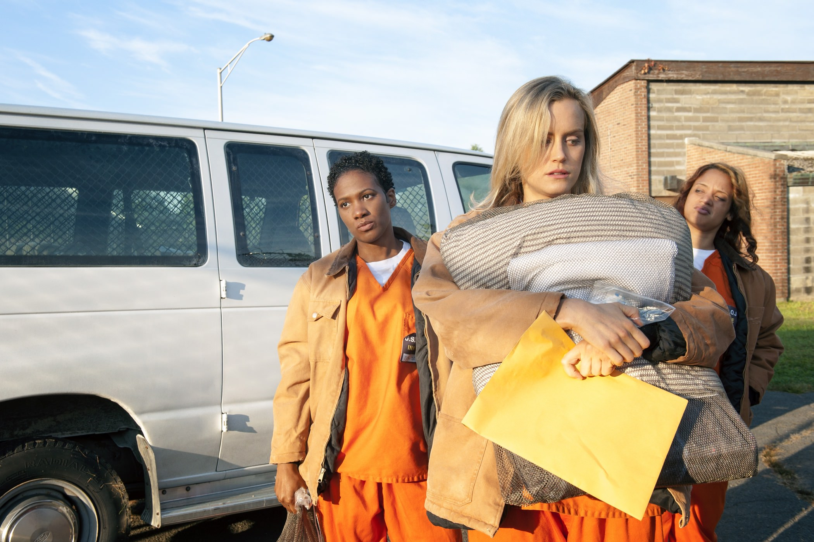
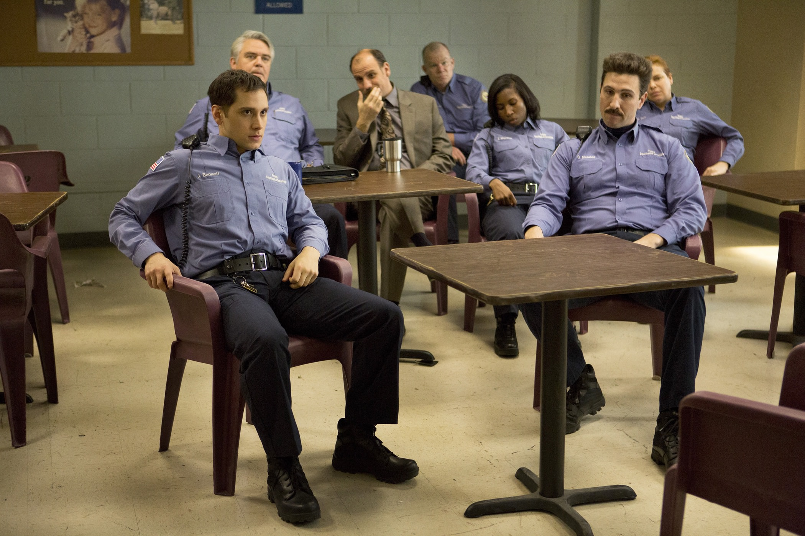
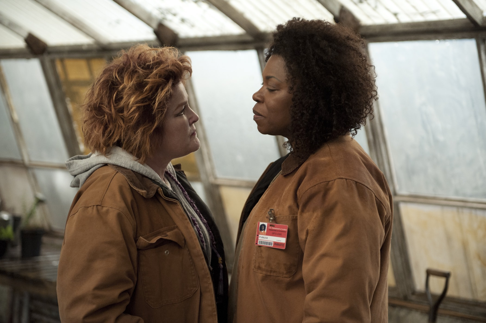

+++
type = "post"
titre = "<em>Orange is the New Black</em>, Jenji Kohan (Netflix)"
title = "Orange is the New Black, Jenji Kohan (Netflix)"
url = "/orange-is-the-new-black-kohan-netflix"
date = "2014-07-06T14:58:47"
Lastmod = "2014-07-06T15:03:07"
cover = "orange-is-the-new-black-kohan-netflix.jpg"
categorie = [ "À voir" ]
tag = [ "Adaptation littéraire", "Amour", "Autobiographie", "Drame", "Homosexualité", "Prison", "Série" ]
createur = [ "Jenji Kohan", "Netflix" ]
acteur = [ "Danielle Brooks", "Jason Biggs", "Kate Mulgrew", "Laura Prepon", "Michael J. Harney", "Natasha Lyonne", "Taryn Manning", "Taylor Schilling", "Uzo Aduba" ]
annee = [ "2013" ]
weight = 2013
pays = [ "États-Unis" ]

+++

Avec <a href="http://voiretmanger.fr/weeds-kohan-showtime/"><em>Weeds</em></a>, Jenji Kohan décrivait le quotidien difficile d’une mère au foyer tout à fait banale qui se mettait à vendre de la drogue pour survivre suite à la mort de son mari. Quelques années après, la scénariste s’amuse à nouveau à mettre une femme dans une situation impossible : dans <em>Orange is the New Black</em>, c’est une WASP bien sous tout rapport qui se retrouve pendant un an dans une prison pour une erreur de jeunesse. Dans les deux cas, on retrouve un goût prononcé pour les confrontations improbables. Après la banlieue chic et la mafia liée à la drogue, Jenji Kohan fait affronter la New-Yorkaise chic et branchée à la prison pleine de délinquantes d’horizons divers, mais toujours à l’opposée de ceux de l’héroïne. En deux saisons, Netflix pose les bases d’une excellente série qui sait surprendre, malgré son postulat de départ très mince. À voir !

Quand elle franchit les grilles de Litchfield, Piper Chapman n’est pas vraiment dans son élément. Et pour cause, cette prison fédérale accueille rarement la bonne société new-yorkaise entre ses murs et la majorité des prisonnières provient des classes populaires. D’ailleurs, la majorité d’entre elles sont d’origine étrangère : il y a d’un côté les Afro-Africaines, les Hispaniques de l’autre et les Caucasiennes entre les deux, qu’elles soient originaires de Russie ou d’un autre pays européen, ou bien Américaines. Dès les premiers épisodes, <em>Orange is the New Black</em> tire de cette diversité sa richesse, même si la première saison se concentre essentiellement sur Piper et sur ses relations avec Larry, son fiancé, et avec Alex, son ancienne copine. C’est à cause d’elle qu’elle s’est retrouvée en prison : à la tête d’un trafic de drogue, elle a entraîné Piper dans son mouvement et c’est elle aussi qui l’a dénoncée lors de son procès. Les premiers épisodes sont ainsi consacrés à la haine de Piper contre celle qu’elle a aimée, mais la prison change ses occupants et la série montre bien qu’elle se rapproche irrémédiablement d’Alex. Son amour pour Larry, amour qu’elle ne peut plus vivre qu’à distance désormais, va-t-il survivre ? C’est l’un des enjeux d’<em>Orange is the New Black</em> : Jenji Kohan étudie à nouveau les effets d’un milieu étranger sur une femme et cette fois encore, les transformations sont rapides. Passé le temps de la défiance et de la peur, Piper s’habitue à la vie en prison, en apprend les codes et s’éloigne toujours plus du monde extérieur et donc de son fiancé. Difficile de comprendre ce quotidien qu’il ne peut pas vivre, tandis que le microcosme de la prison change le point de vue et fait de l’incident le plus anodin à l’extérieur une crise majeure à l’intérieur.

Cette plongée saisissante au cœur d’une prison est sans conteste la plus grande réussite de la série. Ce n’est sans doute pas pour rien que le scénario s’éloigne assez vite de Piper Chapman pour élargir ses horizons. La deuxième saison d’<em>Orange is the New Black</em> s’attache ainsi beaucoup plus aux autres prisonnières, à la fois à leurs histoires personnelles, aux raisons qui les ont amenées en prison, mais aussi à leurs conflits. L’environnement carcéral fermé reproduit le fonctionnement en ghetto de la société américaine et chaque origine ethnique reste de son côté, dans sa « famille ». La lutte est permanente entre ces groupes pour savoir qui contrôle les cuisines — poste clé essentiel —, qui bénéficie de telle ou telle salle de bain et qui contrôle les trafics internes. Ces luttes sont présentes dès les premiers épisodes, mais Jenji Kohan leur laisse plus de place dans la deuxième saison, et c’est très bien ainsi. L’histoire personnelle de Piper Chapman n’est pas la plus intéressante et la série gagne à ouvrir ses horizons sur d’autres problèmes. On apprécie ainsi de découvrir des personnages hauts en couleur, souvent interprétés de très belle manière par les actrices choisies. Dans le lot, plus que Taylor Schilling qui compose une Piper convaincre, on remarque surtout Kate Mulgrew qui incarne Red, une Russe qui cache sa faiblesse par une force démonstrative, mais surtout Uzo Aduba, époustouflante dans le rôle de la folle Crazy Eyes. Pour contrôler la prison, il y a aussi des gardes et une administration et les intrigues ne manquent pas de les impliquer aussi. Entre ce gardien qui tombe amoureux d’une prisonnière et la directrice qui détourne les maigres fonds de l’établissement à des fins personnelles, il y a largement de quoi alimenter les deux premières saisons, et les suivantes.

On pourrait avoir du mal à croire au quotidien décrit dans <em>Orange is the New Black</em>, mais Jenji Kohan n’a pourtant rien inventé. La série est adaptée d’une autobiographie et même si on imagine que la scénariste a brodé un peu, elle s’est inspirée de faits réels. Le quotidien de ces prisonnières est souvent difficile, mais la série contient aussi son lot de scènes cocasses, voire drôles. Le scénario exploite toutes les pistes possibles pour éviter l’ennui et les deux premières saisons sont à cet égard très réussies. À la fin de la deuxième, il reste encore huit mois à Piper Chapman : largement de quoi faire quelques épisodes supplémentaires, même si naturellement, la question de l’ennui risque de se poser à un moment ou à un autre. En attendant de savoir si <em>Orange is the New Black</em> finira par lasser, on peut regarder sans crainte les deux premières saisons qui constituent, déjà, une excellente série !

