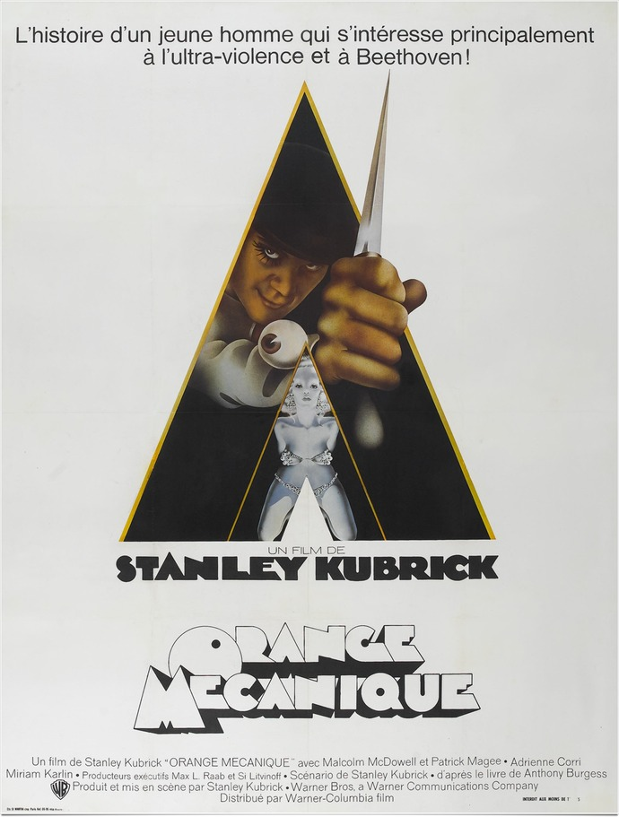
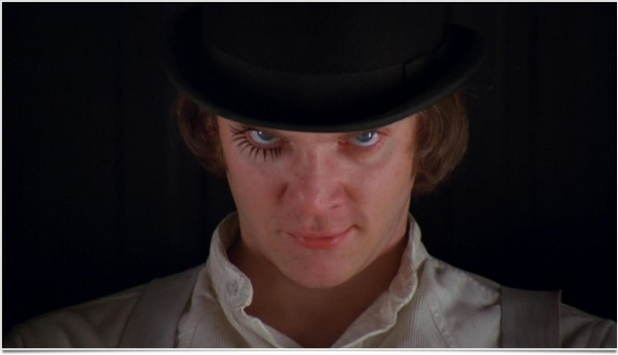
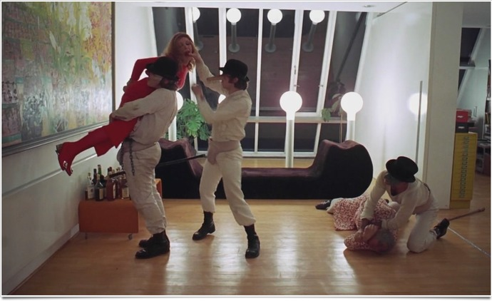

+++
titre = "<em>Orange mécanique</em>, Stanley Kubrick"
title = "Orange mécanique, Stanley Kubrick"
url = "/orange-mecanique-kubrick"
date = "2011-06-05T01:01:43"
Lastmod = "2013-09-27T09:20:16"
cover = "orange-mecanique-kubrick.jpg"
categorie = [ "À voir" ]
tag = [ "Humour", "Politique", "Sexe", "Société", "Violence" ]
createur = [ "Stanley Kubrick" ]
acteur = [ "Malcolm McDowell", "Michael Bates", "Patrick Magee", "Warren Clarke" ]
annee = [ "1971" ]
weight = 1971
original = "A Clockwork Orange"

+++

Trois ans après <em>2001, Odyssée de l&rsquo;espace</em>, le neuvième long-métrage de Stanley Kubrick sort dans les salles. <em>Orange mécanique</em> reste l&rsquo;un de ses films les plus connus, un des plus controversés aussi. Sa description d&rsquo;une société futuriste violente a pu en inspirer quelques-uns, raison de l&rsquo;interdiction du film en Grande-Bretagne pendant une trentaine d&rsquo;années, mais <em>Orange mécanique</em> est d&rsquo;abord une critique extrêmement efficace, car glaçante, de la société contemporaine. Si le film a visuellement un peu vieilli, il reste indéniablement un film extrêmement fort grâce, notamment, à son climat malsain et terrifiant.

<em>Orange mécanique</em> se déroule au XXIe siècle. On suit les pas d&rsquo;Axel, jeune chef de bande qui sème la terreur avec ses trois &laquo;&nbsp;drougs&nbsp;&raquo;. Leur occupation favorite, sortir dans les rues sous l&rsquo;effet d&rsquo;une boisson qui les mène à l&rsquo;ultraviolence : les quatre jeunes hommes tapent alors sur quiconque tombe sur leur chemin, que ce soit un ivrogne dans la rue, une bande ennemie ou même un riche couple dans une maison isolée. Quand ils le peuvent, ils n&rsquo;hésitent pas non plus à violer une femme ou deux. Cette violence extrême ne semble réprimée par rien, ni les parents qui sont effacés et qui ont peur de ces enfants au point d&rsquo;être ridicules, ni la police qui semble d&rsquo;une inefficacité légendaire. Alex est le maître incontesté de cette bande, jusqu&rsquo;au jour où les trois autres en ont assez et décident de prendre le pouvoir. Un soir, lors d&rsquo;un vol habituel chez une femme seule, la police arrive et Alex est emprisonné pour meurtre. Il doit purger une peine de 14 ans de prison et quand il entend parler d&rsquo;un nouveau traitement qui doit lui permettre de sortir en deux semaines, guéri et libre, il n&rsquo;hésite pas une seconde et se fait porter volontaire.

Dans <em>Orange mécanique</em>, les parents craignent leurs enfants et les gangs s&rsquo;attaquent impunément aux personnes âgées ou aux adultes, toujours plus faibles. Ils sont arrogants, sûrs d&rsquo;eux et extrêmement violents, mais cette maturité n&rsquo;est qu&rsquo;apparente. Alex en particulier l&rsquo;utilise à sa guise, faisant les yeux doux quand il en a besoin, manipulant ses interlocuteurs à l&rsquo;envie… mais aussi les spectateurs puisque le film reprend le principe du narrateur. C&rsquo;est Alex qui raconte son histoire, de son point de vue donc, si bien que le spectateur comprend qu&rsquo;il joue un rôle, qu&rsquo;il se comporte comme on attend de lui qu&rsquo;il se comporte, mais qu&rsquo;en son for intérieur, il ne change pas. <em>Orange mécanique</em> est traversé par de nombreuses questions qui vont de la philosophie à la psychiatrie. Le traitement suivi par Alex consiste à le dégoûter physiquement de la violence comme du sexe. Dès qu&rsquo;il touche une femme, dès qu&rsquo;il veut frapper quelqu&rsquo;un, il se met à avoir une nausée terrible qui le bloque immédiatement et l&rsquo;empêche d&rsquo;agir. L&rsquo;idée est simple, associer des images violentes ou sexuelles à un dégoût profond et ainsi créer des associations d&rsquo;idées dans le subconscient d&rsquo;Alex. Utiliser ce dernier comme narrateur de l&rsquo;histoire est dès lors un principe qui prouve brillamment l&rsquo;échec de la thérapie et on comprend très bien le mot de la fin, quand le narrateur lui-même dit avoir été guéri. Une question fondamentale est posée dans le film : un homme qui n&rsquo;a pas le choix est-il encore vraiment un homme ? La réponse ne fait guère de doute : même si le choix est celui de la violence, il reste meilleur que l&rsquo;absence totale de choix. Rappelons au passage que la naissance de l&rsquo;homme dans <em>2001, Odyssée de l&rsquo;espace</em> se fait avec la découverte de l&rsquo;outil, mais aussi de la violence qui l&rsquo;accompagne. Le tournant des années 1970 est ainsi l&rsquo;occasion, pour Stanley Kubrick, de poser des questions finalement assez proches en deux films pourtant très différents.

Le futur d&rsquo;<em>Orange mécanique</em> ne ressemble en rien à celui de <em>2001, Odyssée de l&rsquo;espace</em>, c&rsquo;est le moins que l&rsquo;on puisse dire. Stanley Kubrick montre un univers sombre où la jeunesse a pris le dessus et impose une violence extrême et permanente. <em>Orange mécanique</em> se rapproche d&rsquo;une dystopie, indéniablement, et on note quelques points communs avec d&rsquo;autres œuvres du genre, comme avec le <em>1984</em> de George Orwell. Les deux récits sont marqués par une société coercitive où l&rsquo;individualité est poussée à entrer dans le rang, de gré ou de force. Chez Orwell comme chez Kubrick, on trouve un nouveau langage inventé : dans <em>Orange mécanique</em>, il s&rsquo;agit en fait du <a href="http://fr.wikipedia.org/wiki/Nadsat_(lexique)">Nadsat</a> inventé par l&rsquo;auteur du roman d&rsquo;Anthony Burgess dont est tiré le film. Dystopie, certes, mais si Stanley Kubrick crée des décors qui se veulent clairement futuristes, en particulier dans les maisons et appartements, mais aussi pour la voiture qui apparaît à un moment, il oublie aussi la plupart du temps cet aspect futuriste pour ancrer son film dans une réalité qui rappelle très clairement la société du début des années 1970. C&rsquo;est sans doute pour cette raison qu&rsquo;<em>Orange mécanique</em> a tant frappé les esprits : si le film se veut futuriste, personne ne s&rsquo;y est trompé, Stanley Kubrick proposait en fait une critique aussi dure qu&rsquo;efficace de sa propre société. C&rsquo;est son époque qu&rsquo;il condamne en la filmant violente, ce sont les prisons de son temps qu&rsquo;il caricature, ce sont les politiciens de son époque qu&rsquo;il ridiculise par ce personnage de ministre prêt à tout, y compris nourrir un Alex trop heureux de prendre sa revanche, pour obtenir quelques clichés dans la presse. La science-fiction est souvent l&rsquo;occasion de critiquer une époque, mais Stanley Kubrick ne fait même pas vraiment d&rsquo;effort en filmant les scènes de prison dans une prison réelle et contemporaine. Le message est clair et l&rsquo;ambiance poisseuse qui caractérise le film de bout en bout a, dès lors, de quoi glacer le sang.

Si l&rsquo;on devait regrouper les meilleures images dans l&rsquo;œuvre de Stanley Kubrick, <em>Orange mécanique</em> serait cité à de nombreuses reprises. Le cinéaste compose de nombreux plans qui font date, souvent grâce à des décors audacieux qui n&rsquo;ont pas manqué de faire polémique à l&rsquo;époque. Il y a bien sûr le bar qui ouvre le film où les tables sont des femmes nues, il y a cette statue en forme d&rsquo;énorme phallus, mais aussi l&rsquo;attaque du vieil ivrogne, modèle de mise en scène sous le pont avec la lumière rasante. On pourrait ainsi énumérer encore de nombreux plans qui rappellent tous, si besoin était, le talent du réalisateur. Avec <em>Orange mécanique</em>, plus que dans tous ses autres films peut-être, Stanley Kubrick expérimente. Il ne s&rsquo;agit pas tant d&rsquo;inventer de nouvelles techniques, comme ce sera le cas ensuite avec <em><a href="http://voiretmanger.fr/2011/05/22/barry-lyndon-kubrick/">Barry Lyndon</a></em> ou <em><a href="http://voiretmanger.fr/2011/04/17/shining-kubrick/">Shining</a></em>, mais plutôt d&rsquo;en détourner certaines. À titre d&rsquo;exemple, signalons la fameuse scène de sexe en accéléré : l&rsquo;effet apporte à cette scène une charge comique inattendue. <em>Orange mécanique</em> est un film en fait assez drôle, quoique d&rsquo;un humour très noir, et la musique joue un rôle central dans cet aspect comique. On le sait, la musique est essentielle dans toute l&rsquo;œuvre de Kubrick, mais elle a un statut très particulier dans <em>Orange mécanique</em> : c&rsquo;est le seul film où non seulement Kubrick utilise une musique originale composée pour le film, mais en plus une musique contemporaine qui reprend des morceaux de classique au synthétiseur. La <em>Neuvième Symphonie</em> de Beethoven est bien sûr au programme, mais ce n&rsquo;est pas la seule relecture opérée par Wendy Carlos et sa version de Purcell est extrêmement réussie, notamment.

Coup sur coup, Stanley Kubrick réalise deux films de science-fiction, au moins en apparence. Si <em>2001, Odyssée de l&rsquo;espace</em> appartient sans conteste au domaine de l&rsquo;anticipation, c&rsquo;est beaucoup moins évident pour <em>Orange mécanique</em>. Le neuvième film du réalisateur a beau être extrêmement moderne par certains décors, c&rsquo;est une société tout à fait contemporaine de sa sortie qui est critiquée par le film. C&rsquo;est pourquoi le film a autant dérangé, non pas tant pour sa violence visuelle qui est, certes, très présente (surtout selon les standards de 1971), mais qui n&rsquo;est pas ce qui est le plus choquant. Si violence il y a dans <em>Orange mécanique</em>, elle est beaucoup plus subtile et liée à une société qui essaie de faire plier l&rsquo;individu pour le faire rentrer à tout prix dans le rang. <em>Orange mécanique</em> est d&rsquo;abord un film politique, peut-être le plus politique de Stanley Kubrick.

<h3>Vous voulez m&rsquo;aider ?<a href="#footnote_0_4880" id="identifier_0_4880" class="footnote-link footnote-identifier-link" title="&Agrave; propos de la publicit&eacute;&hellip;">1</a></h3>
<ul>
<li><a href="http://www.amazon.fr/gp/product/B000XIABSA/ref=as_li_ss_tl?ie=UTF8&#038;tag=leblogdenic07-21&#038;linkCode=as2&#038;camp=1642&#038;creative=19458&#038;creativeASIN=B000XIABSA">Acheter le film en Blu-Ray sur Amazon</a></li>
<li><a href="http://www.amazon.fr/gp/product/B00005NDRV/ref=as_li_ss_tl?ie=UTF8&#038;tag=leblogdenic07-21&#038;linkCode=as2&#038;camp=1642&#038;creative=19458&#038;creativeASIN=B00005NDRV">Acheter le film en DVD sur Amazon</a></li>
<li><a href="https://itunes.apple.com/fr/movie/orange-mecanique/id389746457">Acheter ou louer le film sur l&rsquo;iTunes Store</a></li>
</ul>

<ol class="footnotes"><li id="footnote_0_4880" class="footnote"><a href="http://voiretmanger.fr/a-propos/publicite/">À propos de la publicité…</a> [<a href="#identifier_0_4880" class="footnote-link footnote-back-link">&#8617;</a>]</li></ol>
