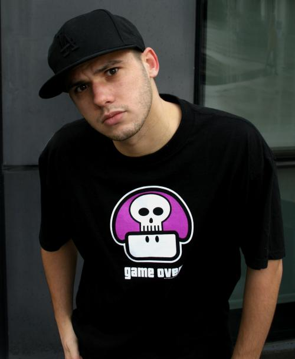
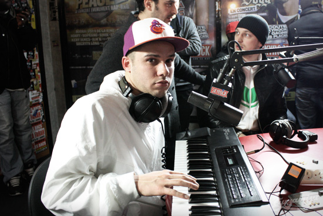
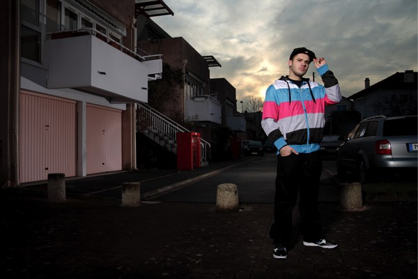
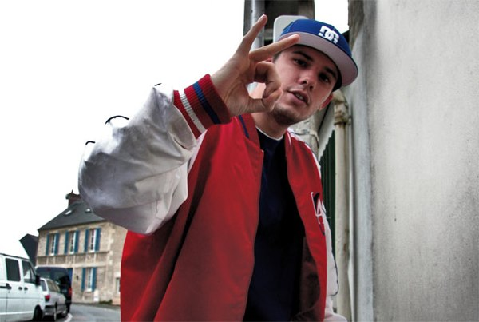

+++
type = "post"
titre = "Orelsan au Bataclan (13 mai 2009)"
title = "Orelsan au Bataclan (13 mai 2009)"
url = "/orelsan-bataclan-2009"
date = "2009-05-14T01:11:17"
Lastmod = "2010-01-31T16:57:13"
cover = "orelsan-concert.jpg"
categorie = [ "À voir… en live" ]
tag = [ "Bataclan", "Concert", "Polémique", "Politique", "Rap", "Société" ]
createur = [ "Orelsan" ]
annee = [ "2009" ]
weight = 2009
pays = [ "France" ]

+++

Je poursuis ma découverte du rap, non pas avec un nouvel artiste puisque <a href="http://voiretmanger.fr/2009/03/29/orelsan/">je connais Orelsan et son album</a> depuis quelque temps déjà, mais avec un nouveau pilier de cette musique : le concert. Eh oui, la musique ne prend vraiment tout son intérêt qu&rsquo;en direct, et je ne vois pas pourquoi il n&rsquo;en serait pas de même pour le rap, genre par ailleurs né dans la rue et pour qui le show est important. Après quelques hésitations, j&rsquo;ai donc pris une place (pas chère) pour le concert d&rsquo;Orelsan qui avait lieu ce soir au Bataclan.

<h2>La polémique</h2>

Alors avant d&rsquo;en venir au concert proprement dit, un mot de la polémique que <a href="http://voiretmanger.fr/2009/03/29/orelsan/">j&rsquo;évoquais</a> en même temps que l&rsquo;album. J&rsquo;aurais tant aimé ne plus en parler, mais manifestement la polémique n&rsquo;est pas terminée. Le Bataclan était facilement repérable aujourd&rsquo;hui, il suffisait de repérer les banderoles et les manifestants féministes. Venus en nombre (je dirais une centaine), ils scandaient des slogans d&rsquo;une finesse rare, du type &laquo;&nbsp;féminisme = racisme&nbsp;&raquo;. Évidemment, la cible de leurs attaques était les deux chansons incriminées que l&rsquo;on peut trouver sur YouTube depuis au moins deux ans, pour rappel, enfin mieux vaut tard que jamais comme on dit.

Amusé et de bonne humeur, je décidai d&rsquo;accepter de discuter avec deux mamies qui me tendaient un tract expliquant que tant de femmes meurent chaque année sous les coups de leur compagnon et autres statistiques et qui, à grand renfort de citations, vilipendait le rappeur caennais. Ces deux féministes ne connaissaient manifestement même pas l&rsquo;existence de YouTube, n&rsquo;ont jamais écouté l&rsquo;album d&rsquo;Orelsan, ni aucun album de rap à mon avis, ni d&rsquo;ailleurs aucun album récent tout court. Ah si, l&rsquo;une d&rsquo;entre elles a un petit-fils qui &laquo;&nbsp;fait du rap&nbsp;&raquo;, me dit-elle sur le ton de la confidence, l&rsquo;air de dire que tout se perd parce que si même son petit fils se met au rap&#8230;

Ne connaissant rien de tout cela, on comprend que leurs arguments soient limités. Ils se résument en fait très simple : elles avaient le texte de &laquo;&nbsp;Sale pute&nbsp;&raquo; sous les yeux et disaient, Voyez, il dit ceci ou cela. J&rsquo;ai bien essayé de suggérer que s&rsquo;il y avait une vidéo en accompagnement, cela valait la peine, éventuellement, de la regarder ; que peut-être c&rsquo;était un problème générationnel ; et surtout, je leur ai demandé si elles savaient pourquoi une vidéo vieille de deux ans est sortie par des politiques&#8230; mais rien n&rsquo;y fit. Une jeune est venue se joindre à nous, m&rsquo;expliquant que l&rsquo;album était de la m&#8230; (et que le seul vrai RAP était NTM&#8230;), qu&rsquo;Orelsan est une anomalie de l&rsquo;existence, ce genre de choses (je brode un peu, j&rsquo;avoue ne pas me souvenir de la discussion précise).

Bien. Au bout d&rsquo;un moment, l&rsquo;heure avançant, je suis entré parce que la polémique avec des gens qui ne savent même pas de quoi ils parlent, ça n&rsquo;est même plus drôle. Aucun n&rsquo;a voulu accepter l&rsquo;évidence même. Alors, rappelons-la, haut et clair : <strong>bon sang, &laquo;&nbsp;Sale pute&nbsp;&raquo; est un texte i-ro-ni-que</strong> !! Ça n&rsquo;est <strong><em>pas</em></strong> du premier degré, il ne faut <strong><em>pas</em></strong> extraire des paroles de leur contexte, ou alors ça n&rsquo;a plus aucun sens. Tenez, amis féministes<a href="#footnote_0_1523" id="identifier_0_1523" class="footnote-link footnote-identifier-link" title="S&eacute;rieusement, je ne voudrais surtout pas que l&rsquo;on croie que je m&rsquo;attaque aux f&eacute;ministes&hellip; Mais j&rsquo;ose esp&eacute;rer qu&rsquo;il y a aussi des f&eacute;ministes s&eacute;rieux, capables de r&eacute;fl&eacute;chir par eux-m&ecirc;mes plut&ocirc;t que de gober une machination politique sans discuter ! D&rsquo;ailleurs, je viens de d&eacute;couvrir cette vid&eacute;o : Bayrou remonte subitement dans mon estime (ce qui, il faut bien le dire, n&rsquo;&eacute;tait pas difficile).">1</a>, faites plaisir à tous ceux qui défendent Orelsan, sachez de quoi vous parlez. Vous ne connaissez pas YouTube ? Vous n&rsquo;avez pas le temps de trouver la vidéo ? Qu&rsquo;à cela ne tienne, la voici, pour vous, ici même :

<object classid="clsid:d27cdb6e-ae6d-11cf-96b8-444553540000" width="480" height="385" codebase="http://download.macromedia.com/pub/shockwave/cabs/flash/swflash.cab#version=6,0,40,0"><param name="allowFullScreen" value="true" /><param name="allowscriptaccess" value="always" /><param name="src" value="http://www.youtube.com/v/BLC24EqcNTM&amp;hl=fr&amp;fs=1&amp;hd=1" /><param name="allowfullscreen" value="true" /><embed type="application/x-shockwave-flash" width="480" height="385" src="http://www.youtube.com/v/BLC24EqcNTM&amp;hl=fr&amp;fs=1&amp;hd=1" allowscriptaccess="always" allowfullscreen="true"></embed></object>

Si vous ne voyez pas l&rsquo;humour&#8230; bon, disons l&rsquo;ironie (chacun son humour hein, vous pouvez préférer Bigard, je le respecte parfaitement) dans ce clip, je ne peux plus rien faire pour vous. Allez un indice quand même : 1) Orelsan aime jouer des rôles, ici c&rsquo;est le français très moyen bourré, qui dit qu&rsquo;il parle pour lui ? ; 2) connaître un peu le rap permet de reconnaître des codes, des clichés qui sont ici repris et, tenez-vous bien, tournés en ridicule. Oui, le gars est macho/misogyne, mais est-ce que vous avez pensé une seule seconde que cela pouvait être une dénonciation ironique ? On appelle cela de l&rsquo;humour noir.

Il est vrai que l&rsquo;idée même qu&rsquo;un rappeur puisse connaître autre chose que le premier degré a peut-être de quoi surprendre. Quand j&rsquo;ai évoqué l&rsquo;idée à l&rsquo;une de mes mamies, elle m&rsquo;a regardé d&rsquo;un air qui en disait long : attendez, c&rsquo;est un rappeur, restons sérieux. L&rsquo;une des deux était un peu plus intelligente, ou plutôt plus sincère, en notant que les jeunes qu&rsquo;elle croisait étaient &laquo;&nbsp;fort sympathiques&nbsp;&raquo;. Dingue ça hein, tous ceux qui écoutent du rap ne vivent pas dans des cités où ils passent leur temps à former de dangereuses bandes !

Bon, je ne voulais pas en parler, et voilà déjà un article complet sans évoquer l&rsquo;album. Pour moi, le sujet est désormais clos, entrons si vous le voulez bien dans la salle.

<h2>Le concert</h2>

Comme je le disais en préambule, c&rsquo;était mon premier concert de rap. Alors forcément, je suis passé en mode &laquo;&nbsp;sociologue en herbe&nbsp;&raquo; devant cet échantillon de djeun&rsquo;s qui, s&rsquo;ils ne venaient pas de banlieue, n&rsquo;auraient pas choqué dans un reportage de Pernault sur les jeunes de nos jours qui font rien que se rassembler en bandes pour embêter Nico. La moyenne d&rsquo;âge ne dépassait pas 25 ans, pour un public assez masculin, mais pas exclusivement. Au milieu de jeunes avec casquette vissée sur la tête, pantalons très larges et parfois même chaîne en métal massif autour du coup, on trouvait quelques personnes — dont moi — qui semblaient débarquer d&rsquo;une autre planète. J&rsquo;ai même repéré un jeune homme avec encore la cravate, c&rsquo;est dire. Le public restait massivement conforme à l&rsquo;image que l&rsquo;on peut se faire du rappeur, c&rsquo;était assez amusant à observer.

Oui parce que j&rsquo;ai eu le temps, d&rsquo;observer. Le concert annoncé à 19h30 a commencé avec une très grosse demi-heure de retard, ce qui n&rsquo;est pas courant à Paris. Je ne sais pas si c&rsquo;est à cause des manifestations à l&rsquo;extérieur (j&rsquo;ai comme un gros doute), ou si c&rsquo;est une règle dans le rap&#8230; Peu importe, le concert commence finalement avec une première partie et un groupe (dont j&rsquo;ai honteusement oublié le nom, je savais que j&rsquo;aurais dû le noter) que je rangerai dans la catégorie du rap pur et dur, un peu à l&rsquo;ancienne. Il y a au moins 5 ou 6 rappeurs, plus deux DJ. Que dire&#8230; ça n&rsquo;est pas trop mon style de musique. Il y avait bien des paroles, je n&rsquo;en ai compris aucune. Ça n&rsquo;est pas grave en soi, sauf que la musique étant quasiment absente (une boite à rythmes essentiellement), on n&rsquo;entend plus finalement que des vociférations. J&rsquo;ai trouvé ça rigolo cinq minutes, mais bon, j&rsquo;étais content qu&rsquo;ils s&rsquo;en aillent en fin de première partie.

Il est temps d&rsquo;aborder, avant le concert d&rsquo;Orelsan proprement dit, LE problème du concert de ce soir, à savoir le son. Des concerts mal sonorisés, avec un élément trop en avant, un autre oublié, avec de la saturation, de la distorsion&#8230; bref un son pourri, j&rsquo;en ai connu plein. Les festivals sont particulièrement spécialisés dans le domaine, ce qui est logique du fait de l&rsquo;alternance des groupes. Mais jamais jusque-là j&rsquo;avais entendu un son aussi pourri et aussi fort. Manifestement, la recette pour sonoriser un concert de rap est simple : tu pousses tous les curseurs à fond, sauf le médium que tu vires complètement. Résultat, il y a plein de basses, il y a des aigus criards (jamais j&rsquo;aurais pensé que c&rsquo;était possible), mais rien au milieu, et ça manque. Par ailleurs, la section sample (boite à rythmes et autre) est poussée aussi fort que les micros. Disons-le, un rappeur n&rsquo;est pas un très bon chanteur, au sens traditionnel du terme : il a tendance à gueuler dans son micro. Gueuler dans un micro poussé à fond, cela donne une saturation, à tel point que l&rsquo;on entendait à peine des voix, mais bien plus des cris que l&rsquo;on aurait dit animaux.

Heureusement, un effort a été fait pour Orelsan. Mais après une interview du rappeur où il disait régler avec précision chaque instrument, je dois m&rsquo;avouer déçu. Les boites à rythmes étaient constamment au maximum : je veux bien croire que ça soit utile sur certaines chansons, mais sur celles qui sont douces, non, c&rsquo;est horrible ! Et pour qu&rsquo;on entende le &laquo;&nbsp;<em>flow</em>&laquo;&nbsp;, les micros sont aussi à fond, d&rsquo;où une saturation très désagréable. Le pire, c&rsquo;est qu&rsquo;une guitare intervient à plusieurs reprises (oui oui, une vraie, avec des cordes et tout). Mais même la guitare est poussée à fond et sature comme c&rsquo;est pas permis.

 
<em>Crédit photo : <a href="http://blogs.lexpress.fr/judebox/2009/01/orelsan-lalenconnais.php">Judebox</a></em>

Ces choix sonores, ou plutôt, à mon avis, ces non-choix sonores sont vraiment dommages, car la musique d&rsquo;Orelsan perd toute subtilité et devient une sorte de machine à faire du bruit. Sur certaines chansons, on aimerait tant baisser les basses et les voix, et mettre en avant un sample, ou la guitare. C&rsquo;est une excellente idée, on a même eu droit à une sorte de reprise d&rsquo;AC/DC (il n&rsquo;y avait que le riff) mêlée à du rap, mais le son était si mauvais que la guitare est venue se fondre dans le bruit ambiant, sans ressortir. Dommage vraiment : j&rsquo;ai l&rsquo;impression que les rappeurs se sentent obligés de faire ça, mais je demande bien pourquoi.

Conséquence positive de cela, néanmoins, le disque ressort complètement métamorphosé d&rsquo;un passage sur scène. Ça, on ne peut pas reprocher au rappeur de nous sortir le disque sans modification : alors que je connais bien l&rsquo;album, il y a des morceaux que je n&rsquo;ai reconnus que par les paroles, un comble dans mon cas ! Il y a trois rappeurs sur scène, plus Skred aux platines, plus parfois un guitariste. La formule marche plutôt bien, nonobstant la qualité du son. Par ailleurs, ils jouent devant nous des sortes de mini-clip avec une mise en scène qui rappelle que les chansons d&rsquo;Orelsan, comme <a href="http://voiretmanger.fr/2009/01/24/the-streets-le-rap-a-langlaise/">celles de The Streets</a>, sont très scénarisées.

C&rsquo;est plutôt bien trouvé et surtout, cela ajoute au concert un naturel rare dans le rock je trouve. Vous en connaissez beaucoup des groupes qui font monter deux personnes sur scène pour&#8230; une partie de Street Fighter en direct ? On a un mélange de show à l&rsquo;américaine, et d&rsquo;improvisation entre potes, c&rsquo;est assez agréable et rafraîchissant.

<h2>L&rsquo;étude comportementale <a href="#footnote_1_1523" id="identifier_1_1523" class="footnote-link footnote-identifier-link" title="Un titre &agrave; ne pas forc&eacute;ment prendre pleinement au s&eacute;rieux, apr&egrave;s tout, il se fait tard&hellip;">2</a></h2>

Dans l&rsquo;ensemble, cette soirée ne fut pas vraiment une déception, même si j&rsquo;aurais tant aimé un meilleur son. Mais je ne regrette pas le déplacement, pour les mamies certes, mais aussi et surtout la confrontation rigolote avec un milieu que j&rsquo;ignore en large part, celui du rap. Et là, mes souvenirs de sociologie remontent à la surface&#8230;

J&rsquo;ai noté que la casquette reste un indémodable : placée dans toutes les directions selon un code qui m&rsquo;échappe, elle reste très présente, même si elle n&rsquo;est pas obligatoire. Le pantalon large est bien implanté, mais les grosses chaînes se font rares : effet de la crise, changement de mode&#8230; ? Le casque autour du cou, voire sur les oreilles (ce qui ne manque pas de sel quand on assiste à un concert) est très présent : pour certains, je me demande même s&rsquo;ils l&rsquo;enlèvent pour dormir. Ça doit être un prolongement naturel de leur corps.

Le concert de rap est régi par des règles fort différentes de celles d&rsquo;un concert de rock. Le plus frappant pour un habitué comme moi de la seconde catégorie, c&rsquo;est que l&rsquo;on n&rsquo;applaudit pas. Non, jamais, ni au début pour encourager la venue, ni pendant pour signifier son bonheur après une chanson, ni à la fin pour faire revenir l&rsquo;artiste. Non, on crie beaucoup, on agite son bras en l&rsquo;air, mais on n&rsquo;applaudit pas. Mine de rien, c&rsquo;est vachement étonnant, on a tellement l&rsquo;habitude d&rsquo;applaudir pendant un concert que cela fait tout drôle de n&rsquo;entendre personne le faire.

À propos de bras levé, cela reste un grand mystère pour moi. Pourquoi doit-on lever un seul bras (le droit en général) et l&rsquo;agiter de haut en bas comme si on voulait ventiler son voisin de devant (ce qui n&rsquo;eût pas été un luxe dans la chaleur étouffante du Bataclan, mais mon voisin de derrière manquait manifestement d&rsquo;efficacité) ? Vraiment, je ne vois pas. Mais j&rsquo;ai compris que c&rsquo;était la manifestation de la joie à l&rsquo;écoute, l&rsquo;équivalent donc des applaudissements, ou du secouage de tête qui reste d&rsquo;ailleurs une constante. Par contre, les bis sont étranges : dans le rock, c&rsquo;est souvent quelque chose de prévu, tout le monde fait comme si l&rsquo;artiste n&rsquo;avait pas prévenu de revenir et seulement sous le tonnerre d&rsquo;applaudissements, revenait. Dans le rap, on dirait que tout le monde sait qui revient, donc on demande à peine le retour, et manifestement tout le monde sait quand c&rsquo;est fini. Orelsan avait à peine quitté la scène que certains s&rsquo;étaient déjà tournés pour partir. Étonnant&#8230;

Constante par contre, le jeune amateur de rap fume, et pas seulement des cigarettes. J&rsquo;ai eu droit à un voisin fumeur d&rsquo;herbe pendant la mi-temps, ce qui fait que j&rsquo;ai aussi fumé à l&rsquo;insu de mon plein gré et en fin de concert, on ne voyait pas à 10 mètres.

Quelques autres éléments notés en vrac : les morceaux s&rsquo;enchaînent sans vraie pause, comme sur les albums, ce qui fait qu&rsquo;un concert de rap peut être très fatigant ; on sautille dans la fosse comme pour du rock, sauf qu&rsquo;on sautille le bras levé ; les rappeurs restent les maîtres en matière de gestion du corps et de l&rsquo;espace : il faut voir comment ils occupent la scène en se déplaçant constamment, et comment ils utilisent en permanence tout leur corps, c&rsquo;est assez fascinant.

Bon, tout ceci est déjà dix fois trop long, il est déjà dix fois trop tard tôt, donc je m&rsquo;arrête, en enfonçant le clou par rapport à la polémique : je suis ravi d&rsquo;avoir été là ce soir, ne serait-ce que pour signifier mon soutien. Il y aura toujours des gens bornés pour vouloir descendre des artistes comme Orelsan ; il y en aura toujours d&rsquo;autres pour le défendre. Je m&rsquo;inscris dans cette seconde catégorie, et je suis très très borné quand je le veux&#8230;

<strong>Ajouts du lendemain, quand il fait jour </strong>:

<ul>
<li>Un autre avis très intéressant sur le concert sur <a href="http://www.taistoietblogue.com/orelsan-au-bataclan">Tais-toi et blogue</a>&#8230;</li>
<li>&#8230; où l&rsquo;on trouve <a href="http://www.youtube.com/watch?v=QT4o3iIW9ds">une vidéo du combat de Street Fighter</a>. Il faut dire qu&rsquo;à peu près tout le monde filmait&#8230; impressionnant.</li>
<li>Enfin, Orelsan a donné des dizaines d&rsquo;interviews depuis la polémique. Je trouve <a href="http://clement.blogs.com/thomas_clment/2009/04/orlesan-sale-pute-perdu-d-avance.html">celle de Thomas Clément</a> intéressante. Je crois que le rappeur a eu du mal à répondre correctement à ses interviews, beaucoup de ses réponses s&rsquo;étant retournées contre lui. Il faut dire que ça ne doit pas être évident à gérer à 25 ans. Enfin bon, il rappelle que c&rsquo;est une chanson ironique, même pas une très bonne chanson, et qu&rsquo;il aimerait bien qu&rsquo;on parle un peu de son album.</li>
</ul>

<em>Crédit couverture : <a href="http://www.flickr.com/photos/hi-tekznologik/4149422837/">Simon Grossi @ Flickr</a></em>

<ol class="footnotes"><li id="footnote_0_1523" class="footnote">Sérieusement, je ne voudrais surtout pas que l&rsquo;on croie que je m&rsquo;attaque aux féministes&#8230; Mais j&rsquo;ose espérer qu&rsquo;il y a aussi des féministes sérieux, capables de réfléchir par eux-mêmes plutôt que de gober une machination politique sans discuter ! D&rsquo;ailleurs, je viens de découvrir <a href="http://www.eteignezvotreordinateur.com/bayrou-donne-son-avis-sur-orelsan/">cette vidéo</a> : Bayrou remonte subitement dans mon estime (ce qui, il faut bien le dire, n&rsquo;était pas difficile). [<a href="#identifier_0_1523" class="footnote-link footnote-back-link">&#8617;</a>]</li><li id="footnote_1_1523" class="footnote">Un titre à ne pas forcément prendre pleinement au sérieux, après tout, il se fait tard&#8230; [<a href="#identifier_1_1523" class="footnote-link footnote-back-link">&#8617;</a>]</li></ol>
