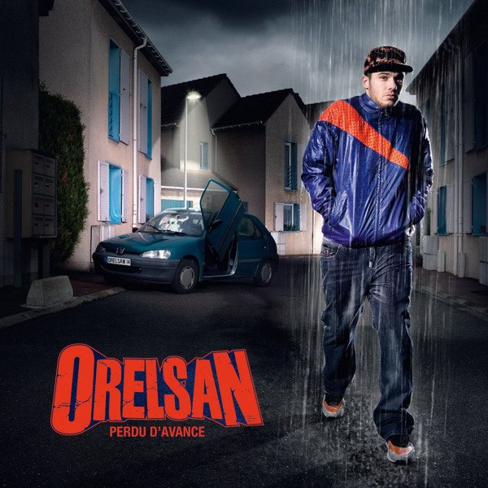

+++
type = "post"
titre = "Orelsan : en français, rap rime avec polémique"
title = "Orelsan : en français, rap rime avec polémique"
url = "/orelsan"
date = "2009-03-29T15:48:26"
Lastmod = "2012-05-07T16:12:18"
cover = "orelsan1.jpg"
categorie = [ "Musique" ]
tag = [ "Orelsan", "Polémique", "Politique", "Rap", "Société" ]
createur = [ "Orelsan" ]
annee = [ "2009" ]
weight = 2009
pays = [ "France" ]

+++

La polémique <a href="http://www.lesinrocks.com/musique/musique-article/article/orelsan-incite-t-il-a-la-violence/">fait rage</a>. Orelsan, jeune rappeur caennais de 26 ans, agite le petit monde policitico médiatique sur le thème, bien connu, de la violence des rappeurs. En cause, une chanson, &laquo;&nbsp;Sale Pute&nbsp;&raquo;, parue il y a quelques mois déjà, absente de son premier album, mais que tout le monde semble avoir découvert et qui vaut un flot de critiques contre ce jeune homme. Marie-George Buffet est ainsi montée au créneau, dénonçant une &laquo;&nbsp;incitation à la violence&nbsp;&raquo; contre les femmes ; pour cette raison, elle veut supprimer du Printemps de Bourge le concert de l&rsquo;artiste. Les organisateurs dudit festival ont répondu que le texte est en effet &laquo;&nbsp;inacceptable&nbsp;&raquo;, mais que la chanson incriminée ne sera pas jouée en concert et qu&rsquo;ils maintiennent l&rsquo;artiste.

Toute cette polémique a attiré mon attention sur ce rappeur. Par polémique, bien sûr, mais aussi parce que je considère que l&rsquo;on n&rsquo;a pas à juger les textes d&rsquo;un artiste, et d&rsquo;autant moins quand on essaie de supprimer une chanson. Grand bien m&rsquo;en a pris, cet Orelsan est vraiment un artiste à écouter !

Orelsan est le second rappeur français à entrer dans mes listes de lecture, après Hocus Pocus. J&rsquo;ai toujours beaucoup de mal avec la musique française et tout particulièrement quand il s&rsquo;agit du rap. Je ne sais pas bien pourquoi et de toute manière, Orelsan vient de me prouver que je pouvais apprécier du rap français.

La pochette et le titre de <em>Perdu d&rsquo;avance</em> annoncent clairement la couleur : on est ici en présence d&rsquo;une musique noire, plutôt négative de bout en bout, voire déprimante. J&rsquo;ai toujours pensé que l&rsquo;art atteignait des sommets dans le désespoir et cela se confirme avec cet album (sans forcément atteindre les sommets de l&rsquo;art en soi, s&rsquo;entend&#8230;). On compare souvent Orelsan à <a href="/2009/01/24/the-streets-le-rap-a-langlaise/">The Streets</a>, et ça n&rsquo;est pas idiot je trouve. Comme le rappeur britannique, Orelsan propose des chansons très réalistes, très crues, sur une génération et sur un milieu social, ici encore un milieu plutôt populaire, façon djeun&rsquo;s de banlieue caennaise. Comme Mike Skinner, chez son collègue d&rsquo;outre-Manche, Aurélien parle de son quotidien dans tout ce qu&rsquo;il a de plus banal et déprimant : les problèmes avec les petites copines qui se combinent avec des problèmes de paternité, l&rsquo;absence d&rsquo;avenir, les soirées ratées, la peur du futur&#8230; Comme sur tous les albums de The Streets, on trouve sur <em>Perdu d&rsquo;avance</em> une capacité assez impressionnante à raconter des histoires de manière très naturelle. Évidemment, le milieu social est assez proche et des thèmes traités se retrouvent.

Si les comparaisons sont toujours faciles et un peu futiles, on ne peut aussi s&rsquo;empêcher de penser à <a href="/2009/03/01/eminem-le-maitre/">Eminem</a>, pour l&rsquo;ambiance et le choix des thèmes, mais aussi pour un &laquo;&nbsp;flow&nbsp;&raquo;, certes différent du maître, mais très bien maîtrisé, très à l&rsquo;aise et qui passe bien, je ne pourrais dire mieux. Le plus flagrant point commun reste les textes et leur violence, notamment quand il s(agit des femmes. Il faudra bien évoquer cette fameuse polémique à propos de &laquo;&nbsp;Sale Pute&nbsp;&raquo;, chanson absente du dernier album, mais écoutable et visible sur <a href="http://www.youtube.com/watch?v=_U7V9oZPTWY">YouTube</a>. Je me contente de mettre le lien parce que cette chanson pourrait choquer, tout ça. Après l&rsquo;avoir regardée, ma réaction a été : oui, et ? Évidemment, cette chanson est violente, on entend un homme qui apprend qu&rsquo;il est trompé par sa copine et qui veut l&rsquo;amocher sérieusement et la tuer, tout en l&rsquo;insultant abondamment pendant les 3 minutes de la chanson. En gros, voilà.

Comment pourrait-on prendre au sérieux la chanson plus de trente secondes ? Déjà, n&rsquo;oublions jamais qu&rsquo;il s&rsquo;agit d&rsquo;un artiste qui peut très bien nous manipuler. En l&rsquo;occurrence, je pense qu&rsquo;il est sincère, comme sur tout l&rsquo;album d&rsquo;ailleurs. Mais on comprend bien qu&rsquo;il s&rsquo;agit d&rsquo;une chanson écrite après une rupture, par colère, et qu&rsquo;il ne s&rsquo;agit que de fantasmes. Jamais Orelsan ne ferait ça en vrai, cela paraît évident. Ça l&rsquo;est d&rsquo;autant plus que le clip le présente complètement saoul : comment le doute pourrait-il être permis ? &laquo;&nbsp;Sale Pute&nbsp;&raquo; est l&rsquo;exact équivalent de &laquo;&nbsp;Kim&nbsp;&raquo; d&rsquo;Eminem, une chanson également très violente (d&rsquo;ailleurs, bien plus violente) où le chanteur exprime sa volonté de tuer sa femme de manière extrêmement forte. Maintenant que j&rsquo;y pense, &laquo;&nbsp;Sale Pute&nbsp;&raquo; est plutôt une chanson sympathique à côté : rappelons qu&rsquo;Eminem termine sa version en hurlant &laquo;&nbsp;Bleed bitch, bleed !&nbsp;&raquo; (soit &laquo;&nbsp;Saigne, pute, saigne !&nbsp;&raquo;).

L&rsquo;affaire est d&rsquo;autant plus ridicule que la vidéo est en ligne depuis 2007 et que la chanson a été créée, si l&rsquo;on en croit le <a href="http://orelsan.skyrock.com/">blog</a> (attention, skyblog inside !) de l&rsquo;artiste, il y a plusieurs années (&laquo;&nbsp;genre 2/3 ans&nbsp;&raquo; écrit-il). Tout le monde semble juste de l&rsquo;avoir découvert, et tout cela sent mauvais la récupération politique, si vous voulez mon avis. Et puis j&rsquo;ai la désagréable impression que l&rsquo;on fait tant de bruit parce qu&rsquo;il s&rsquo;agit de rap : en aurait-il été de même si cela avait été du rock ? Je suis loin d&rsquo;en être sûr, malheureusement&#8230; En tout cas, c&rsquo;est un mauvais calcul de la part de ceux qui s&rsquo;insurgent : cette chanson est loin d&rsquo;être sa meilleure, il ne l&rsquo;aurait peut-être jamais jouée en concert et tout se serait bien passé. Là, du coup, tout le monde parle d&rsquo;Orelsan (tant mieux pour lui), mais aussi de la chanson qui cartonne sur Internet. À croire que les politiques n&rsquo;ont toujours pas compris le principe d&rsquo;un buzz Internet.

Bref, assez parlé de cette &laquo;&nbsp;affaire&nbsp;&raquo;, revenons au disque. Je ne vais pas systématiser les comparaisons avec d&rsquo;autres rappeurs (il y aurait encore beaucoup à dire concernant les liens avec Eminem, par exemple sur le rôle de père), je me contenterai de signaler l&rsquo;usage à plusieurs reprises de l&rsquo;Auto-Tune qui n&rsquo;a pas manqué de me rappeler <a href="/2008/12/25/808s-heartbreak-kanye-west-coup-de-coeur-du-moment/">Kanye West</a>, même si je sais bien qu&rsquo;il n&rsquo;en a pas l&rsquo;exclusivité.

Ce qui est assez fort avec <em>Perdu d&rsquo;avance</em>, c&rsquo;est la capacité de cet album à parler à tous à travers les exemples du quotidien d&rsquo;un seul. C&rsquo;est, je pense, ce qui explique le succès d&rsquo;Orelsan, notamment auprès des adolescents et jeunes adultes de sa génération.

Pour finir sur une note un peu plus positive, signalons que les textes d&rsquo;Orelsan peuvent aussi être drôles à condition, bien sûr, d&rsquo;être doté d&rsquo;un sens de l&rsquo;humour comprenant, au moins vaguement, l&rsquo;ironie et le second degré en général (comme en témoigne la présence récurrente du lapin blanc dans ses <a href="http://www.myspace.com/orelsan">clips</a>). L&rsquo;autodérision est aussi omniprésente, et elle est, comme toujours, bienvenue.

J&rsquo;en ai déjà beaucoup trop dit sur cet artiste, que je recommande à tous d&rsquo;écouter. Pour une fois que de la chanson française vaut le détour&#8230; 😉

<h3>Vous voulez m&rsquo;aider ?<a href="#footnote_0_1422" id="identifier_0_1422" class="footnote-link footnote-identifier-link" title="&Agrave; propos de la publicit&eacute;&hellip;">1</a></h3>
<ul>
<li><a href="http://www.amazon.fr/gp/product/B0056BMUYW/ref=as_li_ss_tl?ie=UTF8&tag=leblogdenic07-21&linkCode=as2&camp=1642&creative=19458&creativeASIN=B0056BMUYW">Acheter l&rsquo;album en CD en Blu-Ray sur Amazon</a> (<a href="http://www.amazon.fr/gp/product/B0026TG2PK/ref=as_li_ss_tl?ie=UTF8&tag=leblogdenic07-21&linkCode=as2&camp=1642&creative=19458&creativeASIN=B0026TG2PK" target="_blank">téléchargement MP3</a>)</li>
<li><a href="http://itunes.apple.com/fr/album/perdu-davance/id304100159">Acheter l&rsquo;album sur l&rsquo;iTunes Store</a></li>
</ul>

<ol class="footnotes"><li id="footnote_0_1422" class="footnote"><a href="/a-propos/publicite/">À propos de la publicité…</a> [<a href="#identifier_0_1422" class="footnote-link footnote-back-link">&#8617;</a>]</li></ol>
