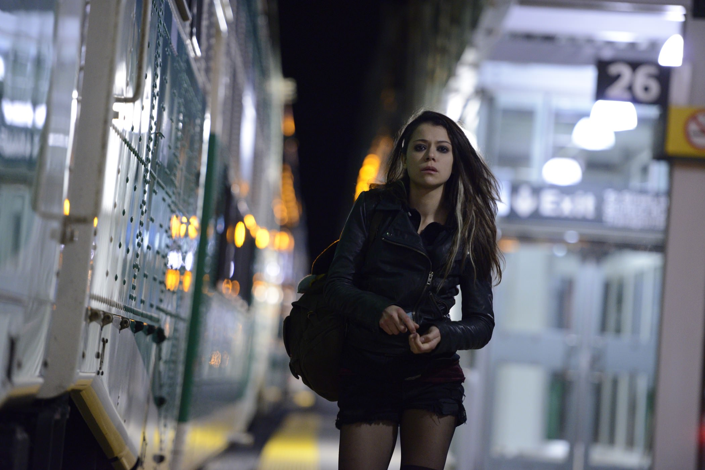
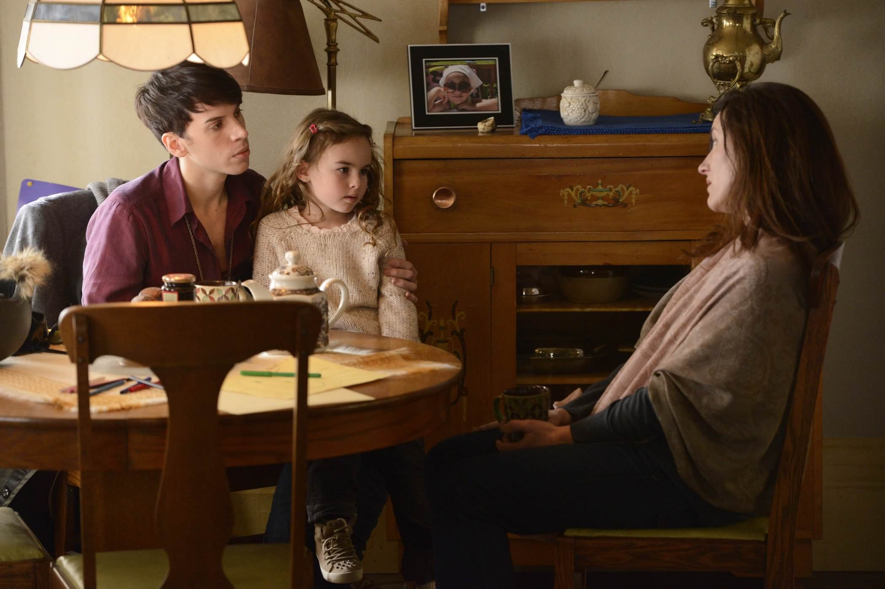
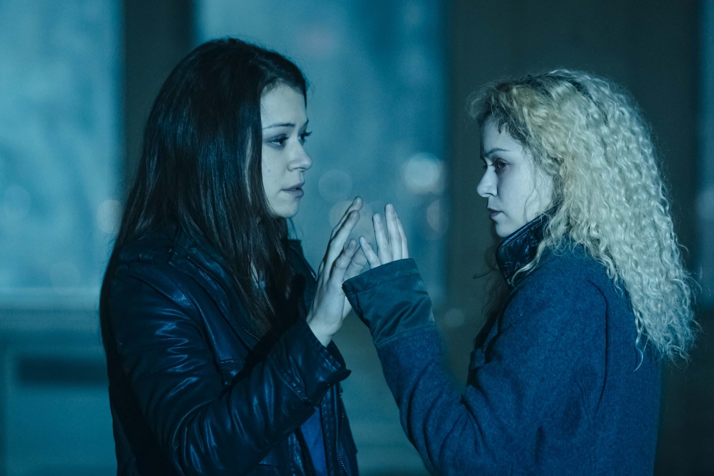

+++
titre = "<em>Orphan Black</em>, Graeme Manson et John Fawcett (Space)"
title = "Orphan Black, Graeme Manson et John Fawcett (Space)"
url = "/orphan-black-manson-fawcett-space"
date = "2014-12-04T23:13:21"
Lastmod = "2014-12-05T14:10:26"
cover = "orphan-black-manson-fawcett-space.jpg"
categorie = [ "À voir" ]
tag = [ "Action", "Argent", "Clonage", "Enquête", "Famille", "Fantastique", "Science-Fiction", "Série", "Société" ]
createur = [ "Graeme Manson", "John Fawcett", "Space" ]
acteur = [ "Dylan Bruce", "Evelyne Brochu", "Jordan Gavaris", "Kevin Hanchard", "Maria Doyle Kennedy", "Michael Mando", "Tatiana Maslany" ]
annee = [ "2013" ]
weight = 2013
pays = [ "Canada" ]

+++

<em>Orphan Black</em> fait partie de ces séries que l&rsquo;on commence et qui scotche du premier au dernier épisode. Basée sur une idée originale, elle est par ailleurs extrêmement rythmée, si bien qu&rsquo;il est difficile de ne pas être pris par son histoire. Ses deux premières saisons sont assez courtes — chacune ne s&rsquo;étend que sur dix épisodes de 45 minutes environ —, mais quelles saisons ! On a rarement fait aussi efficace et même si la série créée par Graeme Manson et John Fawcett pour une chaîne canadienne souffre de quelques défauts, on les oublie vite tant on est happé par cette histoire étonnante. Portée par une actrice aussi présente qu&rsquo;impressionnante, <em>Orphan Black</em> est incontestablement une série à suivre, surtout si vous aimez le fantastique façon <a href="http://voiretmanger.fr/fringe-abrams-kurtzman-orci-fox/" title="Fringe, J. J. Abrams, Alex Kurtzman et Roberto Orci (FOX)"><em>Fringe</em></a> : un divertissement de qualité, fun et terriblement efficace !

La série commence avec un drame : la première séquence d&rsquo;Orphan Black se déroule sur les quais d&rsquo;une gare, où l&rsquo;on découvre Sarah Manning, l&rsquo;héroïne d&rsquo;<em>Orphan Black</em> et une autre femme qui s&rsquo;apprête à se suicider en se jetant contre un train. Rien que du très banal jusque-là, sauf que cette autre femme ressemble trait pour trait à Sarah. Cette dernière, manifestement en fuite, décide d&rsquo;emporter les affaires de la morte avec elle et elle se fait passer pour Beth, sans comprendre au départ pourquoi elle lui ressemble à ce point. Toute l&rsquo;astuce de Graeme Manson et John Fawcett et de ne pas dévoiler tout de suite pourquoi on a deux femmes qui se ressemblent comme deux gouttes d&rsquo;eau. Dans un premier temps, Sarah devient Beth, elle enterre son ancienne vie et se débarrasse ainsi d&rsquo;un ex gênant et embrasse une nouvelle vie. Les premiers épisodes de la première saison sont presque comiques, car Sarah découvre que cet emprunt d&rsquo;identité n&rsquo;était vraiment pas une bonne idée. Elle comprend un peu tard que Beth était un flic et qu&rsquo;elle avait des obligations ; alors que son unique objectif, dans un premier temps, était de récupérer l&rsquo;argent de celle qui s&rsquo;était suicidée pour fuir avec sa fille, la vie de Beth finit par envahir la sienne. L&rsquo;idée est plutôt bonne, mais on n&rsquo;en est qu&rsquo;aux prémices de la série. La vraie idée d&rsquo;<em>Orphan Black</em> est rapidement dévoilée et l&rsquo;on découvre que Sarah est en fait un clone résultant d&rsquo;une expérience scientifique menée une vingtaine d&rsquo;années plus tôt. Beth, qui s&rsquo;est suicidée au tout début de la série, était un autre clone, mais on en découvre rapidement d&rsquo;autres, jusqu&rsquo;à une dizaine de personnes différentes. Chaque version de ce clone est différent, mais l&rsquo;intrigue ne se contente pas de cette base déjà prometteuse : dès le départ, Graeme Manson et John Fawcett imaginent qu&rsquo;une personne ou un groupe s&rsquo;en prend aux clones et veut les abattre l&rsquo;un après les autres. La mécanique folle de la série est en marche et soyez prévenus, vous ne pourrez pas en sortir avant d&rsquo;avoir vu tous les épisodes.

Pour incarner tous ces clones, il fallait une seule actrice qui soit capable d&rsquo;incarner non pas un, mais dix personnages différents. Graeme Manson et John Fawcett ont incontestablement trouvé la bonne personne avec Tatiana Maslany, jeune actrice canadienne qui est époustouflante dans <em>Orphan Black</em>, pas moins. Elle est déjà convaincante en Sarah Manning et quand elle interprète Beth au début de l&rsquo;histoire, on voit toujours Sarah derrière. En revanche, au fur et à mesure que le scénario ajoute des clones, on ne peut qu&rsquo;être bluffé par le travail de l&rsquo;actrice. Certes, il y a le maquillage, les péruques qui changent selon les personnages… mais il y a bien plus que cela. Pour chaque clone, Tatiana Maslany a développé un jeu spécifique, nettement différent de tous les autres. Il y a Alison, la mère de famille modèle qui vit l&rsquo;<em>American Dream</em> en banlieue et elle n&rsquo;a absolument rien à voir avec Cosima, scientifique branchée et lesbienne et ces deux variantes n&rsquo;ont encore rien à avoir avec Helena, élevée dans un couvent ukrainien… vous avez compris le principe. Ces rôles sont si bien faits, le travail de l&rsquo;actrice est si cohérent qu&rsquo;on en vient à oublier qu&rsquo;il n&rsquo;y a en fait qu&rsquo;une seule personne derrière tous ces personnages. <em>Orphan Black</em> donne l&rsquo;impression troublante qu&rsquo;il pourrait avoir été tourné avec dix actrices différentes, ce qui montre bien la maîtrise totale de Tatiana Maslany. Sa présence et sa capacité à se fondre dans toujours plus de personnages explique en grande partie la réussite de la série, mais il faut aussi reconnaître qu&rsquo;elle tient grâce au talent d&rsquo;écriture des scénaristes. Les deux premières saisons sont parfaitement cohérentes et elles forment un tout que l&rsquo;on ne veut surtout pas interrompre. À cet égard, c&rsquo;est une vraie réussite et les <em>cliffhangers</em> habilement placés tiennent en haleine jusqu&rsquo;au bout et donnent envie d&rsquo;en voir encore plus. Qu&rsquo;importe alors si Graeme Manson et John Fawcett se trompent sur quelques personnages grotesques, ou sur des péripéties moins crédibles. Avec deux personnages secondaires gay très importants, la série est plutôt ouverte, mais fallait-il vraiment en faire deux caricatures ? C&rsquo;est surtout le personnage de Felix, le frère adoptif de Sarah, qui est un peu gênant, même si Jordan Gavaris finit par le rendre attachant.

Cette série canadienne se regarde avec le plaisir un peu coupable du feuilleton facile et il faut reconnaître qu&rsquo;elle excelle dans ce rôle. <em>Orphan Black</em> ne restera probablement pas dans les annales des meilleures séries de l&rsquo;histoire, mais on ne peut pas la commencer sans la finir aussi vite que possible. Graeme Manson et John Fawcett ont trouvé une idée originale, qui pose en outre quelques questions éthiques autour du clonage et de l&rsquo;identité, et ils ont su l&rsquo;exploiter pour en tirer le meilleur. Et si vous avez encore besoin d&rsquo;un argument, que dire de la prestation époustouflante de Tatiana Maslany ? On saluait, dans <em>Fringe</em>, le travail des acteurs qui devaient passer d&rsquo;un personnage à l&rsquo;autre selon les univers, mais ce n&rsquo;était rien à côté de la performance de l&rsquo;actrice dans <em>Orphan Black</em>. À voir !

<h3>Vous voulez <a href="http://voiretmanger.fr/soutien/">m&rsquo;aider</a> ?</h3>
<ul>
<li><a href="http://www.amazon.fr/gp/product/B00CYHTJ6I/ref=as_li_ss_tl?ie=UTF8&amp;tag=leblogdenic07-21&amp;linkCode=as2&amp;camp=1642&amp;creative=19458&amp;creativeASIN=B00CYHTJ6I">Acheter la série en Blu-ray sur Amazon</a></li>
<li><a href="http://www.amazon.fr/gp/product/B00H20JDJ0/ref=as_li_ss_tl?ie=UTF8&amp;tag=leblogdenic07-21&amp;linkCode=as2&amp;camp=1642&amp;creative=19458&amp;creativeASIN=B00H20JDJ0">Acheter la série en DVD sur Amazon</a></li>
<li><a href="https://itunes.apple.com/fr/tv-season/orphan-black-season-1/id611208235">Acheter ou louer la série sur l&rsquo;iTunes Store</a></li>
<li><a href="http://www.netflix.com/WiMovie/70276033">Regarder la série sur Netflix</a></li>
</ul>

