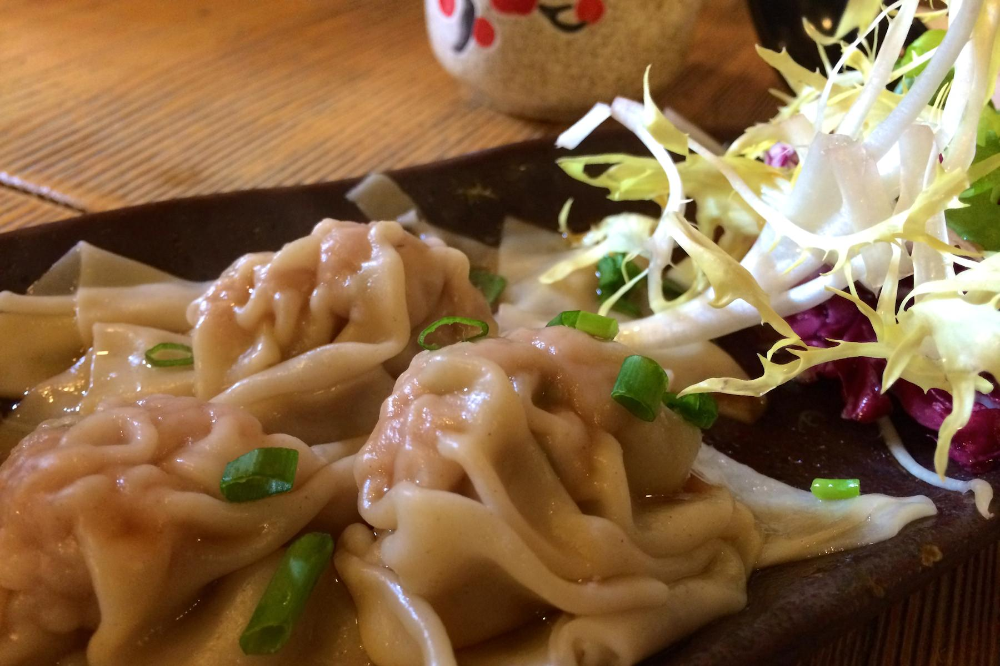
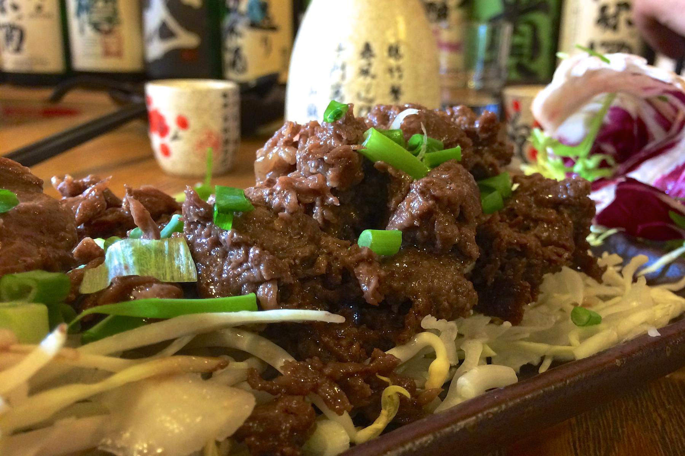

+++
titre = "Oto Oto à Lyon"
title = "Oto Oto à Lyon"
url = "/oto-oto-lyon"
date = "2014-02-22T20:03:11"
Lastmod = "2014-02-22T20:09:43"
cover = "oto-oto-lyon-kamakura.jpg"
categorie = [ "À manger" ]
tag = [ "Cadre original", "Cuisine japonaise" ]

+++

À Lyon comme ailleurs, les « japonais » sont partout, mais ces restaurants où l’on ne sert que des sushis ou des brochettes n’ont souvent de japonais que la réputation. Au cœur de Guillotière, dans le septième arrondissement lyonnais, <a href="http://www.lyonresto.com/restaurant-Lyon/restaurant-Oto-Oto---concept-japonais-Lyon/restaurant-Oto-Oto---concept-japonais-Lyon-9028.html"><strong>Oto Oto</strong></a> est un « <em>Izakaya</em> », l’équivalent au Japon de nos bistrots en France, ou bien encore des bars à tapas espagnols. Un lieu convivial où l’on ne trouvera aucun sushi, mais où l’on peut faire quelques découvertes surprenantes, à défaut d’être à notre goût. Une adresse à tester accompagné avec un connaisseur, à moins d’aimer les surprises.

Le cadre d’<strong>Oto Oto</strong> surprend : les murs sont entièrement recouverts de caisses de Saké, il y a aussi de nombreuses bouteilles vides partout, mais on est surtout intrigué par les « <em>Kamakura</em> ». Le long du mur, trois petites grottes avec à l’intérieur une table pour manger et être un peu isolé : cette tradition japonaise est méconnue en France, mais elle est assez amusante, en plus d’être pratique pour qui veut un peu d’intimité. Si vous voulez une table dans ces espaces, pensez à le préciser au moment de réserver. Sinon, vous pourrez trouver place dans la petite salle où les tables sont un peu proches les unes des autres. L’ambiance est chaleureuse avec ce décor boisé, mais ce samedi midi, il y avait suffisamment de monde et notamment des familles pour que ce soit un peu bruyant. Même si on est sans doute isolé à l’intérieur des <em>Kamakura</em>, ces grottes deviennent des caisses de résonance qui amplifient les sons pour tous ceux qui sont à l’extérieur. On imagine qu’en semaine, c’est encore plus bruyant : pour un repas en toute intimité, ce n’est pas l’idéal.

La carte d’<strong>Oto Oto</strong> est déroutante quand on ne connaît pas la vraie cuisine japonaise. Fort heureusement, les propriétaires du restaurant ont pensé à ajouter quelques explications et traductions, même si elles n’ont pas toujours été utiles comme on le verra. On apprend que la tradition au Japon est de choisir quelques <a href="http://voiretmanger.fr/wp-content/2014/02/oto-oto-carte.jpg">plats chauds</a> et de les partager. Suivant la tradition, nous commandons quatre plats à partager entre autant de convives. Comptez une dizaine d’euros à chaque fois, pour des proportions très réduites dans l’assiette. Huit <em>gyoza</em> au porc ouvrent le repas et ici, ils sont servis sans être grillés en fin de cuisson, comme des raviolis vapeur. Sur le plan gustatif, rien à redire, même si on aurait aimé un petit peu plus de quantité sur le prix. Le repas se poursuit avec du « <em>Yakiniku</em> », annoncé par la carte comme du bœuf grillé façon barbecue. Arrivent de très fines lamelles de bœuf qui n’est pas vraiment grillé, mais qui est assez savoureux malgré tout. On continue avec des travers de porc frits bien trop maigres et avec vraiment peu de viande pour le prix. Notre dernier choix était le plus intrigant sur la carte : un « <a href="http://fr.wikipedia.org/wiki/Okonomiyaki"><em>Okonomiyake</em></a> » que l’on nous a vendu comme une pizza japonaise. Nous nous attendions à quelque chose qui ressemblait, au moins vaguement à une pizza, mais nous avons reçu un plat très étrange qui ressemblait bien plus à une omelette (photo ci-dessous). De fait, l’essentiel du plat était des œufs, avec du chou et de nombreux autres éléments, mais c’est la sauce qui ressemblait à une sauce barbecue bien plus forte que celle que l’on connaît qui couvrait le tout. Sans être mauvais, l’ensemble était assez fort et pas forcément à notre goût. Mieux vaut être prévenu, les plats chauds servis ici peuvent être vraiment très particuliers, même si on retrouve quelques assiettes plus classiques. Nous avons fait le choix de l’exotisme et nous n’avons pas été déçus, au-delà de nos espérances. Malheureusement, ce plat nous a coupé l’appétit et nous sommes sortis de table sans être vraiment rassasiés. Payer environ 15 € par personne et avoir faim même pas une heure après être sorti de table, c’est un peu cher.

<strong>Oto Oto</strong> n’est sans doute pas un mauvais restaurant japonais, mais il mériterait un service plus pédagogique. Quand on ne connaît pas, on est un peu pris au dépourvu face à une quinzaine de sakés et on aimerait quelques explications. Mieux, on aimerait une dégustation gratuite avant d’acheter un pichet de saké que l’on n’a pas fini, faute de trouver l’alcool traditionnel à notre goût<a href="#fn-11233-1" rel="footnote">1</a> . Et que dire de ce plat que l’on nous présente comme une pizza, sans jamais nous prévenir que cela n’a en fait rien à voir ? On aurait apprécié un guide dans cette cuisine si particulière et ce jour-là, la serveuse ne maîtrisait manifestement pas son sujet (nous recommander un saké parce qu’il est le moins cher de la carte, ce n’est pas sérieux) et c’est bien dommage. Le repas aurait été beaucoup plus agréable avec un vrai connaisseur de la cuisine japonaise, pas quelqu’un qui n’est ici que pour faire son travail. Difficile, en l’état, de recommander cette adresse pourtant originale, si ce n’est en conseillant de s’y rendre avec un connaisseur, ou de s’en tenir aux plats connus. C’est dommage, <strong>Oto Oto</strong> aurait mérité mieux que cet avis en demi-teinte<a href="#fn-11233-2" rel="footnote">2</a>…

<ol>
<li id="fn-11233-1">
Je n&rsquo;ai sans doute jamais bu de bon saké et je comptais beaucoup sur ce restaurant. Malheureusement, celui que nous avons pris (un <em>Gekkeikan</em> qualifié par la carte de « <em>Junmai</em>) était assez mauvais à notre avis. Douceâtre, sans saveur bien marquée, il n&rsquo;a plu à personne. Est-ce une intolérance générale à l&rsquo;alcool ou un mauvais choix ?&#160;<a href="#fnref-11233-1" rev="footnote">&#8617;</a>
</li>
<li id="fn-11233-2">
Un avis renforcé par le fait que la carte bleue n’est pas acceptée. Certes, c&rsquo;est indiqué sur la porte d&rsquo;entrée, mais qu&rsquo;importe : je ne vois pas pourquoi un restaurant n&rsquo;accepterait pas les cartes en 2014. Les prix sont déjà assez élevés et c&rsquo;est inacceptable de devoir penser à venir avec du liquide…&#160;<a href="#fnref-11233-2" rev="footnote">&#8617;</a>
</li>
</ol>

