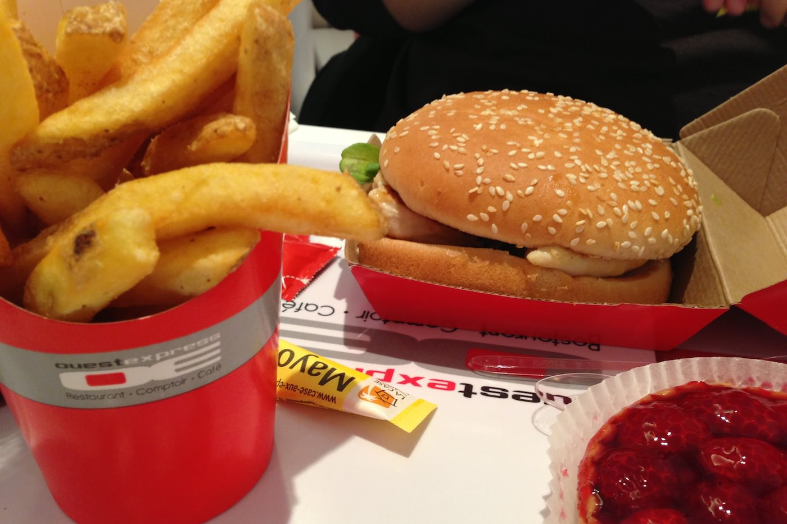
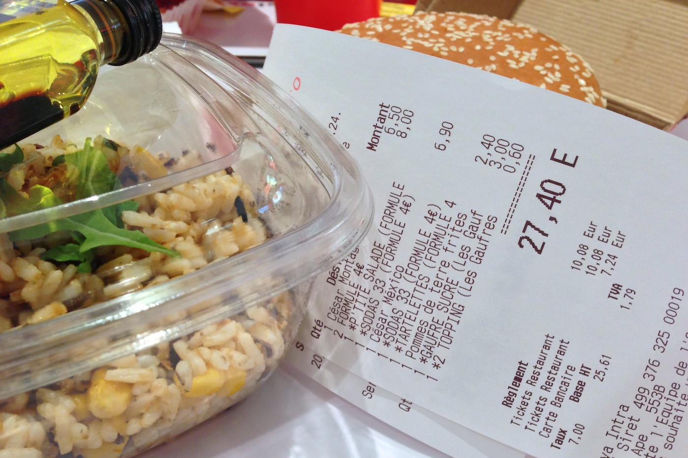
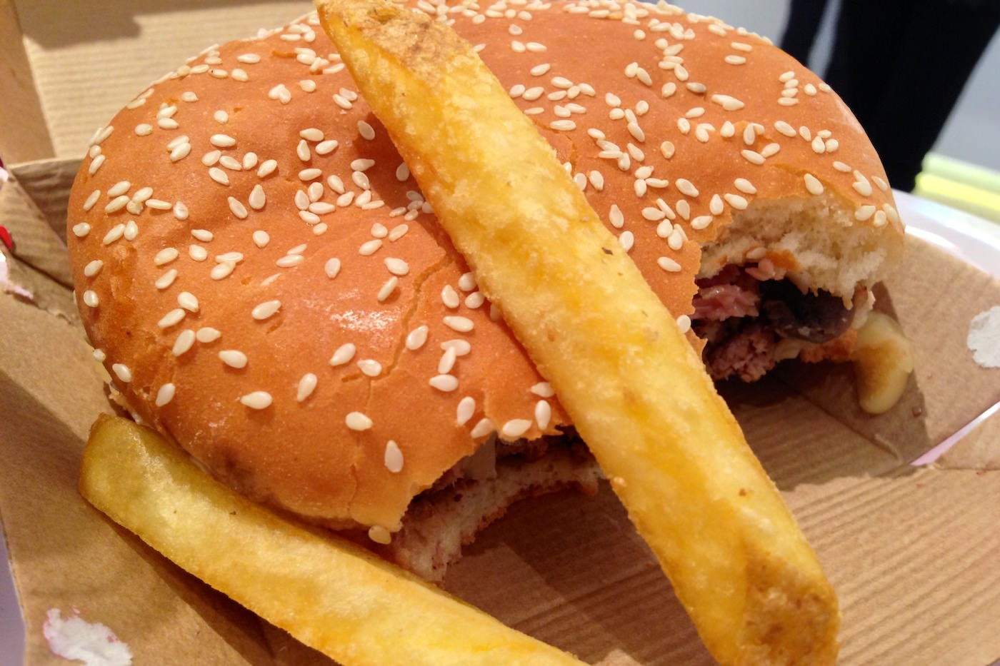
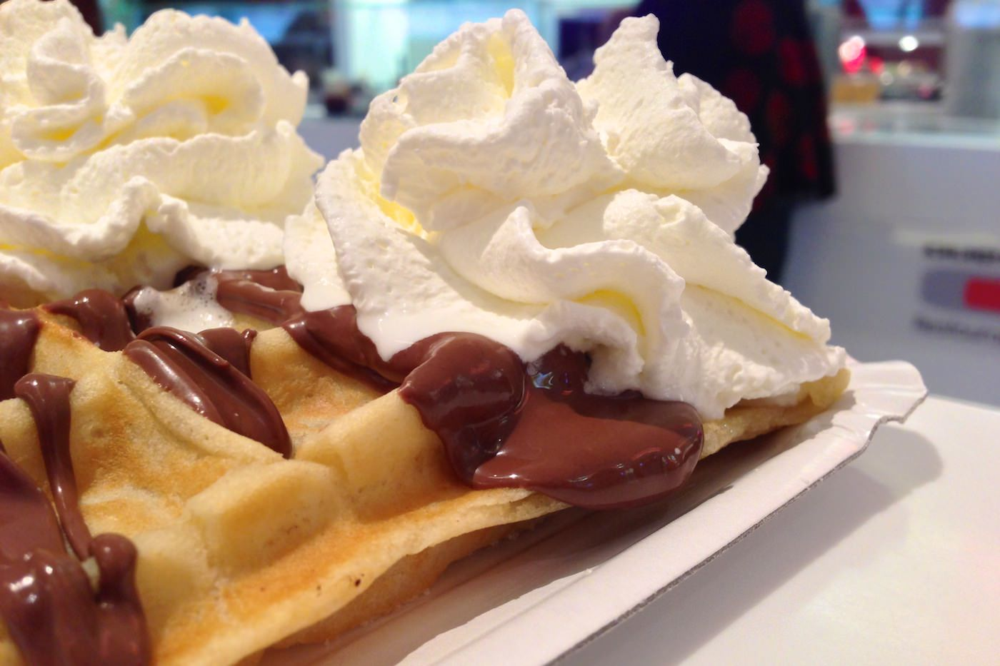

+++
titre = "L&rsquo;Ouest Express à Lyon"
title = "L'Ouest Express à Lyon"
url = "/ouest-express-lyon"
date = "2013-04-20T16:53:20"
Lastmod = "2015-03-14T23:20:34"
cover = "ouest-express-vaise-lyon.jpg"
categorie = [ "À manger" ]
tag = [ "69009", "Cuisine américaine", "Fast-food", "Hamburger", "Paul Bocuse" ]

+++

Paul Bocuse, le « Pape de la cuisine », s’est fait connaître avec <a href="http://voiretmanger.fr/2013/01/04/auberge-pont-collonges-bocuse/" title="L'Auberge du Pont de Collonges, à Collonges au Mont d'Or (Paul Bocuse) - À voir et à manger"><strong>L’Auberge du Pont de Collonges</strong></a>, mais il a rapidement constitué son réseau de restaurants, à Lyon et dans le monde comme beaucoup de grands chefs étoilés français. On le sait peut-être moins, mais il a aussi lancé en 2008 <a href="http://www.ouestexpress.com/"><strong>Ouest Express</strong></a>, une chaîne de fast-food. Deux adresses à Lyon pour le moment — une à Vaise dans le neuvième, l’autre à Part-Dieu dans le troisième arrondissement —, mais d’autres ouvertures sont prévues encore à Lyon, à Marseille, Strasbourg ou encore Lille. Que vaut ce fast-food revisité par Bocuse ? Est-ce simplement une stratégie marketing ou y a-t-il une vraie différence avec les chaînes historiques ?

Vu de l’extérieur, un <strong>Ouest Express</strong> ressemble à n’importe quel autre restaurant rapide. Celui de Vaise est situé juste à côté d’un multiplex de cinéma et on imagine très bien un MacDonald&rsquo;s ou un Quick à la place. Les nombreuses pointes de rouge, des chaises jusqu’aux poubelles en passant bien sûr par les textes, attirent l’œil, mais absolument rien ne permet pas de savoir à ce stade que l’on entre chez Bocuse. En fait, rien ne permet de le déterminer à aucun moment : que ce soit à l’intérieur ou à l’extérieur, ou même sur le site (nonobstant une discrète photo du chef), celui qui est censé avoir créé ce fast-food s’est effacé derrière l’adresse. Il faut dire que la cuisine traditionnelle de Paul Bocuse s’accorde mal avec l’idée que l’on se fait d’un fast-food et à bien des égards, sa cuisine devrait être l’antithèse de ce que l’on mange dans un tel lieu. Autant dire que l’on pousse la porte en verre de l’<strong>Ouest Express</strong> avec une certaine curiosité. À l’intérieur, pas de surprise non plus, des touches de rouge qui peinent à ajouter de la chaleur à cette grande salle assez froide. On ne vient évidemment pas ici pour la décoration, mais on peut noter que les concurrents de ce fast-food font mieux, notamment pour isoler les tables et donner un sentiment d’intimité. Ici, c’est grand et c’est bruyant : ce samedi midi pluvieux, les familles étaient venues en nombre et cela s’entendait. Qu’importe, on ne vient pas pour un repas gastronomique, mais pour manger vite et de fait, on ne s’attardera pas trop longtemps.

Que mange-t-on dans un fast-food qui appartient à Paul Bocuse ? Du fast-food, surtout, malheureusement… La <a href="http://www.ouestexpress.com/pdf/carte_ouestexpress.pdf">carte</a> propose un petit peu plus que des hamburgers malgré tout, on trouve aussi des salades et des sandwiches et même des pâtes et un plat cuisiné par jour. Si l’on vient pour manger un hamburger, on aura le choix entre quatre recettes au bœuf et une au poulet. C’est peu, d’autant que les recettes sont très basiques : on espérait un peu d’originalité, une touche de cuisine plus recherchée, mais aussi des recettes qui changent régulièrement, ce qui n’est pas le cas avec cette carte statique. L’offre côté sandwich et salades est en revanche plus importante, mais comme avec les quatre pâtes différentes au programme, l’originalité n’est jamais de mise. L’<strong>Ouest Express</strong> avait une carte à jouer en proposant des plats qui changeraient tous les jours, mais ce n’est pas le cas. Comme chez ses concurrents, on peut en tout cas associer un hamburger ou autre élément à une boisson et un accompagnement pour composer un menu. Vous pouvez opter pour un soda et des frites, mais aussi pour une petite salade, de la soupe ou un dessert, une bonne idée. Si l’esprit Bocuse se retrouve quelque part sur cette carte, ce sera au niveau des prix : comptez entre 6 et 7 € pour un hamburger seul, une dizaine d’euros pour un menu. C’est plus que MacDonald&rsquo;s et la facture grimpera beaucoup plus vite si vous ajoutez un dessert. Une gaufre vous sera facturée 3 € par exemple, ce n’est pas rien. À deux, en prenant deux menus et deux desserts, on approche des 30 €, largement plus de ce que l’on aurait eu dans un fast-food lambda.

Une fois passé à la caisse, vous allez vous assoir avec votre plateau, comme chez les autres, et l’<strong>Ouest Express</strong> ne fait guère mieux sur la présentation. Les frites et les hamburgers sont dans des boites en carton, les salades dans du plastique, on mange avec des couverts en plastique et on jettera l’intégralité du plateau, comme ailleurs. L’esprit fast-food est au moins respecté, mais malheureusement ce n’est pas toujours meilleur que dans les chaînes internationales. Le steak des hamburgers est français, c’est bien, mais pourquoi est-il gâché par une surcuisson et finalement aussi médiocre qu’ailleurs ? Pourquoi choisir ces &laquo;&nbsp;buns&nbsp;&raquo; industriels que l’on voit déjà partout, alors que les sandwiches sont quant à eux censés être maison ? Sans être mauvais, les deux hamburgers testés ici étaient communs et même, osons-le dire, moins bons que ceux de MacDonald&rsquo;s. C’est gênant, mais l’<strong>Ouest Express</strong> se rattrape sur tout ce qui les entoure. Les frites avec la peau sont grosses et excellentes, bien meilleures que les frites blanches sans âme que l’on trouve partout. La salade de riz choisie comme autre accompagnement était commune, mais assez bonne. Les desserts ont été la bonne surprise de ce repas : la tartelette aux framboises était fraiche du jour et sa pâte craquante était savoureuse tandis que la gaufre maison faite à la dernière minute était généreusement recouverte de pâte à tartiner et d’une chantilly maison réussie. 

Comme on le pressentait, le nom de Paul Bocuse n’est malheureusement qu’un faire-valoir pour ce fast-food. L’<strong>Ouest Express</strong> essaie bien de se différencier avec des salades ou des pâtes, il reste une chaîne de restauration rapide comme on en connaît plein. Il y avait une carte à jouer avec, par exemple, de la viande cuite à la dernière minute et selon les goûts des clients ou encore avec des recettes changées très régulièrement, mais ici tout est trop commun. On connaît déjà la formule, on a même mieux ailleurs et surtout moins cher : avec de tels tarifs, l’<strong>Ouest Express</strong> devrait proposer une cuisine nettement supérieure. Dommage…

