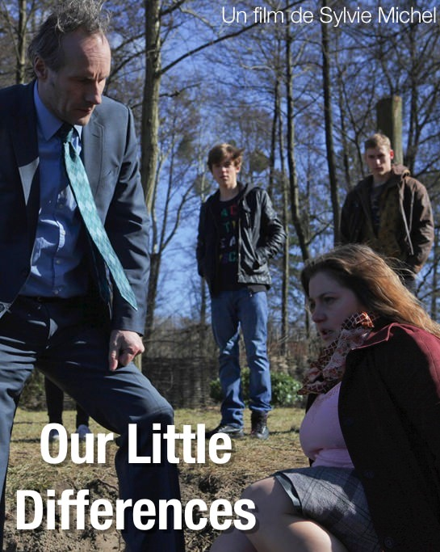
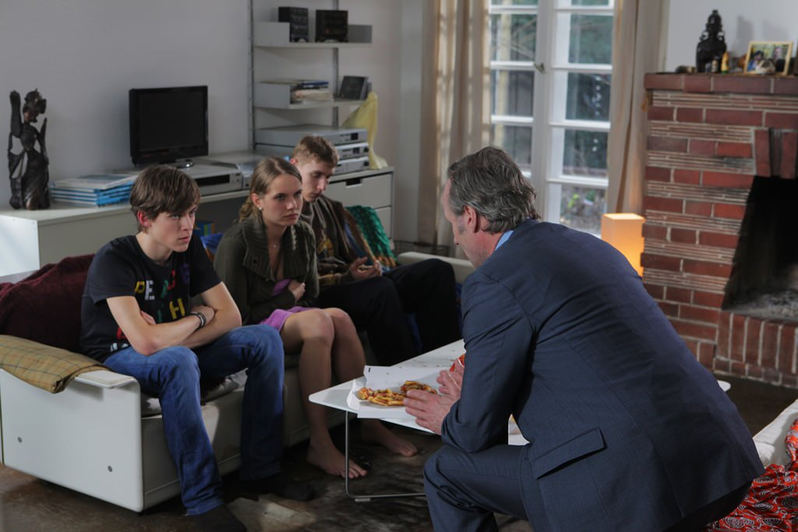
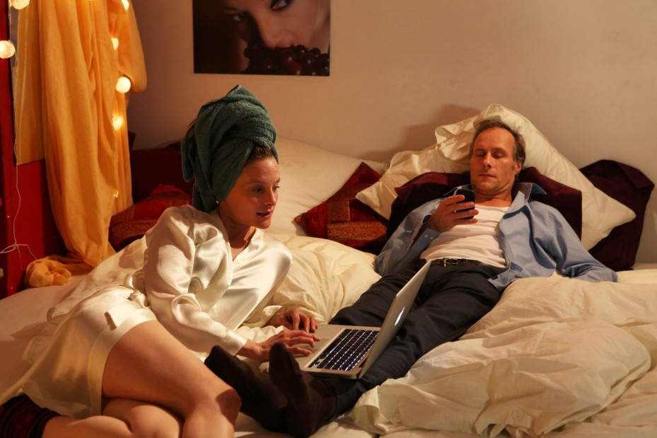

+++
titre = "Our Little Differences, Sylvie Michel"
title = "Our Little Differences, Sylvie Michel"
url = "/our-little-differences-michel"
date = "2012-12-27T09:43:26"
Lastmod = "2014-02-16T16:08:25"
cover = "sylvie-michel-our-little-differences.jpg"
categorie = [ "À voir" ]
tag = [ "Adolescence", "Arcs 2012", "Famille", "Société", "Sociologie", "Vite oublié" ]
createur = [ "Sylvie Michel" ]
acteur = [ "Bettina Stucky", "Wolfram Koch" ]
annee = [ "2013" ]
weight = 2013
pays = [ "Allemagne" ]

+++

Pour son premier film, la réalisatrice française Sylvie Michel est allée en Allemagne pour tourner un film allemand. <em>Our Little Differences</em> est un film sur l’adolescence et le travail de parents, mais aussi, et surtout sur les différences sociales dans l’Allemagne d’aujourd’hui. Un sujet qui manque autant d’originalité que le résultat : ce premier long-métrage est techniquement maîtrisé, mais son scénario laisse une impression de déjà vu permanent, tandis que les clichés s’accumulent un peu trop pour en profiter. 

Sebastian est un médecin spécialisé dans les fécondations in-vitro. Toute la journée, il aide des femmes à avoir le bébé qu’elles désirent tant, un métier qu’il semble particulièrement apprécier et qui lui permet aussi de mener un train de vie particulièrement confortable. S’il côtoie toute la journée des femmes à son travail, il vit seul après avoir divorcé avec sa propre femme. C’est elle qui gère Arthur, leur enfant adolescent de 16 ans et son père n’a ainsi à s’en occuper que de temps à autre. Sauf que cette fois, la mère d’Arthur est partie plusieurs semaines pour faire une pause et c’est le papa qui s’en charge en permanence. Autant dire que Sebastian ne sait pas trop comment s’y prendre, mais opte pour la souplesse de manière générale. Quand son fils lui demande l’autorisation pour sortir le soir même avec sa petite amie et Vera, la fille de la femme de ménage de la famille, Sebastian donne son autorisation sans trop hésiter. Jana, la femme de ménage d’origine bulgare, ne voit pas les choses du même œil et proteste vigoureusement contre cette sortie, sans effet. Quand sa fille n’est pas rentrée le lendemain matin, c’est le drame. Arthur lui aussi semble avoir disparu et Sebastian et Jana se mettent à les rechercher.

<em>Our Little Differences</em> commence un peu comme un thriller. Une fois la situation et les personnages posés, la disparition des adolescents alerte inévitablement leurs parents qui partent à leur recherche. Sylvie Michel sait plutôt bien entretenir une ambiance de peur et on ressent vraiment la détresse de Jana surtout, mais aussi celle de Sebastian, même si ce dernier essaie de toujours faire bonne figure. Chez l’un, comme chez l’autre, on ressent au moins du stress quand ils éliminent peu à peu les possibilités sans trouver leurs enfants. La femme de ménage est plus hystérique que le médecin, plus agacé qu’angoissé par la situation, mais qu’importe, le doute et la peur sont au rendez-vous. Quand <em>Our Little Differences</em> avance et finit par débloquer la situation toutefois, on comprend que Sylvie Michel n’a jamais voulu faire de cette disparition l’enjeu principal de son film. On ne révèlera pas tous les détails concernant les différents adolescents perdus dans le film, même si ce n’est pas l’essentiel du film ; disons simplement que la résolution est un peu trop rapide et un  peu trop simple pour vraiment intéresser le spectateur. Pour le dire autrement, si vous regardez <em>Our Little Differences</em> en espérant un scénario original et surprenant, vous serez certainement déçu.

Le titre original du film, <em>Die feinen Unterschiede</em> est en fait un indice essentiel pour comprendre les intentions de la réalisatrice. Ce titre est la version allemande de <a href="http://www.amazon.fr/gp/product/2707302759/ref=as_li_ss_tl?ie=UTF8&amp;tag=leblogdenic07-21&amp;linkCode=as2&amp;camp=1642&amp;creative=19458&amp;creativeASIN=2707302759"><em>La Distinction</em></a>, l’un des essais du célèbre sociologue Pierre Bourdieu. Cet essai s’intéresse aux différentes classes sociales et <a href="http://fr.wikipedia.org/wiki/La_Distinction._Critique_sociale_du_jugement">élabore</a> une théorie autour des styles de vie et des goûts qui varient en fonction des différentes classes sociales dans une société. Les petites différences du titre choisi à l’international pour le long-métrage, ce sont justement ces marqueurs de classe, les choses que l’on fait ou que l’on aime et qui rattache chaque individu à son environnement social. Sylvie Michel semble vouloir les dénoncer dans <em>Our Little Differences</em> et on comprend mieux la place assez réduite accordée à l’intrigue de la disparition des adolescents. Cette histoire n’est en fait qu’un prétexte à confronter deux individus et deux classes sociales radicalement opposées. On a d’un côté Sebastian, riche allemand qui roule dans une confortable et flambant neuve Mercedes et qui habite un pavillon dans la banlieue manifestement cossue de Berlin. De l’autre, on retrouve Jana, immigrée bulgare qui vit depuis dix ans en Allemagne en faisant du ménage chez des habitants ou à la clinique de Sebastian. Leurs éducations respectives sont un symbole des différences sociales profondes entre les deux êtres : Jana s’inquiète pour sa fille qu’elle veut absolument surprotéger, alors que Sebastian laisse peut-être un peu trop de liberté à son fils. <em>Our Little Differences</em> peine malheureusement à passionner sur ces questions de sociologie. Loin de la subtilité d’un essai de Bourdieu, le scénario mis en scène par Sylvie Michel s’avère au contraire plein de clichés, trop pour que l’ensemble puisse espérer atteindre la crédibilité nécessaire. L’opposition est trop brutale et systématique pour ne pas tomber dans la caricature pure et on a un peu le sentiment d’avoir déjà vu et revu cette histoire ailleurs. On sent que la cinéaste cherche, surtout sur la fin, à casser cette opposition, mais la prise de conscience de Sebastian n’aide pas le film, c’est même tout le contraire.

Il faut dire que la réalisation proprement dite n’aide pas à s’intéresser à <em>Our Little Differences</em>. Il s’agit du tout premier film de Sylvie Michel et on peut être tolérant à cet égard, mais quand même : ce long-métrage évoque plus certains téléfilms un peu fauchés qu’un cinéma ambitieux. L’ensemble est soigné et le film est assez bien maîtrisé, mais le film manque d’ambitions sur le plan formel. Ce ne serait pas gênant si le scénario était exceptionnel, mais ce n’est malheureusement pas le cas. Que reste-t-il dès lors à <em>Our Little Differences</em> ? Peu de choses, si ce n’est tout même l’ambiance de stress et de peur sourde qui étreint le spectateur autant que les parents quand les adolescents disparaissent. On doit, à cet égard, saluer les deux acteurs principaux : Wolfram Koch compose un Sebastian insupportable comme il faut, tandis que Bettina Stucky rend bien sa peur de mère et son obstination forcenée à retrouver sa fille. 

Adapter une théorie de sociologie à un film a rarement fonctionné et Sylvie Michel le prouve à nouveau avec <em>Our Little Differences</em>. Ignorant la fugue des adolescents, reléguée au rang de sous-intrigue sans grand intérêt, la cinéaste a préféré se pencher sur l’opposition entre Sebastian et Jana, ses deux personnages principaux. L’idée n’était pas inintéressante sur le papier, mais le résultat s’avère finalement décevant, car trop caricatural. Dommage…

<em>Sortie en salles à une date inconnue</em>

