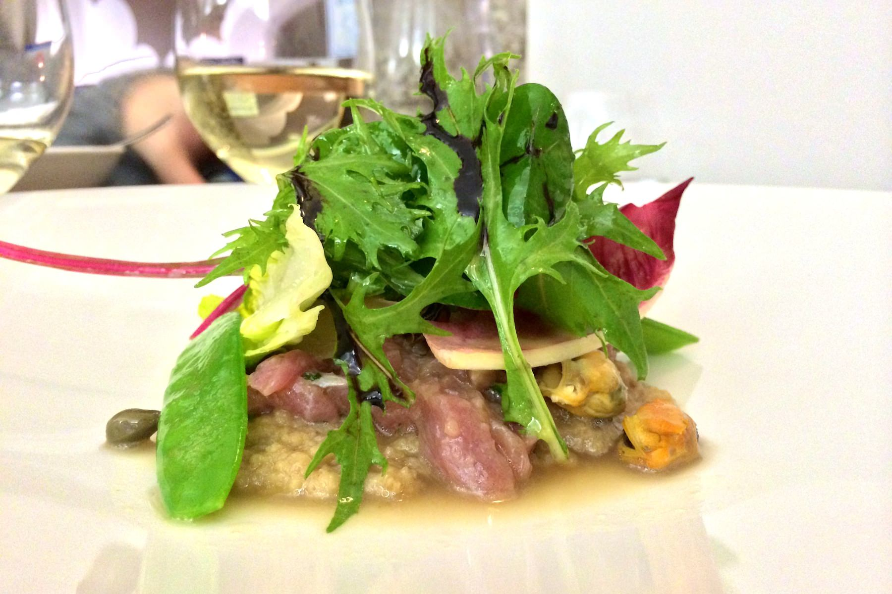
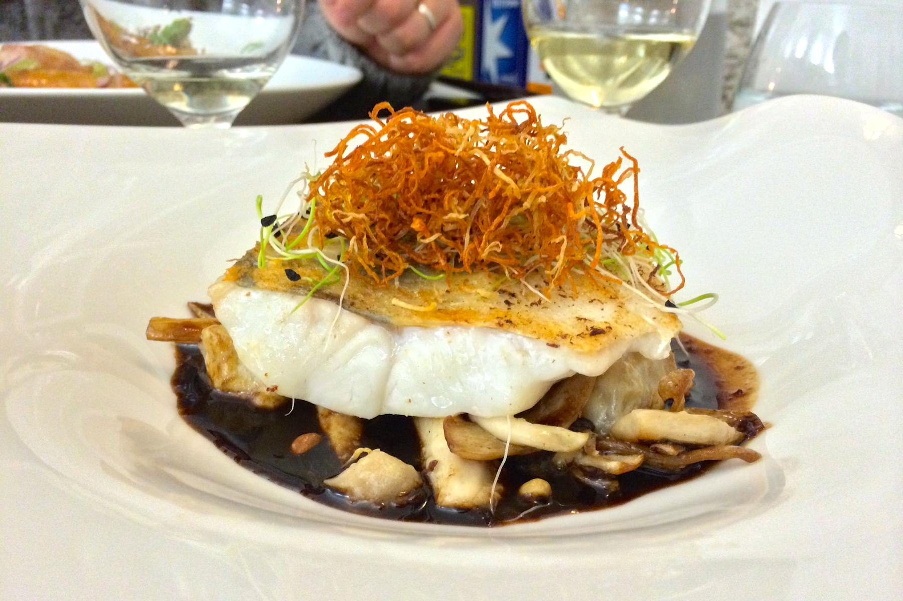
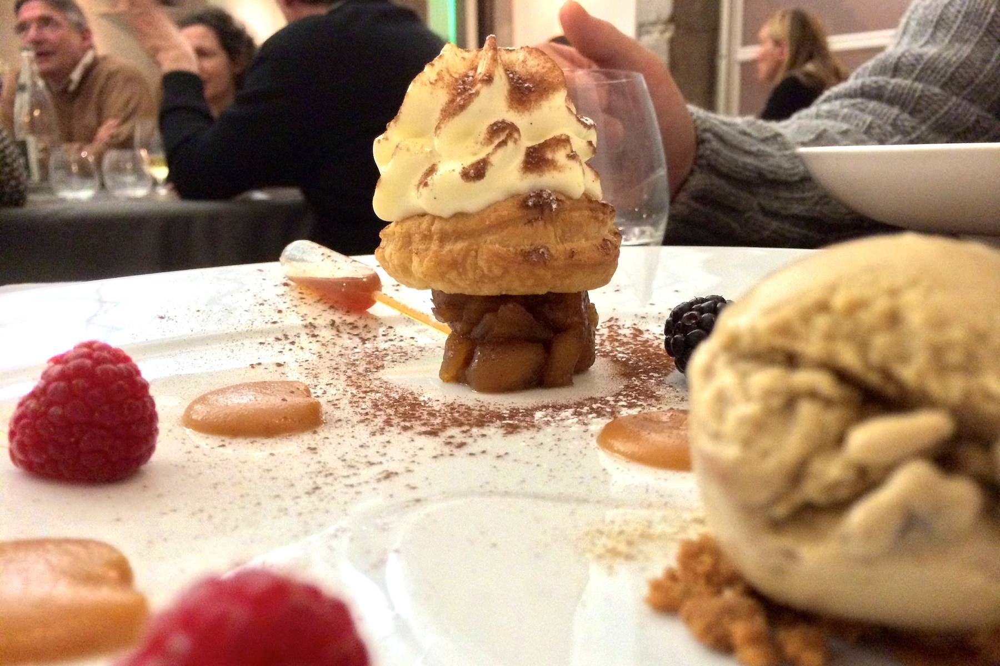

+++
type = "post"
titre = "L&rsquo;ourson qui boit à Lyon"
title = "L'ourson qui boit à Lyon"
url = "/ourson-qui-boit-lyon"
date = "2014-02-09T00:05:58"
Lastmod = "2014-02-09T00:05:39"
cover = "ourson-qui-boit-lyon.jpg"
categorie = [ "À manger" ]
tag = [ "Cuisine française", "Cuisine japonaise", "Cuisine moderne" ]

+++

À deux pas de la station Croix Paquet, non loin de l’Hôtel de Ville de Lyon, <a href="http://www.lyonresto.com/restaurant-Lyon/restaurant-L-ourson-qui-boit-Lyon/restaurant-L-ourson-qui-boit-Lyon-2801.html"><strong>L’ourson qui boit</strong></a> fait partie de ces adresses qui se font désirer. Difficile en effet d’y obtenir une table sans s’y prendre quelques semaines, voire un bon mois pour le samedi soir, en avance. Une attente qui attire forcément l’attention et qui s’explique naturellement dès que l’on peut déguster la cuisine franco-japonaise qui y est proposée. Malgré des prix très raisonnables, le chef japonais compose des assiettes inventives très réussies. Une excellente adresse, à découvrir !

La devanture très banale pourrait vous faire passer à côté de <strong>L’ourson qui boit</strong>, ce serait une grave erreur. Il faut passer la porte pour découvrir une petite salle très simple, lumineuse et sobre par son mobilier, mais décorée de façon originale avec des oursons au plafond. Une quinzaine de couverts seulement dans cette pièce, une petite dizaine dans une salle attenante : on comprend vite pourquoi il faut s’y prendre un petit peu à l’avance et ce samedi soir, toutes les tables étaient occupées, sans exception. Dans ce quartier composé essentiellement d’immeubles anciens, le plafond est très haut, ce qui ne favorise pas un niveau sonore contenu. De fait, le bruit était assez élevé ce soir dans la salle, un petit bémol que l’espacement généreux entre les tables vient compenser. À <a href="/wp-content/2014/02/ourson-qui-boit-menu.jpg">la carte</a>, peu de choix, puisque l’on a un menu unique qui change très régulièrement et qui est composé uniquement de deux entrées, deux plats et deux desserts (plus quelques propositions fromagères, Lyon oblige). À ce menu unique répond un tarif unique : 28 € pour une entrée, un plat et un dessert. Un prix très raisonnable, qui tranche avec l’originalité annoncée des assiettes.

Puisque la carte change constamment, difficile de juger autrement que sur les assiettes goûtées ce soir-là. Toujours est-il qu’une tendance très nette se dégage : l’association terre-mer est manifestement un sujet de prédilection du chef. Les deux entrées et les deux plats associent des produits de la mer et d’autres de la terre. On a un bouillon de champignon avec des lamelles de Saint-Jacques, ou bien un tartare de beau avec des moules, ou encore du poulet associé à une sauce aux huitres. <strong>L’ourson qui boit</strong> mêle les cultures et les influences et le chef a ramené du Japon des produits, comme du Gari — du gingembre sucré salé — ou encore le Yuzu, cet agrume typiquement japonais. Pour qui aime les associations de saveur et les assiettes originales, c’est incontestablement une carte réjouissante et on n’a qu’une hâte, c’est de goûter. Le résultat est à la hauteur de cette attente : on pourrait bien noter quelques fausses notes ici ou là, à l’image du jambon cru trop salé ou du caviar d’aubergine trop présent qui déséquilibraient dans les deux cas les entrées, mais ce serait chipoter. La cuisine servie ici est vraiment excellente et elle associe avec toute la finesse nécessaire des associations souvent inattendues. Le filet de sandre parfaitement cuit était admirablement relevé par une sauce balsamique au Yuzu qui apportait au plat tout le pers nécessaire. En face, le filet de poulet bien rôti était sublimé par une sauce avec un peu d’huîtres vraiment savoureuse. La vraie surprise toutefois est venue des desserts : la soupe de fraise au crémant était un modèle d’équilibre, mais on retiendra surtout cet étonnant dessert qui associait des pommes caramélisées à… une glace de cèpes. La glace seule est un peu déstabilisante, on n’a pas vraiment l’impression de manger un dessert, mais ajoutez de la pomme et vous obtenez une saveur explosive.

Comment ne pas s’enthousiasmer pour ce restaurant qui propose une cuisine inventive et bon marché ? Le chef japonais à la tête des cuisines de <strong>L’ourson qui boit</strong> compose des assiettes franco-japonaises qui sont toujours très originales et surtout très réussies. Les accords de saveur sont exemplaires et le prix reste très mesuré. On comprend sans peine le succès des lieux et même si attendre un mois est contraignant, on recommande sans peine de faire cet effort, l’adresse mérite amplement cet effort !

