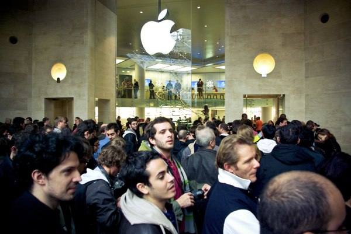
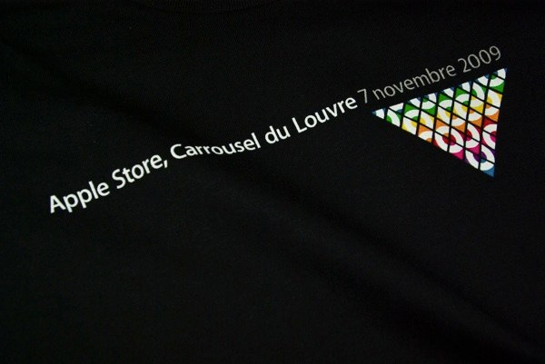
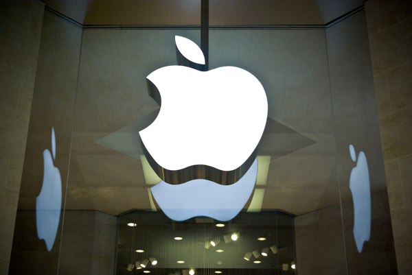
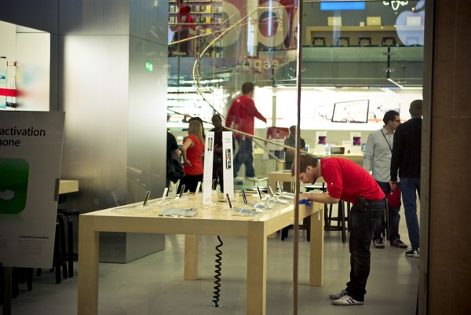

+++
type = "post"
titre = "J&rsquo;ai participé à l&rsquo;ouverture d&rsquo;un Apple Store"
title = "J'ai participé à l'ouverture d'un Apple Store"
url = "/ouverture-apple-store"
date = "2009-11-07T20:34:02"
Lastmod = "2014-11-03T23:53:59"
cover = "apple-store-louvre.jpg"
categorie = [ "En bref" ]
tag = [ "Apple Store", "France", "Paris" ]

+++

Oui, on le sait tous, ce n&rsquo;est qu&rsquo;un magasin. Mais c&rsquo;est quand même plus qu&rsquo;un magasin&#8230; Vous en connaissez beaucoup, vous, des magasins qui rassemblent de telles foules ?

<a href="http://www.flickr.com/photos/anthonynelzin/4082155179/in/set-72157622614313973/">

</a>

On ne sait pas combien de personnes sont passées dans le tout nouvel <a href="http://www.apple.com/fr/retail/carrouseldulouvre/">Apple Store du Louvre</a> aujourd&rsquo;hui, on parle de 10 000 personnes et d&rsquo;une queue de 1,5 km au maximum, c&rsquo;était peut-être plus. Beaucoup de jeunes, très peu de femmes et quelques étrangers (on a discuté avec un Américain qui apparemment, trouvait ça très fun de venir à l&rsquo;inauguration d&rsquo;un Apple Store en France). En tout cas, la pomme a ici totalement réussi son coup, se faisant de la publicité à peu de frais comme elle sait le faire.

<a href="http://www.flickr.com/photos/anthonynelzin/4078260033/in/set-72157622614313973/">

</a>

L&rsquo;important n&rsquo;était en fait pas de faire plaisir à quelques fans (5000 t-shirts distribués), mais bien plus de se faire connaître auprès du public qui compte, c&rsquo;est-à-dire les gens qui n&rsquo;utilisent pas des produits Apple. En d&rsquo;autres termes, ceux qui pourraient potentiellement acheter des produits Apple, que ce soit des iPod ou iPhone, ou des Mac. Et là encore, à en juger par le nombre de touristes béats d&rsquo;étonnement devant les scènes de folie que l&rsquo;on a eu ce matin à l&rsquo;ouverture, on se dit que le pari est totalement réussi. J&rsquo;ai cru voir des touristes d&rsquo;un peu partout dans le monde, beaucoup d&rsquo;Asie on s&rsquo;en doute dans un tel lieu, mais pas seulement. Et au-delà des touristes de passage — cible principale de ce magasin situé dans un lieu totalement ignoré par les Parisiens —, on a pu repérer plusieurs télévisions françaises (Canal+, BFM TV) et divers journalistes. Gageons que l&rsquo;événement a été/sera largement transmis.

<a href="http://www.flickr.com/photos/anthonynelzin/4083090712/in/set-72157622614313973/">

</a>

Une opération Apple est toujours savamment orchestrée. Au point qu&rsquo;une heure avant l&rsquo;ouverture, on voyait les équipes s&rsquo;activer pour placer les produits au millimètre et effacer les dernières traces de poussière au coton-tige. Les employés ont aussi commencé à chauffer la salle avant l&rsquo;ouverture, après s&rsquo;être longtemps autocongratulés sur le mode du &laquo;&nbsp;on est les meilleurs, ouaiiiiiis !!&nbsp;&raquo;. Le service de sécurité était aussi des plus impressionnants, je ne sais pas combien ils étaient, mais sans doute pas loin de la centaine, et ils étaient super efficaces.

<a href="http://www.flickr.com/photos/anthonynelzin/4081794279/in/set-72157622614313973/">

</a>

Impressionnante aussi, l&rsquo;ambiance qui régnait ce matin devant la pyramide inversée. Difficile de la décrire, mieux vaut laisser l&rsquo;image et le son s&rsquo;en charger avec ce petit condensé de deux minutes <a href="http://www.macg.co/news/voir/137200/l-apple-store-du-louvre-comme-si-vous-y-etiez">réalisé pour MacGeneration</a> (l&rsquo;image est très moyenne, mais c&rsquo;est un pauvre iPhone 3GS qui servait de caméra&#8230;). On peut trouver ces employés ridicules, avec leurs applaudissements à tout rompre, les olas et autres tapes dans la main, mais sur place, c&rsquo;était assez grisant. Je n&rsquo;irai pas dans les extrêmes de certains fanatiques (oui, avec toute la connotation religieuse que le terme contient), mais je dois dire que je ne suis pas resté insensible.

<iframe class="aligncenter" src="//www.youtube.com/embed/Oow6sqgngEI" frameborder="0" allowfullscreen></iframe>

En tout cas, j&rsquo;y étais<a href="#footnote_0_2035" id="identifier_0_2035" class="footnote-link footnote-identifier-link" title="En plus, j&rsquo;avais une excuse officielle&hellip;">1</a> (la preuve ci-dessous), et c&rsquo;était une expérience pour le moins intéressante&#8230; On pensera ce que l&rsquo;on veut de l&rsquo;événement, mais Apple sait y faire et l&rsquo;ensemble était plutôt sympathique et bon enfant. Bien sûr que c&rsquo;est pour vendre<a href="#footnote_1_2035" id="identifier_1_2035" class="footnote-link footnote-identifier-link" title="Mais pas que, c&rsquo;est aussi un des derniers lieux &agrave; proposer du vrai Wifi gratuit, c&rsquo;est aussi un lieu de formation, un SAV qui ne ressemble pas &agrave; un SAV&hellip; Plus largement, il est int&eacute;ressant de noter que sur les &eacute;talages, les prix sont discrets quand ils ne sont pas tout simplement absents.">2</a>, mais Saturn aussi c&rsquo;est pour vendre, et j&rsquo;aime autant le cadre d&rsquo;un Apple Store…

<a href="http://www.flickr.com/photos/anthonynelzin/4082116993/in/set-72157622614313973/">

</a>

<em>Geek, moi ? Je ne vois pas pourquoi&#8230;</em>

Toutes les photos sont © <a href="http://www.flickr.com/photos/anthonynelzin/sets/72157622614313973/">Anthony Nelzin</a> (<a href="http://www.flickr.com/photos/anthonynelzin/4082347101/in/set-72157622614313973/">couverture</a>)

<ol class="footnotes"><li id="footnote_0_2035" class="footnote">En plus, j&rsquo;avais une excuse officielle&#8230; [<a href="#identifier_0_2035" class="footnote-link footnote-back-link">&#8617;</a>]</li><li id="footnote_1_2035" class="footnote">Mais pas que, c&rsquo;est aussi un des derniers lieux à proposer du vrai Wifi gratuit, c&rsquo;est aussi un lieu de formation, un SAV qui ne ressemble pas à un SAV&#8230; Plus largement, il est intéressant de noter que sur les étalages, les prix sont discrets quand ils ne sont pas tout simplement absents. [<a href="#identifier_1_2035" class="footnote-link footnote-back-link">&#8617;</a>]</li></ol>
