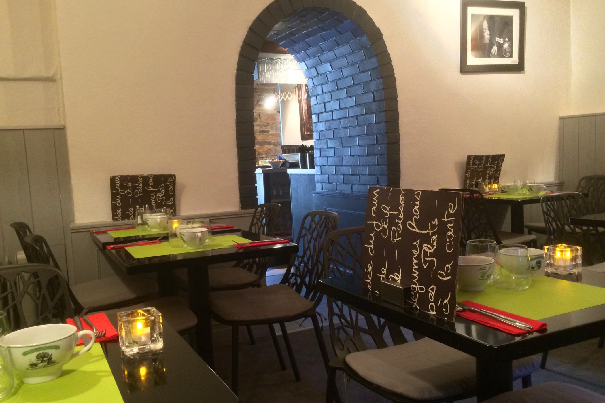
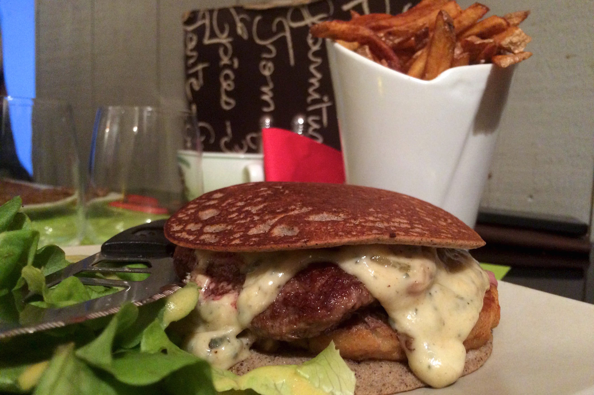
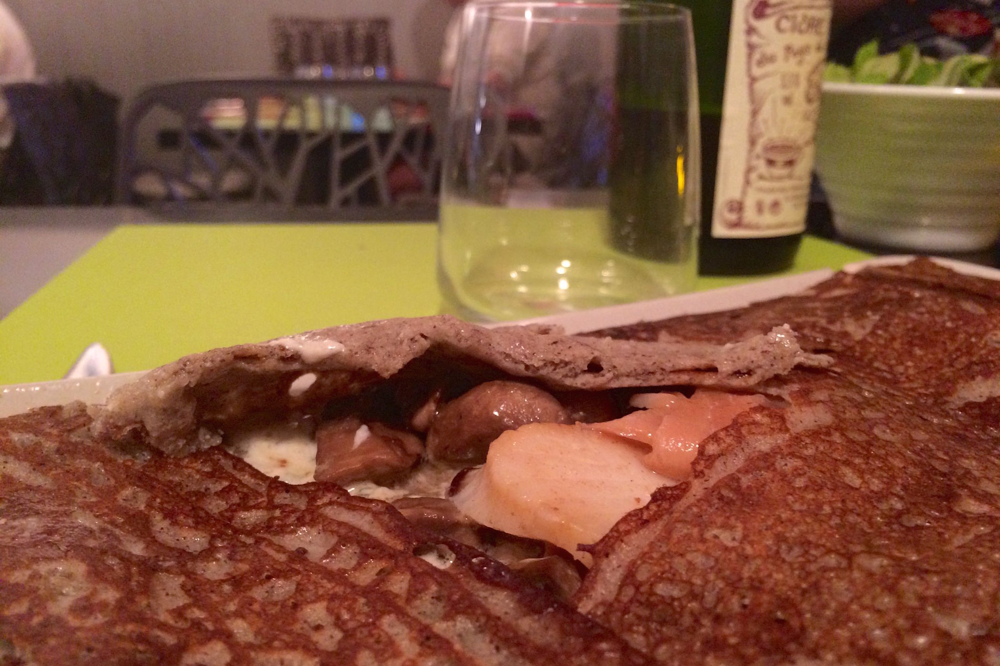
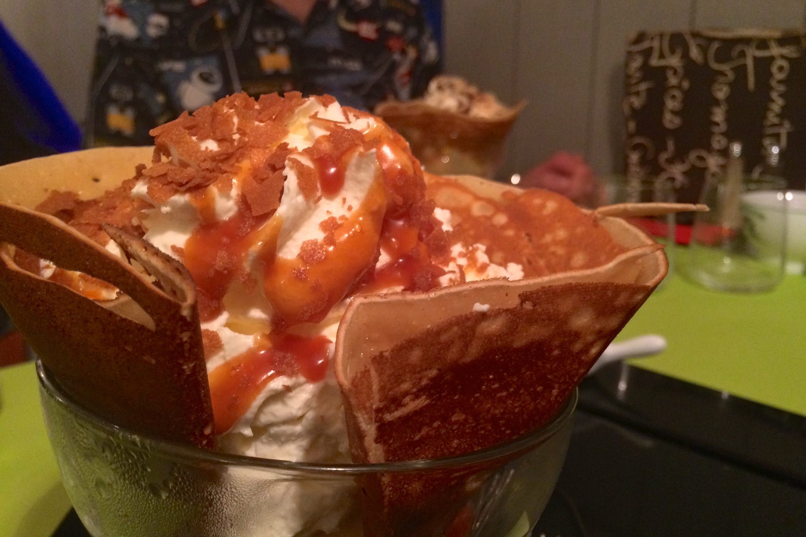

+++
titre = "Ouzh-Taol à Rennes"
title = "Ouzh-Taol à Rennes"
url = "/ouzh-taol-rennes"
date = "2014-07-03T08:25:11"
Lastmod = "2014-07-03T08:29:55"
cover = "ouzh-taol-rennes.jpg"
categorie = [ "À manger" ]
tag = [ "Bretagne", "Crêperie" ]

+++

Nichée dans une petite rue aux abords du vieux Rennes, la crêperie <strong>Ouzh-Taol</strong> n’a manifestement pas besoin de se faire de publicité. La façade est inexistante, ou presque : seule une plaque sur un mur permet de savoir que l’on est face à une crêperie et l’été, les parasols de la terrasse la masquent en grande partie. Autant dire que l’on peut passer devant sans la voir, mais ce serait une erreur. Si la devanture est aussi discrète, c’est qu’il y a une raison : dans la capitale bretonne, tout le monde semble connaître cette adresse, très réputée pour ses galettes et ses crêpes. De fait, on y mange des classiques savoureux et surtout des recettes originales et audacieuses très bien pensées. Un régal !

Mieux vaut réserver si on espère manger à <strong>Ouzh-Taol</strong>, surtout les week-ends et en saison touristique. La salle est toute petite et même si on y a placé le maximum possible de tables, il ne rentre guère plus de trente convives par service. Il y avait du monde ce soir-là, un soir de semaine, mais en juillet. Résultat, beaucoup de bruit et la sensation de partager la conversation avec la table d’à côté : pour l’intimité, on repassera, mais on vient ici pour manger. La vieille carte façon cahier d’école ne manque pas de propositions, à tel point que le choix est un peu trop large. Il y a de tout, des plus classiques aux recettes plus originales, mêlant la terre et la mer notamment. Mais il y a surtout, sur une ardoise dans la salle, l’une des idées originales de l’adresse : des burgers. Pas n’importe quel hamburger toutefois, ceux-ci remplacent les <em>buns</em> traditionnels par deux blinis, des crêpes épaisses donc qui offrent au sandwich sa structure. Difficile de résister à cette idée originale et parfaitement réalisée. Les blinis sont très bien cuits et remplacent sans problème du pain. Entre les deux, un steak haché rosé comme il se doit — un bon point, d’autant que l’on n’avait rien spécifié à la commande — et un fromage coulant à souhait. Ce burger est servi avec une salade et si on le souhaite, de très bonnes frites maison : une vraie réussite, qui a apparemment beaucoup de succès.

Il n’y a pas que cette formule burger toutefois : la crêperie sert aussi des galettes traditionnelles, mais là encore elles sont incontestablement au-dessus du lot. La pâte est bonne et très bien beurrée (avec une noix de beurre supplémentaire si vous n’en avez pas assez), mais tout le monde peut en faire autant. Ce sont les ingrédients à l’intérieur qui font la différence et là encore, <strong>Ouzh Taol</strong> fait un sans-faute. Les Saint-Jacques n’étaient pas des noix de pétoncles, mais de belles noix savoureuses. Les champignons étaient cuisinés pour avoir du goût et la sauce ail et fines herbes ainsi que la crème enrobaient le tout, dans un équilibre parfait. Ajoutons que les proportions sont conséquentes : certaines crêperies ne rassasient pas avant au moins trois assiettes, ici on aura parfois du mal à terminer deux galettes ou crêpes. Pour le prix demandé — entre 8 et 10 € pour une galette, 7 à 9 € pour une crêpe —, le rapport qualité/prix est très bon, surtout en plein cœur de Rennes. N’oubliez pas d’arroser le repas d’un bon cidre et sur ce plan aussi, l’excellence est au rendez-vous avec un cidre fermier des environs succulent… et pas très cher lui non plus.

Chez <strong>Ouzh Taol</strong>, mieux vaut garder une petite place pour le dessert, même si ce n’est pas toujours facile, tant les galettes sont imposantes. Vous auriez tort toutefois de passer à côté de l’autre grande spécialité de la maison : après le burger revisité façon crêperie, la coupe de glace réimaginée. Servi dans une coupe, le cornet de crêpe est en fait une crêpe de froment traditionnelle enroulée dans la coupe avec à l’intérieur tous les ingrédients. Plusieurs coupes glacées traditionnelles sont proposées, comme une Dame Blanche — glace vanille, chantilly et chocolat fondu —, mais il y a aussi des recettes originales, à l’image du cornet belge qui associe une glace aux Spéculoos à de la chantilly, du caramel au beurre salé et des gavottes. Un délice de gourmandise, certes pas très léger, mais que c’est bon ! Certes, ce dessert n’est pas très pratique à manger — on finit par tout poser dans l’assiette sous la coupe pour finir avec des couverts classiques —, mais on s’en fiche un peu, tant ce mélange de saveurs offre un plaisir régressif irrésistible. Et si vous préférez une forme plus classique, des crêpes posées sur l’assiette et fourrées sont bien entendu proposées et celles avec la frangipane maison sont excellentes.

Difficile de ne pas s’enthousiasmer pour cette crêperie qui ne reste pas aux recettes traditionnelles, mais ose des idées nouvelles et surtout choisit toujours des produits de grande qualité. On apprécie les petites attentions : <strong>Ouzh Taol</strong> vous accueille avec des roulés de galette en guise d’amuse-bouche, et un chocolat craquant vous attend au moment de payer l’addition. Le cadre est bruyant, c’est vrai, mais on peut aisément l’oublier grâce au contenu des assiettes : si vous aimez les crêperies qui sortent un peu de l’ordinaire sans aller trop loin, c’est une excellente adresse à Rennes !

