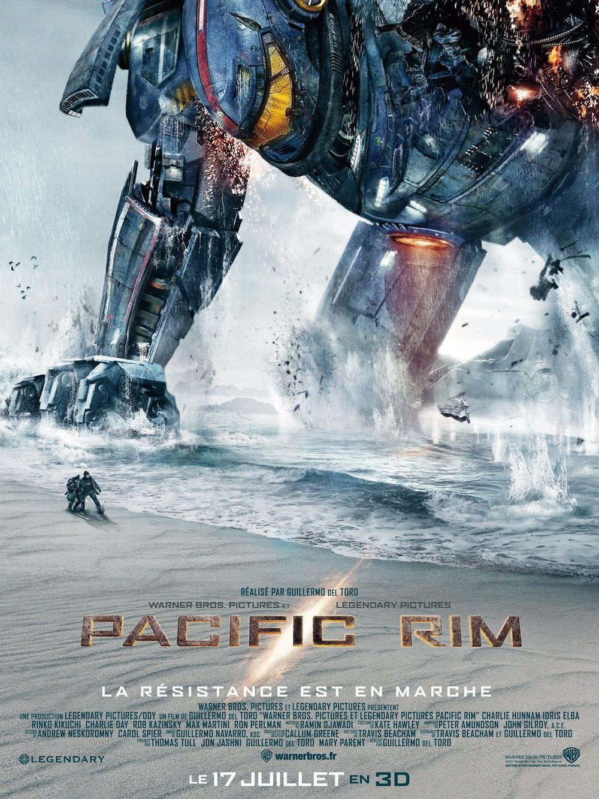
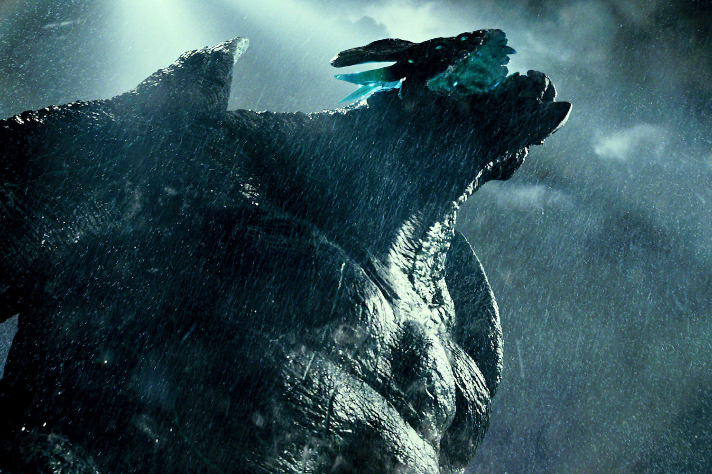
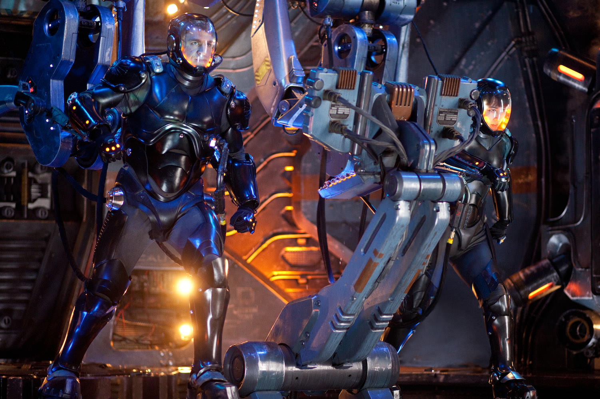
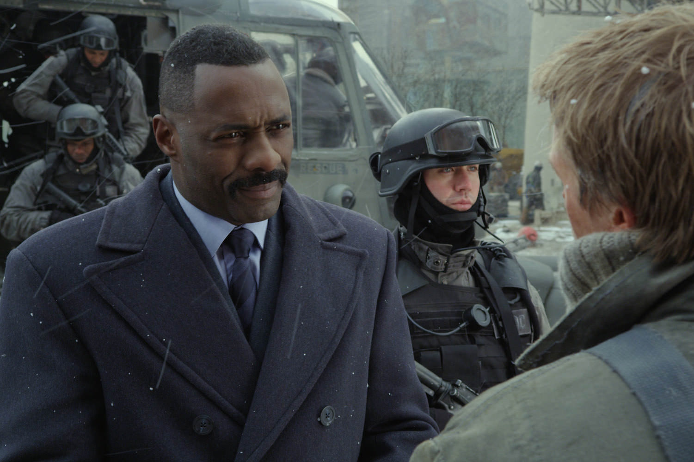

+++
type = "post"
titre = "<em>Pacific Rim</em>, Guillermo del Toro"
title = "Pacific Rim, Guillermo del Toro"
url = "/pacific-rim-toro"
date = "2013-07-13T09:24:09"
Lastmod = "2015-05-14T18:33:56"
cover = "pacific-rim-guillermo-del-toro.jpg"
categorie = [ "À voir" ]
tag = [ "Action", "Apocalypse", "Blockbuster", "Guerre", "Monstres", "Robot", "Science-Fiction" ]
createur = [ "Guillermo del Toro" ]
acteur = [ "Charlie Day", "Charlie Hunnam", "Idris Elba", "Rinko Kikuchi", "Ron Perlman" ]
annee = [ "2013" ]
weight = 2013
saga = [ "Pacific Rim" ]
pays = [ "États-Unis" ]

+++

Faire combattre des monstres et des robots géants. Guillermo del Toro a d’abord cherché à se faire plaisir avec son dernier long-métrage et on imagine bien <em>Pacific Rim</em> comme la concrétisation d’un vieux rêve de gosse. Exploitant le genre nippon du « <em>kaijū eiga</em> » popularisé par le monstre le plus célèbre Godzilla, le film imagine un univers crédible et trouve un scénario en guise d’excuse pour justifier les combats les plus spectaculaires. Autant dire que <em>Pacific Rim</em> ne brille pas par l’originalité de son récit, mais ce n’est pas grave : ce film nous plonge dans un univers original extrêmement bien pensé et parfaitement réaliste. Une vraie réussite, qui rappelle un peu celle de James Cameron avec <a href="/avatar-james-cameron/" title="Avatar, James Cameron - À voir et à manger"><em>Avatar</em></a>, rien que ça. Ce blockbuster explosif est certainement le meilleur spectacle de l’été, à voir, mais à voir sur le plus grand écran possible.

Guillermo del Toro ne s’embarrasse pas avec de longues introductions. Quelques mots en ouverture suffisent à poser le décor et le contexte, avant de commencer le film à proprement parler. Film de science-fiction, <em>Pacific Rim</em> se déroule quelques années après l’époque contemporaine seulement, puisqu’il se déroule essentiellement vers 2025. Dans la veine apocalyptique du genre, le long-métrage a la bonne idée de ne pas faire venir le danger de l’espace, mais des fonds sous-marins : une faille spatio-temporelle permet à un ennemi inconnu d’envoyer d’énormes monstres tout détruire sur leur passage. Le cinéaste passe rapidement sur les débuts de ce qui va vite être appelée « guerre des <em>kaijū</em> », avec une présentation qui multiplie les images de télévision et les séquences catastrophes pour arriver directement à son premier combat entre un monstre et un « <em>Jaeger</em> ». Le petit nom de ces robots est en allemand, un bon résumé de leur caractère international : face à l’adversité, les pays ont rangé leurs différends pour s’unir dans leur conception. Ces combats sont bien le clou du spectacle et <em>Pacific Rim</em> en met plein la vue dès les toutes premières minutes avec l’attaque de San Francisco par un monstre, déjà très impressionnante. On n’a encore rien vu et les deux heures et des poussières de film sont ponctuées par des combats pas forcément très nombreux — cinq ou six en tout —, mais si spectaculaires qu’ils marquent bien au-delà de la projection. Ce rêve de gosse n’est peut-être pas celui de tous le monde, mais Guillermo del Toro réveille sans doute un plaisir coupable chez beaucoup de monde. Difficile de ne pas se réjouir face au bestiaire inventé par le cinéaste pour tous les amateurs de monstres, ou face à ces robots géants pour tous ceux qui, plus jeunes, ont joué avec des figures similaires… Qu’on en ait rêvé ou pas, on ne peut qu’être abasourdi face au déchainement de violence spectaculaire à chaque combat. Contrairement à d’autres cinéastes, celui de <em>Pacific Rim</em> ne bouge pas la caméra dans tous les sens, ni ne multiplie les plans extrêmement rapides pour impressionner. Loin des combats souvent illisibles d’un Michael Bay, Guillermo del Toro sait au contraire en mettre plein la vue, tout en gardant une lisibilité parfaite. <a href="/transformers-3-face-cachee-lune-bay/" title="Transformers 3 : La Face cachée de la Lune, Michael Bay - À voir et à manger"><em>Transformers 3 : La Face cachée de la Lune</em></a> est enterré face à ce nouveau film, beaucoup plus spectaculaire.

À la manière d’<em>Avatar</em> ou, dans un autre genre, d’<a href="/inception-nolan/" title="Inception, Christopher Nolan - À voir et à manger"><em>Inception</em></a>, <em>Pacific Rim</em> frappe d’abord par sa cohérence. Il s’agit de science-fiction, certes, mais le cinéaste s’interdit toute facilité avec le genre et son univers est parfaitement vraisemblable, ce qui est extrêmement important. Le plus impressionnant concerne les tailles des monstres et des robots : Guillermo del Toro imagine ses créatures hautes ou longues de plusieurs mètres et il s’y tient pendant tout le film. Au départ, on découvre les monstres seuls qui attaquent des villes entières, comme s’il ne s’agissait que de châteaux de sable. L’effet est déjà saisissant, mais il est renforcé quand les robots entrent en action. Conçus pour se battre contre les <em>kaijū</em>, ils sont aussi grands et massifs et les humains ont presque l’air de fourmis à côté. Dans ces conditions, le respect des proportions est primordial et <em>Pacific Rim</em> s’en tire vraiment très bien. Une des scènes les plus époustouflantes du film se déroule dans les rues de Hong-Kong, alors qu’un robot combat avec difficulté un monstre plus puissant que d’habitude. Pour l’achever, le robot en question prend un porte-conteneur à deux mains et le balance sur le monstre : cette séquence assez brève est particulièrement réussie et elle montre bien le soin du cinéaste pour ne pas casser la vraisemblance de son univers. Autre exemple avec les mouvements des robots : ces monstres d’acier sont un peu lourdauds, ce qui est logique avec une telle masse de métal, mais Guillermo del Toro imagine des réacteurs positionnés au niveau des coudes pour accélérer un poing, ou dans le dos pour avancer plus rapidement. Ce sont des petits détails, mais ils font que <em>Pacific Rim</em> reste en permanence crédible et c’est une vraie réussite. On apprécie aussi la fusion entre un univers occidental et l’origine asiatique du récit : l’action se déroule en grande partie en Chine — pour une fois qu’un blockbuster n’est pas centré uniquement sur les États-Unis… — et les <em>Jaeger</em> combattent avec plusieurs armes, parmi lesquelles… une épée. Difficile de ne pas y voir un lien avec les combats de samouraï, mais à une échelle et une époque légèrement différente.

<em>Pacific Rim</em> ne souffre pas de la critique quant à son univers général, mais on n’en dira malheureusement pas autant de son scénario. Sans être mauvaise, l’histoire racontée par Guillermo del Toro est très banale et elle n’est pas compensée par un univers aussi riche et novateur, comme c’était le cas dans <em>Avatar</em>. Très vite, on s’aperçoit que ce qui motive le plus le réalisateur, et ses spectateurs par la même occasion, ce sont les combats entre robots et monstres. L’humain passe au second plan, un paradoxe dans un film catastrophe hollywoodien, mais il est vrai que <em>Pacific Rim</em> n’est pas le blockbuster habituel. Il y a bien des personnages principaux, il y a même une histoire d’amour entre le héros — Charlie Hunnam, musclé et plutôt bon — et la seule fille du scénario — Rinko Kikuchi, efficace —, mais tout cela n’a pas vraiment d’importance. Ces personnages sont esquissés rapidement et réduits à quelques traits de caractère, ils n’ont aucune existence propre et sont souvent réduits à leurs robots. Ce qui n’est pas une mauvaise idée d’ailleurs et on apprécie particulièrement le concept de connexion neuronale des deux pilotes qui aurait mérité d’être plus exploitée, même s’il offre la possibilité à Guillermo del Toro d’offrir une très belle séquence de souvenir. Les personnages sont caricaturaux et ils sont prévisibles : <em>Pacific Rim</em> déçoit un petit peu en n’offrant aucune véritable surprise quant à sa conclusion, même si on apprécie sa fin fermée, une bonne surprise dans le domaine des blockbusters<a href="#fn-9911-1" rel="footnote">1</a>. Le personnage de l’officier en charge des <em>Jaeger</em> — Idris Elba, excellent — n’est pas sans intérêt, mais il manque lui aussi de profondeur, même si au-delà des personnages, c’est le scénario qui manque de cohérence à la fin. Difficile de pointer ses faiblesses sans dévoiler l’intrigue, mais Guillermo del Toro semble bizarrement sacrifier la cohérence de son univers, avec un récit qui devient brusquement invraisemblable. Dommage, d’autant que les bonnes idées sont toujours présentes, notamment avec le personnage du trafiquant qui vit grâce aux dépouilles des <em>kaijū</em> — Ron Perlman, impeccable comme toujours.

Vous aimez les gros monstres et les robots ? Ne passez sous aucun prétexte à côté de <em>Pacific Rim</em>, un blockbuster explosif qui signe un nouveau record en matière de spectacle au cinéma. Guillermo del Toro fait mieux que tout ce que l’on a pu voir jusque là en matière d’effets — avec, au passage, une 3D efficace et utile, c’est trop rare pour ne pas le signaler — et d’idées spectaculaires. Pendant un petit peu plus de deux heures, on en prend plein la vue, à tel point que l’on sort un peu lessivé de la séance. Ce n’est pas une critique et <em>Pacific Rim</em> est un film à voir sur le plan grand écran possible pour en profiter un maximum. Dommage dans ces conditions que l’histoire soit un peu faible, mais on pardonne sans peine Guillermo del Toro : ce récit n’est qu’un prétexte pour justifier les affrontements entre <em>Jaeger</em> et <em>kaijū</em>, entre robots et monstres, et ces affrontements sont complètement réussis. Un vrai plaisir coupable, à ne pas rater…

<h3>Vous voulez m&rsquo;aider ?</h3>
<ul>
<li><a href="http://www.amazon.fr/gp/product/B00ETZ3SJM/ref=as_li_ss_tl?ie=UTF8&tag=leblogdenic07-21&linkCode=as2&camp=1642&creative=19458&creativeASIN=B00ETZ3SJM">Acheter le film en Blu-Ray sur Amazon</a></li>
<li><a href="http://www.amazon.fr/gp/product/B00DZL9AQQ/ref=as_li_ss_tl?ie=UTF8&tag=leblogdenic07-21&linkCode=as2&camp=1642&creative=19458&creativeASIN=B00DZL9AQQ">Acheter le film en DVD sur Amazon</a></li>
<li><a href="https://itunes.apple.com/fr/movie/pacific-rim/id713997037">Acheter ou louer le film sur l&rsquo;iTunes Store</a></li>
</ul>

<ol>
<li id="fn-9911-1">
Même si une suite est <a href="http://en.wikipedia.org/wiki/Pacific_Rim_(film)#Potential_sequel">apparemment en préparation</a>…&#160;<a href="#fnref-9911-1" rev="footnote">&#8617;</a>
</li>
</ol>

