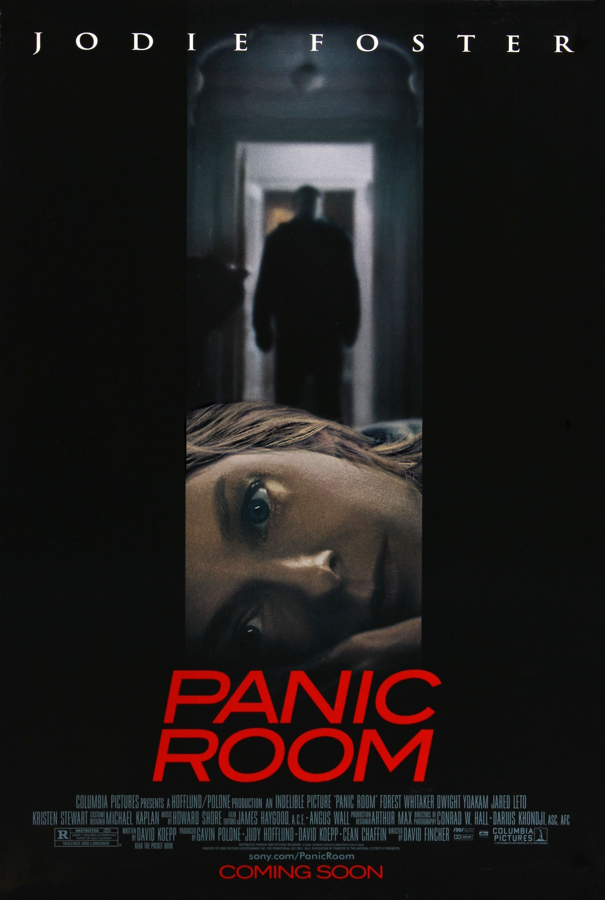
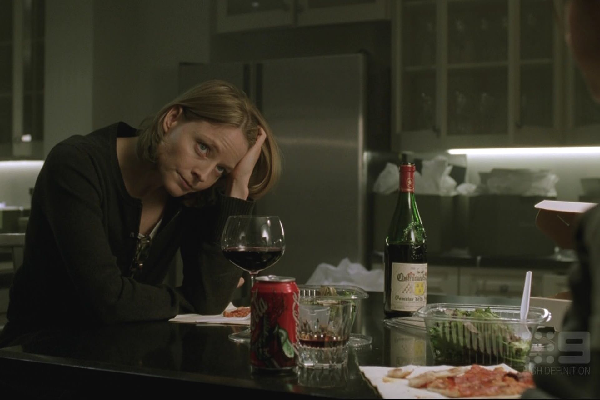
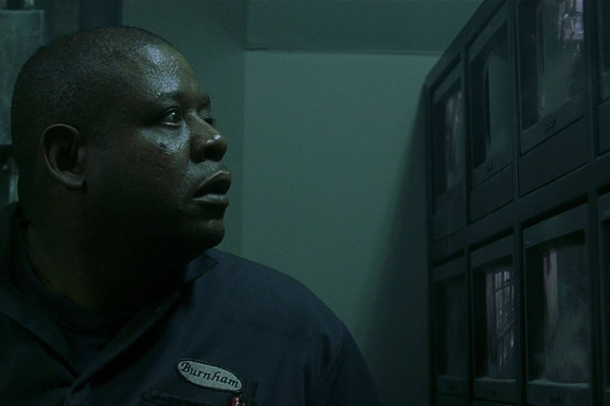

+++
titre = "<em>Panic Room</em>, David Fincher"
title = "Panic Room, David Fincher"
url = "/panic-room-fincher"
date = "2015-03-31T23:10:47"
Lastmod = "2015-03-31T23:14:11"
cover = "panic-room-david-fincher-jodie-foster-kristen-stewart.jpg"
position = "top"
categorie = [ "À voir" ]
tag = [ "Argent", "Braquage", "Famille", "Huis clos", "Suspense", "Thriller" ]
createur = [ "David Fincher" ]
acteur = [ "Dwight Yoakam", "Forest Whitaker", "Jared Leto", "Jodie Foster", "Kristen Stewart" ]
annee = [ "2002" ]
weight = 2002
pays = [ "États-Unis" ]

+++

Contrairement à certains de ses autres films, aux intrigues d&rsquo;une complexité folle, <em>Panic Room</em> est au contraire extrêmement simple. On peut même faire difficilement plus simple, puisque David Fincher se contente, pendant deux heures, d&rsquo;un huis clos dans une maison. Des voleurs veulent entrer dans un coffre fort à taille humaine imprenable, une mère et sa jeune fille veulent en sortir. C&rsquo;est une impensable <em>a priori</em> insurmontable et c&rsquo;est aussi l&rsquo;unique sujet du cinquième long-métrage du cinéaste. Comment s&rsquo;en sortir avec aussi peu de matériau ? <em>Panic Room</em> prouve qu&rsquo;un sens aiguisé de la mise en scène pour entretenir un suspense haletant suffit largement. David Fincher n&rsquo;a peut-être pas beaucoup à raconter, mais ce n&rsquo;est pas grave : un huis clos époustouflant, épuisant.

<em>Panic Room</em> ne s&rsquo;embarrasse pas de préliminaires : le film commence avec la visite d&rsquo;une mère récemment séparée de son mari volage et de sa fille d&rsquo;une immense maison à Manhattan. Un bien rare, prévient l&rsquo;agent immobilier qui en vante tous les mérites, de l&rsquo;ascenseur à la « <em>panic room</em> », ces pièces sécurisées et impénétrables qui font office de coffre-fort pour ses habitants. Le plan suivant, c&rsquo;est l&rsquo;emménagement et bien vite, la première nuit passée dans cette nouvelle maison. On sent que David Fincher est impatient de passer à la suite, mais il prend malgré tout le temps de nous présenter ses deux personnages principaux, Sarah et sa mère, Meg. On comprend que cette dernière s&rsquo;est séparée récemment de son riche époux et on comprend que sa fille lui en veuille un peu…, mais tout cela n&rsquo;a pas vraiment d&rsquo;importance à dire vrai. Bien vite, c&rsquo;est la nuit et malchance, trois voleurs arrivent pour voler l&rsquo;immense demeure. <em>Panic Room</em> les présente comme des professionnels sérieux, qui savent précisément ce qu&rsquo;ils font. De fait, l&rsquo;un d&rsquo;eux a installé la chambre forte dans la maison et il sait exactement comment elle fonctionne. Et un autre a une information essentielle : à l&rsquo;intérieur de la <em>panic room</em>, cachés dans un coffre-fort que personne d&rsquo;autre ne connaît, trois millions de dollars n&rsquo;attendent qu&rsquo;à être récupérés. Ils avaient tout prévu, sauf une chose : la maison devait être vide et ils tombent sur la mère et sa fille, endormies.

À partir de ce point de départ, David Fincher fait tenir tout un film en huis clos, avec un suspense très souvent extrêmement intense. Les voleurs commencent par agir aussi discrètement que possible, mais Meg finit par se rendre compte de ce qui se passe, elle va chercher sa fille et part s&rsquo;enfermer avec elle dans le coffre. Les trois autres s&rsquo;en rendent compte trop tard et ils n&rsquo;ont alors plus le choix : ils ne pourront pas entrer par la force, il faut forcer les deux occupantes à sortir. <em>Panic Room</em> suit ainsi plusieurs pistes qui relancent à chaque fois et l&rsquo;intrigue, et surtout le suspense. Les assaillants essaient d&rsquo;asphyxier Meg et Sarah, mais cela ne fonctionne pas. De l&rsquo;autre côté des épais murs d&rsquo;acier, les deux femmes tentent tout pour appeler la police, y compris du morse avec les voisins. Naturellement, certains rebondissements sont un peu grossiers et l&rsquo;ensemble de l&rsquo;intrigue peut facilement être remise en cause d&rsquo;une manière ou d&rsquo;une autre, mais on s&rsquo;en fiche, car le suspense est communicatif. On est pris par le film et David Fincher sait admirablement bien présenter ses différentes péripéties, si bien que l&rsquo;on ne s&rsquo;ennuie jamais et que l&rsquo;on a au contraire toujours envie de savoir comment les deux partis vont pouvoir s&rsquo;en tirer. Il faut dire que la mise en scène est techniquement impressionnante, mais pas dans l&rsquo;esbroufe. Elle se met au contraire au service de l&rsquo;histoire et les mouvements de caméra virtuoses dans toute la maison servent autant à donner une vue d&rsquo;ensemble qu&rsquo;à renforcer la claustrophobie que l&rsquo;on finit par ressentir dans ce huis clos. C&rsquo;est extrêmement bien mené et on est forcément happé par <em>Panic Room</em>, d&rsquo;une efficacité redoutable.

Avec très peu d&rsquo;éléments, David Fincher parvient à tirer un film prenant et suffisamment cohérent pour qu&rsquo;on le suive avec beaucoup de plaisir. <em>Panic Room</em> est parfois un petit peu tiré par les cheveux, c&rsquo;est vrai, mais on se prend au jeu malgré tout et on craint pour les personnages. Dans le coffre, Jodie Foster assure son rôle de mère avec une pointe de folie qui convient très bien au personnage, tandis que Kristen Stewart à ses côtés est méconnaissable. De l&rsquo;autre côté, les trois malfrats sont convaincants, de Forest Whitaker à Jared Leto, en passant par le plus rare Dwight Yoakam. Parfaitement maîtrisé, souvent bluffant sur le plan technique, <em>Panic Room</em> est un vrai plaisir à (re)voir !

<h3>Vous voulez <a href="http://voiretmanger.fr/soutien/">m&rsquo;aider</a> ?</h3>
<ul>
<li><a href="http://www.amazon.fr/gp/product/B00017NUZO/ref=as_li_ss_tl?ie=UTF8&amp;tag=leblogdenic07-21&amp;linkCode=as2&amp;camp=1642&amp;creative=19458&amp;creativeASIN=B00017NUZO">Acheter le film en DVD sur Amazon</a></li>
<li><a href="https://itunes.apple.com/fr/movie/panic-room/id369793479">Acheter ou louer le film sur l&rsquo;iTunes Store</a></li>
</ul>

