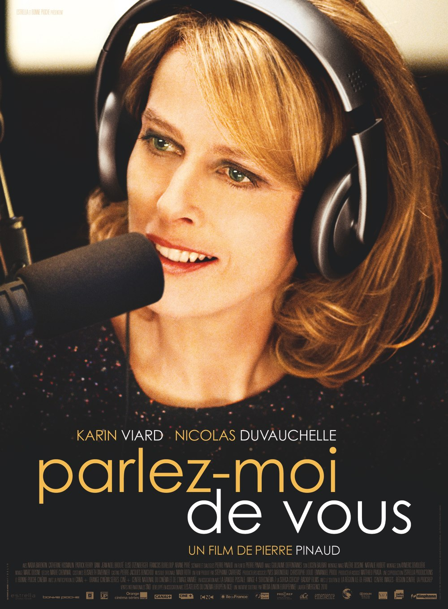
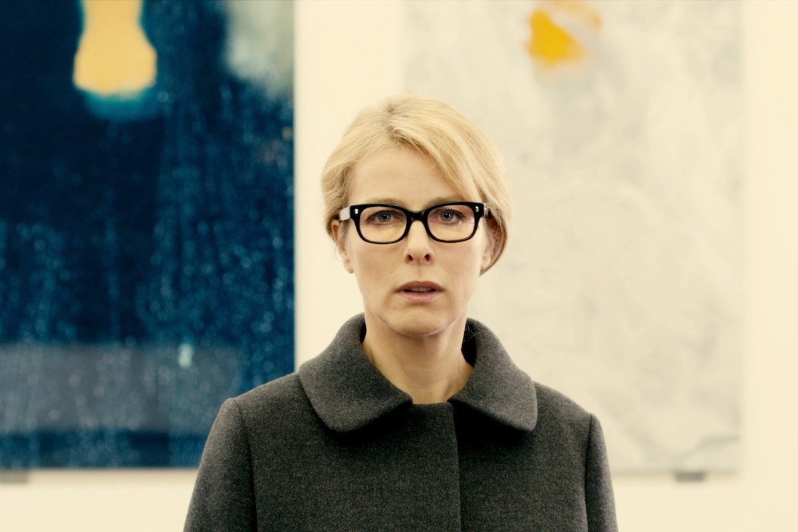
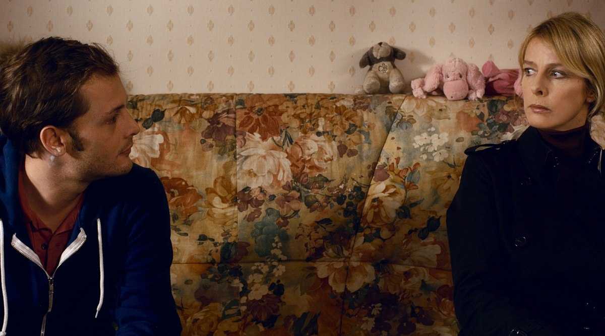

+++
type = "post"
titre = "Parlez-moi de vous, Pierre Pinaud"
title = "Parlez-moi de vous, Pierre Pinaud"
url = "/parlez-moi-de-vous-pinaud"
date = "2012-04-05T23:41:52"
Lastmod = "2012-04-05T23:46:34"
cover = "parlez-moi-de-vous-pinaud.jpg"
categorie = [ "À voir" ]
tag = [ "Amour", "Drame", "Famille", "Vite oublié" ]
createur = [ "Pierre Pinaud" ]
acteur = [ "Karin Viard", "Nicolas Duvauchelle" ]
annee = [ "2012" ]
weight = 2012
pays = [ "France" ]

+++

Premier film de Pierre Pinaud, <em>Parlez-moi de vous</em> dresse d&rsquo;abord un portrait touchant, celui d&rsquo;une animatrice à la radio célèbre pour sa franchise et sa liberté derrière le micro, mais incapable d&rsquo;entretenir une relation dans la vie. Le film n&rsquo;évite pas les clichés du genre, mais il est en quelque sorte sauvé par son actrice principale. Intéressant, mais pas inoubliable pour autant.

Pour des dizaines de milliers d&rsquo;auditrices, Mélina est d&rsquo;abord une voix et de précieux conseils. Cette animatrice à Radio France s&rsquo;occupe d&rsquo;une tranche horaire le soir : deux heures pendant lesquelles elle reçoit des appels de femmes, les écoute et répond à leurs questions. Les sujets sont variés, mais il s&rsquo;agit souvent de vie amoureuse, voire de sexualité. Mélina a ses fans qui lui envoient chaque semaine des centaines de lettres de remerciement. Au téléphone, on sent les voix émues de femmes qui ont une reconnaissance sincère et émouvante envers l&rsquo;animatrice. La voix Mélina est une vraie star, mais la femme qui se cache derrière ce pseudo reste une inconnue totale. Claire ne veut pas se montrer, personne ne doit la prendre en photo et l&rsquo;associer à Mélina. Si elle y tient particulièrement, ce n&rsquo;est pas vraiment pour des raisons marketing : Claire est aussi timide et coincée dans la vraie vie, que Mélina est libre et à l&rsquo;aise dans le poste de radio. Une rencontre risque pourtant de bouleverser cet équilibre précaire…

Pierre Pinaud débute son film sur une fausse piste. Claire est une orpheline abandonnée très jeune par sa mère qu&rsquo;elle recherche activement. L&rsquo;animatrice gagne très bien sa vie à en juger à son appartement sur les toits du XVIe arrondissement et elle embauche une entreprise qui piste sa mère biologique. <em>Parlez-moi de vous</em> n&rsquo;a rien d&rsquo;un film à suspense toutefois : on sait dès le départ que l&rsquo;identité maternelle a été découverte. Claire quitte immédiatement les beaux quartiers parisiens pour la banlieue populaire où vit celle qui lui a donné la vie, mais elle n&rsquo;ose pas se montrer. Sa curiosité lui permet de surmonter sa timidité maladive et elle prend contact avec la famille de sa mère par le biais du secours populaire. C&rsquo;est alors qu&rsquo;elle rencontre Lucas, le beau-petit-fils de sa mère. Le vrai sujet de <em>Parlez-moi de vous</em> s&rsquo;ouvre alors : la différence d&rsquo;âge n&rsquo;empêche pas le coup de foudre, mais le jeune homme va avoir toutes les peines du monde à convaincre Claire de se laisser emporter par l&rsquo;amour. L&rsquo;intrigue amoureuse de <em>Parlez-moi de vous</em> manque malheureusement de crédibilité : Pierre Pinaud ne parvient pas à éviter les clichés du genre. Les différentes étapes de l&rsquo;amour sont ici toutes réalisées méticuleusement et le spectateur n&rsquo;est jamais surpris par l&rsquo;intrigue qui suit des rails dès la première rencontre entre les deux personnages. C&rsquo;est dommage, tant cette histoire se révélait potentiellement passionnante, mais l&rsquo;émotion semble ici constamment forcée et on peine à entrer dans cette histoire d&rsquo;amour.

Fort heureusement, <em>Parlez-moi de vous</em> propose aussi un sujet bien plus intéressant en dressant un très beau portrait. Le personnage de Mélina/Claire est fascinant et Pierre Pinaud l&rsquo;a très bien exploité dans son film. Cette animatrice de radio est parfaitement à l&rsquo;aise derrière le micro. Elle sait écouter d&rsquo;autres femmes et surtout leur répondre avec les mots justes, tantôt pour les réconforter, tantôt pour les encourager. Cette belle femme semble parfaitement à l&rsquo;aise dans la vie, mais elle change du tout au tout hors du studio. Claire est une femme coincée, timide à en être malade et surtout complètement soumise par d&rsquo;innombrables tocs. Maniaque à l&rsquo;extrême et hypocondriaque, elle refuse de manger ou même de s&rsquo;asseoir loin de son appartement. Claire ne veut rien d&rsquo;autre que vivre seule dans son appartement avec son chien et elle va jusqu&rsquo;à s&rsquo;enfermer des heures durant dans un petit placard qui ne contient que des souvenirs de sa mère qui l&rsquo;a abandonné. <em>Parlez-moi de vous</em> dresse le portrait d&rsquo;une femme complexée qui a choisi d&rsquo;écouter les autres femmes évoquer leurs problèmes pour, en quelque sorte, régler les siens. Quand Mélina répond aux auditrices qui l&rsquo;appellent, elle répond en fait à elle-même et quand elle encourage une femme à retrouver son passé, c&rsquo;est en fait elle qui cherche à se convaincre de retrouver sa mère et d&rsquo;enfin tourner la page. Ce portrait est beaucoup plus fin et intéressant qu&rsquo;escompté et Pierre Pinaud se rattrape d&rsquo;ailleurs avec une fin bien loin des clichés attendus. On ne la détaillera pas pour laisser un peu de suspense, mais cette fin oblige à réévaluer <em>Parlez-moi de vous</em>. Ce n&rsquo;est pas suffisant pour en faire un grand film, mais c&rsquo;est mieux qu&rsquo;escompté.

On ne s&rsquo;attardera pas sur la mise en scène de Pierre Pinaud, classique et sans grand intérêt. <em>Parlez-moi de vous</em> hésite parfois entre plusieurs genres et même s&rsquo;il reste résolument un drame, il tend parfois à la comédie sociale plus légère, sans toutefois assumer complètement cette tendance. La confrontation de la bourgeoise parisienne aux bénévoles du Secours populaire donne lieu à une ou deux scènes cocasses, quoiqu&rsquo;un peu téléphonées, mais c&rsquo;est à peu près tout. <em>Parlez-moi de vous</em> reste sur une ligne sérieuse, un peu trop peut-être : Pierre Pinaud aurait peut-être gagné à se laisser aller à un peu de fantaisie. Son film tient en grande partie sur les épaules de Karin Viard : l&rsquo;actrice n&rsquo;a plus besoin de prouver son talent, elle montre ici encore qu&rsquo;elle incarne avec une force rare ses personnages. Elle incarne à merveille cette femme complexe et ses regards noirs lancés à de nombreuses reprises sont simplement exquis.

<em>Parlez-moi de vous</em> n&rsquo;est pas totalement réussi. Le film de Pierre Pinaud accumule trop de clichés, ses ficelles sont trop grosses pour vraiment susciter l&rsquo;enthousiasme. La fin surprend pourtant et sauve un peu le film autant qu&rsquo;elle amène le spectateur à reconsidérer en partie ce qui précède. <em>Parlez-moi de vous</em> ne sort pas de la catégorie des <a href="http://voiretmanger.fr/tag/vite-oublie/">vite oubliés</a> pour autant, mais il mérite quand même d&rsquo;être vu, ne serait-ce que pour l&rsquo;interprétation de Karin Viard et son personnage fascinant.

Parlez-moi de vous <em>sortira en DVD le 11 mai 2012.</em>

<h3>Vous voulez m&rsquo;aider ?<a href="#footnote_0_6122" id="identifier_0_6122" class="footnote-link footnote-identifier-link" title="&Agrave; propos de la publicit&eacute;&hellip;">1</a></h3>
<ul>
<li><a href="http://www.amazon.fr/gp/product/B0076QXHFQ/ref=as_li_ss_tl?ie=UTF8&amp;tag=leblogdenic07-21&amp;linkCode=as2&amp;camp=1642&amp;creative=19458&amp;creativeASIN=B0076QXHFQ">Acheter le film en DVD sur Amazon</a></li>
</ul>

<ol class="footnotes"><li id="footnote_0_6122" class="footnote"><a href="http://voiretmanger.fr/a-propos/publicite/">À propos de la publicité…</a> [<a href="#identifier_0_6122" class="footnote-link footnote-back-link">&#8617;</a>]</li></ol>
