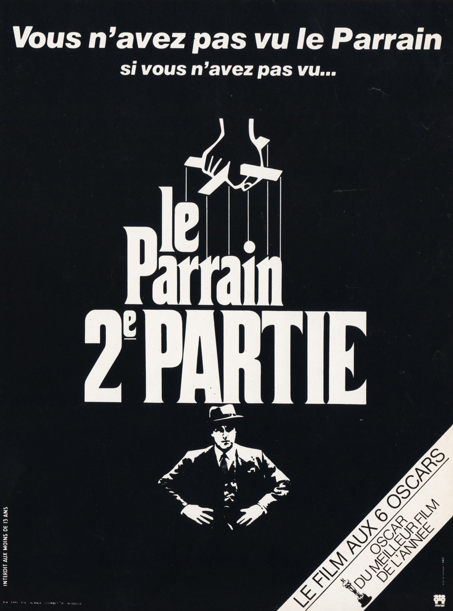
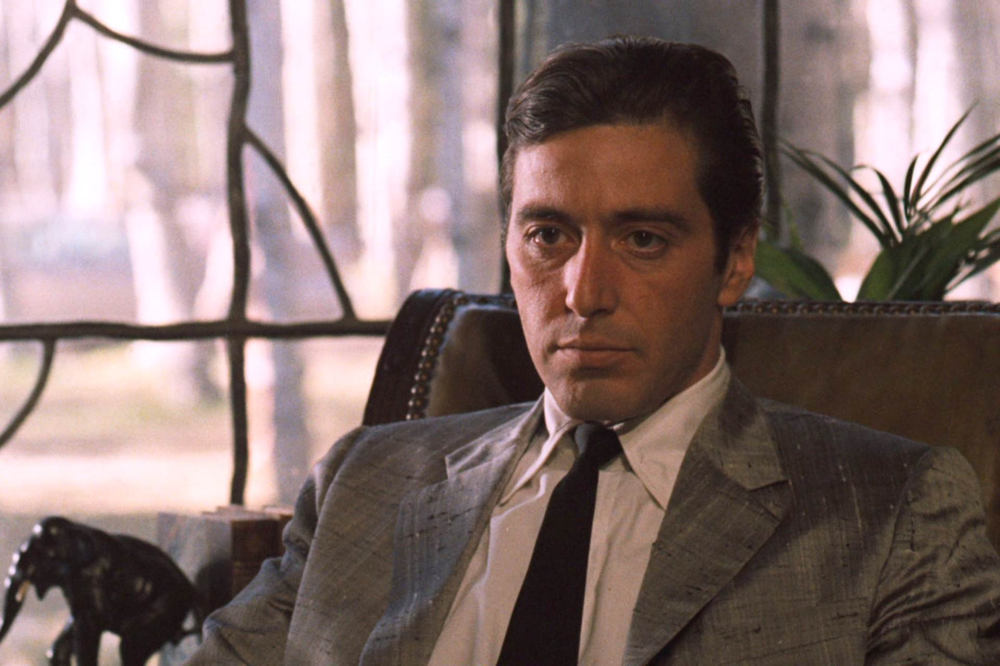
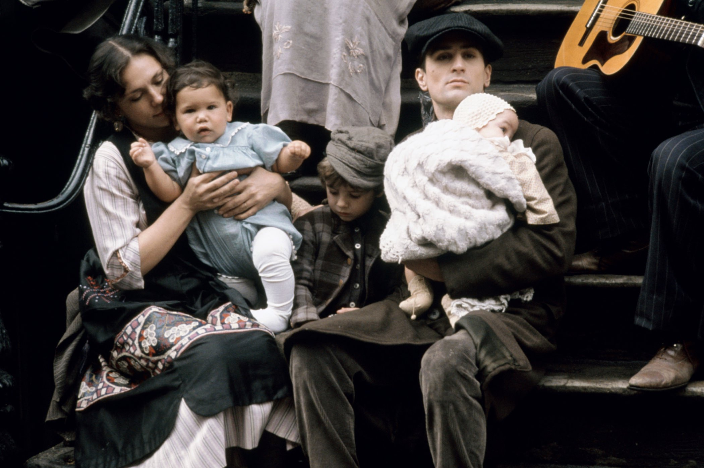

+++
type = "post"
titre = "<em>Le Parrain, 2e partie</em>, Francis Ford Coppola"
title = "Le Parrain, 2e partie, Francis Ford Coppola"
url = "/parrain-partie-2-coppola"
date = "2014-07-13T14:15:48"
Lastmod = "2014-07-13T21:17:01"
cover = "le-parrain-2-al-pacino.jpg"
categorie = [ "À voir" ]
tag = [ "Adaptation littéraire", "Drame", "Famille", "Histoire", "Mafia", "Politique", "Procès", "Saga" ]
createur = [ "Francis Ford Coppola" ]
acteur = [ "Al Pacino", "Diane Keaton", "John Cazale", "Robert De Niro", "Robert Duvall" ]
annee = [ "1975" ]
weight = 1975
saga = [ "Le Parrain" ]
pays = [ "États-Unis" ]
original = "Mario Puzo's The Godfather: Part II"

+++

À la surprise générale, <a href="http://voiretmanger.fr/parrain-coppola/"><em>Le Parrain</em></a> est un immense succès, c’est même un record au box-office à sa sortie. Face à un tel succès, une suite s’impose, mais cette fois, Francis Ford Coppola a les pleins pouvoirs. La méfiance des studios est un mauvais souvenir, le cinéaste dispose d’un meilleur budget et surtout de la confiance des producteurs pour écrire une suite à la hauteur. Le premier volet laisse envisager une suite assez facilement : on quittait la famille Corleone alors que Mickael, le cadet, a pris les rênes et impose son pouvoir non seulement à New York, mais aussi à Las Vegas où la famille mafieuse s’installe. Une suite était donc logique, mais c’était sans compter sur le réalisateur, qui propose non pas simplement une séquelle, mais aussi la préquelle du premier volet. Ainsi, <em>Le Parrain, 2e partie</em> ne se contente pas de dévoiler le règle du nouveau Don Corleone, il raconte également l’enfance du premier parrain et surtout ses premiers pas comme mafieux. Un objectif ambitieux, pour un long-métrage encore plus long, mais encore moins ennuyeux si c’était possible. Une réussite époustouflante, à voir dans la foulée du premier épisode.

Il ne s’y destinait absolument pas, mais Mickael Corleone remplace son père à la tête de la famille quand ce dernier meurt, à la fin du premier long-métrage. On le retrouve ainsi parrain à son tour et <em>Le Parrain, 2e partie</em> évoque ses premières années à diriger quelques casinos et des affaires plus ou moins louches. Positionnant son long-métrage directement dans les pas de son prédécesseur, Francis Ford Coppola commence ce nouveau volet avec une scène très similaire à l’ouverture du premier : une fête de famille, entrecoupée de rencontres entre le parrain et ses sujets. Cette fois, le fils de Mickael célèbre sa communion, une fête essentielle dans cette communauté qui reste très religieuse. C’est donc une fête majestueuse, avec à nouveau un orchestre complet, des danses et la famille rassemblée au grand complet. Dans cette scène, Al Pacino a l’occasion de se faire remarquer : on avait déjà noté dans <em>Le Parrain</em> sa capacité à instiller la peur en gardant un calme parfait, mais c’est encore plus visible ici. Certes, son personnage s’énerve une fois ou deux, mais il reste surtout impassible et il forme un parrain <em>in fine</em> bien plus impressionnant que son père. Sa voix est peut-être moins typique, mais il est aussi bien plus violent que feu Don Corleone père : il n’hésite jamais à tuer quand il se sent menacé, y compris quand la menace vient de sa propre famille. Alors que <em>Le Parrain, 2e partie</em> évoque des temps compliqués pour la mafia, alors que l’étau gouvernemental se resserre, alors même que Mickael est appelé pour un procès qui doit statuer sur son implication dans plusieurs meurtres et autres actes illégaux, il continue ses actions, implacable. À bien des égards, ce nouveau parrain est pire que le premier : alors que le jeune soldat que l’on découvrait au début du premier film n’avait absolument pas envie d’entrer dans la mafia, il en fait non seulement partie, mais en outre il prend plaisir au pouvoir et se met à l’exercer n’importe comment, au détriment de sa famille.

Cette histoire aurait suffi à faire un bon film, mais Francis Ford Coppola ne s’arrête pas en si bon chemin. <em>Le Parrain, 2e partie</em> ne se contente pas de montrer l’ascension de Mickael, il la met en parallèle avec celle de Vito Corleone, son père. De fait, le long-métrage se divise en deux parties qui ne sont pas données successivement, mais qui s’entrecoupent en continu. En plus de l’histoire de Mickael à la fin des années 1950, on revient au début du siècle, puis dans les années 1910 pour découvrir les premiers pas de Vito. D’ailleurs, le film ouvre vraiment en Sicile, où l’on assiste à l’enterrement du père du garçon, alors âgé de neuf ans. Pendant que la famille marche derrière le cercueil, le parrain qui avait assassiné le père tue son fils ainé. Pour protéger son cadet, Vito, la mère se rend chez le parrain en question qui le condamne à son tour, par peur de la vengeance à l’âge adulte. Vito parvient à s’enfuir et il est envoyé aux États-Unis par des proches : on le découvre ainsi, un peu perdu dans les immenses bâtiments d’Ellis Island, à passer les contrôles de l’immigration. Plus tard, le cinéaste le filme dans les rues sales du quartier italien de New York ; Vito a alors une vingtaine d’années, il a fondé une famille avec sa femme et il découvre le système de la mafia. Avec une succession d’épisodes dans le passé, <em>Le Parrain, 2e partie</em> montre l’ambition du personnage qui n’a absolument pas envie de payer le gros italien qui contrôle le quartier, mais qui se verrait bien en revanche à sa place. On le voit nouer aussi ses premières relations d’amitié avec des proches qui le suivront par la suite — on les connait en fait déjà avec <em>Le Parrain</em> — et on assiste à la mise à mort du parrain et son remplacement. En juxtaposant ainsi les deux récits, Francis Ford Coppola ne cherche pas seulement à tout raconter et le choix de les entremêler n’a rien de gratuit. Le cinéaste présente en fait deux ascensions et deux accessions au pouvoir, mais avec deux personnalités radicalement différentes. Là où Vito monte au profit de sa famille, Mickael le fait au détriment de celle-ci et alors que le passé est plutôt heureux, le présent est plus dramatique.

Porté par deux acteurs exceptionnels — on a déjà évoqué Al Pacino, mais face à lui, le tout jeune Robert de Niro compose un Vito Corleone jeune extrêmement réussi —, ce deuxième volet de <a href="http://voiretmanger.fr/saga/le-parrain/">la saga</a> est une franche réussite. Moins intense que son aîné peut-être, <em>Le Parrain, 2e partie</em> est aussi plus dense et peut-être plus simple encore à suivre. Pendant près de 3h30, on ne s’ennuie jamais et Francis Ford Coppola compose une fresque à la fois passionnante et magnifique, portée par la <a href="https://itunes.apple.com/fr/album/la-parrain-trilogie/id591275952">musique de Nino Rota</a> qui imagine de nombreuses variantes autour du thème original, mais aussi par la photographie splendide de Gordon Willis. Un autre classique, à voir absolument après <em>Le Parrain</em> !

<h3>Vous voulez <a href="http://voiretmanger.fr/soutien/">m’aider</a> ?</h3>
<ul>
<li><a href="http://www.amazon.fr/gp/product/B003EN2SLE/ref=as_li_ss_tl?ie=UTF8&amp;tag=leblogdenic07-21&amp;linkCode=as2&amp;camp=1642&amp;creative=19458&amp;creativeASIN=B003EN2SLE">Acheter le film en Blu-ray sur Amazon</a></li>
<li><a href="http://www.amazon.fr/gp/product/B001B0LZ1G/ref=as_li_ss_tl?ie=UTF8&amp;tag=leblogdenic07-21&amp;linkCode=as2&amp;camp=1642&amp;creative=19458&amp;creativeASIN=B001B0LZ1G">Acheter le film en DVD sur Amazon</a></li>
<li><a href="https://itunes.apple.com/fr/movie/le-parrain-2-vost/id396331538">Acheter ou louer le film sur l’iTunes Store</a></li>
</ul>
<ul>
<li><a href="http://www.amazon.fr/gp/product/B001H8VBMK/ref=as_li_ss_tl?ie=UTF8&tag=leblogdenic07-21&linkCode=as2&camp=1642&creative=19458&creativeASIN=B001H8VBMK">Acheter la saga <em>Le Parrain</em> en Blu-ray sur Amazon</a></li>
<li><a href="http://www.amazon.fr/gp/product/B00DJYTGCC/ref=as_li_ss_tl?ie=UTF8&tag=leblogdenic07-21&linkCode=as2&camp=1642&creative=19458&creativeASIN=B00DJYTGCC">Acheter la saga <em>Le Parrain</em> en DVD sur Amazon</a></li>
</ul>

