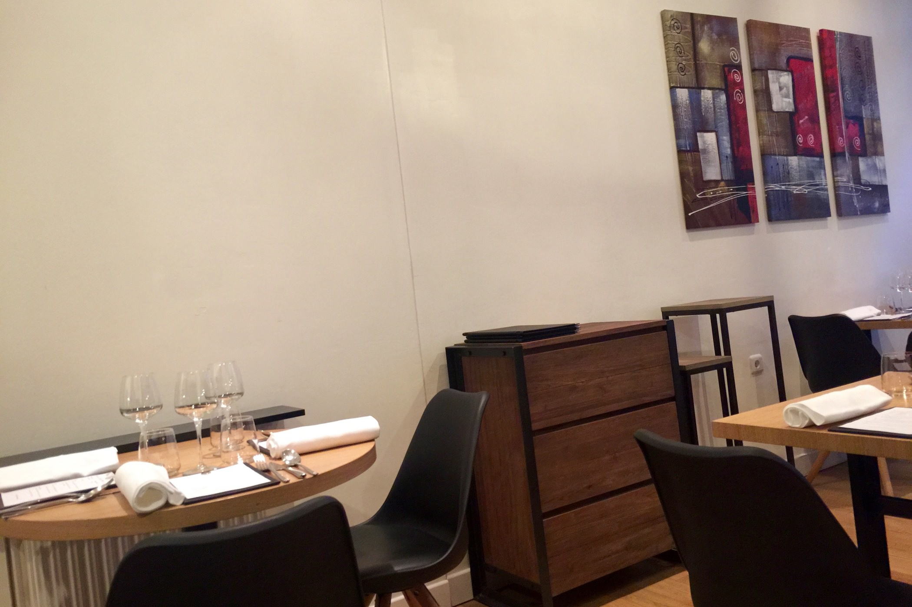
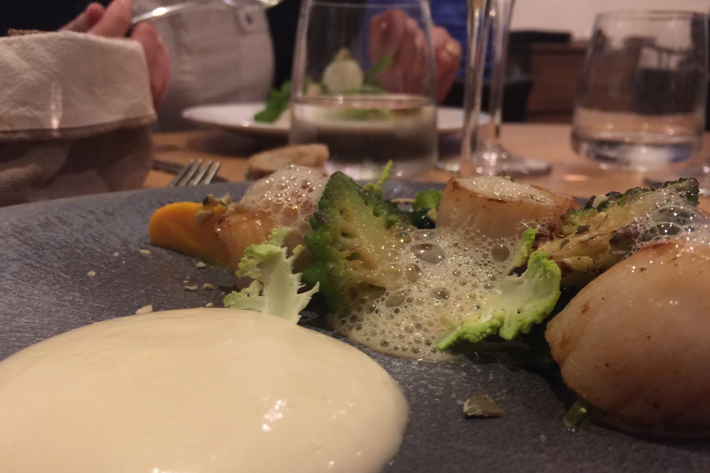
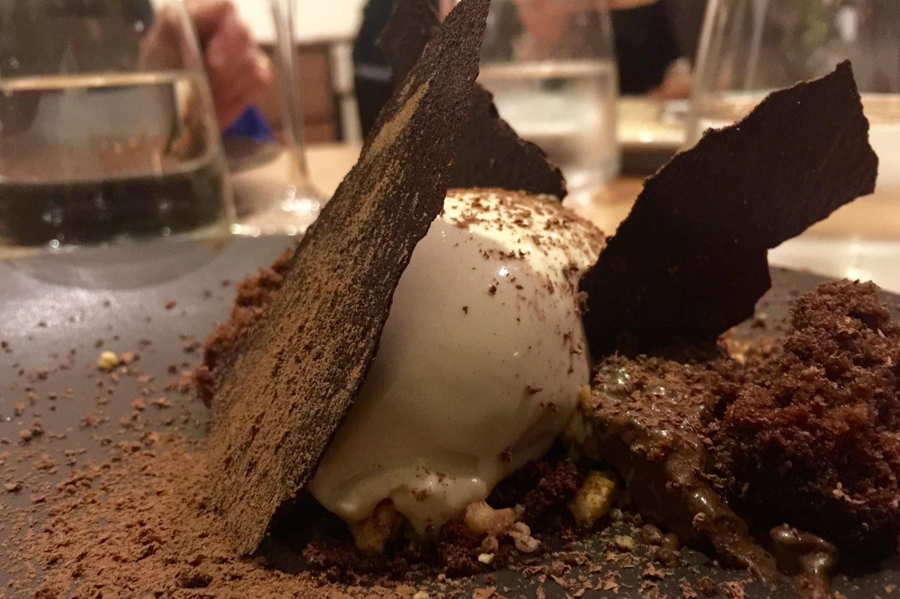

+++
type = "post"
titre = "Le Passe Temps à Lyon"
title = "Le Passe Temps à Lyon"
url = "/passe-temps-lyon"
date = "2015-04-05T00:27:55"
Lastmod = "2015-04-05T00:33:02"
cover = "passe-temps-lyon.jpg"
categorie = [ "À manger" ]
tag = [ "69006", "Cuisine contemporaine", "Cuisine coréenne", "Cuisine française" ]

+++

Le sixième arrondissement lyonnais ne manque pas de très bonnes adresses, mais on peut ajouter à la liste <a href="http://www.lyonresto.com/restaurant-Lyon/restaurant-Le-Passe-Temps-Lyon/restaurant-Le-Passe-Temps-Lyon-10791.html"><strong>Le Passe Temps</strong></a>. Derrière une devanture très commune, une salle meublée sobrement et une cuisine explosive. La cuisine est tenue par un chef coréen, mais qui exploite sa culture culinaire pour mieux revisiter la cuisine française. À la clé, des assiettes inventives et excellentes, des menus qui changent en permanence et des produits frais… une vraie réussite.

On n&rsquo;entre pas dans ce restaurant par hasard, et de toute façon ce sera sûrement complet si vous tentiez d&rsquo;y manger sans réservation. <strong>Le Passe Temps</strong> n&rsquo;a pas misé sur sa devanture pour vous séduire et ce n&rsquo;est pas la salle, décorée avec goût, mais très sobre, qui changera votre premier avis. Qu&rsquo;importe, on ne vient pas pour la décoration, mais pour manger, et cette salle a l&rsquo;avantage d&rsquo;être de taille réduite. Ce n&rsquo;est pas un grand restaurant et une vingtaine de convives peuvent y manger au maximum. La disposition des tables est un petit peu dense, mais la salle reste très agréable. Un serveur amène très vite un premier amuse-bouche, ce soir-là un choux fourré avec une crème au sésame. Une bonne entrée en matière pour découvrir une carte avec <a href="http://voiretmanger.fr/wp-content/2015/04/le-passe-temps-carte.jpg">un menu unique</a> qui change toutes les semaines… un bon signe pour la qualité et la fraicheur des produits.

Le menu change très régulièrement, mais vous aurez toujours le choix entre deux entrées, deux plats et deux desserts et à chaque fois entre un poisson et une viande, et entre du fromage ou un dessert sucré. Ce soir-là par exemple, on avait de la Saint-Jacques ou un tartare de bœuf, puis du lieu jaune ou du canard et enfin des fromages affinés par un M.O.F. lyonnais ou un dessert chocolaté. Dans tous les cas, la formule entrée/plat/dessert coûte 38 € le soir, un tarif très raisonnable quand on considère la qualité des assiettes. Sans compter que le restaurant est généreux en matière de mise en bouche : le choux au sésame n&rsquo;était qu&rsquo;un apéritif, on a ensuite deux amuse-bouches et qui pourraient très bien être des entrées si les quantités étaient plus généreuses. Du boudin noir avec une savoureuse purée de topinambours relevée de graines de sésame, puis un cromesqui de poisson avec une sauce citronnée toute en finesse : pour ouvrir l&rsquo;appétit et donner une idée de qui attend, on pouvait difficilement faire mieux. Précisons que l&rsquo;on peut aussi opter pour un menu « dégustation » qui consiste à se laisser porter pour 50 €.

Le repas commence vraiment avec les entrées et deux propositions très différentes, mais toutes deux séduisantes. D&rsquo;un côté, un tartare de bœuf revisité avec quelques éléments bien vus, comme de l&rsquo;asperge ou du Nashi. De l&rsquo;autre, des noix de Saint-Jacques d&rsquo;une fraicheur incontestable, bien moelleuses et savoureuses, entourées d&rsquo;un peu de butternut, de quelques épinards à peine fondus, d&rsquo;une émulsion d&rsquo;oursins qui apporte l&rsquo;iode à l&rsquo;assiette et de quelques sommités de choux fleur. C&rsquo;est très efficace et en même extrêmement gourmand, essentiellement grâce à la sauce au beurre blanc servie généreusement. Cette assiette résume bien l&rsquo;esprit du lieu, entre cuisine traditionnelle et modernité, et la suite confirme cette tendance. Le lieu jaune servi avec des petits pois frais et des suprêmes de pamplemousse est un plat diététique, mais qui n&rsquo;oublie pas la gourmandise, même si le canard avait à en revendre, de la gourmandise. Une belle pièce de viande cuite à la perfection et avec une peau croustillante comme il faut, une sauce réduite dans la plus grande tradition française, avec un peu de céleris, quelques échalotes, des toutes petites betteraves… un régal. Et si vous cherchiez de l&rsquo;originalité, le dessert imaginé autour de chocolat très corsé (jusqu&rsquo;à 82 % de cacao) et surtout d&rsquo;une glace au foin répond bien à cette attente. L&rsquo;association de l&rsquo;amertume du cacao avec la douceur de cette glace au goût herbacé subtil fonctionne parfaitement, avec une pointe de gourmandise supplémentaire apportée par des céréales caramélisées. Un régal pour bien terminer le repas !

La réussite est totale pour cette adresse qui ne paye pas de mine de l&rsquo;extérieur, mais qui fait des étincelles dans l&rsquo;assiette. <strong>Le Passe Temps</strong> compose des assiettes gourmandes et inventives à la fois, et la promesse de menus qui changent chaque semaine permet d&rsquo;y retourner régulièrement sans craindre la lassitude. Un coup de cœur dans le quartier, et en plus à des tarifs plutôt raisonnables. S&rsquo;il fallait formuler un regret, on aurait apprécié une association de vin pour chaque plat, mais ne boudons pas notre plaisir : c&rsquo;est un excellent restaurant lyonnais, à essayer !

