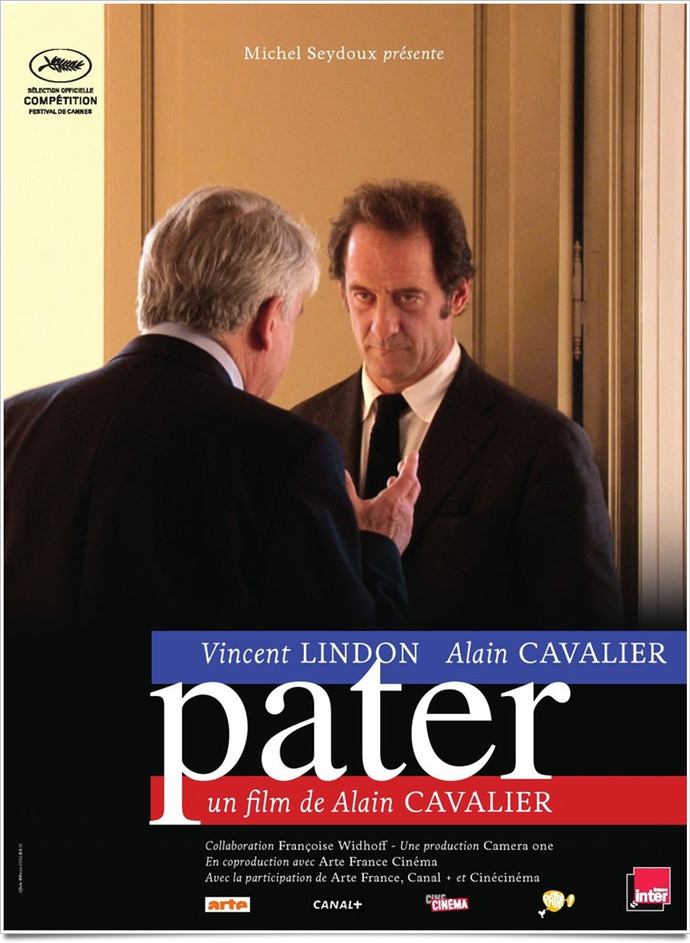
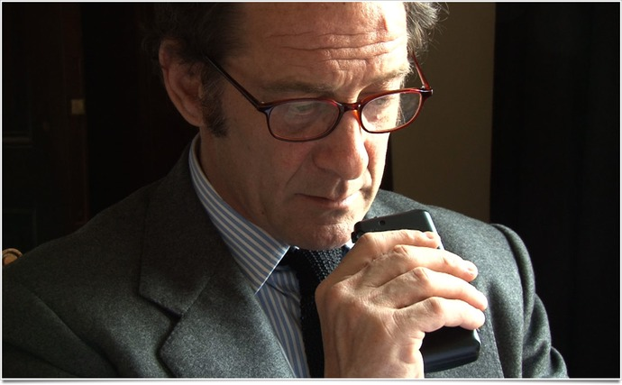
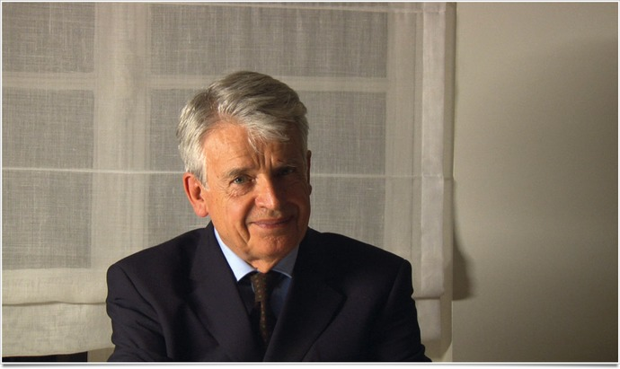

+++
titre = "Pater, Alain Cavalier"
title = "Pater, Alain Cavalier"
url = "/pater-cavalier"
date = "2011-06-28T00:11:47"
Lastmod = "2013-03-14T12:47:33"
cover = "pater.jpg"
categorie = [ "À voir" ]
tag = [ "Expérience", "Metafilm", "Politique", "Société" ]
createur = [ "Alain Cavalier" ]
acteur = [ "Alain Cavalier", "Vincent Lindon" ]
annee = [ "2011" ]
weight = 2011
pays = [ "France" ]

+++

Présenté à Cannes, <em>Pater</em> est le film qui a sans doute reçu le plus d&rsquo;éloges de la presse française sur place, tout en passant totalement inaperçu à l&rsquo;étranger et dans le palmarès. Et pour cause, le dernier film d&rsquo;Alain Cavalier est un objet étrange, pas une fiction, pas un documentaire non plus, un metafilm sur les rapports entre réalisateur et comédien, un film politique peut-être et même un film composé de vidéos de chats comme on en voit des milliers sur YouTube. Un patchwork complexe sur le papier, difficile à vendre pour un film extrêmement français dans son mode de fonctionnement et ses interrogations. Un film d&rsquo;une richesse folle tout en étant à l&rsquo;origine un projet très modeste. Bref, une œuvre difficile à cerner, mais ne vous laissez pas impressionner : <em>Pater</em> n&rsquo;est pas complexe et c&rsquo;est un excellent film, à ne pas rater.

Résumer <em>Pater</em> en quelques mots tient de la gageure. À l&rsquo;origine, il y a le projet d&rsquo;un film mis en scène par Alain Cavalier sur un premier ministre interprété par Vincent Lindon. Ce film n&rsquo;est pas présent comme un produit fini néanmoins, il se construit tout au long de <em>Pater</em>, devant nos yeux, comme le making-of du film. Le cinéaste ne veut rien cacher, ni les dépenses effectuées pour son film, aux frais du film, ni la place des caméras, pas plus que les artifices de cinéma. En ce sens, <em>Pater</em> offre une plongée dans le tournage d&rsquo;un film indépendant à petit budget… mais Alain Cavalier va beaucoup plus loin encore. La fiction qu&rsquo;il est en train de tourner devient à de nombreuses reprises la réalité, ou plutôt elle devient la réalité du film qui doit se tourner. Comme le dit très bien Vincent Lindon à la fin de <em>Pater</em>, « <em>Si c&rsquo;est dans un film, c&rsquo;est vrai</em> ». Il y a de cela chez Alain Cavalier, la foi dans le cinéma qui parvient à faire croire à la réalité. De fait, alors que le spectateur est constamment ramené à la réalité du tournage et du projet de tourner un film sur un film en train de se faire, il ne peut s&rsquo;empêcher par moments de croire à l&rsquo;action, d&rsquo;oublier qu&rsquo;Alain Cavalier et Vincent Lindon jouent un rôle pour un faux film et de croire à l&rsquo;idée qu&rsquo;ils sont effectivement Président et Premier ministre de la République française. Leur talent en tant qu&rsquo;acteur est indéniablement à l&rsquo;origine du doute, mais eux-mêmes finissent à se prendre à leur propre jeu.

Comme tout film sur le cinéma, <em>Pater</em> interroge beaucoup de concepts, jusqu&rsquo;à remettre en cause la place respective du réalisateur et de l&rsquo;acteur. Les rapports sont dans un premier temps très clairs et la fonction jouée dans la fiction renforce encore ces rapports de force, Vincent Lindon étant instinctivement en retrait. Dans la suite néanmoins, les rapports se brouillent. Alain Cavalier est aussi acteur dans son film et Vincent Lindon prend assez régulièrement la caméra pour filmer son réalisateur. Dans ces séquences-là, les rapports sont bien sûr inversés, mais il arrive aussi que l&rsquo;on voit Vincent Lindon filmer Alain Cavalier. Ce dernier laisse le premier jouer au réalisateur, mais garde <em>in fine</em> le contrôle sur son film. Que dire néanmoins du dernier repas dans le film, repas au cours duquel non seulement Vincent Lindon filme, mais il suggère en plus à Alain Cavalier une manière de monter la scène… Dans <em>Pater</em>, les frontières entre fiction et réalité ne sont jamais très nettes, le spectateur ne sait pas toujours si les deux acteurs sont dans leur rôle ou au naturel. Quand Vincent Lindon raconte son dialogue avec le propriétaire de son immeuble, est-ce un dialogue préparé pour le film ou une histoire racontée à Alain Cavalier ? Pour les acteurs et personnages eux-mêmes, les frontières sont parfois floues : Vincent Lindon se sent pousser des ailes et s&rsquo;étonne, en rigolant à moitié, que l&rsquo;on ne sollicite pas plus son avis sur les grandes questions de société…

<em>Pater</em> est également un film politique, sans être non plus le brulot que certains ont voulu voir. La question politique est évidemment au cœur des enjeux du film d&rsquo;Alain Cavalier puisqu&rsquo;il met en scène un président et son premier ministre. Quand le film commence, le président est déjà élu et il cherche à former un gouvernement avec une idée en tête : instaurer un salaire maximum légal, pour compléter le salaire minimum légal. Vincent Lindon joue le rôle d&rsquo;un ancien député et ministre ayant quitté les affaires politiques pour fonder une entreprise où le salaire maximum n&rsquo;est que dix fois supérieur au salaire minimum. Son idée est simple : appliquer cette même solution qui fonctionne si bien dans son entreprise au pays tout entier. Évidemment, la transposition n&rsquo;est pas aussi simple que sur le papier et d&rsquo;emblée les deux hommes évoquent le risque d&rsquo;être mal compris par le peuple. <em>Pater</em> est aussi le récit d&rsquo;une déception : une réforme sincèrement pensée pour le bien général n&rsquo;est pas comprise, sa sincérité n&rsquo;est pas reconnue et ces hommes qui étaient pourtant sincères ne savent pas comment réagir. La politique n&rsquo;est pas vue sous un angle &laquo;&nbsp;tous pourris&nbsp;&raquo; pour une fois, mais de manière finalement moins romanesque, plus réaliste aussi. Tout le monde n&rsquo;est pas gentil et naïf, les tensions sont bien présentes, mais ce regard moins contrasté et plus mesuré fait du bien dans le cinéma français. <em>Pater</em> n&rsquo;est pas un pamphlet politique, le film ne développe en fait qu&rsquo;une ou deux idées, mais c&rsquo;est un film indéniablement politique qui interroge ce qui fait l&rsquo;homme politique. Ne serait-ce finalement que le costume ?

<em>Pater</em> est enfin un film sur la relation entre deux hommes, une relation qui, comme son nom l&rsquo;indique bien, est filiale. Comme tout réalisateur est un peu le père de ses acteurs dans un film, Alain Cavalier entretient avec Vincent Lindon des rapports d&rsquo;amour qui évoque l&rsquo;amour filial. Il y a certes le jeu de la fiction, mais quand <em>Pater</em> revient à la réalité, les rapports entre les deux hommes éclatent au grand jour. Il y a de l&rsquo;admiration, de l&rsquo;intérêt réciproque… pour un peu on oublierait presque qu&rsquo;ils sont dans un rapport professionnel. Les deux hommes semblent eux-mêmes l&rsquo;oublier : quand Alain Cavalier évoque avec malice que Vincent Lindon n&rsquo;aime pas que le touche, on sent à la fois l&rsquo;amusement mêlé de tendresse chez le premier et l&rsquo;acceptation tendre chez le second. Les pères sont présents au-delà des deux personnages principaux, par l&rsquo;évocation de celui du cinéaste notamment qui fait le constat amer devant sa glace qu&rsquo;il est devenu comme son père, un homme qu&rsquo;il n&rsquo;a jamais aimé enfant, mais qu&rsquo;il aurait dû aimer.

<em>Pater</em> est indéniablement un film riche, une œuvre complexe qui pourra paraître foutraque et effrayer. Il est vrai que le dernier film d&rsquo;Alain Cavalier n&rsquo;a pas vraiment de justification, qu&rsquo;il avance en roue libre, mais si cela peut sembler constituer sa plus grande limite, c&rsquo;est aussi sa plus grande force. Film riche, mais pas complexe, <em>Pater</em> mérite vraiment d&rsquo;être vu : il faut se laisser porter, rien n&rsquo;en attendre et accepter l&rsquo;originalité de ce film qui forme un peu un genre à lui tout seul. À ne surtout pas manquer…

<h3>Vous voulez m&rsquo;aider ?<a href="#footnote_0_4935" id="identifier_0_4935" class="footnote-link footnote-identifier-link" title="&Agrave; propos de la publicit&eacute;&hellip;">1</a></h3>
<ul>
<li><a href="http://www.amazon.fr/gp/product/B005H3HXZU/ref=as_li_ss_tl?ie=UTF8&#038;tag=leblogdenic07-21&#038;linkCode=as2&#038;camp=1642&#038;creative=19458&#038;creativeASIN=B005H3HXZU">Acheter le film en DVD sur Amazon</a></li>
<li><a href="https://itunes.apple.com/fr/movie/pater/id466213533">Acheter ou louer le film sur l&rsquo;iTunes Store</a></li>
</ul>

<ol class="footnotes"><li id="footnote_0_4935" class="footnote"><a href="http://voiretmanger.fr/soutien/">À propos de la publicité…</a> [<a href="#identifier_0_4935" class="footnote-link footnote-back-link">&#8617;</a>]</li></ol>
