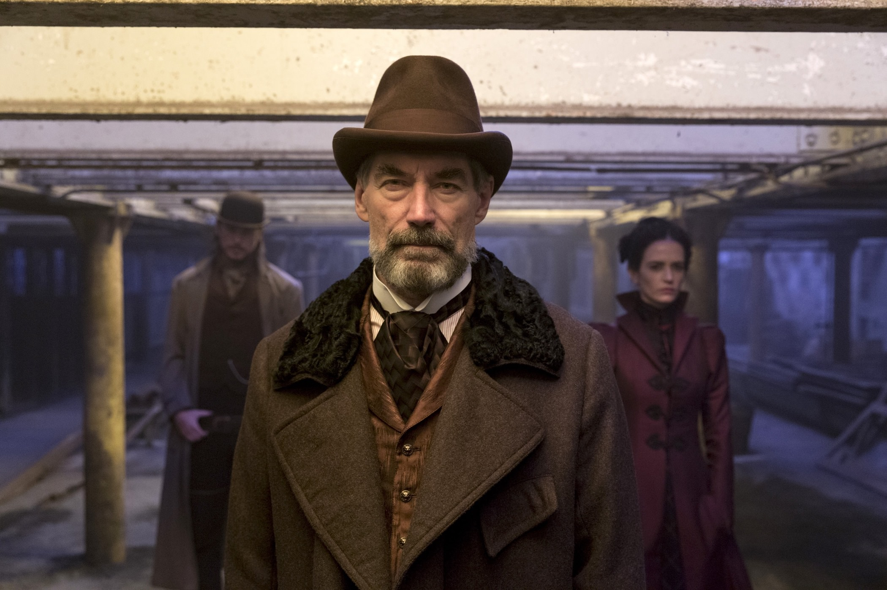
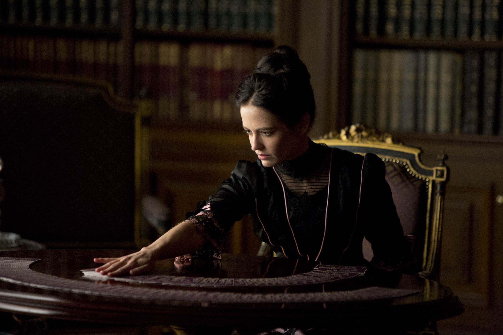
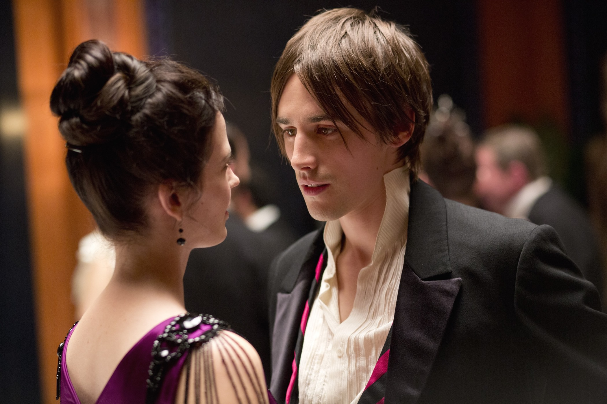

+++
type = "post"
titre = "<em>Penny Dreadful</em>, John Logan (Showtime)"
title = "Penny Dreadful, John Logan (Showtime)"
url = "/penny-dreadful-logan-showtime"
date = "2014-08-31T15:35:43"
Lastmod = "2014-08-31T15:46:08"
cover = "penny-dreadful-showtime.jpg"
categorie = [ "À voir" ]
tag = [ "Enquête", "Famille", "Fantastique", "Horreur", "Mort", "Série", "Thriller", "Vampire" ]
createur = [ "John Logan", "Showtime" ]
acteur = [ "Billie Piper", "Danny Sapani", "Eva Green", "Harry Treadawa", "Josh Hartnett", "Reeve Carney", "Timothy Dalton" ]
annee = [ "2014" ]
weight = 2014
pays = [ "Grande-Bretagne" ]

+++

Au XIXe siècle, en Grande-Bretagne, on s&rsquo;arrachait des romans vendus sous la forme de feuilletons : ces « <em>penny dreadful</em> » étaient de la littérature bon marché et d&rsquo;une qualité littéraire toute relative, mais qui plaisait énormément par ses thématiques horrifiques et extraordinaires. John Logan n&rsquo;a pas choisi le nom de sa série au hasard : <em>Penny Dreadful</em> s&rsquo;inspire des thématiques de ces écrits et raconte une histoire pleine de vampires, de démons et autres loups garous. L&rsquo;intrigue se déroule aussi, pour la même raison, dans le Londres des années 1890, mais le scénariste ne s&rsquo;est pas contenté de faire un hommage au genre. La première saison de cette série étonnante concentre quelques figures mythiques de la littérature anglo-saxonne fantastique de cette époque. De Frankenstein à Dorian Gray, en passant par le chasseur de vampires Van Helsing, <em>Penny Dreadful</em> opère un joyeux mélange. La série pourrait frôler avec l&rsquo;indigestion, mais elle est sauvée par son ambiance très réussie et par des personnages bien écrits qui donnent envie d&rsquo;en voir plus.

Comme toutes les séries, <em>Penny Dreadful</em> se construit autour de quelques personnages principaux. Ici, John Logan imagine un groupe assez improbable autour de Sir Malcom Murray, un riche noble et aussi aventurier qui a multiplié les voyages en Afrique à la recherche de la source du Nil. Alors que sa fille a disparu dans d&rsquo;étranges circonstances, il réunit autour de lui plusieurs personnes susceptibles de l&rsquo;aider. Il y a tout d&rsquo;abord Vanessa Ives, la fille de la famille voisine qui a été longtemps la meilleure amie de Mina, la fille disparue. Vanessa a des dons de voyance qui font avancer l&rsquo;action, mais dès le premier épisode, ce personnage trouble semble cacher quelques secrets. Ensemble, ils recrutent Ethan Chandler, un Américain qui semble fuir son pays et qui est un excellent tireur… ce qui n&rsquo;est pas superflu pour affronter les dangers au programme. Il manque encore le docteur, un certain Victor Frankenstein qui fait preuve d&rsquo;une certaine fascination pour les cadavres. Ajoutons à cela l&rsquo;homme à tout faire ramené d&rsquo;Afrique et l&rsquo;équipe est au complète. Avec ces personnages, John Logan imagine une intrigue sous la forme d&rsquo;une enquête quasiment policière autour de la disparition de Mina. Ils suivent des pistes, découvrent des créatures surnaturelles partout où ils passent et finissent, peu à peu par se rapprocher de la jeune fille. Toutefois, cette intrigue principale fonctionne comme un fil rouge, mais ce n&rsquo;est pas le principal : le récit n&rsquo;est pas toujours passionnant et son issue ne laisse guère pas vraiment de place au doute. Par ailleurs, à trop vouloir brasser les mythes de l&rsquo;époque, on s&rsquo;y perd parfois un peu. <em>Penny Dreadful</em> met en scène les vampires imaginés par le <em>Dracula</em> de Bram Stocker, mais aussi le docteur Frankenstein tel que l&rsquo;a décrit Mary Shelley, ou encore le Dorian Gray d&rsquo;Oscar Wilde. L&rsquo;idée est amusante, mais la série frise aussi par moments l&rsquo;incohérence, voire l&rsquo;indigestion.

<em>Penny Dreadful</em> a toutefois d&rsquo;autres arguments à faire valoir, à commencer par une ambiance remarquablement poisseuse, comme il se devait. Le Londres de la fin du XIXe siècle a été recréé en studio avec  beaucoup de soin et, de manière générale, les décors sont incontestablement un point fort de cette série. Un vieux théâtre de boulevard, un bar sombre et mal famé, une maison victorienne… l&rsquo;action se déroule toujours dans des décors conçus avec un soin infini pour les détails, et cela se voit. Plutôt que de compter sur l&rsquo;ordinateur, les producteurs ont préféré faire confiance aux techniques anciennes et des pièces entières ont été créées en studio, pour un résultat très convaincant. <em>Penny Dreadful</em> ne sait pas seulement reproduire les rues sales de Londres, la série reproduit également fidèlement le quotidien de cette époque et même si elle n&rsquo;a pas vocation à être une série historique — bien au contraire… —, elle offre malgré tout une reconstitution d&rsquo;un très bon niveau. On apprécie aussi le climat oppressant généré par John Logan dès les premières scènes, avec cette photographie la plupart du temps très sombre. Le climat de cette série est une vraie réussite, de même que les acteurs qui sont tous très convaincants. Timothy Dalton est resté très discret depuis son interprétation éphémère de James Bond, mais l&rsquo;acteur gagnerait à être plus souvent devant les caméras, il est très convaincant dans son rôle de noble un peu hautain et pourchasseur de créatures nocturnes démoniaques. La plus grande réussite de la série toutefois, c&rsquo;est Eva Green qui interprète à merveille le rôle de Vanessa Ives, un personnage fragile et très fort à la fois, mais surtout un personnage mystérieux avec ses pouvoirs surnaturels qui font un étrange ménage avec sa conviction religieuse. Elle est le personnage le plus impressionnant et l&rsquo;une des scènes de <em>Penny Dreadful</em>, lors d&rsquo;une discussion avec l&rsquo;au-delà, justifie à elle seule de voir la série. Et même si on ne sait pas toujours pourquoi ils sont là, tous les autres personnages piochés dans d&rsquo;autres univers romanesques, de Frankenstein à Dorian, sont tous passionnants. On apprécie notamment ce dernier, très bien incarné par le juvénile Reeve Carney.

<em>Penny Dreadful</em> est une série surprenante et finalement très convaincante. Le format très court de sa première saison — huit épisodes d&rsquo;un peu moins de 60 minutes — évite la lassitude et offre une bonne entrée en matière. On sent le soin porté par John Logan aux décors, mais aussi à ses personnages très variés. Même si on peut trouver que mêler ainsi tous les grands récits fantastiques de l&rsquo;époque est un peu facile et indigeste, il faut reconnaître que le mariage se fait bien, et qu&rsquo;il est même assez amusant. Après cette introduction un peu courte, on a envie de voir la suite et <em>Penny Dreadful</em> est une réussite, ne serait-ce que pour cette raison. Après une première enquête, les scénaristes ont sous la main largement de quoi faire pour imaginer des saisons originales et portées par une ambiance toujours aussi prenante… souhaitons que ce soit le cas !

