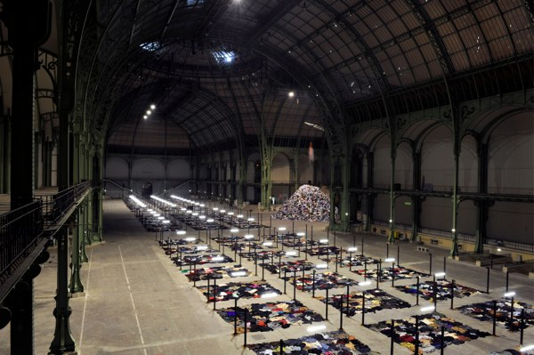
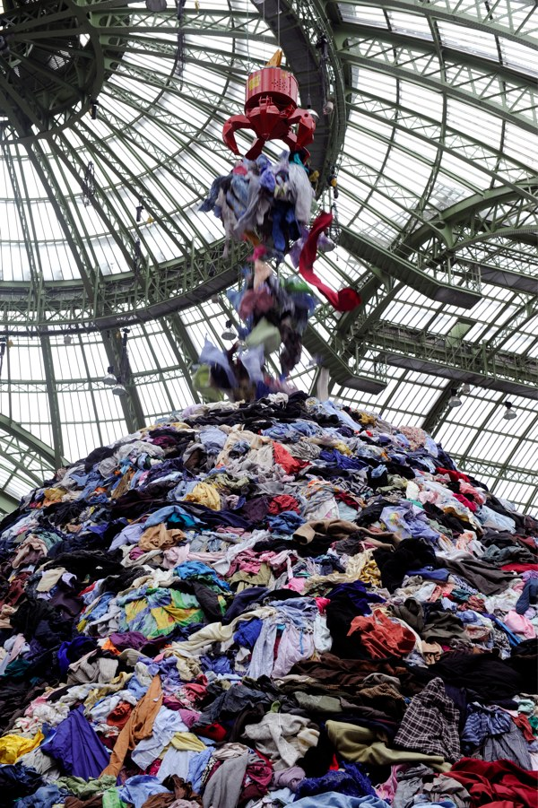
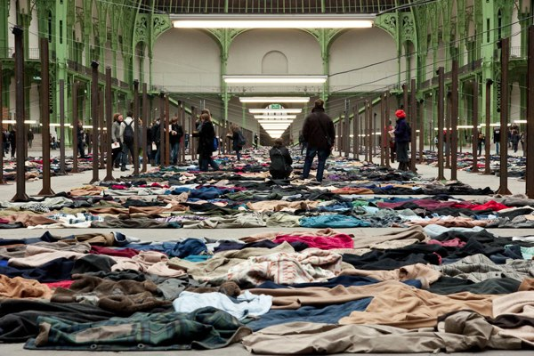
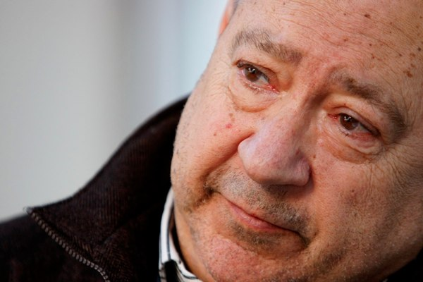

+++
type = "post"
titre = "Personnes de Christian Boltanski au Grand Palais (janvier-février 2010)"
title = "Personnes de Christian Boltanski au Grand Palais (janvier-février 2010)"
url = "/personnes-boltanski-grand-palais"
date = "2010-02-20T00:03:59"
Lastmod = "2013-09-08T00:23:24"
cover = "personnes-boltanski-grand-palais-2010.jpg"
tag = [ "Art", "Exposition", "Grand Palais", "Histoire" ]
createur = [ "Christian Boltanski" ]
annee = [ "2010" ]
weight = 2010
pays = [ "France" ]

+++

Christian Boltanski a investi la Nef du Grand Palais, un énorme espace dans lequel il a installé <em>Personnes</em>, sa plus récente installation. Composée de centaines de milliers de vêtements, celle-ci propose une expérience totale déroutante et très forte. On ne sort pas comme on est entré du Grand Palais…

Le Grand Palais n&rsquo;est pas un lieu intimiste, c&rsquo;est le moins que l&rsquo;on puisse dire. Conçu comme un hall d&rsquo;exposition, c&rsquo;est bien plus l&rsquo;ancêtre de la porte de Versailles. La verrière qui surmonte l&rsquo;intégralité de la nef ainsi que l&rsquo;ensemble des escaliers et balcons qui entourent l&rsquo;espace central témoignent de l&rsquo;intérêt du XIXe siècle pour le métal et le verre. L&rsquo;ensemble est, à mon avis, magnifique, même si assez froid. On est plus proche du hall de gare ou de l&rsquo;usine que du musée. C&rsquo;est en tout cas un lieu très particulier qui nécessite de penser une exposition en fonction du lieu, et non l&rsquo;inverse. Christian Boltanski l&rsquo;a très bien compris puisqu&rsquo;il a conçu <em>Personnes</em> comme une œuvre intégrée au Grand Palais, une œuvre dans laquelle les visiteurs sont appelés à s&rsquo;immerger. &laquo;&nbsp;<em>Le Grand Palais est pour moi un lieu de spectacle</em>&nbsp;&raquo; dit encore l&rsquo;artiste, et c&rsquo;est bien de cela qu&rsquo;il s&rsquo;agit : un spectacle total au milieu duquel on déambule.

L&rsquo;installation comporte trois parties plus ou moins distinctes. Devant les portes d&rsquo;entrée se dresse un mur de boites métalliques rouillées numérotées. Ce mur assez haut bloque complètement la vision du visiteur qui ne voit pas ce qui se cache derrière. Il faut donc le contourner pour découvrir la nef dans son ensemble. Celle-ci est parcourue de cases rectangulaires délimitées par quatre poteaux, mais surtout rendues visibles par la présence au sol de vêtements étalés. Un néon éclaire chacune de ces cases, tandis que de petits hauts parleurs diffusent des sons réguliers qui se découvrent en même temps que l&rsquo;on évolue au milieu de ces cases par l&rsquo;un des chemins réguliers qui les découpent. <em>Personnes</em> comprend aussi une montagne de vêtements qui se dresse dans la petite branche de la croix. Au-dessus de la montagne, une grue armée d&rsquo;une pince métallique s&rsquo;abaisse pour prendre quelques vêtements, se relève, relâche les vêtements avant de recommencer ce cycle, indéfiniment. <em>Personnes</em> ajoute à ces trois éléments un fond sonore constitué de battements sourds et répétés.

Dans l&rsquo;art contemporain, la question du sens se pose toujours, mais elle est ici flagrante. Au premier degré, il ne s&rsquo;agit finalement que de quelques fripes jetées à même le sol, éclairées aux néons, et accompagnées d&rsquo;un <em>beat</em> musical simpliste. Pourtant, pour peu que l&rsquo;on aille un peu plus loin que cette lecture premier degré, on tombe sur un faisceau de sens possible des plus large. Les sons diffusés dans la nef du Grand Palais évoquent le martèlement de l&rsquo;industrie, ou les battements d&rsquo;un cœur, ou quelque chose entre les deux. De la machine monstrueuse et implacable au doux son de la vie, la distance est parfois faible. Le bâtiment, tout de métal et de verre, évoque tout à fait dans l&rsquo;imaginaire collectif l&rsquo;usine, on verrait bien au milieu une chaîne de production de chez Ford ou Citroën. Sauf que là, il s&rsquo;agit de vêtements. Ces cases dessinées par les vêtements sur le sol nu pourraient alors rappeler les bureaux étriqués des entreprises modernes où, au nom du rationalisme économique, on travaille dans un espace ouvert et surchargé. L&rsquo;accumulation des vêtements serait alors le symbole de cette surcharge, tandis que la grue évoquerait tout simplement les machines qui sont aujourd&rsquo;hui responsables de la production de la majeure partie des biens.

Cette lecture est intéressante, mais <em>Personnes</em> fouille immanquablement dans nos imaginaires collectifs pour faire surgir une image beaucoup moins réjouissante. Ce tas de vêtements, ces vêtements laissés sur le sol évoquent avec une force terrifiante les images désormais bien connues de la Shoah. Les Nazis récupéraient bien tous les biens des millions de civils, hommes, femmes et enfants tués par des moyens divers pendant la guerre. Tous ces vêtements sont comme le souvenir d&rsquo;êtres disparus. Dans ce grand espace, et nonobstant les visiteurs, l&rsquo;humain est à la fois présent partout par les vêtements, la lumière, et en même temps totalement absent, implacablement absent. La grue serait alors la pince qui sert dans toutes les décharges pour récupérer les déchets. La chute des vêtements, plus ou moins rapide en fonction du poids de ceux-ci, évoque vite la chute de corps morts. Et dans cette logique, les boites numérotées à l&rsquo;entrée seraient une manifestation assez terrible de la disparition de milliers d&rsquo;êtres réduits à de la cendre dans une boite normalisée et numérotée. Tout peut faire sens dans cette lecture : les néons blafards et froids évoquent la morgue, les sons renvoient qui aux trains, qui à une respiration lente et difficile.

 Dans l&rsquo;art contemporain, l&rsquo;artiste est le plus souvent présent avec son œuvre et il en est le premier commentateur, le premier donneur de sens. Mais ce qui est intéressant souvent, c&rsquo;est qu&rsquo;il ne se positionne pas comme celui qui possède la clé de lecture de son œuvre, mais plus modestement comme proposition de lecture. Parfois, l&rsquo;artiste est aussi celui qui théorise son œuvre, mais ça n&rsquo;est pas vraiment le cas de Christian Boltanski. Ce dernier refuse en effet toute théorisation : &laquo;&nbsp;<em style="text-align: justify;">je ne m&rsquo;adresse pas aux spécialistes de l&rsquo;art contemporain</em>&nbsp;&raquo; lance-t-il ainsi quand on lui demande ce qu&rsquo;il aimerait dire aux visiteurs peu habitués à cette forme d&rsquo;art. Ainsi, s&rsquo;il propose bien une clé de lecture — la grue serait la main de Dieu qui emporte certains êtres au hasard —, il ajoute aussi : &laquo;&nbsp;<em style="text-align: justify;">L&rsquo;art consiste uniquement à poser des questions, à donner des émotions, sans avoir de réponse</em>.&nbsp;&raquo; Et de fait, plusieurs questions restent à jamais en suspens : que veulent dire ces sons ? Pourquoi n&rsquo;y a-t-il pas de pantalons, mais que des hauts ? Pourquoi ce mur de boites qui crée une rupture nette avec l&rsquo;extérieur ?

Comme le dit très bien Christan Boltanski, l&rsquo;art est affaire d&rsquo;émotions. Et <em>Personnes</em> n&rsquo;est pas avare de ce côté, bien au contraire. L&rsquo;artiste a voulu une installation éprouvante, presque pénible, qui donne envie de fuir. &laquo;&nbsp;<em>Le fait d&rsquo;avoir froid, d&rsquo;être angoissé et bouleversé, de chercher la sortie, de vouloir retrouver la vie à tout prix, est une expérience originale, prélevée sur le cœur vivant de l&rsquo;œuvre.</em> […] <em>Cette installation est conçue pour produire un puissant sentiment d&rsquo;oppression. Il s&rsquo;agit d&rsquo;une expérience dure et je suis convaincu que les gens éprouveront un soulagement en sortant.</em>&nbsp;&raquo; Et de fait, le froid glacial qui règne à l&rsquo;intérieur (l&rsquo;artiste a choisi d&rsquo;exposer en plein cœur de l&rsquo;hiver pour ce froid), le son fort et assez désagréable, la faible luminosité de l&rsquo;ensemble (c&rsquo;est une exposition à voir de nuit, je pense) contribuent à vite développer chez le visiteur ce sentiment d&rsquo;oppression que souhaitait Christian Boltanski. L&rsquo;oppression vient aussi quand on réalise que tout ceci pourrait n&rsquo;être qu&rsquo;une gigantesque métaphore d&rsquo;un camp de concentration. De toute façon, il ne s&rsquo;agit pas ici d&rsquo;art agréable, il s&rsquo;agit d&rsquo;un art qui dérange et questionne.

<em>Personnes</em> de Christian Boltanski est une installation d&rsquo;art contemporain passionnante justement parce qu&rsquo;elle perturbe celui qui l&rsquo;observe. Le fait que le visiteur fasse partie intégrante de l&rsquo;œuvre, ne serait-ce qu&rsquo;en ajoutant aux sons enregistrés sa propre voix, n&rsquo;est certainement pas étranger à ce sentiment de gêne qui le gagne vite. Je regrette d&rsquo;avoir vu l&rsquo;exposition à la toute fin (elle se termine le dimanche 21 février), mais je suis heureux de l&rsquo;avoir vue avant sa destruction, Christian Boltanski souhaitant en effet recycler entièrement son exposition et la faire disparaître autrement que par les images enregistrées. Une démarche intéressante, qui vient à contre-courant de la tendance générale de l&rsquo;art (imaginez un instant que Léonard de Vinci jetait ses toiles après les avoir peintes…). Si vous en avez encore le temps, courrez au Grand Palais voir <em>Personnes</em> ! Sinon, Christian Boltanski propose en parallèle au <a href="http://www.macval.fr/site.php?&amp;lg=1">MAC/VAL</a> une autre œuvre, Après, qui fonctionne apparemment conjointement à Personnes. Je ne l&rsquo;ai pas vue, mais elle dure jusqu&rsquo;à la fin du mois de mars et ma découverte de Christian Boltanski me donne bien envie de voir cette autre installation.

Rendons à César… et en l&rsquo;occurrence à Benjamin l&rsquo;envie de visiter cette exposition. Sans <a href="http://www.playlistsociety.fr/2010/01/personnes-de-christian-boltanski-au.html">son article</a>, je crois que je n&rsquo;aurais même pas remarqué l&rsquo;exposition. C&rsquo;est d&rsquo;ailleurs très intéressant de constater que nous ne sommes pas d&rsquo;accord sur la lecture &laquo;&nbsp;historique&nbsp;&raquo; basée sur la Shoah. Peut-être est-ce un résidu de mes années d&rsquo;historien en herbe, mais je trouve qu&rsquo;il écarte trop rapidement ce thème. Par contre, j&rsquo;aime beaucoup sa lecture SF de l&rsquo;exposition. Je ne l&rsquo;ai pas du tout ressentie sur place, mais elle est originale et prouve bien que l&rsquo;art est avant tout affaire de ressenti personnel.

<h3>Vous voulez m&rsquo;aider ?<a href="#footnote_0_2873" id="identifier_0_2873" class="footnote-link footnote-identifier-link" title="&Agrave; propos de la publicit&eacute;&hellip;">1</a></h3>
<ul>
<li><a href="http://www.amazon.fr/mn/search/?_encoding=UTF8&x=0&tag=leblogdenic07-21&linkCode=ur2&y=0&camp=1642&creative=19458&field-keywords=christian%20boltanski&url=search-alias%3Daps#/ref=nb_sb_noss?__mk_fr_FR=ÅMÅZÕÑ">Christian Boltanski sur Amazon</a></li>
</ul>

<ol class="footnotes"><li id="footnote_0_2873" class="footnote"><a href="http://voiretmanger.fr/a-propos/publicite/">À propos de la publicité…</a> [<a href="#identifier_0_2873" class="footnote-link footnote-back-link">&#8617;</a>]</li></ol>
