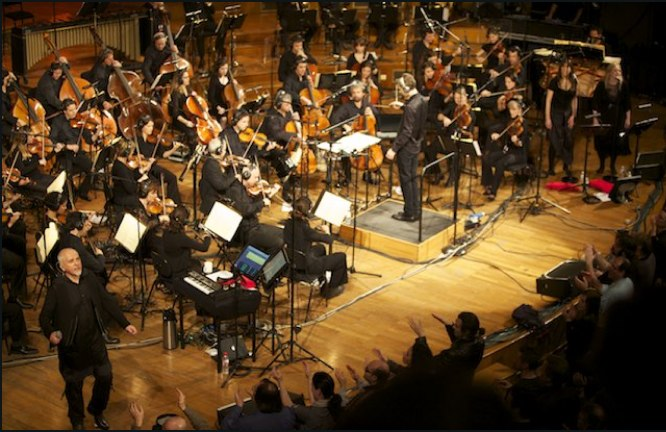
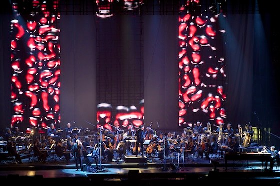
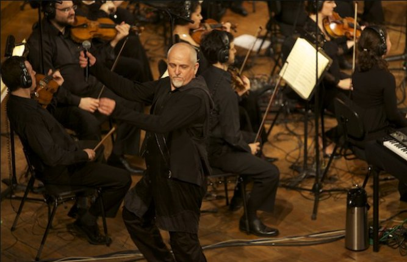
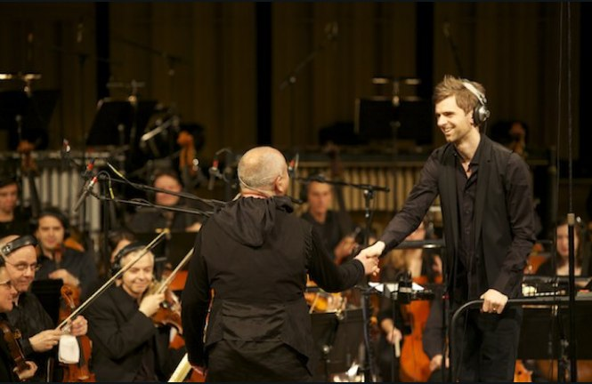
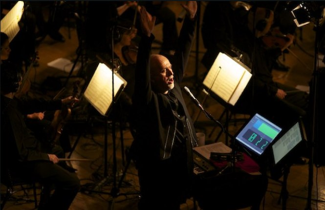

+++
type = "post"
titre = "Peter Gabriel à Bercy (22 mars 2010)"
title = "Peter Gabriel à Bercy (22 mars 2010)"
url = "/peter-gabriel-bercy-mars-2010"
date = "2010-03-23T02:00:59"
Lastmod = "2013-10-17T08:20:47"
cover = "peter-gabriel1.jpg"
categorie = [ "À voir… en live" ]
tag = [ "Bercy", "Classique", "Concert", "Mélange", "Scratch My Back" ]
annee = [ "2010" ]
weight = 2010
lieu = [ "Bercy" ]

+++

Ce soir, pour la troisième fois, j&rsquo;allais voir Peter Gabriel en live. C&rsquo;est le seul artiste que j&rsquo;ai vu trois fois sur scène en un temps finalement assez court, la première fois remontant à 2004. Mais comme sur ses albums, Peter Gabriel propose à chaque fois une nouvelle expérience. Ces trois concerts ont été très différents, de la grosse machine du Still Growing Up Tour au concert léger de festival, et ce soir un concert sans batterie ni guitare, encore différent de tout ce que j&rsquo;avais pu entendre jusque-là. Ce soir, j&rsquo;ai été surpris, j&rsquo;ai frissonné de bonheur, et au bout de 3 bonnes heures de concert, ma première réaction a été &laquo;&nbsp;comment, déjà ?&nbsp;&raquo;. En un mot, un excellent concert !

La &laquo;&nbsp;tournée&nbsp;&raquo; New Blood à laquelle appartient ce concert parisien défend <em><a href="/2010/02/08/scratch-my-back-peter-gabriel/">Scratch My Back</a></em>, album que j&rsquo;ai déjà eu longuement l&rsquo;occasion d&rsquo;évoquer. À l&rsquo;image des reprises sur l&rsquo;album, les concerts de New Blood sont annoncés sans guitare, ni batterie, mais avec un orchestre symphonique pour remplacer les instruments traditionnels du rock. L&rsquo;orchestre varie en fonction des localisations, à Paris c&rsquo;était l&rsquo;orchestre philharmonique de Radio France, rien que cela. Ce choix radical est pour le moins intéressant sur le papier (et pour ma part, je n&rsquo;ai pas hésité bien longtemps avant d&rsquo;acheter ma place), mais a deux inconvénients majeurs : en fait de tournée, il y a en tout et pour tout 5 dates en Europe, dont deux à Berlin et deux à Londres. Et puis le prix des places s&rsquo;est apparemment hissé au niveau de l&rsquo;opéra, avec les meilleures places qui se vendaient aux alentours de 200 €. J&rsquo;ai payé ma place environ 70 €, mais je ne le regrette pas une seule seconde, tant chaque seconde du concert en valait le coup et le coût.

Le concert commence avec une mini première partie assumée par Ane Brun, chanteuse tendance folk que je ne connaissais pas et qui assure aussi les chœurs avec Peter Gabriel. Ce dernier, fidèle à sa traditionnelle modestie, l&rsquo;introduit en personne puis s&rsquo;éclipse discrètement le temps de… deux morceaux. Difficile de parler de première partie donc, mais ça n&rsquo;était pas désagréable et Bercy a été mis dans l&rsquo;ambiance du concert. Après une pause, on aperçoit des dizaines de musiciens se glisser derrière le rideau de LEDs qui fait office, à ce moment, de mise en scène. L&rsquo;ambiance monte d&rsquo;un cran et c&rsquo;est un Bercy déjà chargé à bloc qui accueille l&rsquo;homme de la soirée, Peter Gabriel bien sûr. L&rsquo;orchestre entame immédiatement les premières notes de &laquo;&nbsp;<em>Sledgehammer</em>&laquo;&nbsp;, des notes évidemment connues de tous et les hurlements de joie ne se font pas attendre… très vite interrompues par le musicien qui donne alors le programme de cette soirée &laquo;&nbsp;nouvelle&nbsp;&raquo; où le tube, classique entre les classiques, n&rsquo;a pas sa place.

Le concert commence donc avec l&rsquo;intégralité des morceaux de <em>Scratch My Back</em> proposés dans l&rsquo;ordre, qui plus. Je ne suis pas trop fan de ce principe en règle générale, ce qui se justifie sur un album ne fonctionnant pas forcément en concert. Mais après tout, pourquoi pas, et cette idée a eu le mérite de rappeler que cet album de reprises possède en fait une très grande unité, tant technique que thématique. L&rsquo;amour y prend ainsi une place prépondérante, comme en témoigne le grand usage des lumières rouges (couleur des habits des techniciens que Peter Gabriel met désormais systématiquement en avant). La salle n&rsquo;apprécie pas forcément ses reprises, qu&rsquo;elle ignore en grande partie (&laquo;&nbsp;<em>My Body is a Cage</em>&nbsp;&raquo; est un excellent moyen de détecter cette ignorance…) : les personnes derrière moi avouèrent même pendant l&rsquo;entracte n&rsquo;avoir reconnu aucun titre ! Sans aller jusque-là, le public de Bercy est moyennement réceptif, applaudissant poliment entre chaque morceau, sans faire preuve d&rsquo;enthousiasme débordant.

Quelques moments forts pendant cette première partie, les mêmes que sur l&rsquo;album finalement. La reprise d&rsquo;Arcade Fire m&rsquo;a littéralement scotché, je l&rsquo;ai trouvée excellente, aussi puissante que sur l&rsquo;album, parfaite. Peut-être en attendais-je trop, mais &laquo;&nbsp;Après moi&nbsp;&raquo;, la reprise de Regina Spektor, m&rsquo;a semblé un peu moins forte que ce à quoi je pensais. Enfin, c&rsquo;était très bon, comme l&rsquo;ensemble de cette partie, avec évidemment mes préférences pour certains morceaux. Cette partie fut l&rsquo;occasion de vérifier que Peter Gabriel a conservé toute sa voix, puissante et juste, mais aussi que l&rsquo;acoustique d&rsquo;une salle dépend d&rsquo;abord et avant tout du soin que l&rsquo;on apporte aux ondes qui sortent des enceintes. Je gardais un très bon souvenir de son précédent concert à Bercy, et là encore j&rsquo;ai été très agréablement surpris par un son très propre.

Après l&rsquo;excellente reprise de Radiohead — certes, peut-être pas taillée pour une salle de la taille de Bercy —, le rideau rouge s&rsquo;abaisse et on annonce vingt minutes d&rsquo;entracte. Quand j&rsquo;évoquais l&rsquo;opéra, c&rsquo;est vraiment ça, d&rsquo;autant que le même rituel est observé : l&rsquo;orchestre entre, puis son chef d&rsquo;orchestre, et enfin seulement Peter Gabriel. Pendant ces vingt minutes, une question me travaille continuellement : que va-t-on nous proposer ensuite ? J&rsquo;ignorais jusqu&rsquo;à l&rsquo;existence du concert donné en petit comité à Radio France et donc je n&rsquo;avais rien lu dessus, et c&rsquo;est tant mieux. Quand le rideau s&rsquo;est à nouveau levé, je ne savais vraiment pas à quoi m&rsquo;attendre. Et quelle ne fut pas ma surprise de constater que l&rsquo;orchestre était toujours là, seul. La seconde partie a donc consisté en des relectures de titres plus ou moins anciens de Peter Gabriel.

Relectures, le mot est encore faible. Les morceaux proposés ce soir n&rsquo;avaient plus grand-chose à voir avec les originaux, un peu comme sur <em>Scratch My Back</em> finalement, comme si Peter Gabriel avait fait des reprises de ses propres titres. En général, les titres étaient reconnus par les paroles, non par la mélodie. C&rsquo;est troublant de connaître un titre sur le bout des ongles, de l&rsquo;avoir entendu dans des dizaines de versions et de ne pas le reconnaître immédiatement. C&rsquo;est aussi le gage d&rsquo;un renouvellement complet, indispensable pour éviter la monotonie des concerts. On peut sans doute reprocher beaucoup de choses à Peter Gabriel, mais certainement pas le fait de se répéter ! Ces relectures m&rsquo;ont semblé inégales, forcément, on ne peut pas non plus être excellent en permanence. Elles sont néanmoins toutes intéressantes, surtout quand elles jouent sur nos attentes comme sur &laquo;&nbsp;<em>Digging In The Dirt</em>&nbsp;&raquo; où un moment calme intervient là où on attendait une explosion de l&rsquo;orchestre. &laquo;&nbsp;<em>Signal To Noise</em>&nbsp;&raquo; est un titre qui semble n&rsquo;avoir été écrit que pour cette tournée, et les mots sont faibles pour transcrire ce que j&rsquo;ai ressenti à l&rsquo;écoute de l&rsquo;un de mes morceaux préférés de Peter Gabriel. Rien qu&rsquo;à y penser, j&rsquo;en ai encore des frissons.

La grosse surprise de ce soir, et mon coup de cœur, fut indéniablement la version orchestrale de « <em>The Rythm of The Heat</em> ». C&rsquo;est peut-être mon titre préféré de l&rsquo;artiste, notamment pour ce final à base de percussions, et la version entendue aux Vieilles Charrues m&rsquo;avait énormément plue, à tel point que je ne pensais pas penser trouver mieux avant ce soir. Il faudrait réécouter la version orchestre pour en être sûr, mais rien que le fait de faire ce morceau sans la moindre batterie est une idée géniale, et qui fonctionne si bien ! J&rsquo;en suis vraiment resté bouche bée. Les &laquo;&nbsp;classiques&nbsp;&raquo; n&rsquo;ont pas été en reste, avec une bonne version de &laquo;&nbsp;<em>Don&rsquo;t Give Up</em>&nbsp;&raquo; pour clore le concert, même si n&rsquo;est pas Kate Bush qui veut, quand même, ou encore un &laquo;&nbsp;<em>In Your Eyes</em>&nbsp;&raquo; marqué par la présence surprise de Youssou N&rsquo; Dour en personne.

Peter Gabriel a toujours été un artiste complet, et ses concerts n&rsquo;ont jamais manqué de mise en scène. S&rsquo;il s&rsquo;est effectivement beaucoup assagi depuis l&rsquo;époque Genesis, et même depuis les tournées de <em>UP</em>, il reste que l&rsquo;on a aussi beaucoup à regarder à ses concerts. La tournée &laquo;&nbsp;<em>New Blood</em>&nbsp;&raquo; confirme ce sentiment, avec la présence permanente de visuels affichés sur quatre bandeaux de LEDs, dont un horizontal et mobile qui monte ou descend en fonction des besoins. Pendant la première partie, c&rsquo;est surtout une sorte d&rsquo;animations iTunes qui bougeaient, mais de manière intelligente, en fonction de la musique. L&rsquo;effet est assez réussi et évite de trop distraire le spectateur, ce qui est souvent le souci de ces écrans. À noter, sur &laquo;&nbsp;<em>The Book of Love</em>&laquo;&nbsp;, une animation assez drôle avec des personnages en fils de fer surmontés de portraits. La seconde partie ressemblait plus à ce que Peter Gabriel a l&rsquo;habitude de faire depuis quelques années, à base d&rsquo;images bidouillées dans tous les sens, et de webcams.

Ce concert est proche de l&rsquo;irréprochable sur le plan technique, même si la voix de Peter était un peu en retrait sur la première partie. Je crois que les ingénieurs du son ont un peu abusé sur l&rsquo;écho, mais c&rsquo;était peut-être un choix qui permet de fondre la voix dans l&rsquo;orchestre. Ce dernier est très présent, chaque instrument ayant droit à son micro apparemment. Ce qui conduit, live oblige, à quelques ratés, notamment des archets qui cognent des micros. C&rsquo;est en tout cas fort plaisant d&rsquo;entendre un orchestre symphonique au complet jouer des morceaux moins conventionnels, où une contrebasse soliste peut devenir l&rsquo;instrument principal, ou bien où les cordes se font percussions. L&rsquo;orchestre est d&rsquo;une efficacité redoutable, mené de main de maître par son jeune chef. La voix de Peter Gabriel était excellente, je l&rsquo;ai dit. Celle de Mélanie, sa fille, n&rsquo;était même pas mauvaise, comme quoi tout se perd. Je serais curieux de savoir ce que donnerait un tel orchestre sans amplification, dans une salle adaptée, l&rsquo;opéra Bastille ou la salle Pleyel par exemple. En tout cas, j&rsquo;avais un peu peur d&rsquo;aller écouter un orchestre à Bercy, et finalement c&rsquo;est très bien passé. Chapeau aux ingénieurs du son…

Encore un concert de Peter Gabriel, et toujours ce plaisir intact de le retrouver, de l&rsquo;entendre parler français (pas d&rsquo;évolution de ce côté, c&rsquo;est toujours un peu confus… mais bon, les artistes internationaux qui font cet effort sont si rares que l&rsquo;on ne dit rien), de le voir s&rsquo;éclater sur scène. Premier concert de la tournée, donc avec quelques ratés qui, à mon sens, font tout l&rsquo;intérêt des live (les shows trop bien huilés ont vite un intérêt limité, quand même), mais j&rsquo;ai peur que ses troubles constants de mémoire (Peter avait les yeux rivés sur ses textes) soient plus un signe d&rsquo;Alzheimer qu&rsquo;autre chose.

Trois concerts, et une envie toujours intacte de le voir sur scène. La prochaine fois qu&rsquo;il passera à Paris, à moins d&rsquo;être retenu à l&rsquo;autre bout de la planète, j&rsquo;y serai !

<em>Couverture : kennymathieson @ <a href="http://www.flickr.com/photos/kennymathieson/3859625639/">FlickR</a></em>

<em>Les autres photos viennent <a href="http://www.petergabriel.com/" target="_blank">du site officiel</a></em><em>.</em>

<strong>Autres avis / photos : </strong>

<ul>
<li>Le forum de <a href="http://www.pg-fr.com/forum/viewtopic.php?t=2965" target="_blank">pg-fr.com</a> (à partir de la <a href="http://www.pg-fr.com/forum/viewtopic.php?t=2965&amp;postdays=0&amp;postorder=asc&amp;start=75" target="_blank">page 6</a>)</li>
<li><a href="http://zegut.blogspot.com/2010/03/peter-gabriel-paris-bercy-22-mars-2010.html" target="_blank">Zegut</a></li>
<li><a href="http://www.parsenlive.fr/peter-gabriel-bercy-paris-22-03-10-6641" target="_blank">Pars en live</a></li>
<li><a href="http://www.ubikwit.net/peter-gabriel-new-blood-tour-paris-bercy-22-03-2010/" target="_blank">Ubikwit</a></li>
</ul>

<h3>Vous voulez m&rsquo;aider ?<a href="#footnote_0_3072" id="identifier_0_3072" class="footnote-link footnote-identifier-link" title="&Agrave; propos de la publicit&eacute;&hellip;">1</a></h3>
<ul>
<li><a href="http://www.amazon.fr/mn/search/?_encoding=UTF8&tag=leblogdenic07-21&linkCode=as2&camp=1642&creative=19458&field-keywords=peter+gabriel&ie=UTF8&qid=1381990806&url=search-alias%3Daps">Peter Gabriel sur Amazon</a></li>
<li><a href="https://itunes.apple.com/fr/artist/peter-gabriel/id115433">Peter Gabriel sur l&rsquo;iTunes Store</a></li>
</ul>

<ol class="footnotes"><li id="footnote_0_3072" class="footnote"><a href="/soutien/">À propos de la publicité…</a> [<a href="#identifier_0_3072" class="footnote-link footnote-back-link">&#8617;</a>]</li></ol>
