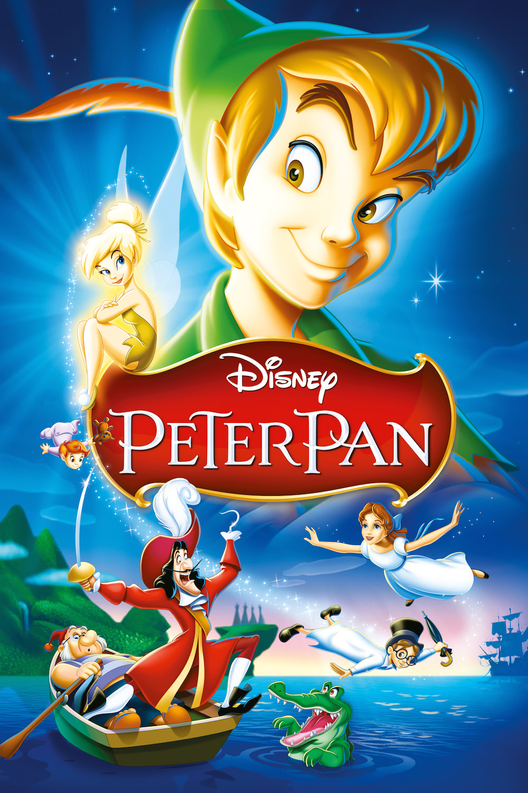
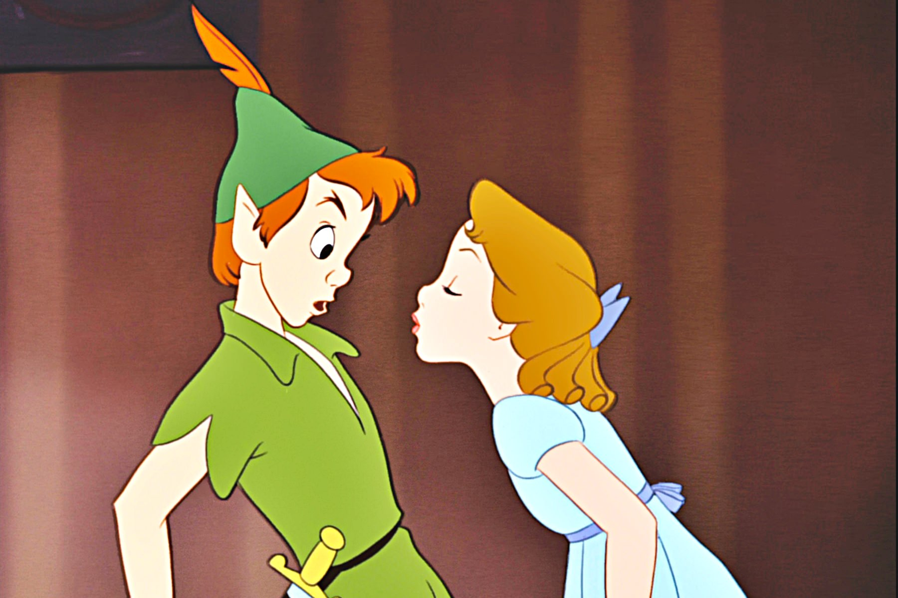
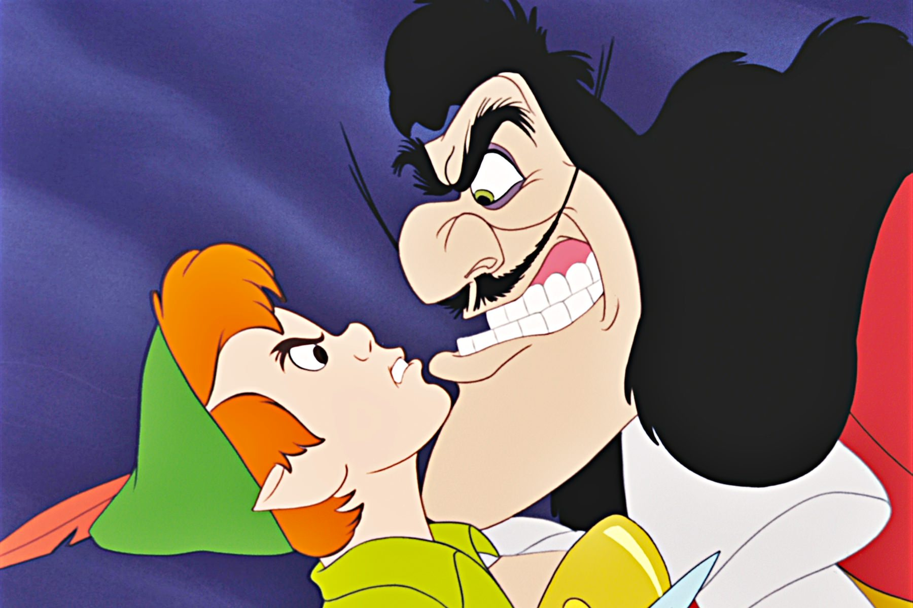

+++
type = "post"
titre = "<em>Peter Pan</em>, Clyde Geronimi, Wilfred Jackson et Hamilton Luske"
title = "Peter Pan, Clyde Geronimi, Wilfred Jackson et Hamilton Luske"
url = "/peter-pan-geronimi-jackson-luske"
date = "2014-03-03T17:25:04"
Lastmod = "2014-03-01T23:31:39"
cover = "peter-pan-geronimi-jackson-luske.jpg"
categorie = [ "À voir" ]
tag = [ "Adaptation théâtrale", "Adolescence", "Animation", "Aventure", "Éducation", "Enfance", "Famille", "Fantastique", "Pirates" ]
createur = [ "Clyde Geronimi", "Hamilton Luske", "Walt Disney", "Wilfred Jackson" ]
annee = [ "1953" ]
weight = 1953
saga = [ "Classiques d'animation Disney" ]
pays = [ "États-Unis" ]

+++

Après le plus atypique de ses classiques, <a href="http://voiretmanger.fr/alice-pays-merveilles-geronimi-jackson-luske/" title="Alice au pays des merveilles, Clyde Geronimi, Wilfred Jackson et Hamilton Luske"><em>Alice au pays des merveilles</em></a>, le studio Disney revient à ses premières amours avec un long-métrage qui représente un peu l’archétype de ses productions. <em>Peter Pan</em> n’est pas adapté d’un conte du XIXe siècle toutefois, mais d’une œuvre beaucoup plus récente et que l’on peut même considérer comme contemporaine de sa sortie originale. De fait, le quatorzième <a href="http://voiretmanger.fr/saga/classiques-danimation-disney/">classique Disney</a> est l’adaptation d’une pièce de théâtre sortie en 1904, une cinquantaine d’années seulement avant donc. Comme pour beaucoup d’autres adaptations, celle conçue par Walt Disney et ses équipes s’est imposée dans l’imaginaire collectif et c’est, aujourd’hui encore, celle qui reste la plus forte en tête. Ainsi, <em>Peter Pan</em> assume pleinement son statut de classique et représente une forme d’accomplissement pour le studio, même si le film a été, comme souvent, critiqué à sa sortie.

Comme son prédécesseur et même comme son successeur, <em>Peter Pan</em> commence dans un univers non seulement réaliste, mais en plus relativement récent. C’est dans un Londres début de siècle que le film ouvre, loin encore du pays imaginaire qui constitue l’essentiel du récit. On découvre dans un premier temps la famille Darling, le père et la mère et surtout leurs trois enfants, Wendy l’aînée et ses deux frères, Jean et Michel. Wendy raconte tous les soirs à ses cadets des histoires merveilleuses composées d’un endroit magique où l’on ne vieillit jamais et où Peter Pan, un enfant qui refuse de grandir, est opposé dans une lutte féroce avec le Capitaine Crochet, un redoutable pirate. Ces histoires d’enfants agacent profondément le père qui voudrait bien que ses enfants, et en particulier sa fille, grandissent. C’est dans cette ambiance parfaitement réaliste que Clyde Geronimi, Wilfred Jackson et Hamilton Luske introduisent, assez brutalement, la touche de fantastique avec l’entrée en matière de Peter Pan, le vrai, à la recherche de son ombre volée par le chien de la famille. Comme souvent dans les films de Walt Disney, cette incursion du fantastique ne pose aucun problème : c’est un fait considéré comme naturel, on ne cherche jamais à le remettre en cause. On n’est pas surpris, dès lors, que la fratrie suive docilement le garçon volant, pour se rendre dans le fameux pays imaginaire. À partir de là, <em>Peter Pan</em> reprend un chemin plus traditionnel, mais dans un registre que les studios n’avaient pas encore vraiment exploité. Des pirates, des Indiens et des sirènes :  c’est toute une mythologie assez classique dans l’imaginaire collectif, mais que Walt Disney n’avait pas encore tout à fait exploité à ce jour, du moins pas sur un long-métrage complet, qui se met en place. À cet égard, le film signé par Clyde Geronimi, Wilfred Jackson et Hamilton Luske faisait preuve d’originalité, même si aujourd’hui il incarne au contraire l’archétype des films Disney et ce, encore aujourd’hui.

Particulièrement bien rythmé, le récit avance vite et même s’il est bien plus complexe que tous longs-métrages précédents, exception faite d’<em>Alice au pays des merveilles</em>, le scénario est toujours parfaitement clair. La prouesse mérite d’être relevée quand on compare ne serait-ce que le nombre de personnages ici, par rapport au nombre de personnages dans <a href="http://voiretmanger.fr/cendrillon-geronimi-jackson-luske/" title="Cendrillon, Clyde Geronimi, Wilfred Jackson et Hamilton Luske"><em>Cendrillon</em></a> par exemple. Il y a Peter Pan naturellement, il y a Wendy et ses deux frères, il y a les enfants sauvages, les pirates et le Capitaine Crochet, mais aussi les Indiens, les sirènes, les deux parents également. L’ensemble est riche, mais pas indigeste, signe sans doute que l’adaptation est une réussite. Le résultat est sans doute moins riche que la pièce de J.M. Barrie, mais ce n’est pas très grave, d’autant que les choix du studio s’avèrent payants. <em>Peter Pan</em> raconte d’un côté le récit allégorique d’un passage à l’âge adulte pour Wendy qui refuse de grandir au départ, gagne en maturité avec Peter et les autres, et finalement accepte de ne plus être une enfant à la fin. En parallèle, le personnage de Peter Pan est à l’extrême opposé, avec ce choix intéressant de la part du studio de le représenter non pas comme un enfant, mais comme un adolescent qui attire toutes les filles, sans rien en faire. Lui ne change pas d’opinion et ne veut pas passer à la suite de sa vie, c’est pourquoi le <em>happy end</em> que l’on pouvait attendre n’a pas lieu : il reste loin de Wendy, dans son pays imaginaire. Ce dernier offre par ailleurs de nombreuses opportunités, tant en matière d’aventures avec une succession de péripéties assez folles, mais aussi d’humour avec les personnages du pirate et surtout du crocodile. Dans la pièce originale, ce dernier est absent de la scène, il n’est évoqué que par le bruit que fait le réveil dans son ventre. Disney en fait un personnage comique et si c’est assez banal comme traitement, il faut bien reconnaître que cela fonctionne très bien et le film est assez drôle, ce qui n’était pas tout à fait le cas de ses deux prédécesseurs.

Devenu un classique incontestable, <em>Peter Pan</em> a été assez critiqué à sa sortie pour les libertés qu’il a pris par rapport à la pièce adaptée. Une critique que l’on a totalement oubliée aujourd’hui : le film de Walt Disney s’est imposé comme la référence, ce qui suffit à prouver sa réussite. Bien mené, amusant et touchant à la fois, le dessin animé incarne une forme de perfection pour les studios et reste toujours aujourd’hui un classique à voir, et à revoir.

<h3>Vous voulez m’aider ?<a href="#footnote_0_11307" id="identifier_0_11307" class="footnote-link footnote-identifier-link" title="&Agrave; propos de la publicit&eacute;&hellip;">1</a></h3>
<ul>
<li><a href="http://www.amazon.fr/gp/product/B008YISMLY/ref=as_li_ss_tl?ie=UTF8&tag=leblogdenic07-21&linkCode=as2&camp=1642&creative=19458&creativeASIN=B008YISMLY">Acheter le film en Blu-Ray sur Amazon</a></li>
<li><a href="http://www.amazon.fr/gp/product/B008YISN3G/ref=as_li_ss_tl?ie=UTF8&tag=leblogdenic07-21&linkCode=as2&camp=1642&creative=19458&creativeASIN=B008YISN3G">Acheter le film en DVD sur Amazon</a></li>
<li><a href="https://itunes.apple.com/fr/movie/peter-pan/id567695306">Acheter ou louer le film sur l’iTunes Store</a></li>
</ul>

<ol class="footnotes"><li id="footnote_0_11307" class="footnote"><a href="http://voiretmanger.fr/soutien/">À propos de la publicité…</a> [<a href="#identifier_0_11307" class="footnote-link footnote-back-link">&#8617;</a>]</li></ol>
